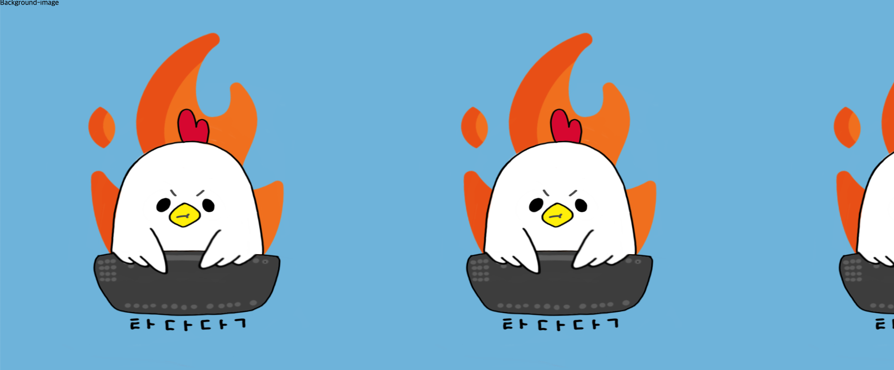
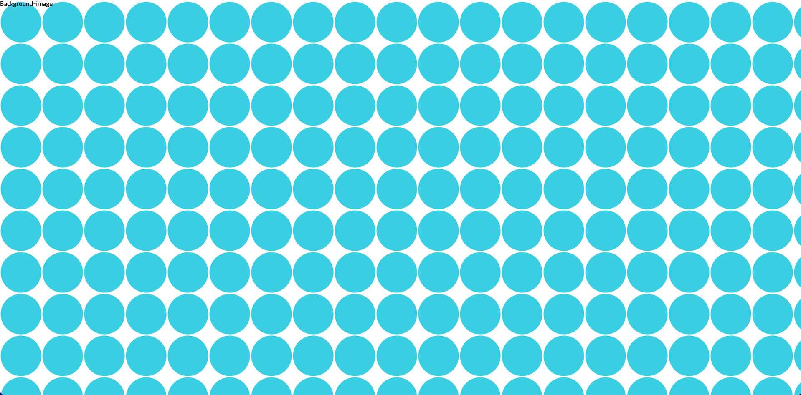
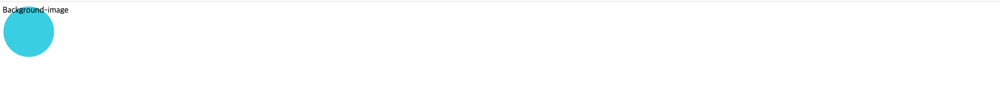
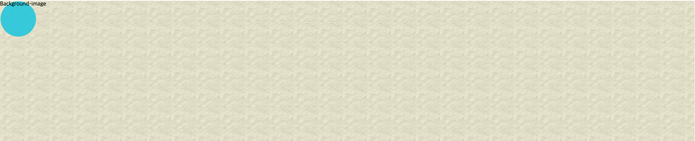
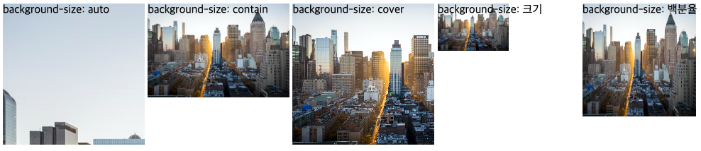
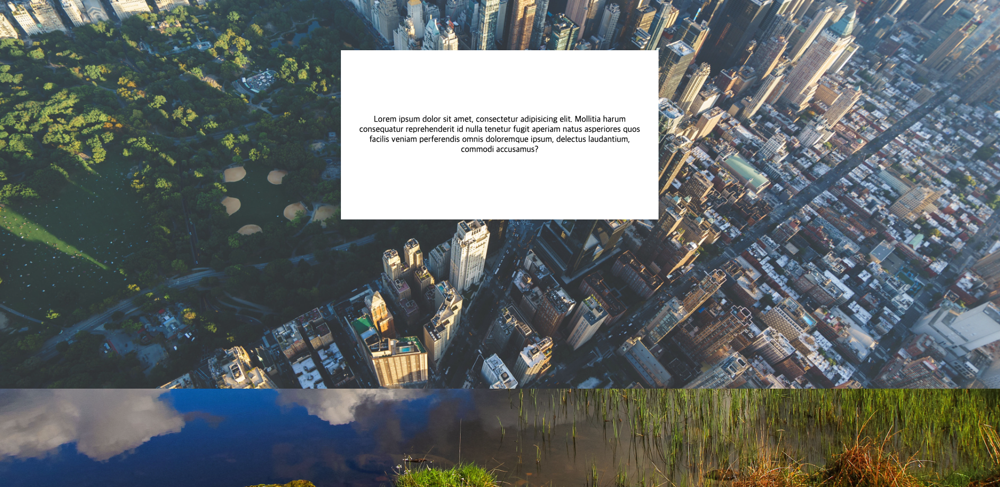
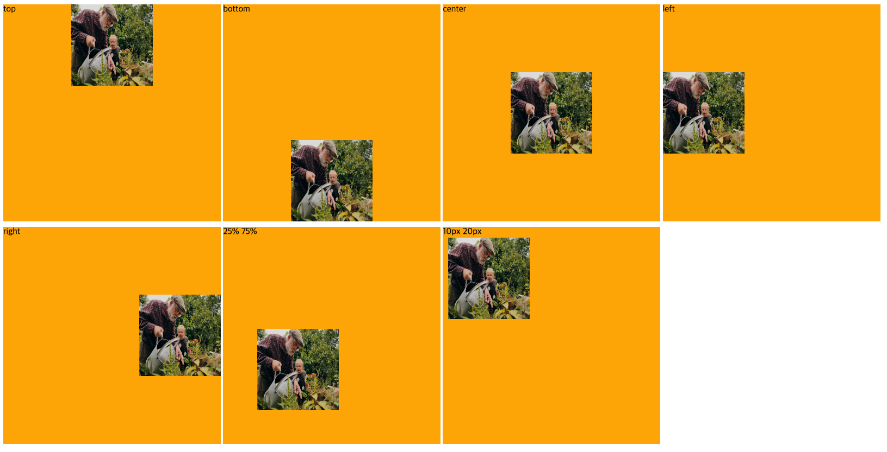
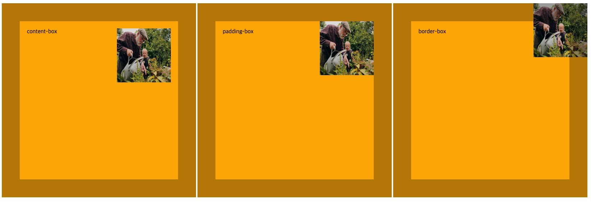
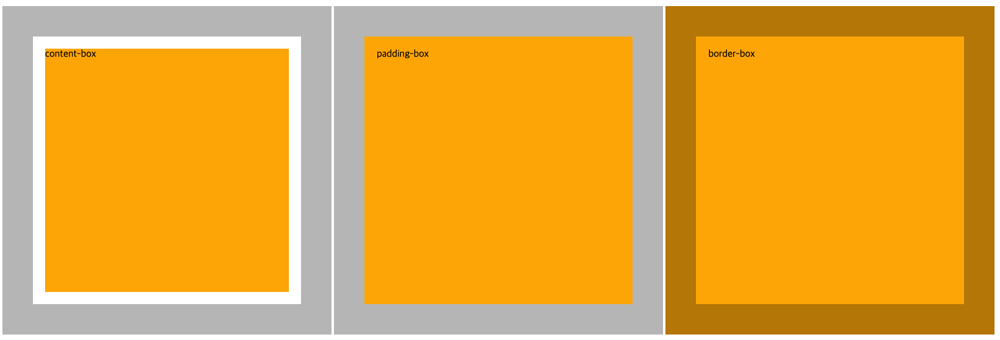
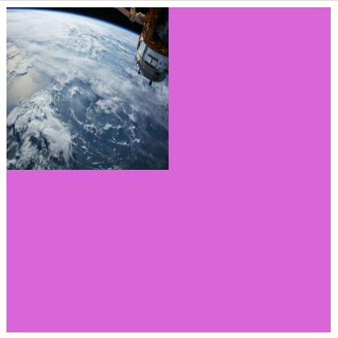

# Background

## 👉 바로가기

- [1. 개요](#1-개요)
- [2. background-image 프로퍼티](#2-background-image-프로퍼티)
- [3. background-repeat 프로퍼티](#3-background-repeat-프로퍼티)
- [4. background-size 프로퍼티](#4-background-size-프로퍼티)
- [5. background-attachment 프로퍼티](#5-background-attachment-프로퍼티)
- [6. background-position 프로퍼티](#6-background-position-프로퍼티)
- [7. background-origin 프로퍼티](#7-background-origin-프로퍼티)
- [8. background-color 프로퍼티](#8-background-color-프로퍼티)
- [9. background-clip 프로퍼티](#9-background-clip-프로퍼티)
- [10. background Shorthand](#10-background-shorthand)
- [11. Conclusion](#11-conclusion)

---

## 1. 개요

Background 관련 프로퍼티는 해당 요소의 배경으로 이미지 또는 색상을 정의한다. 웹 문서의 전체 배경뿐만 아니라 텍스트, 목록 등 특정한 요소에도 배경을 지정할 수 있다.

---

## 2. background-image 프로퍼티

요소에 배경 이미지를 지정한다.

기본형 `background-color: url("이미지 파일 경로")`

```html
<!DOCTYPE html>
<html lang="en">
  <head>
    <style>
      div {
        height: 100vh;
        background-image: url("https://raw.githubusercontent.com/iteach12/html_css_js_basic/1c84313da723024e72882618d203e5f9acab045b/images/logo.png");
      }
    </style>
  </head>
  <body>
    <div>Background-image</div>
  </body>
</html>
```



---

## 3. background-repeat 프로퍼티

배경 이미지의 반복을 지정한다. 수직, 수평 또는 수직과 수평 모두의 반복을 지정할 수 있다.

| 종류      | 설명                                                          |
| :-------- | :------------------------------------------------------------ |
| repeat    | 브라우저 화면에 가득 찰 때까지 가로와 세로로 반복한다. 기본값 |
| repeat-x  | 브라우저 화면 너비에 가득 찰 때까지 가로로 반복한다.          |
| repeat-y  | 브라우저 화면 높이에 가득 찰 때까지 세로로 반복한다.          |
| no-repeat | 한 번만 표시하고 반복하지 않는다.                             |

```html
<!DOCTYPE html>
<html lang="en">
  <head>
    <style>
      div {
        height: 100vh;
        background-image: url("http://poiemaweb.com/img/bg/dot.png");

        /* 기본값 */
        background-repeat: repeat;
      }
    </style>
  </head>
  <body>
    <div>Background-image</div>
  </body>
</html>
```



반복 출력을 멈추고 싶은 경우, `background-repeat` 프로퍼티값에 no-repeat를 설정한다.

```html
<!DOCTYPE html>
<html lang="en">
  <head>
    <style>
      div {
        height: 100vh;
        background-image: url("http://poiemaweb.com/img/bg/dot.png");
        background-repeat: no-repeat;
      }
    </style>
  </head>
  <body>
    <div>Background-image</div>
  </body>
</html>
```



`background-image`에 복수개의 이미지를 설정할 경우, 먼저 설정된 이미지가 전면에 출력된다.

```html
<!DOCTYPE html>
<html lang="en">
  <head>
    <style>
      div {
        height: 100vh;
        background-image: url("http://poiemaweb.com/img/bg/dot.png"),
          url("http://poiemaweb.com/img/bg/paper.gif");
        background-repeat: no-repeat, repeat;
      }
    </style>
  </head>
  <body>
    <div>Background-image</div>
  </body>
</html>
```



---

## 4. background-size 프로퍼티

배경 이미지의 사이즈를 지정한다. 배경 이미지의 고유 비율을 유지하기 때문에 설정에 따라 이미지의 일부가 보이지 않을 수 있다. `background-size` 프로퍼티를 사용하여 배경 이미지의 크기를 조절할 수 있다. 특히 화면에 배경 이미지를 가득 채워야 할 경우에 유용하다.

아래의 표는 background-size 프로퍼티값이다.
|종류|설명|
|:---|:---|
|auto|원래 배경 이미지 크기만큼 표시한다. 기본값|
|contain|요소 안에 배경 이미지가 다 들어오도록 이미지를 확대 축소한다.|
|cover|배경 이미지로 요소를 모두 덮도로 이미지를 확대 축소한다.|
|<크기>|이미지의 너비와 높이를 지정한다. 값이 하나만 주어질 경우 너빗값으로 인식하며, 이미지의 너비와 너빗값에 맞춘 높이값도 자동 계산된다.|
|<백분율>|배경 이미지가 들어갈 요소의 크기를 기준으로 값을 백분율로 지정하고 그 크기에 맞도록 배경 이미지를 확대 축소한다.|

```html
<!DOCTYPE html>
<html lang="en">
  <head>
    <style>
      .bg {
        display: inline-block;
        width: 200px;
        height: 200px;
        background-image: url("https://images.unsplash.com/photo-1480714378408-67cf0d13bc1b?ixlib=rb-1.2.1&ixid=MnwxMjA3fDB8MHxwaG90by1wYWdlfHx8fGVufDB8fHx8&auto=format&fit=crop&w=1170&q=80");
        background-repeat: no-repeat;
      }
      .bg1 {
        background-size: auto;
      }
      .bg2 {
        background-size: contain;
      }
      .bg3 {
        background-size: cover;
      }
      .bg4 {
        /* 높이는 자동 계산된다. */
        background-size: 100px;
      }
      .bg5 {
        background-size: 80% 80%;
      }
    </style>
  </head>
  <body>
    <div class="bg bg1">background-size: auto</div>
    <div class="bg bg2">background-size: contain</div>
    <div class="bg bg3">background-size: cover</div>
    <div class="bg bg4">background-size: 크기</div>
    <div class="bg bg5">background-size: 백분율</div>
  </body>
</html>
```



---

## 5. background-attachment 프로퍼티

일반적으로 화면을 스크롤하면 문서 전체가 움직이므로 배경 이미지도 함께 스크롤된다. 화면이 스크롤되더라도 배경이미지는 스크롤되지 않고 고정되어 있게 하려면 `background-attachment` 프로퍼티에 fixed 키워드를 지정한다.

```html
<!DOCTYPE html>
<html>
  <head>
    <style>
      *,
      *:after,
      *:before {
        margin: 0;
        padding: 0;
        box-sizing: border-box;
      }
      html,
      body {
        width: 100%;
        height: 100%;
      }

      .bg-wrap {
        min-height: 600px;
        height: 100%;
        background-size: cover;
        background-position: center;
        background-repeat: no-repeat;

        overflow: auto;
      }

      .parallax {
        background-image: url("http://poiemaweb.com/img/bg/stock-photo-125979219.jpg");
        background-attachment: fixed;
      }

      .normal {
        background-image: url("http://poiemaweb.com/img/bg/stock-photo-155153867.jpg");
        background-attachment: fixed;
      }
      p {
        padding: 30px;
        width: 600px;
        height: 320px;
        margin: 320px auto;
        background-color: white;
        text-align: center;
        display: flex;
        align-items: center;
      }
    </style>
  </head>
  <body>
    <div class="bg-wrap parallax">
      <p>
        Lorem ipsum dolor sit amet, consectetur adipisicing elit. Mollitia harum
        consequatur reprehenderit id nulla tenetur fugit aperiam natus
        asperiores quos facilis veniam perferendis omnis doloremque ipsum,
        delectus laudantium, commodi accusamus?
      </p>
    </div>
    <div class="bg-wrap normal">
      <p>
        Lorem ipsum dolor sit amet, consectetur adipisicing elit. Mollitia harum
        consequatur reprehenderit id nulla tenetur fugit aperiam natus
        asperiores quos facilis veniam perferendis omnis doloremque ipsum,
        delectus laudantium, commodi accusamus?
      </p>
    </div>
  </body>
</html>
```



위와 아래의 배경화면을 모두 고정시켰기 때문에 스크롤을 해도 움직이지 않는다.

> 지금까지 한 번도 사용하지 않았던 프로퍼티이다. 하지만 직접 적용하고 보니 완전 멋져..

---

## 6. background-position 프로퍼티

일반적으로 `background-image`는 좌상단부터 이미지를 출력한다. `background-position` 속성을 이용하면 배경 이미지의 수평 위치 또는 수직 위치의 값을 지정할 수 있다.

기본값 `background-position: 0% 0%;`  
기본형 `background-position: <수평 위치> <수직 위치>;`

프로퍼티값을 하나만 지정한다면 웹 브라우저에서는 지정한 값을 수평 위치값으로 간주하고, 수직 위칫값은 50%나 center로 간주한다.

```html
<!DOCTYPE html>
<html>
  <head>
    <style>
      div {
        display: inline-block;
        width: 400px;
        height: 400px;
        background-color: orange;
        background-image: url("https://images.unsplash.com/photo-1657664043009-c4975cb4eed3?ixlib=rb-1.2.1&ixid=MnwxMjA3fDF8MHxwaG90by1wYWdlfHx8fGVufDB8fHx8&auto=format&fit=crop&w=1074&q=80");
        background-size: 150px 150px;
        background-repeat: no-repeat;
        margin-top: 10px;
      }

      .ex1 {
        background-position: top;
      }
      .ex2 {
        background-position: bottom;
      }
      .ex3 {
        background-position: center;
      }
      .ex4 {
        background-position: left;
      }
      .ex5 {
        background-position: right;
      }
      .ex6 {
        background-position: 25% 75%;
      }
      .ex7 {
        background-position: 10px 20px;
      }
    </style>
  </head>
  <body>
    <div class="ex1">top</div>
    <div class="ex2">bottom</div>
    <div class="ex3">center</div>
    <div class="ex4">left</div>
    <div class="ex5">right</div>
    <div class="ex6">25% 75%</div>
    <div class="ex7">10px 20px</div>
  </body>
</html>
```



---

## 7. background-origin 프로퍼티

`background-origin` 프로퍼티를 지정하여 배경 이미지를 패딩까지 표시하거나 테두리까지 포함해서 표시할 수 있다.

아래의 표는 `background-origin` 프로퍼티값이다.  
|종류|설명|
|:---|:---|
|content-box|박스 모델에서 내용 부분에만 이미지를 표시한다. 기본값|
|padding-box|박스 모델에서 패딩까지 배경 이미지를 표시한다.|
|border-box|박스 모델에서 테두리까지 배경 이미지를 표시한다.|

```html
<!DOCTYPE html>
<html>
  <head>
    <style>
      div {
        display: inline-block;
        width: 400px;
        height: 400px;
        background-color: orange;
        background-image: url("https://images.unsplash.com/photo-1657664043009-c4975cb4eed3?ixlib=rb-1.2.1&ixid=MnwxMjA3fDF8MHxwaG90by1wYWdlfHx8fGVufDB8fHx8&auto=format&fit=crop&w=1074&q=80");
        background-size: 150px 150px;
        background-repeat: no-repeat;
        margin-top: 10px;
        border: 50px solid rgba(10, 10, 10, 0.3);
        padding: 20px;
        background-position: top right;
      }

      .ex1 {
        /* 기본값 */
        background-origin: content-box;
      }
      .ex2 {
        background-origin: padding-box;
      }
      .ex3 {
        background-origin: border-box;
      }
    </style>
  </head>
  <body>
    <div class="ex1">content-box</div>
    <div class="ex2">padding-box</div>
    <div class="ex3">border-box</div>
  </body>
</html>
```



---

## 8. background-color 프로퍼티

배경색을 지정하려면 배경을 넣고 싶은 요소의 스타일 규칙을 만들 때 `background-color` 프로퍼티를 사용한다. `background-color`는 16진수나 rgb값 또는 색상 이름을 사용하여 지정한다. 또한 transparent키워드를 지정할 수 있다.

```css
div {
  background-color: #000000;
  background-color: rgb(255, 255, 255);
  background-color: white;
}
```

---

## 9. background-clip 프로퍼티

배경을 넣고 싶은 요소마다 속성을 입력하면 되지만 박스 모델 관점에서 배경의 범위를 조절할 수도 있다. 테두리까지 적용할지, 패딩 범위까지 적용할지, 아니면 내용 부분에만 적용할지 선택할 수 있다.

| 종류        | 설명                                                |
| :---------- | :-------------------------------------------------- |
| border-box  | 박스 모델의 가장 외곽인 테두리까지 적용한다. 기본값 |
| padding-box | 박스 모델에서 테두리를 뺀 패딩 범위까지만 적용한다. |
| content-box | 박스 모델에서 내용(콘텐츠) 부분에만 적용한다.       |

```html
<!DOCTYPE html>
<html>
  <head>
    <style>
      div {
        display: inline-block;
        width: 400px;
        height: 400px;
        background-color: orange;
        background-size: 150px 150px;
        background-repeat: no-repeat;
        margin-top: 10px;
        border: 50px solid rgba(10, 10, 10, 0.3);
        padding: 20px;
        background-position: top right;
      }

      .ex1 {
        background-clip: content-box;
      }
      .ex2 {
        background-clip: padding-box;
      }
      .ex3 {
        /* 기본값 */
        background-clip: border-box;
      }
    </style>
  </head>
  <body>
    <div class="ex1">content-box</div>
    <div class="ex2">padding-box</div>
    <div class="ex3">border-box</div>
  </body>
</html>
```



---

## 10. background Shorthand

background-color, background-image, background-repeat, background-position를 하번에 정의하기 위한 Shorthand Syntax이다.

기본형 `background: color || image || repeat || attachment || position`

```html
<!DOCTYPE html>
<html>
  <head>
    <style>
      div {
        width: 400px;
        height: 400px;
        background: orchid
          url("https://images.unsplash.com/photo-1446776811953-b23d57bd21aa?ixlib=rb-1.2.1&ixid=MnwxMjA3fDB8MHxwaG90by1wYWdlfHx8fGVufDB8fHx8&auto=format&fit=crop&w=1172&q=80")
          no-repeat top left;
        background-size: 200px 200px;
      }
    </style>
  </head>
  <body>
    <div></div>
  </body>
</html>
```



---

## 11. Conclusion

> `background`관련 프로퍼티는 자주 사용하는 것 중 하나이다. 그래서 많이 사용해왔다. 처음 해당 프로퍼티를 사용했을 때에는 `backgrounbd-position`, `background-size`를 통해 이미지를 박스에 잘 맞게 구성하는 것 까지만 해도 굉장히 기분이 좋았고 이후에는 다른 프로퍼티에 대해 잘 알아보지 않고 지내왔다.  
> 이번에 공부하면서 한 번도 사용해보지 않았던 `background-attachment` 프로퍼티를 처음 사용해봤는데 정말 신세계였다. 배경이미지가 스크롤되지 않고 그 자리 그대로 있다는 것이 글로는 이해가 잘 되지 않았는데 직접 코드를 작성하고 결과물을 보니 너무 멋졌다. 그래서 해당 프로퍼티를 배우고 잠깐 멈춘 후 계속해서 여러가지 시도를 했다. 이 프로퍼티를 앞으로 잘 활용하여 더 멋진 웹 페이즈를 만들어야 겠다😃

---

## 참고

[poiemaweb 2-6 백그라운드](https://poiemaweb.com/css3-background)  
도서 - HTML + CSS + 자바스크립트 웹 표준의 정석

---

[👆](#background)
