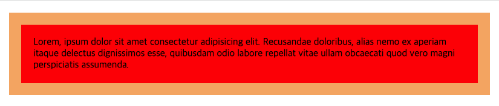
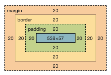
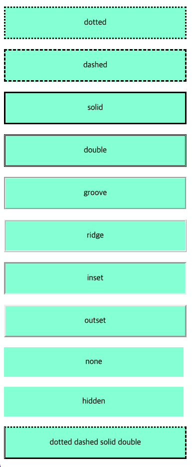
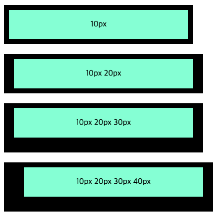
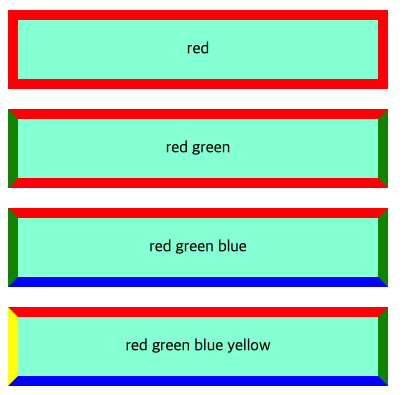
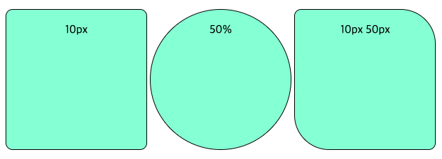
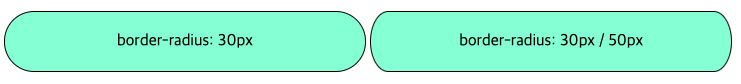
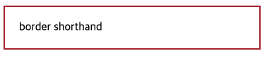
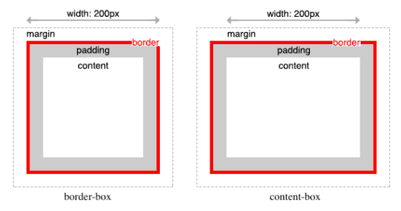
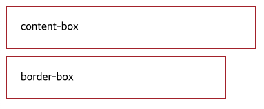

# Box Model (박스 모델)

## 👉 바로가기

- [1 개요](#1-개요)
- [2 width / height 프로퍼티](#2-width--height-프로퍼티)
- [3 margin / padding 프로퍼티](#3-margin--padding-프로퍼티)
- [4 border 프로퍼티](#4-border-프로퍼티)
  - [4-1 border-style](#4-1-border-style)
  - [4-2 border-width](#4-2-border-width)
  - [4-3 border-color](#4-3-border-color)
  - [4-4 border-radius](#4-4-border-radius)
  - [4-5 border](#4-5-border)
- [5 box-sizing 프로퍼티](#5-box-sizing-프로퍼티)
- [6 Conclusion](#6-conclusion)
- [참고](#참고)

---

## 1 개요

웹 문서의 블록 레벨 요소는 모두 Box 형태의 영역을 가지고 있음. 스타일 시트에서 이렇게 BOx 형태인 요소를 박스 모델 요소라고 함. 이 Box는 콘텐츠(Content), 패팅(Padding), 테두리(Border), 마진(Margin)로 구성됨.


> Box Model의 이해는 아래의 4가지 명칭을 이해하는데서 부터 시작한다.

| 명칭    | 설명                                                                                                                                                                                         |
| :------ | :------------------------------------------------------------------------------------------------------------------------------------------------------------------------------------------- |
| Content | 요소의 텍스트나 이미지 등의 실제 내용이 위치하는 영역, width, height 프로퍼티를 갖는다.                                                                                                      |
| Padding | 테두리(Border) 안쪽에 위치하는 요소의 내부 영역의 여백, padding 프로퍼티 값은 패딩 영역의 두깨를 의미하며 기본색은 투명(transparent), 요소에 적용된 배경의 컬러, 이미지는 패딩 영역까지 적용 |
| Border  | 테두리 영역으로 border 프로퍼티 값은 테두리의 두께를 의미                                                                                                                                    |
| Margin  | 테두리(Border) 바깥에 위치하는 요소의 외부 여백 영역, margin 프로퍼티 값은 마진 영역의 두께를 의미, 기본적으로 투명(transparent)하며 배경색을 지정할 수 없음                                 |

```html
<!DOCTYPE html>
<head>
  <style>
    body {
      width: 50vw;
    }
    div {
      /* 배경색의 지정: 콘텐츠 영역과 패딩 영역에 적용 */
      background-color: red;

      /* 패딩 영역의 두께 */
      padding: 20px;

      /* 테두리: 두께 형태 색상 */
      border: 20px solid sandybrown;

      /* 마진 영역의 두께 */
      margin: 20px;
    }
  </style>
</head>
<body>
  <div>
    Lorem, ipsum dolor sit amet consectetur adipisicing elit. Recusandae
    doloribus, alias nemo ex aperiam itaque delectus dignissimos esse, quibusdam
    odio labore repellat vitae ullam obcaecati quod vero magni perspiciatis
    assumenda.
  </div>
</body>
```




> 웹디자인은 콘텐츠를 담을 박스 모델을 정의하고 CSS 프로퍼티를 통해 스타일(배경, 폰트와 텍스트 등)과 위치 및 정렬을 지정하는 것

---

## 2 width / height 프로퍼티

박스 모델에서 콘텐츠 영역의 크기를 지정할 때 너비는 width, 높이는 height 프로퍼티를 사용함, 콘텐츠의 영역을 대상을 하는 이유는 `box-sizing 프로퍼티`에 기본값인 **content-box**가 적용되었기 때문, `box-sizing 프로퍼티`에 **border-box**를 적용하면 콘텐츠 영역, padding, border가 포함된 영역을 width / height 프로퍼티의 대상으로 지정할 수 있음.

> width와 height의 속성값
> | 종류 | 설명 |
> |:-----|:------|
> |<크기>| 너비가 높이의 값을 px이나 em 단위로 지정|
> |<백분율>| 박스 모델을 포함하는 부모 요소를 기준으로 너빗값이나 높잇값을 백분율(%)로 지정|
> |auto| 박스 모델의 너빗값과 높잇값이 콘텐츠의 양에 따라 자동으로 결정, 기본값|

> 만일 width와 height로 지정한 콘텐츠 영역보다 실제 콘텐츠가 크면 콘텐츠 영역을 넘치게 된다.
> `overflow:hidden;`을 지정하면 넘친 콘텐츠를 감출 수 있다.

> width와 height 프로퍼티를 비롯한 모든 박스모델 관련 프로퍼티(margin, padding, border, box-sizing 등)는 상속되지 않는다.

---

## 3 margin / padding 프로퍼티

박스 모델은 상하좌우 4개의 방향이 있어서 테두리나 마진, 패딩 등을 지정할 때 한꺼번에 똑같이 지정하거나, 모두 다르게 지정할 수 있음.


`margin`, `padding`은 -top, -right, -bottom, -left 4방향의 프로퍼티를 각각지정하지 않고 한 번에 지정할 수 있음.

- 4개의 값을 지정할 때 - `margin: 25px 50px 75px 100px;`
  - 순서대로 top, right, bottom, left
- 3개의 값을 지정할 때 - `margin: 25px 50px 75px;`
  - 순서대로 top, right/left, bottom
- 2개의 값을 지정할 때 - `margin: 25px 50px;`
  - 순서대로 top/bottom, right/left
- 1개의 값을 지정할 때 - `margin: 25px;`
  - top/bottom/right/left를 모두 같은 값으로 지정

## 4 border 프로퍼티

---

### 4-1 border-style

`border-style` 프로퍼티는 테두리의 선의 스타일을 지정, `border-style`4-1 border-style 프로퍼티의 기본값은 none이므로 속성값을 따로 지정하지 않으면 테두리 색상이나 두께를 지정하더도 화면에 표시되지 않음.

[MDN: border-style](https://developer.mozilla.org/ko/docs/Web/CSS/border-style)

```html
<!DOCTYPE html>
<head>
  <style>
    div {
      background-color: aquamarine;
      padding: 20;
      width: 320px;
      margin: 20px 0px;
      padding: 20px;
      text-align: center;
    }
    .dotted {
      border-style: dotted;
    }
    .dashed {
      border-style: dashed;
    }
    .solid {
      border-style: solid;
    }
    .double {
      border-style: double;
    }
    .groove {
      border-style: groove;
    }
    .ridge {
      border-style: ridge;
    }
    .inset {
      border-style: inset;
    }
    .outset {
      border-style: outset;
    }
    .none {
      border-style: none;
    }
    .hidden {
      border-style: hidden;
    }
    .mix {
      border-style: dotted dashed solid double;
    }
  </style>
</head>
<body>
  <div class="dotted">dotted</div>
  <div class="dashed">dashed</div>
  <div class="solid">solid</div>
  <div class="double">double</div>
  <div class="groove">groove</div>
  <div class="ridge">ridge</div>
  <div class="inset">inset</div>
  <div class="outset">outset</div>
  <div class="none">none</div>
  <div class="hidden">hidden</div>

  <!-- 프로퍼티 값의 갯수에 따라 4개 방향(top, right, left, bottom)에 대하여 지정이 가능하다. -->
  <div class="mix">dotted dashed solid double</div>
</body>
```



---

### 4-2 border-width

`border-width` 프로퍼티는 테두리의 두께를 지정, 프로퍼티 값의 갯수에 따라 4개 방향(top, right, left, bottom)에 대하여 지정이 가능(margin, padding과 같음)

[MDN:border-width](https://developer.mozilla.org/ko/docs/Web/CSS/border-width)

```html
<!DOCTYPE html>
<head>
  <style>
    div {
      background-color: aquamarine;
      padding: 20;
      width: 320px;
      margin: 20px 0px;
      padding: 20px;
      text-align: center;
      border-style: solid;
    }
    .one {
      border-width: 10px;
    }
    .two {
      border-width: 10px 20px;
    }
    .three {
      border-width: 10px 20px 30px;
    }
    .four {
      border-width: 10px 20px 30px 40px;
    }
  </style>
</head>
<body>
  <div class="one">10px</div>
  <div class="two">10px 20px</div>
  <div class="three">10px 20px 30px</div>
  <div class="four">10px 20px 30px 40px</div>
</body>
```



---

### 4-3 border-color

`border-color` 프로퍼티는 테두리의 색상을 지정, 프로퍼티 값의 갯수에 따라 4개 방향(top, right, left, bottom)에 대하여 지정이 가능(margin, padding과 같음)

[MDN: border-color](https://developer.mozilla.org/ko/docs/Web/CSS/border-color)

```html
<!DOCTYPE html>
<head>
  <style>
    div {
      background-color: aquamarine;
      padding: 20;
      width: 320px;
      margin: 20px 0px;
      padding: 20px;
      text-align: center;
      border-style: solid;
      border-width: 10px;
    }
    .one {
      border-color: red;
    }
    .two {
      border-color: red green;
    }
    .three {
      border-color: red green blue;
    }
    .four {
      border-color: red green blue yellow;
    }
  </style>
</head>
<body>
  <div class="one">red</div>
  <div class="two">red green</div>
  <div class="three">red green blue</div>
  <div class="four">red green blue yellow</div>
</body>
```



---

### 4-4 border-radius

`border-radius` 프로퍼티는 테두리 모서리를 둥글게 표현하도록 지정, 프로퍼티 값은 길이를 나타내느 단위(px, em등)과 %를 사용, 각각의 모서리에 border-radius 프로퍼티를 개별적으로 지정할 수도 있고 4개의 모서리를 short-hand로 한번에 지정 할 수도 있음

기본형 `border-radius: <크기> | <백분율>`

[MDN: border-radius](https://developer.mozilla.org/en-US/docs/Web/CSS/border-radius)

```html
<!DOCTYPE html>
<head>
  <style>
    div {
      background-color: aquamarine;
      padding: 20;
      width: 160px;
      height: 160px;
      margin: 20px 0px;
      padding: 20px;
      text-align: center;
      border-style: solid;
      border-width: 1px;
      display: inline-block;
    }
    .one {
      /* 4개의 꼭지점에 대해 Radius 지정 */
      border-radius: 10px;
    }
    .two {
      border-radius: 50%;
    }
    .three {
      /*  top-left & bottom-right | top-right & bottom-left */
      border-radius: 10px 50px;
    }
  </style>
</head>
<body>
  <div class="one">10px</div>
  <div class="two">50%</div>
  <div class="three">10px 50px</div>
</body>
```



> 두개의 반지름을 지정하여 타원형 둥근 모서리 설정하기  
> border-radius 프로퍼티를 사용해서 꼭짓점을 타원 형태로 만들 수 있다. 하나의 값(반지름) 대신 타원의 가로 반지름값과 세로 반지름값을 /를 통해 구분하여 넣는다.  
> 기본형 `border-radius: <가로 반지름> / <세로 반지름>`  
> 기본형 `border-위치-radius: <가로 반지름> / <세로 반지름>`

```html
<!DOCTYPE html>
<head>
  <style>
    div {
      background-color: aquamarine;
      padding: 20;
      width: 320px;
      margin: 20px 0px;
      padding: 20px;
      text-align: center;
      border-style: solid;
      border-width: 1px;
      display: inline-block;
    }
    .one {
      border-radius: 30px;
    }
    .two {
      border-radius: 30px / 50px;
    }
  </style>
</head>
<body>
  <div class="one">border-radius: 30px</div>
  <div class="two">border-radius: 30px / 50px</div>
</body>
```



---

### 4-5 border

`border` 프로퍼티는 `border-width`, `border-style`, `border-color`를 한번에 설정하기 위한 shorthand 프로퍼티이다.

[MDN: Border Shorthand](https://developer.mozilla.org/en-US/docs/Web/CSS/border)

기본형 `border: border-width border-style border-color`

```html
<!DOCTYPE html>
<head>
  <style>
    div {
      width: 320px;
      padding: 20px;
      border: 2px solid brown;
    }
  </style>
</head>
<body>
  <div class="one">border shorthand</div>
</body>
```



---

## 5 box-sizing 프로퍼티

`box-sizing` 프로퍼티는 width, height 프로퍼티의 대상 영역을 변경한다.

| 키워드      | 설명                                                                                                       |
| :---------- | :--------------------------------------------------------------------------------------------------------- |
| content-box | width, height 프로퍼티 값은 content 영역을 의미(기본값)                                                    |
| border-box  | width, height 프로퍼티 값은 content 영역, padding, border가 포함된 값을 의미, CSS Layout을 직관적으로 사용 |



```html
<!DOCTYPE html>
<head>
  <style>
    div {
      width: 320px;
      padding: 20px;
      border: 2px solid brown;
      margin-bottom: 10px;
    }
    .border-box {
      box-sizing: border-box;
    }
  </style>
</head>
<body>
  <div class="content-box">content-box</div>
  <div class="border-box">border-box</div>
</body>
```



> box-sizing 프로퍼티는 상속되지 않는다. 따라서 box-sizing 프로퍼티를 사용하도록 초기화하려면 아래와 같이 정의한다.

```css
html {
  box-sizing: border-box;
}
*,
*:before,
*:after {
  box-sizing: inherit;
}
```

---

## 6 Conclusion

> margin, padding, border는 정말 웹디자인을 할 때 flex, grid보다 더 많이 사용을 하는 프로퍼티라고 생각한다. 그 만큼 많이 사용했으니 해당 내용에 대해 익숙해졌지만 이번 챕터를 정리하면서 몰랐던 부분도 많이 알게 되었다.  
> 지금까지 `border-radius: top-left top-right bottom-right bottom-left`를 사용하지 않고 일일히 하나하나 값들을 지정했다. 앞으로는 한 줄로 표현하는 방법으로 사용을 해야겠다. 또한 타원형으로 만드는 방법에 대해서도 이번에 새롭게 알게 되었다. x좌표, y좌표에 각각 다른 반지름을 주어 타원형으로 만드는 방법으로 더 멋진 웹디자인을 할 수 있도록 하자.  
> box-sizing개념에 대해서는 지금까지는 뭔가 박스가 이상한데? 하면서 아무런 생각없이 `box-sizing: border-box`사용해왔다. 하지만 개념에 대해서 정확히 파악을 하니 속이 시원한 기분이 들고 누군가에게 박스 모델에 대해 설명할 때 한층 더 자신감있게 대답할 수 있을거 같다.😊  
> 사용하는 css만 계속 사용하는 것보다 많은 것들을 배우고 하나씩 적용해보면서 공부하자

---

## 참고

[poiemaweb 2-4 박스 모델](https://poiemaweb.com/css3-box-model)  
도서 - HTML + CSS + 자바스크립트 웹 표준의 정석

---

[👆](#box-model-박스-모델)
