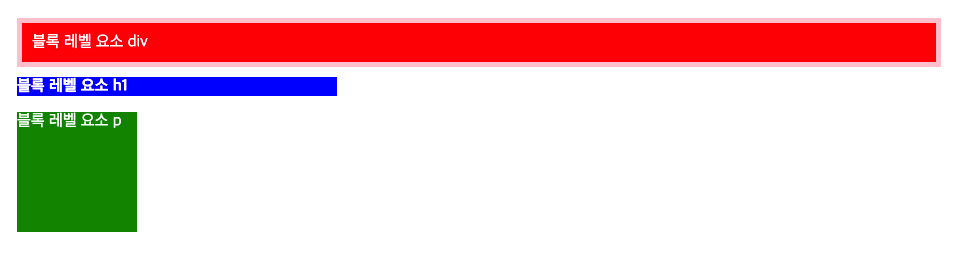
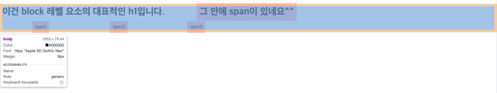
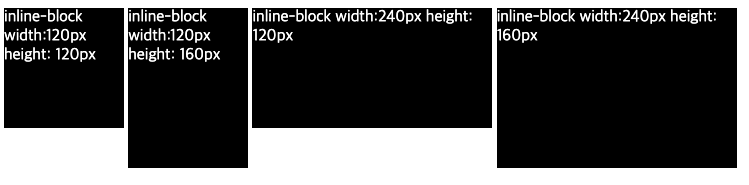

# display 프로퍼티 (block, inline, inline-block)

## 1. 개요

display 프로퍼티는 layout 정의에 자주 사용되는 중요한 프로퍼티  
[박스 모델](./BoxModel.md)은 block 레벨 요소인지 inline 레벨 요소인지에 따라 나열 방법이 달라짐

| 프로퍼티값 키워드 | 설명                                                           |
| :---------------- | :------------------------------------------------------------- |
| block             | block 특성을 가지는 요소(block 레벨 요소)로 지정               |
| inline            | inline 특성을 가지는 요소(inline 레벨 요소)로 지정             |
| inline-block      | inline-block 특성을 가지는 요소(inline-block 레벨 요소)로 지정 |
| none              | 해당 요소를 화면에 표시하지 않음(공간조차 사라짐)              |

> display 프로퍼티는 상속되지 않는다.

---

## 2. Block 레벨 요소

- 항상 새로운 라인에서 시작한다.
- 화면 크기 전체의 가로폭을 차지한다.(width:100%)
- width, height, margin, padding 프로퍼티 지정이 가능하다.
- block 레벨 요소 내에 inline 레벨 요소를 포함할 수 있다.
- block 레벨 요소 예
  - div
  - h1 ~ h6
  - p
  - ol
  - ul
  - li
  - hr
  - table
  - form

```html
<!DOCTYPE html>
<head>
  <style>
    body {
      padding: 10px;
      color: white;
    }
    div {
      background-color: red;
      padding: 10px;
      border: 5px solid pink;
    }
    h1 {
      background-color: blue;
      width: 320px;
      margin: 10px 0px;
      font-size: 16px;
    }
    p {
      background-color: green;
      width: 120px;
      height: 120px;
    }
  </style>
</head>
<body>
  <div>블록 레벨 요소 div</div>
  <h1>블록 레벨 요소 h1</h1>
  <p>블록 레벨 요소 p</p>
</body>
```



---

## 3. inline 레벨 요소

- 새로운 라인에서 시작하지 않으며 문장의 중간에 들어갈 수 있다. 즉, 줄을 바꾸지 않고 다른 요소와 함께 한 행에 위치힌다.
- content의 너비만큼 가로폭을 차지한다.
- **width ,height, margin-top, margin-bottom 프로퍼티를 지정할 수 없다.** 상, 하 여백은 line-height로 지정한다.
- inline 레벨 요소 뒤에 공백(엔터, 스페이스 등)이 있는 경우, 정의하지 않은 space(4px)가 자동 지정된다.
- inline 레벨 요소 내에 block 레벨 요소를 포함할 수 없다. inline 레벨 요소는 일반적으로 block 레벨 요소에 포함되어 사용된다.
- inline 레벨 요소 예

  - span
  - a
  - strong
  - img
  - br
  - input
  - select
  - textarea
  - button

  ```html
  <!DOCTYPE html>
  <head>
    <style>
      span {
        /* margin-top, margin-bottom은 적용되지 않는다. */
        /* 하지만 margin-right, margin-left은 적용된다.*/
        margin: 200px 100px;
        background-color: pink;
        /* padding은 가능하다. */
        /* padding이 클 경우 다른 box를 침범하는 경우도 생긴다...? */
        padding: 10px;
      }
    </style>
  </head>
  <body>
    <h1>
      이건 block 레벨 요소의 대표적인 h1입니다.
      <span>그 안에 span이 있네요^^</span>
    </h1>
    <span>span1</span>
    <span>span2</span><span>span3</span>
  </body>
  ```



---

## 4. inline-block 레벨 요소

block과 inline 레벨 요소의 특징을 모두 갖는다. inline 레벨 요소와 같이 한 줄에 표현되면서 width, height, margin 프로퍼티를 모두 지정할 수 있다.

- 기본적으로 inline 레벨 요소와 흡사하게 줄을 바꾸지 않고 다른 요소와 함께 한 행에 위치시킬 수 있다.
- block 레벨 요소처럼 width, height, margin, padding 프로퍼티를 모두 정의할 수 있다. 상, 하 여백을 margin과 line-height 두가지 프로퍼티 모두를 통해 제어할 수 있다.
- content의 너비만큼 가로폭을 차지한다.
- inline-block 레벨 요소 뒤에 공백(엔터, 스페이스 등)이 있는 경우, 정의하지 않은 space(4px)가 자동 지정된다.

```html
<!DOCTYPE html>
<head>
  <style>
    body {
      color: white;
    }
    .inline-block {
      display: inline-block;
      background-color: black;
      vertical-align: top;
    }
    .box1 {
      width: 120px;
      height: 120px;
    }
    .box2 {
      width: 120px;
      height: 160px;
    }
    .box3 {
      width: 240px;
      height: 120px;
    }
    .box4 {
      width: 240px;
      height: 160px;
    }
  </style>
</head>
<body>
  <span class="inline-block box1">inline-block width:120px height: 120px</span>
  <span class="inline-block box2">inline-block width:120px height: 160px</span>
  <div class="inline-block box3">inline-block width:240px height: 120px</div>
  <div class="inline-block box4">inline-block width:240px height: 160px</div>
</body>
```



---

## 5. Conclusion

> 지금까지 block, inline, inline-block이 있다는 사실만 알고 정확한 쓰임에 대해서는 생각하지 않고 사용을 하였다. 이로 인해 겪었던 고통은 `input`은 기본으로 inline이여서 width가 적용되지 않았던 것이다. block 바꾸었더라면... 쉽게 해결을 할 수 있지 않았을까? 그리고 inline-block은 현제까지 여러 프로젝트를 진행하는 동안 사용하지 않았다.  
> 정확한 개념을 몰라서 사용을 하지 않았던 것인지? 굳이 inline-block으로 사용하지 않아도 flex나 grid으로 해결할 수 있는 문제 였는지는 모르겠지만 특별한 경우가 아니라면 계속해서 flex 또는 grid로 화면 디자인을 할 거 같다. 하지만 태그들이 가지고 있는 기본 display level을 알고 필요할 때 바꾸어 쓰도록 하자!

---

## 참고

[poiemaweb 2-5 display, visibility, opacity 프로퍼티](https://poiemaweb.com/css3-display)  
도서 - HTML + CSS + 자바스크립트 웹 표준의 정석

---

[👆](#display-프로퍼티-block-inline-inline-block)

📅 2022-07-11
