# Flexbox Layout

## 1. 개요

Flexbox Layout은 모던 웹을 위하여 제안된 기존 layout보다 더 세련된 방식의 니즈에 부합하기 위한 CSS3의 새로운 layout방식이다. 플랙스 박스 레이아웃은 비교적 최근에 등장한 개념이므로 기존의 CSS 속성 외에 새로 공부해야 할 속성이 있다.

---

## 2. 용어 정리

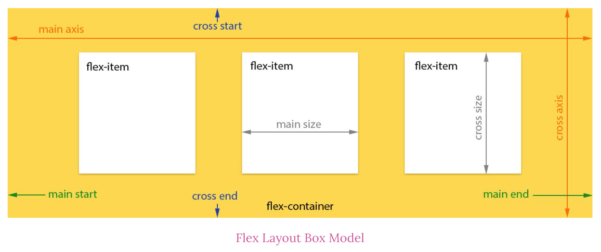

- 플렉스 컨테이너(부모 박스): 플렉스 박스 레이아웃을 적용할 대상을 묶는 요소이다. 위의 그림에서는 노라색 배경을 가진 큰 박스가 플렉스 컨테이너에 해당된다.
- 플렉스 항목(자식 박스, flex-item): 플렉스 박스 레이아웃을 적용할 대상이다. 위의 그림에서는 하얀색 배경을 가진 작은 박스가 플렉스 항목에 해당된다.
- 주축(main axis): 플렉스 컨테이너 안에서 플렉스 항목을 배치하는 기본 방향이다. 기본적으로 왼쪽에서 오른쪽이며 수평 방향으로 배치한다. 플렉스 항목의 배치가 시작되는 위치를 '주축 시작점', 끝나는 위치를 '주축 끝점'이라고 한다.
- 교차축(cross axis): 주축과 교차하는 방향을 말하며 기본적으로 위에서 아래로 배치한다. 플렉스 항목의 배치가 시작되는 위치를 '교차축 시작점', 끝나는 위치를 '교차축 끝점'이라고 한다.

---

## 3. Usage

플렉스 박스 레이아웃을 만들기 위해서는 먼저 웹 콘텐츠를 플렉스 컨테이너로 묶어 주어야 한다. 즉, 배치할 웹 요소가 있다면 그 요소를 감싸는 부모 요소를 만들고, 그 부모 요소를 플렉스 컨테이너로 만들어야 한다.

부모 요소의 display 속성에 flex를 지정하면 플렉스 컨테이너가 만들어진다.

```css
.flex-container {
  display: flex;
}
```

부모 요소가 inline 요소인 경우 inline-flex을 지정한다.

```css
.flex-container {
  display: inline-flex;
}
```

Flexbox Layout를 사용하기 위해서는 flex 또는 inline-flex는 부모 요소에 반드시 지정해야하며 자식 요소는 자동적으로 flex item이 된다.

---

## 4. Flexbox container 속성

### 4.1 flex-direction

플렉스 컨테이너 안에서 플렉스 항목을 배치하는 주축(main axis) 방향을 설정한다.

아래는 `flex-direction`의 프로퍼티값과 설명이다.

| 종류           | 설명                                                         |
| :------------- | :----------------------------------------------------------- |
| row            | 주축을 가로로 지정하고 왼쪽에서 오른쪽으로 배치한다.(기본값) |
| row-reverse    | 주축을 가로로 지정하고 반대로 오른쪽에서 왼쪽으로 배치한다.  |
| column         | 주축을 세로로 지정하고 위쪽에서 아래쪽으로 배치한다.         |
| column-reverse | 주축을 세로로 지정하고 아래쪽에서 위쪽으로 배치한다.         |

```html
<!DOCTYPE html>
<html>
  <head>
    <style>
      div {
        font-size: 20px;
        font-weight: 700;
      }
      .box {
        background-color: yellow;
        width: 60px;
        height: 60px;
        text-align: center;
        line-height: 60px;
        margin: 10px;
      }
      .row {
        display: flex;
        flex-direction: row;
      }
      .row-reverse {
        display: flex;
        flex-direction: row-reverse;
      }
      .column {
        display: flex;
        flex-direction: column;
      }
      .column-reverse {
        display: flex;
        flex-direction: column-reverse;
      }
    </style>
  </head>
  <body>
    <div>
      row
      <div class="row">
        <div class="box">1</div>
        <div class="box">2</div>
        <div class="box">3</div>
      </div>
    </div>
    <div>
      row-reverse
      <div class="row-reverse">
        <div class="box">1</div>
        <div class="box">2</div>
        <div class="box">3</div>
      </div>
    </div>
    <div>
      column
      <div class="column">
        <div class="box">1</div>
        <div class="box">2</div>
        <div class="box">3</div>
      </div>
    </div>
    <div>
      column-reverse
      <div class="column-reverse">
        <div class="box">1</div>
        <div class="box">2</div>
        <div class="box">3</div>
      </div>
    </div>
  </body>
</html>
```

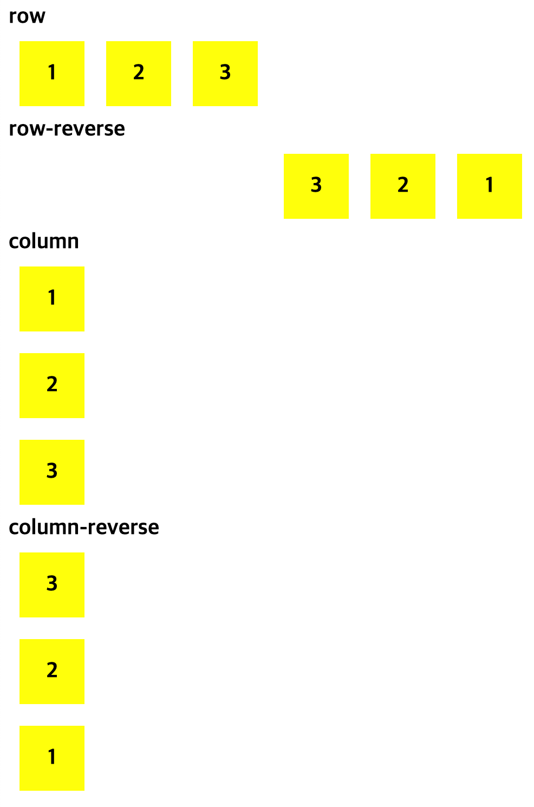

---

### 4-2 flex-wrap

`flex-wrap` 프로퍼티는 플렉스 컨테이너 너비보다 많은 플렉스 항목이 있을 경우 줄을 바꿀지 여부를 지정한다.

아래는 `flex-wrap`에서 사용할 수 있는 프로퍼티값과 설명이다.

| 종류         | 설명                                                      |
| :----------- | :-------------------------------------------------------- |
| nowrap       | 플렉스 항목을 한 줄에 표시한다.(기본값)                   |
| warp         | 플렉스 항목을 여러 줄에 표시한다.                         |
| wrap-reverse | 플레스 항목을 여러 줄에 표시하되, 시작점과 끝점이 바뀐다. |

```html
<!DOCTYPE html>
<html>
  <head>
    <style>
      div {
        font-size: 20px;
        font-weight: 700;
      }
      .box {
        background-color: yellow;
        width: 200px;
        height: 60px;
        text-align: center;
        line-height: 60px;
        margin: 10px;
      }
      .nowrap {
        display: flex;
        flex-wrap: nowrap;
      }
      .wrap {
        display: flex;
        flex-wrap: wrap;
      }
      .wrap-reverse {
        display: flex;
        flex-wrap: wrap-reverse;
      }
    </style>
  </head>
  <body>
    <div>
      nowrap
      <div class="nowrap">
        <div class="box">1</div>
        <div class="box">2</div>
        <div class="box">3</div>
        <div class="box">4</div>
        <div class="box">5</div>
        <div class="box">6</div>
        <div class="box">7</div>
      </div>
    </div>
    <div>
      wrap
      <div class="wrap">
        <div class="box">1</div>
        <div class="box">2</div>
        <div class="box">3</div>
        <div class="box">4</div>
        <div class="box">5</div>
        <div class="box">6</div>
        <div class="box">7</div>
      </div>
    </div>
    <div>
      wrap-reverse
      <div class="wrap-reverse">
        <div class="box">1</div>
        <div class="box">2</div>
        <div class="box">3</div>
        <div class="box">4</div>
        <div class="box">5</div>
        <div class="box">6</div>
        <div class="box">7</div>
      </div>
    </div>
  </body>
</html>
```

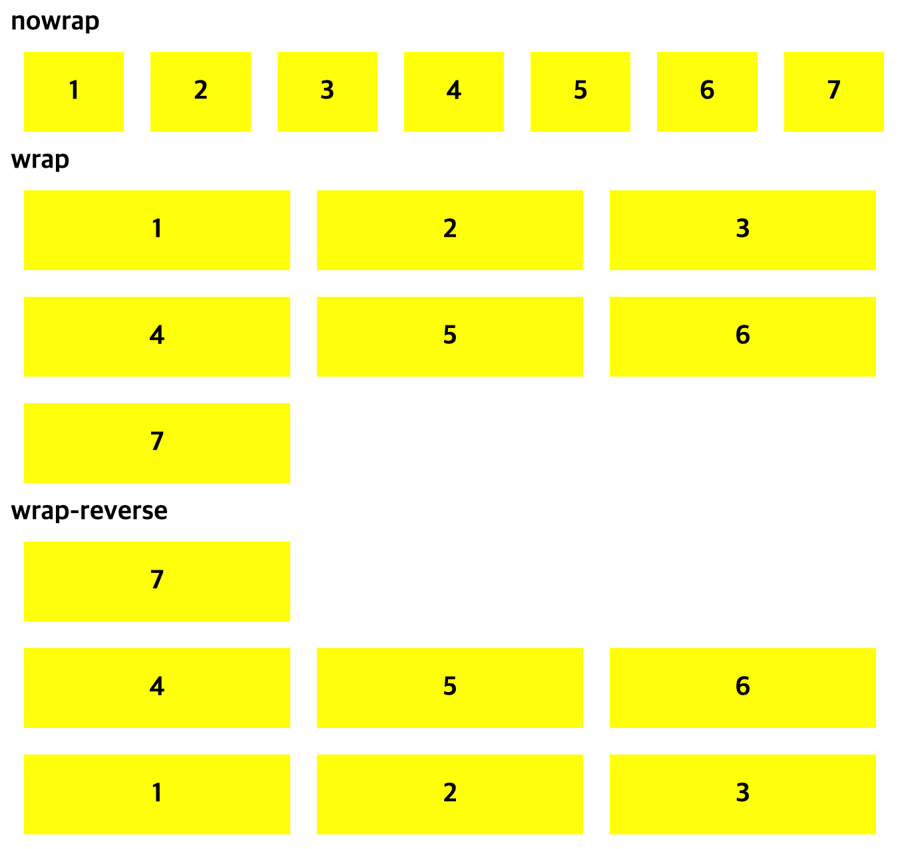

---

### 4-3. flex-flow

`flex-flow` 프로퍼티는 `flex-direction` 프로퍼티와 `flex-wrap` 프로퍼티를 동시에 설정하기 위한 shorthand이다. 기본값은 `row nowarp`이다.

사용법 `flex-flow: <flex-direction> || <flex-wrap>;`

---

### 4-4 justify-content

`justify-content` 프로퍼티는 주축(main axis)을 기준으로 flex item을 수평 정렬 방법을 지정한다.

> `flex-direction: column;`으로 인해 주축이 바뀌게 되는 경우를 조심하자.

아래는 `justify-content`의 프로퍼티값과 설명이다.

| 종류          | 설명                                                                                                      |
| :------------ | :-------------------------------------------------------------------------------------------------------- |
| flex-start    | 주축의 시작점에 맞춰 배치한다.                                                                            |
| flex-end      | 주축의 끝점에 맞춰 배치한다.                                                                              |
| center        | 주축의 중앙에 맞춰 배치한다.                                                                              |
| space-between | 첫 번재 항목과 끝 항목을 주축의 시작점과 끝점에 배치한 후 나머지 항목은 그 사이에 같은 간격으로 배치한다. |
| space-around  | 모든 항목을 주축에 같은 간격으로 배치한다.                                                                |

```html
<!DOCTYPE html>
<html>
  <head>
    <style>
      div {
        font-size: 20px;
        font-weight: 700;
      }
      .parents {
        margin-bottom: 10px;
      }
      .flex-container {
        background-color: green;
      }
      .box {
        background-color: yellow;
        width: 200px;
        height: 60px;
        text-align: center;
        line-height: 60px;
        margin: 10px;
      }
      .flex-start {
        display: flex;
        justify-content: flex-start;
      }
      .flex-end {
        display: flex;
        justify-content: flex-end;
      }
      .center {
        display: flex;
        justify-content: center;
      }
      .space-between {
        display: flex;
        justify-content: space-between;
      }
      .space-around {
        display: flex;
        justify-content: space-around;
      }
    </style>
  </head>
  <body>
    <div class="parents">
      flex-start
      <div class="flex-start flex-container">
        <div class="box">1</div>
        <div class="box">2</div>
        <div class="box">3</div>
        <div class="box">4</div>
      </div>
    </div>
    <div class="parents">
      flex-end
      <div class="flex-end flex-container">
        <div class="box">1</div>
        <div class="box">2</div>
        <div class="box">3</div>
        <div class="box">4</div>
      </div>
    </div>
    <div class="parents">
      center
      <div class="center flex-container">
        <div class="box">1</div>
        <div class="box">2</div>
        <div class="box">3</div>
        <div class="box">4</div>
      </div>
    </div>
    <div class="parents">
      space-between
      <div class="space-between flex-container">
        <div class="box">1</div>
        <div class="box">2</div>
        <div class="box">3</div>
        <div class="box">4</div>
      </div>
    </div>
    <div class="parents">
      space-around
      <div class="space-around flex-container">
        <div class="box">1</div>
        <div class="box">2</div>
        <div class="box">3</div>
        <div class="box">4</div>
      </div>
    </div>
  </body>
</html>
```

## 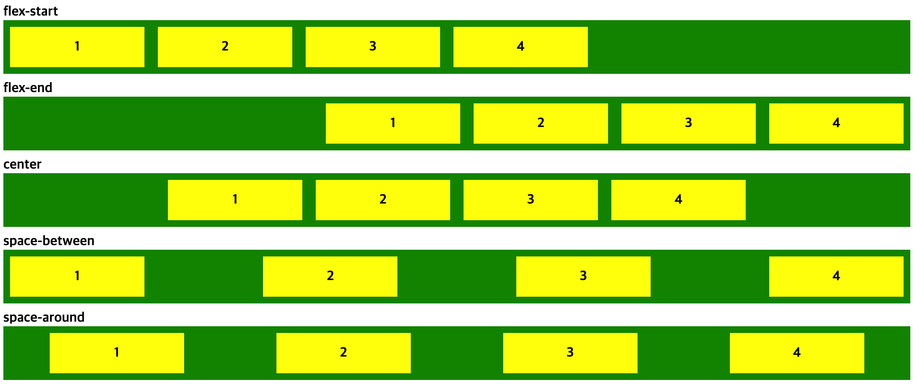

---

### 4-5 align-items

`align-items` 프로퍼티는 수직 방향(cross axis)을 기준으로 flex item을 정렬한다. `align-items` 프로퍼티는 모든 flex-item에 적용된다.

아래는 `align-items`의 프로퍼티값과 설명이다.

| 종류       | 설명                                            |
| :--------- | :---------------------------------------------- |
| flex-start | 교차축의 시작점에 맞춰 배치한다.                |
| flex-end   | 교차축의 끝점에 맞춰 배치한다.                  |
| center     | 교차축의 중아에 배치한다.                       |
| baseline   | 교차축의 문자 기준선에 맞춰 배치한다.           |
| stretch    | 플렉스 항목을 늘려 교차축에 가득 차게 배치한다. |

```html
<!DOCTYPE html>
<html>
  <head>
    <style>
      div {
        font-size: 20px;
        font-weight: 700;
      }
      .parents {
        margin-bottom: 10px;
        background-color: green;
        color: white;
      }
      .flex-container {
        min-height: 120px;
        border-top: 2px solid black;
        padding: 0;
        margin: 0;
        color: green;
      }
      .box {
        background-color: yellow;
        width: 200px;
        text-align: center;
        line-height: 60px;
        margin: 0px 10px;
      }
      .flex-start {
        display: flex;
        align-items: flex-start;
      }
      .flex-end {
        display: flex;
        align-items: flex-end;
      }
      .center {
        display: flex;
        align-items: center;
      }
      .baseline {
        display: flex;
        align-items: baseline;
      }
      .stretch {
        display: flex;
        align-items: stretch;
      }
    </style>
  </head>
  <body>
    <div class="parents">
      flex-start
      <div class="flex-start flex-container">
        <div class="box">1</div>
        <div class="box">2</div>
        <div class="box">3</div>
        <div class="box">4</div>
      </div>
    </div>
    <div class="parents">
      flex-end
      <div class="flex-end flex-container">
        <div class="box">1</div>
        <div class="box">2</div>
        <div class="box">3</div>
        <div class="box">4</div>
      </div>
    </div>
    <div class="parents">
      center
      <div class="center flex-container">
        <div class="box">1</div>
        <div class="box">2</div>
        <div class="box">3</div>
        <div class="box">4</div>
      </div>
    </div>
    <div class="parents">
      baseline
      <div class="baseline flex-container">
        <div class="box" style="padding-top: 10px">1</div>
        <div class="box" style="height: 80px">2</div>
        <div class="box" style="font-size: 32px">3</div>
        <div class="box">4</div>
      </div>
    </div>
    <div class="parents">
      stretch
      <div class="stretch flex-container">
        <div class="box">1</div>
        <div class="box">2</div>
        <div class="box">3</div>
        <div class="box">4</div>
      </div>
    </div>
  </body>
</html>
```

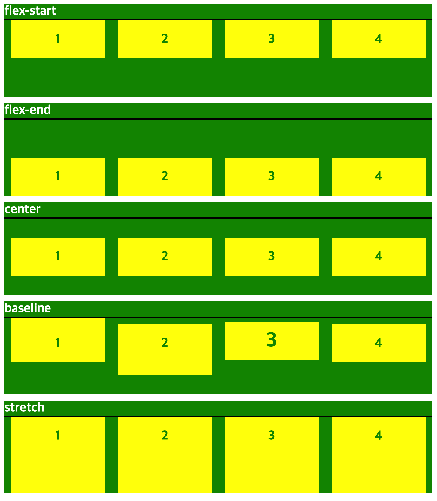

---

### 4-6. align-content

flex container의 cross axis를 기준으로 flex item을 수직 정렬한다.
참고로 `justify-content` 프로퍼티는 flex container의 main aixs를 기준으로 flex item을 수평 정렬한다.

즉, 주축에서 줄 바꿈이 생겨서 flex item을 여러 줄로 표시할 때 `align-content` 프로퍼티를 통해 교차축에서 flex item의 간격을 지정할 수 있다.

아래는 `align-content`의 프로퍼티값과 설명이다.

| 종류          | 설명                                                                                                     |
| :------------ | :------------------------------------------------------------------------------------------------------- |
| flex-start    | 교차축의 시작점에서 맞춰 배치한다.                                                                       |
| flex-end      | 교차축의 끝점에 맞춰 배치한다.                                                                           |
| center        | 교차축의 중앙에 맞춰 배치한다.                                                                           |
| space-between | 첫 번째 항목과 끝 항목을 교차축의 시작점과 끝점에 맞추고 나머지 항목은 그 사이에 같은 간격으로 배치한다. |
| space-around  | 모든 항목을 교차축에 같은 간격으로 배치한다.                                                             |
| stretch       | 플렉스 항목을 늘려서 교차축에 가득 차게 배치한다.                                                        |

```html
<!DOCTYPE html>
<html>
  <head>
    <style>
      div {
        font-size: 20px;
        font-weight: 700;
      }
      .parents {
        margin-bottom: 10px;
        background-color: green;
        color: white;
      }
      .flex-container {
        min-height: 160px;
        border-top: 2px solid black;
        padding: 0;
        margin: 0;
        color: green;
      }
      .box {
        background-color: yellow;
        width: 200px;
        text-align: center;
        line-height: 60px;
        margin: 0px 10px;
      }
      .box:nth-child(1) {
        margin-bottom: 10px;
      }
      .box:nth-child(2) {
        margin-bottom: 10px;
      }
      .flex-start {
        display: flex;
        flex-wrap: wrap;
        align-content: flex-start;
      }
      .flex-end {
        display: flex;
        flex-wrap: wrap;
        align-content: flex-end;
      }
      .center {
        display: flex;
        flex-wrap: wrap;
        align-content: center;
      }
      .sapce-between {
        display: flex;
        flex-wrap: wrap;
        align-content: space-between;
      }
      .space-around {
        display: flex;
        flex-wrap: wrap;
        align-content: space-around;
      }
      .stretch {
        display: flex;
        flex-wrap: wrap;
        align-content: stretch;
      }
    </style>
  </head>
  <body>
    <div class="parents">
      flex-start
      <div class="flex-start flex-container">
        <div class="box">1</div>
        <div class="box">2</div>
        <div class="box">3</div>
        <div class="box">4</div>
      </div>
    </div>
    <div class="parents">
      flex-end
      <div class="flex-end flex-container">
        <div class="box">1</div>
        <div class="box">2</div>
        <div class="box">3</div>
        <div class="box">4</div>
      </div>
    </div>
    <div class="parents">
      center
      <div class="center flex-container">
        <div class="box">1</div>
        <div class="box">2</div>
        <div class="box">3</div>
        <div class="box">4</div>
      </div>
    </div>
    <div class="parents">
      sapce-between
      <div class="sapce-between flex-container">
        <div class="box">1</div>
        <div class="box">2</div>
        <div class="box">3</div>
        <div class="box">4</div>
      </div>
    </div>
    <div class="parents">
      space-around
      <div class="space-around flex-container">
        <div class="box">1</div>
        <div class="box">2</div>
        <div class="box">3</div>
        <div class="box">4</div>
      </div>
    </div>
    <div class="parents">
      stretch
      <div class="stretch flex-container">
        <div class="box">1</div>
        <div class="box">2</div>
        <div class="box">3</div>
        <div class="box">4</div>
      </div>
    </div>
  </body>
</html>
```

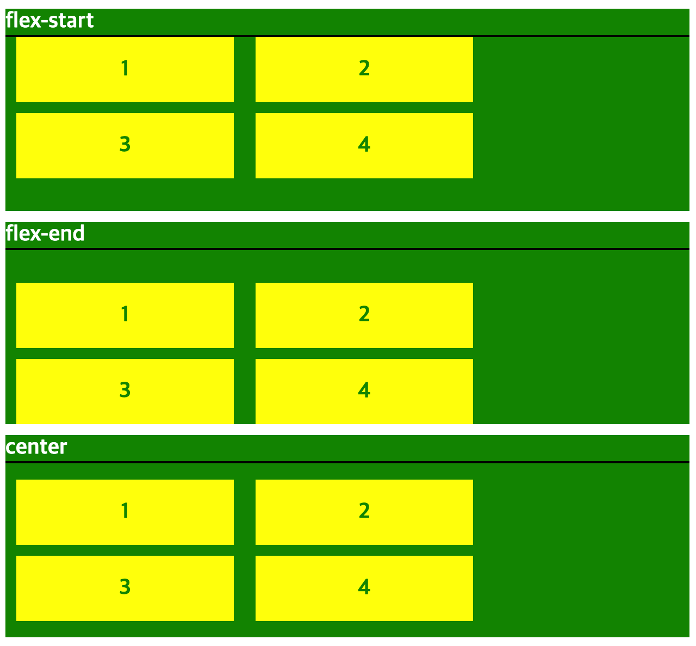
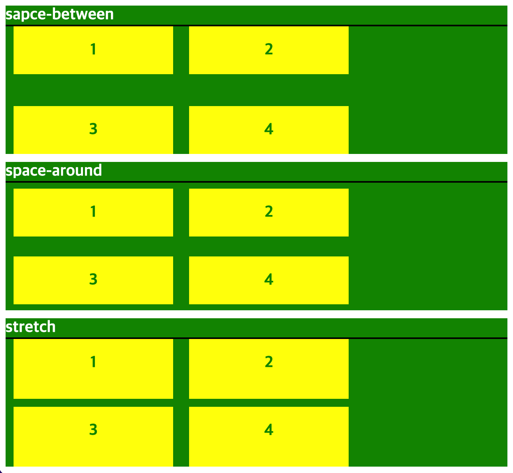

---

## 5. Flexbox item 속성

### 5-1. order

flex item의 배치 순서를 지정한다. HTML 코드를 변경하지 않고 order 프로퍼티값을 지정하는 것으로 간단히 재배치할 수 있다. 기본 배치 순서는 flex container에 추가된 순서이다. 기본값은 0이다.

사용법 `order: <정수값>`

```css
.flex-item {
  order: 2;
}
```

---

### 5-2. flex-grow

flex item의 너비에 대한 확대 인자를 지정한다. 기본값은 0이고 음수값은 무효하다.

```html
<!DOCTYPE html>
<html>
  <head>
    <style>
      .flex-container {
        display: flex;
        justify-content: space-around;
      }
      .box {
        height: 120px;
        background-color: yellow;
      }
      .box:not(:last-child) {
        margin-right: 10px;
      }
      .box:not(:nth-child(2)) {
        flex-grow: 1;
      }
      .box:nth-child(2) {
        flex-grow: 3;
      }
    </style>
  </head>
  <body>
    <div class="flex-container">
      <div class="box">1</div>
      <div class="box">2 / flex-grow: 3</div>
      <div class="box">3</div>
      <div class="box">4</div>
    </div>
  </body>
</html>
```

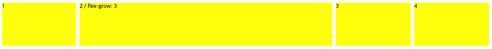

---

### 5-3. flex-shrink

flex item의 너비에 대한 축소 인자를 지정한다. 기본값은 1이고 음수값은 무효하다. 0를 지정하면 축소가 해제되어 원래의 너비를 유지한다.

```html
<!DOCTYPE html>
<html>
  <head>
    <style>
      .flex-container {
        display: flex;
        justify-content: space-around;
      }
      .box {
        width: 300px;
        height: 120px;
        background-color: yellow;
      }
      .box:not(:last-child) {
        margin-right: 10px;
      }
      .box:nth-child(2) {
        flex-shrink: 0;
      }
      .box:nth-child(3) {
        flex-shrink: 2;
      }
    </style>
  </head>
  <body>
    <div class="flex-container">
      <div class="box">1</div>
      <div class="box">2 / flex-shrink: 0</div>
      <div class="box">3 / flex-shrink: 2</div>
      <div class="box">4</div>
    </div>
  </body>
</html>
```

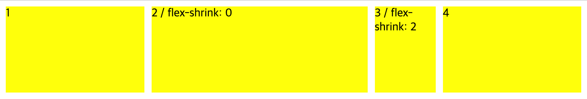

---

### 5-4. flex-basis

flex item의 너비 기본값을 px, % 등의 단위로 지정한다. 기본값은 auto이다.

```html
<!DOCTYPE html>
<html>
  <head>
    <style>
      .flex-container {
        display: flex;
        justify-content: space-around;
      }
      .box {
        width: 100px;
        height: 120px;
        background-color: yellow;
      }
      .box:not(:last-child) {
        margin-right: 10px;
      }
      .box:nth-child(2) {
        flex-basis: 500px;
      }
      .box:nth-child(3) {
        flex-basis: 50%;
      }
    </style>
  </head>
  <body>
    <div class="flex-container">
      <div class="box">1 / flex-basis: auto => 100px</div>
      <div class="box">2 / flex-basis: 500px</div>
      <div class="box">3 / flex-basis: 50%</div>
      <div class="box">4 / flex-basis: auto => 100px</div>
    </div>
  </body>
</html>
```

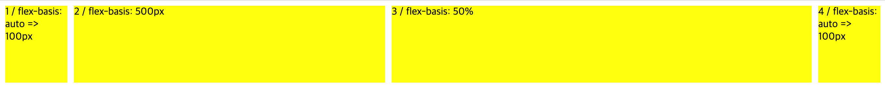

---

### 5-5. flex

`flex-grow`, `flex-shrink`, `flex-basis` 프로퍼티의 shorthand이다. 기본값은 `0 1 auto`이다.

W3C에서는 이 프로퍼티를 사용하는 것 보다 개별적으로 기술하는 것을 추천하고 있다.

---

### 5-6. align-self

`align-item` 속성은 교차축을 기준으로 플렉스 항목의 정렬 방법을 결정하지만 그중에서 특정 항목만 지정하고 싶다면 `align-self` 속성을 사용한다. `align-item` 프로퍼티보다 우선하여 개별 flex item을 정렬한다.

`align-self` 프로퍼티에서 사용한 값은 `align-items` 프로퍼티에서 사용하는 값과 같다.

```html
<!DOCTYPE html>
<html>
  <head>
    <style>
      .flex-container {
        display: flex;
        justify-content: space-around;
        height: 600px;
        background-color: aliceblue;
      }
      .box {
        width: 100px;
        padding: 60px;
        background-color: yellow;
      }
      .box:not(:last-child) {
        margin-right: 10px;
      }
      .box:nth-child(1) {
        align-self: flex-start;
      }
      .box:nth-child(2) {
        align-self: flex-end;
      }
      .box:nth-child(3) {
        align-self: center;
      }
      .box:nth-child(4) {
        align-self: stretch;
      }
    </style>
  </head>
  <body>
    <div class="flex-container">
      <div class="box">1 / align-self: flex-start</div>
      <div class="box">2 / align-self: flex-end</div>
      <div class="box">3 / align-self: center</div>
      <div class="box">4 / align-self: stretch</div>
    </div>
  </body>
</html>
```

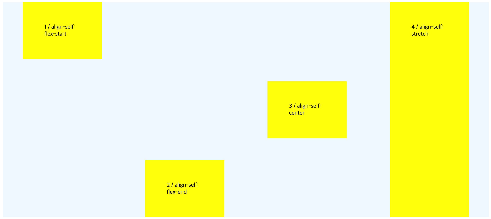

---

## 6. Conclusion

> `flex-grow`는 처음 써보는 프로퍼티이다. 굉장히 신기했다. 위의 코드를 예를들어 box 클래스를 가진 div들의 너비를 100%로 지정하지 않아도 `flex-grow`를 1로 지정하면 전체 너비를 모두 동등하게 차지하게 된다. 기본값은 0 이므로 딱 자신의 요소만큼만 너비를 차지하는 것 같다.  
> 뿐만 아니라 `flex-shrink`과 `flex-basis`도 이번 공부를 하면서 처음 써보는 프로퍼티였다.  
> `flex`는 `grid`를 배우기 전까지 자주 사용하였다. 하지만 `grid`를 배우고 나서는 사용빈도가 많이 줄었다. 두 개의 프로퍼티 모두 CSS에서 중요한 내용이니 필요한 상황에 맞춰 잘 사용하도록 하자.

---

## 참고

[poiemaweb 2-20 플렉스 박스 레이아웃](https://poiemaweb.com/css3-flexbox)  
도서 - HTML + CSS + 자바스크립트 웹 표준의 정석

---

[👆](#flexbox-layout)

📅 2022-07-24
