# Grid Layout

## 1. 개요

현대 웹 레이아웃을 담당하고 있는 가장 큰 프로퍼티가 바로 Grid이다. 나의 경우 전체적인 틀을 Grid로 잡고 작은 부분 부분을 Flex를 사용하고 있다. 사실 지금은 작은 부분도 Flex보다는 Grid를 사용하는 편이다.

이전에 올린 Flexbox Layout은 한 방향 레이아웃 시스템이라면 Grid Layout은 두 방향 레이아웃 시스템이다. 따라서 Flex보다 더 복잡적인 레이아웃 표현이 가능하다.

---

## 2. 용어 정리

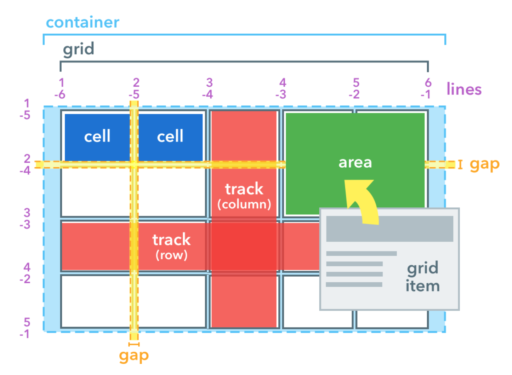

- 그리드 컨테이너(Grid Container): `display: grid`를 적용하는, Grid의 전체 영역이다. Grid 컨테이너 안의 요소들이 Grid 규칙의 영향을 받아 정렬된다.
- 그리드 아이템(Grid Item): Grid 컨테이너의 자식 요소들이다. 그리드 아이템들이 Grid 규칙에 의해 배치된다.
- 그리드 트랙(Grid Track): Grid의 행(Row) 또는 열(Column)
- 그리드 셀(Grid Cell): Grid의 한 칸을 가르킨다. `<div>`같은 실제 html 요소는 Grid 아이템이고, 이런 Grid 아이템 하나가 들어가는 '가상의 칸(틀)'이 Grid 셀이다.
- 그리드 라인(Grid Line): Grid 셀을 구분하는 선이다.
- 그리드 번호(Grid Number): Grid 라인의 각 번호이다.
- 그리드 갭(Grid Gap): Grid 셀 사이의 간격이다.
- 그리드 영역(Grid Area): Grid 라인으로 둘러싸인 사각형 영역으로, 그리드 셀의 집합이다.

---

## 3. Usage

Grid 규칙을 적용하고자 하는 요소들의 부모에 `display: grid;`를 적용을 하면 된다.

```css
.grid-container {
  display: grid;
}
```

`display: inline-grid`도 있다. 아이템의 배치와 관련이 있다가 보다는, 컨테이너가 주변 요소들과 어떻게 어우러질지 결정하는 값이다. `inline-grid`는 `inline-block`처럼 동작한다.

```css
.grid-container {
  display: inline-grid;
}
```

---

## 4. 그리드 형태 정의

### 4-1. grid-template-columns

`grid-template-columns` 프로퍼티는 grid columns의 배치를 지정하는데 사용한다.

```css
.grid-container {
  display: grid;
  grid-template-columns: 100px 200px 300px;
}
```

위의 코드는 grid-container로 감싸져 있는 자식요소들을 그리드로 배치하고 column을 3열로 만들고 첫번째 column 부터 100px, 200px, 300px만큼의 크기로 만들겠다는 의미이다.

또 다른 사용법을 보자.

```css
.grid-container {
  display: grid;
  grid-template-columns: 1fr 2fr 2fr;
}
```

위의 코드에서 fr은 fraction으로 숫자 비율대로 그리드 트랙의 크기를 나눈다. 즉 `1fr 2fr 2fr`은 1:2:2 비윤일 3개의 column을 만들겠다는 의미이다.

```css
.grid-container {
  display: grid;
  grid-template-columns: 100px 2fr 2fr;
}
```

위의 코드와 같이 px과 fr를 함께 사용할 수 있다. %로도 크기를 지정할 수 있다.

```html
<!DOCTYPE html>
<html>
  <head>
    <style>
      div {
        font-size: 24px;
      }
      .box {
        border: 2px solid black;
        border-radius: 10px;
        text-align: center;
        padding: 20px 0px;
        background-color: aliceblue;
      }
      .grid-container1 {
        display: grid;
        grid-template-columns: 1fr 1fr 1fr;
        margin-bottom: 20px;
      }
      .grid-container2 {
        display: grid;
        grid-template-columns: 160px 200px 300px;
        margin-bottom: 20px;
      }
      .grid-container3 {
        display: grid;
        grid-template-columns: 200px 1fr 400px;
      }
    </style>
  </head>
  <body>
    <div>
      grid-template-columns: 1fr 1fr 1fr;
      <div class="grid-container1">
        <div class="box">1</div>
        <div class="box">2</div>
        <div class="box">3</div>
        <div class="box">4</div>
        <div class="box">5</div>
        <div class="box">6</div>
      </div>
    </div>
    <div>
      grid-template-columns: 160px 200px 300px;
      <div class="grid-container2">
        <div class="box">1</div>
        <div class="box">2</div>
        <div class="box">3</div>
        <div class="box">4</div>
        <div class="box">5</div>
        <div class="box">6</div>
      </div>
    </div>
    <div>
      grid-template-columns: 200px 1fr 400px;
      <div class="grid-container3">
        <div class="box">1</div>
        <div class="box">2</div>
        <div class="box">3</div>
        <div class="box">4</div>
        <div class="box">5</div>
        <div class="box">6</div>
      </div>
    </div>
  </body>
</html>
```

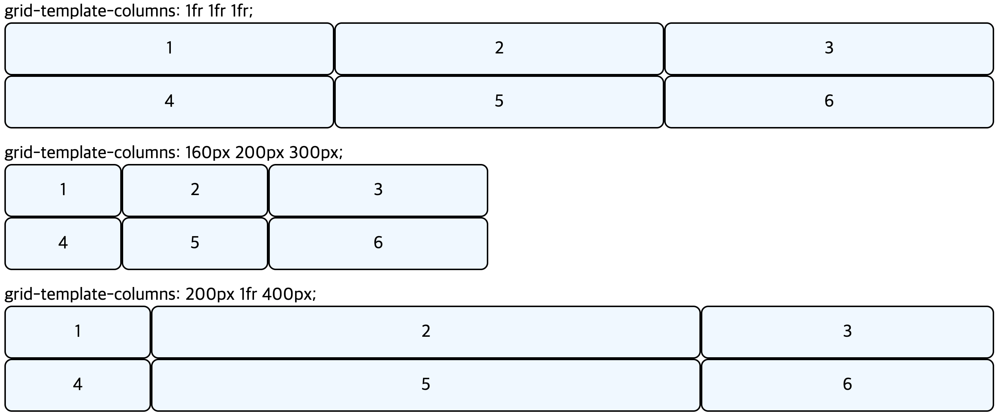

---

### 4-2. grid-template-rows

`grid-template-columns`은 열(column)의 배치라면 `grid-template-rows`은 행(row)의 배치이다. 그 외의 내용은 같다.

```html
<!DOCTYPE html>
<html>
  <head>
    <style>
      div {
        font-size: 24px;
      }
      .box {
        border: 2px solid black;
        border-radius: 10px;
        text-align: center;
        padding: 20px 0px;
        background-color: aliceblue;
      }
      .grid-container1 {
        display: grid;
        grid-template-columns: 1fr 1fr 1fr;
        grid-template-rows: 1fr 2fr;
        margin-bottom: 20px;
      }
      .grid-container2 {
        display: grid;
        grid-template-columns: 1fr 200px 300px;
        grid-template-rows: 160px 300px;
        margin-bottom: 20px;
      }
    </style>
  </head>
  <body>
    <div>
      grid-template-columns: 1fr 1fr 1fr; / grid-template-rows: 1fr 2fr;
      <div class="grid-container1">
        <div class="box">1</div>
        <div class="box">2</div>
        <div class="box">3</div>
        <div class="box">4</div>
        <div class="box">5</div>
        <div class="box">6</div>
      </div>
    </div>
    <div>
      grid-template-columns: 1fr 200px 300px; / grid-template-rows: 160px 300px;
      <div class="grid-container2">
        <div class="box">1</div>
        <div class="box">2</div>
        <div class="box">3</div>
        <div class="box">4</div>
        <div class="box">5</div>
        <div class="box">6</div>
      </div>
    </div>
  </body>
</html>
```

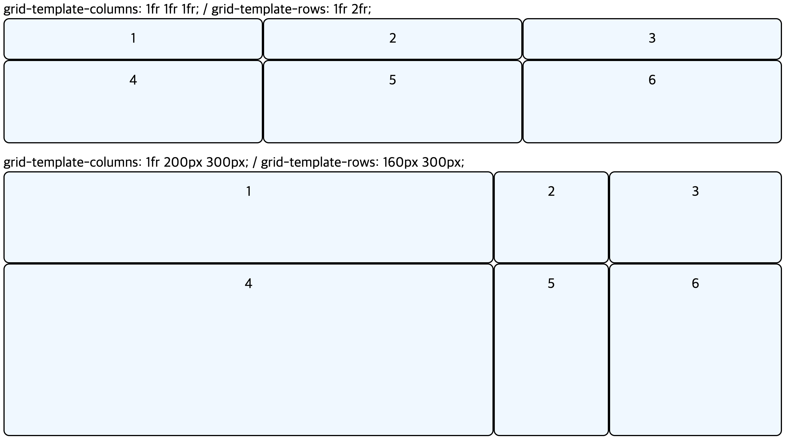

---

### 4-3. repeat 함수

`grid-template-columns, grid-template-rows`의 프로퍼티값으로 사용되는 repeat는 반복되는 값을 자동으로 처리할 수 있는 함수이다.

사용법 `grid-template-columns: repeat(반복횟수, 반복값)`

```css
.grid-container {
  display: grid;
  grid-template-columns: repeat(5, 1fr);
}
```

```css
.grid-container {
  display: grid;
  grid-template-columns: 1fr 1fr 1fr 1fr 1fr;
}
```

위의 두 코드는 같은 결과를 나타낸다.

---

### 4-4. minmax 함수

최솟값과 최댓값을 지정할 수 있는 함수이다.

`minmax(100px, auto)`의 의미는 '최소한 100px, 최대는 자동으로(auto) 늘어나게 한다.'이다. 아무리 내용의 양이 적더라도 최소한의 높이 100px은 확보되고, 내용이 많아 100px이 넘어가면 알아서 늘어나도록 한다.

```html
<!DOCTYPE html>
<html>
  <head>
    <style>
      div {
        font-size: 24px;
      }
      .box {
        border: 2px solid black;
        border-radius: 10px;
        text-align: center;
        padding: 20px 0px;
        background-color: aliceblue;
      }
      .grid-container1 {
        display: grid;
        grid-template-columns: repeat(3, 1fr);
        grid-template-rows: auto 1fr;
        margin-bottom: 20px;
      }
      .grid-container2 {
        display: grid;
        grid-template-columns: repeat(3, 1fr);
        grid-template-rows: repeat(2, minmax(100px, auto));
      }
    </style>
  </head>
  <body>
    <div>
      grid-template-columns: repeat(3, 1fr); grid-template-rows: auto 1fr;
      <div class="grid-container1">
        <div class="box">1</div>
        <div class="box">2</div>
        <div class="box">3</div>
        <div class="box">
          Lorem ipsum, dolor sit amet consectetur adipisicing elit. Eligendi
          eius illo nisi id ut vel, neque aliquam sapiente ullam tempore beatae
          sit aperiam consequuntur! Soluta amet culpa ab omnis quo!
        </div>
        <div class="box">5</div>
        <div class="box">6</div>
      </div>
    </div>
    <div>
      grid-template-columns: repeat(3, 1fr); grid-template-rows: repeat(2,
      minmax(100px, auto));
      <div class="grid-container2">
        <div class="box">1</div>
        <div class="box">2</div>
        <div class="box">3</div>
        <div class="box">
          Lorem ipsum, dolor sit amet consectetur adipisicing elit. Eligendi
          eius illo nisi id ut vel, neque aliquam sapiente ullam tempore beatae
          sit aperiam consequuntur! Soluta amet culpa ab omnis quo!
        </div>
        <div class="box">5</div>
        <div class="box">6</div>
      </div>
    </div>
  </body>
</html>
```

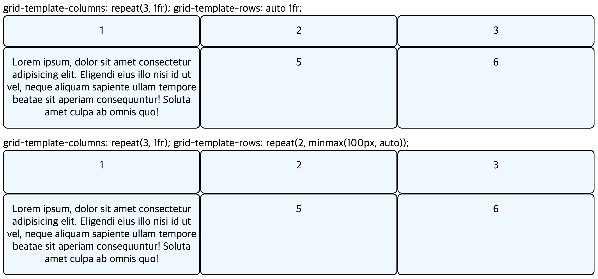

---

### 4-5. auto-fill, auto-fit

`auto-fill`과 `auto-fit`은 column의 개수를 미리 정하지 않고 설정된 너비가 허용하는 한 최대한 셀을 채운다.

`auto-fill`과 `auto-fit`의 차이는 남는 공간을 채우지 않느냐 채우냐이다. `auto-fill`은 남은 공간을 채우지 않고 `auto-fit`은 남은 공간을 채운다.

```html
<!DOCTYPE html>
<html>
  <head>
    <style>
      div {
        font-size: 24px;
        box-sizing: border-box;
      }
      .box {
        border: 2px solid black;
        border-radius: 10px;
        text-align: center;
        padding: 20px 0px;
        background-color: aliceblue;
      }
      .grid-container1 {
        display: grid;
        grid-template-columns: repeat(auto-fill, minmax(25%, auto));
        margin-bottom: 20px;
      }
      .grid-container2 {
        display: grid;
        grid-template-columns: repeat(auto-fit, minmax(25%, auto));
      }
    </style>
  </head>
  <body>
    <div>
      <div class="grid-container1">
        <div class="box">1</div>
        <div class="box">2</div>
        <div class="box">3</div>
        <div class="box">4</div>
        <div class="box">5</div>
        <div class="box">6</div>
      </div>
    </div>
    <div>
      <div class="grid-container2">
        <div class="box">1</div>
        <div class="box">2</div>
        <div class="box">3</div>
        <div class="box">4</div>
        <div class="box">5</div>
        <div class="box">6</div>
      </div>
    </div>
  </body>
</html>
```


> 내가 생각한 결과가 다르다. 위는 fill이기 때문에 예상된 결과이지만 아래는 fit으로 정해도 2번째 열이 모든 너비를 차지하지 않는다. 왤까?

---

## 5. 간격만들기

그리드 셀 사이의 간격을 설정을 하기 위해서는 `row-gap`, `column-gap` 프로퍼티를 사용한다. 각각 row(열), column(행)의 간격을 지정하며 `gap` 프로퍼티는 `row-gap`과 `column-gap`를 지정할 수 있는 shorthand이다.

사용법 `gap: row-gap, column-gap`
`row-gap`과 `column-gap`이 같으면 하나만 적어도 열과 행에 모두 적용이 된다.

```html
<!DOCTYPE html>
<html>
  <head>
    <style>
      div {
        font-size: 24px;
        box-sizing: border-box;
      }
      .box {
        border: 2px solid black;
        border-radius: 10px;
        text-align: center;
        padding: 10px 0px;
        background-color: aliceblue;
      }
      .grid-container1 {
        display: grid;
        grid-template-columns: repeat(3, 1fr);
        column-gap: 10px;
        row-gap: 10px;
        margin-bottom: 20px;
      }
      .grid-container2 {
        display: grid;
        grid-template-columns: repeat(3, 1fr);
        column-gap: 30px;
        row-gap: 5px;
        margin-bottom: 20px;
      }
      .grid-container3 {
        display: grid;
        grid-template-columns: repeat(3, 1fr);
        gap: 40px 10px;
        /* row-gap: 40px, column-gap: 10px*/
        margin-bottom: 20px;
      }
      .grid-container4 {
        display: grid;
        grid-template-columns: repeat(3, 1fr);
        gap: 20px;
        /* row-gap: 20px, column-gap: 20px*/
      }
    </style>
  </head>
  <body>
    <div>
      column-gap: 10px; row-gap: 10px;
      <div class="grid-container1">
        <div class="box">1</div>
        <div class="box">2</div>
        <div class="box">3</div>
        <div class="box">4</div>
        <div class="box">5</div>
        <div class="box">6</div>
      </div>
    </div>
    <div>
      column-gap: 30px; row-gap: 5px;
      <div class="grid-container2">
        <div class="box">1</div>
        <div class="box">2</div>
        <div class="box">3</div>
        <div class="box">4</div>
        <div class="box">5</div>
        <div class="box">6</div>
      </div>
    </div>
    <div>
      gap: 40px 10px;
      <div class="grid-container3">
        <div class="box">1</div>
        <div class="box">2</div>
        <div class="box">3</div>
        <div class="box">4</div>
        <div class="box">5</div>
        <div class="box">6</div>
      </div>
    </div>
    <div>
      gap: 20px;
      <div class="grid-container4">
        <div class="box">1</div>
        <div class="box">2</div>
        <div class="box">3</div>
        <div class="box">4</div>
        <div class="box">5</div>
        <div class="box">6</div>
      </div>
    </div>
  </body>
</html>
```

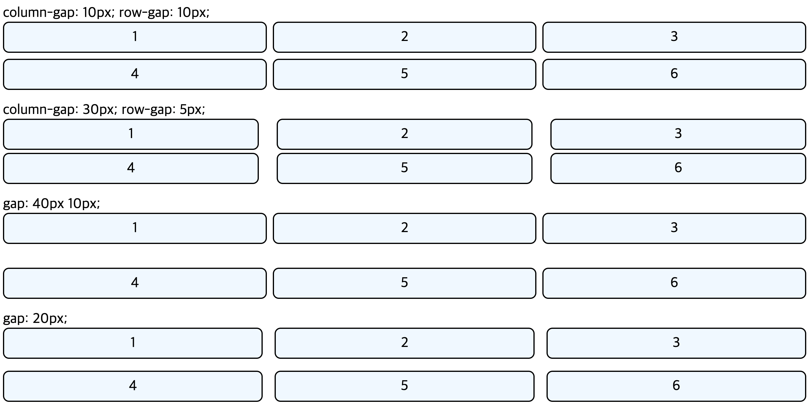

---

## 6. 그리드 형태를 자동으로 정의

`grid-template-columns`또는 `grid-template-rows`의 **통제를 벗어난** 위치에 있는 트랙의 크기를 지정하는 속성이다.

아래의 코드를 보자.

```css
.grid-container {
  display: grid;
  grid-template-rows: repeat(3, minmax(320px, auto));
}
```

해당 css는 3번째 열까지만 트렉의 크기를 지정하고 있다. 하지만 만약 4번째 이상의 열이 생길 경우 지정해주지 않아 다른 크기의 트렉이 생길 수 있다. 이때 4번째 이상의 열이 바로 통제를 벗어난 위치에 있는 트렉이다.
즉, 우리가 생성하고자 하는 column과 row의 개수를 모를 때 `grid-template-columns`또는 `grid-template-rows` 프로퍼티를 사용하면 된다. 이때 모든 column과 row는 통제를 벗어난 위치에 있는 트렉이라고 할 수 있다.

```html
<!DOCTYPE html>
<html>
  <head>
    <style>
      div {
        font-size: 24px;
        box-sizing: border-box;
      }
      .box {
        border: 2px solid black;
        border-radius: 10px;
        text-align: center;
        padding: 20px 0px;
        background-color: aliceblue;
      }
      .grid-container {
        display: grid;
        grid-template-columns: repeat(3, 1fr);
        grid-auto-rows: minmax(120px, auto);
      }
    </style>
  </head>
  <body>
    <div>
      <div class="grid-container">
        <div class="box">1</div>
        <div class="box">2</div>
        <div class="box">3</div>
        <div class="box">4</div>
        <div class="box">
          Lorem ipsum dolor sit amet consectetur, adipisicing elit. Omnis unde
          molestias sequi facere repudiandae architecto molestiae inventore
          ducimus rem, modi rerum, saepe reprehenderit tempore nemo minima ipsa
          laboriosam odit dolore?
        </div>
        <div class="box">6</div>
      </div>
    </div>
  </body>
</html>
```

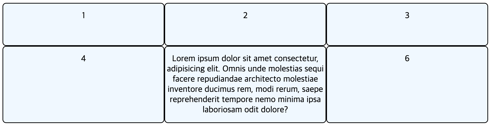

---

## 7. grid-column, grid-row

`grid-column`, `grid-row` 프로퍼티는 Grid 아이템에 적용하는 프로퍼티로, 각 셀의 영역을 지정한다. Grid에는 아래와 같은 번호가 매겨져 있다.

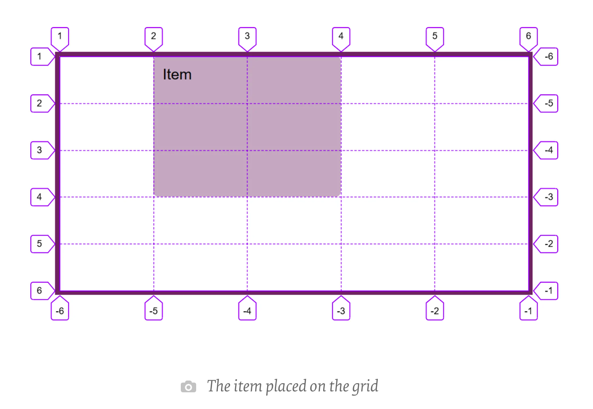

이러한 Grid 번호를 사용하여 영역을 지정한다.

사용법 `grid-column: <시작번호> / <끝번호>`  
사용법 `grid-row: <시작번호> / <끝번호>`

또는 몇 개의 셀을 차지하게 할 것이지를 지정할 수도 있다.

사용법 `grid-column: <시작번호> / span<자치할 영역 셀 수>`  
사용법 `grid-row: <시작번호> / span<자치할 영역 셀 수>`

```html
<!DOCTYPE html>
<html>
  <head>
    <style>
      div {
        font-size: 24px;
        box-sizing: border-box;
      }
      .box {
        border: 2px solid black;
        border-radius: 10px;
        text-align: center;
        padding: 20px 0px;
        background-color: aliceblue;
      }
      .grid-container {
        display: grid;
        grid-template-columns: repeat(4, 1fr);
        grid-auto-rows: minmax(120px, auto);
      }
      .box:nth-child(1) {
        grid-column: 1 / 4;
        grid-row: 1 / 3;
      }
      .box:nth-child(4) {
        grid-column: 1 / span 2;
      }
      .box:nth-child(8) {
        grid-column: 1 / -1;
        grid-row: 4 / 6;
      }
    </style>
  </head>
  <body>
    <div>
      <div class="grid-container">
        <div class="box">grid-column: 1 / 4; grid-row: 1 / 3;</div>
        <div class="box">2</div>
        <div class="box">3</div>
        <div class="box">grid-column: 1 / span 2;</div>
        <div class="box">5</div>
        <div class="box">6</div>
        <div class="box">7</div>
        <div class="box">grid-column: 1 / -1; grid-row: 4 / 6;</div>
        <div class="box">9</div>
        <div class="box">10</div>
      </div>
    </div>
  </body>
</html>
```

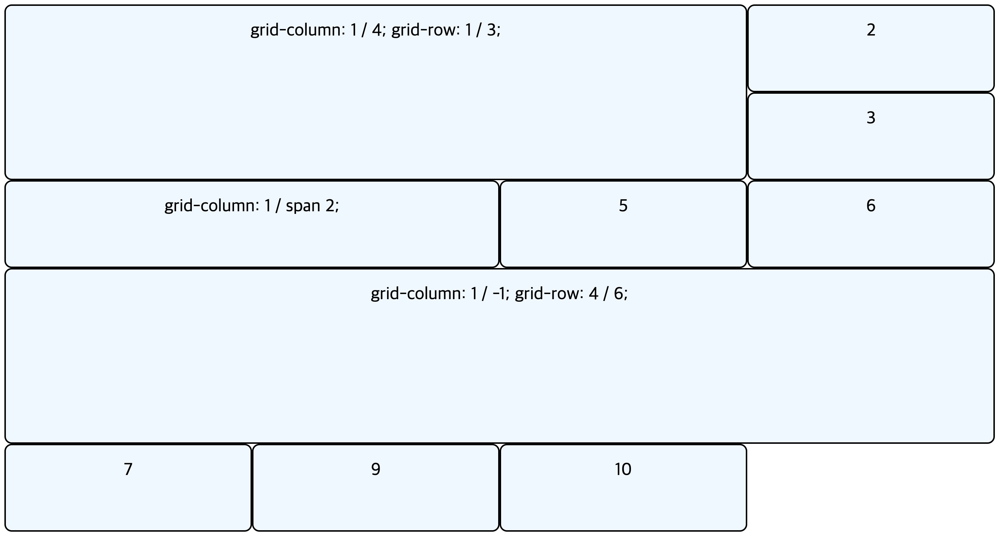

---

## 8. 세로 방향 정렬

### 8-1. align-items

`align-items`는 컨테이너에 적용하는 프로퍼티로 아이템들을 세로(column축) 방향으로 정렬한다.

```html
<!DOCTYPE html>
<html>
  <head>
    <style>
      div {
        font-size: 24px;
        box-sizing: border-box;
      }
      .parents {
        background-color: greenyellow;
        padding: 5px;
        margin-bottom: 20px;
      }
      .box {
        border: 2px solid black;
        border-radius: 10px;
        text-align: center;
        padding: 20px 0px;
        background-color: aliceblue;
      }
      .grid-container {
        height: 300px;
        display: grid;
        grid-template-columns: repeat(3, 1fr);
      }
      .stretch {
        align-items: stretch;
      }
      .start {
        align-items: start;
      }
      .end {
        align-items: end;
      }
      .center {
        align-items: center;
      }
    </style>
  </head>
  <body>
    <div class="parents">
      align-items: stretch;
      <div class="grid-container stretch">
        <div class="box">1</div>
        <div class="box">2</div>
        <div class="box">3</div>
        <div class="box">4</div>
        <div class="box">5</div>
        <div class="box">6</div>
      </div>
    </div>
    <div class="parents">
      align-items: start;
      <div class="grid-container start">
        <div class="box">1</div>
        <div class="box">2</div>
        <div class="box">3</div>
        <div class="box">4</div>
        <div class="box">5</div>
        <div class="box">6</div>
      </div>
    </div>
    <div class="parents">
      align-items: end;
      <div class="grid-container end">
        <div class="box">1</div>
        <div class="box">2</div>
        <div class="box">3</div>
        <div class="box">4</div>
        <div class="box">5</div>
        <div class="box">6</div>
      </div>
    </div>
    <div class="parents">
      align-items: center;
      <div class="grid-container center">
        <div class="box">1</div>
        <div class="box">2</div>
        <div class="box">3</div>
        <div class="box">4</div>
        <div class="box">5</div>
        <div class="box">6</div>
      </div>
    </div>
  </body>
</html>
```

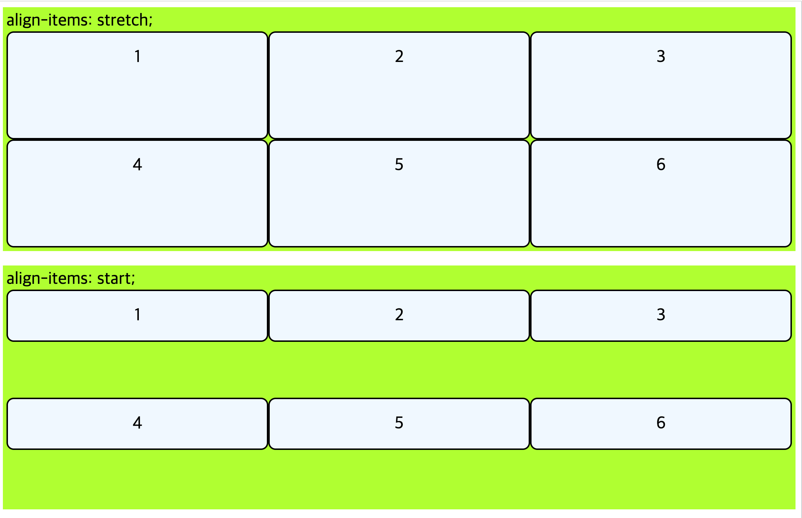
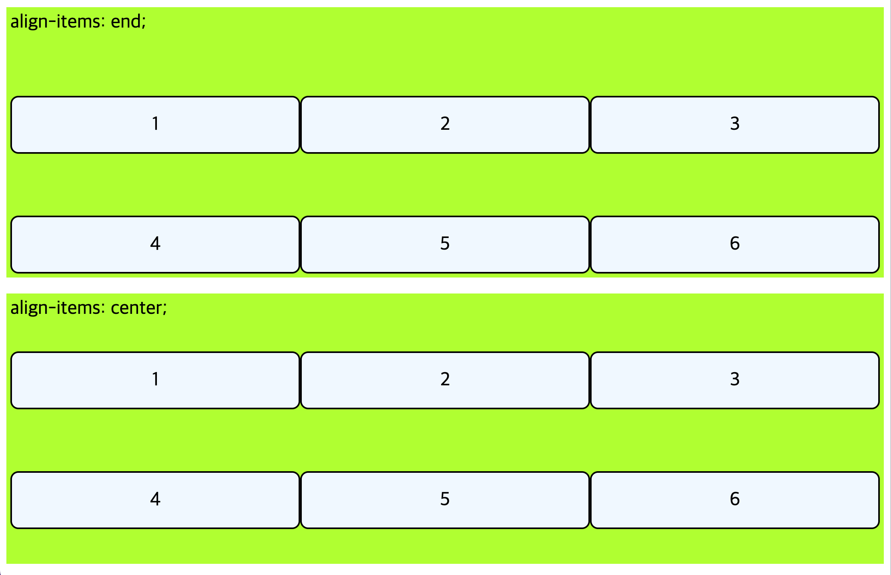

---

### 8-2. align-content

`align-content`는 컨테이너에 적용하는 프로퍼티로 Gird 아이템들의 높이를 모두 합한 값이 Grid 컨테이너의 높이보다 작을 때 Grid 아이템들을 통째로 정렬한다.

```html
<!DOCTYPE html>
<html>
  <head>
    <style>
      div {
        font-size: 24px;
        box-sizing: border-box;
      }
      .parents {
        background-color: greenyellow;
        padding: 5px;
        margin-bottom: 20px;
      }
      .box {
        border: 2px solid black;
        border-radius: 10px;
        text-align: center;
        padding: 20px 0px;
        background-color: aliceblue;
      }
      .grid-container {
        height: 200px;
        display: grid;
        grid-template-columns: repeat(3, 1fr);
      }
      .start {
        align-content: start;
      }
      .end {
        align-content: end;
      }
      .center {
        align-content: center;
      }
      .space-between {
        align-content: space-between;
      }
      .space-around {
        align-content: space-around;
      }
      .space-evenly {
        align-content: space-evenly;
      }
    </style>
  </head>
  <body>
    <div class="parents">
      align-content: start;
      <div class="grid-container start">
        <div class="box">1</div>
        <div class="box">2</div>
        <div class="box">3</div>
        <div class="box">4</div>
        <div class="box">5</div>
        <div class="box">6</div>
      </div>
    </div>
    <div class="parents">
      align-content: end;
      <div class="grid-container end">
        <div class="box">1</div>
        <div class="box">2</div>
        <div class="box">3</div>
        <div class="box">4</div>
        <div class="box">5</div>
        <div class="box">6</div>
      </div>
    </div>
    <div class="parents">
      align-content: center;
      <div class="grid-container center">
        <div class="box">1</div>
        <div class="box">2</div>
        <div class="box">3</div>
        <div class="box">4</div>
        <div class="box">5</div>
        <div class="box">6</div>
      </div>
    </div>
    <div class="parents">
      align-content: space-between;
      <div class="grid-container space-between">
        <div class="box">1</div>
        <div class="box">2</div>
        <div class="box">3</div>
        <div class="box">4</div>
        <div class="box">5</div>
        <div class="box">6</div>
      </div>
    </div>
    <div class="parents">
      align-content: space-around;
      <div class="grid-container space-around">
        <div class="box">1</div>
        <div class="box">2</div>
        <div class="box">3</div>
        <div class="box">4</div>
        <div class="box">5</div>
        <div class="box">6</div>
      </div>
    </div>
    <div class="parents">
      align-content: space-evenly;
      <div class="grid-container space-evenly">
        <div class="box">1</div>
        <div class="box">2</div>
        <div class="box">3</div>
        <div class="box">4</div>
        <div class="box">5</div>
        <div class="box">6</div>
      </div>
    </div>
  </body>
</html>
```

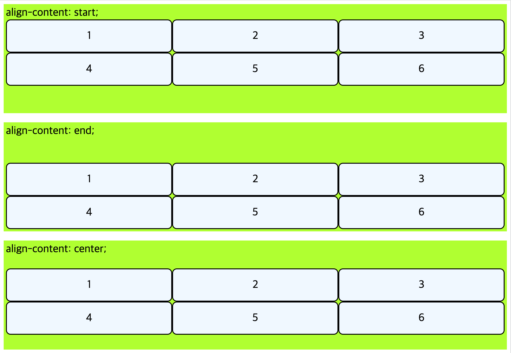
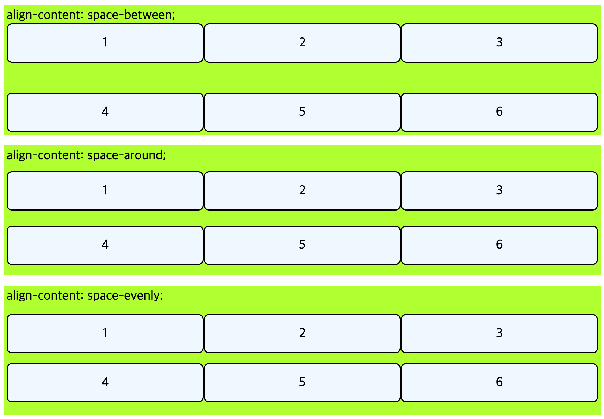

---

### 8-3. align-self

`align-self`는 Grid 아이템에 적용하는 프로퍼티로 해당 아이템을 세로(column축) 방향으로 정렬한다.

```html
<!DOCTYPE html>
<html>
  <head>
    <style>
      div {
        font-size: 24px;
        box-sizing: border-box;
      }
      .parents {
        background-color: greenyellow;
        padding: 5px;
        margin-bottom: 20px;
      }
      .box {
        border: 2px solid black;
        border-radius: 10px;
        text-align: center;
        padding: 20px 0px;
        background-color: aliceblue;
      }
      .grid-container {
        height: 300px;
        display: grid;
        grid-template-columns: repeat(3, 1fr);
        grid-auto-rows: 1fr;
      }
      .box:nth-child(1) {
        align-self: stretch;
      }
      .box:nth-child(2) {
        align-self: start;
      }
      .box:nth-child(5) {
        align-self: center;
      }
      .box:nth-child(6) {
        align-self: end;
      }
    </style>
  </head>
  <body>
    <div class="parents">
      <div class="grid-container start">
        <div class="box">align-self: stretch;</div>
        <div class="box">align-self: start;</div>
        <div class="box">3</div>
        <div class="box">4</div>
        <div class="box">align-self: center;</div>
        <div class="box">align-self: end;</div>
      </div>
    </div>
  </body>
</html>
```

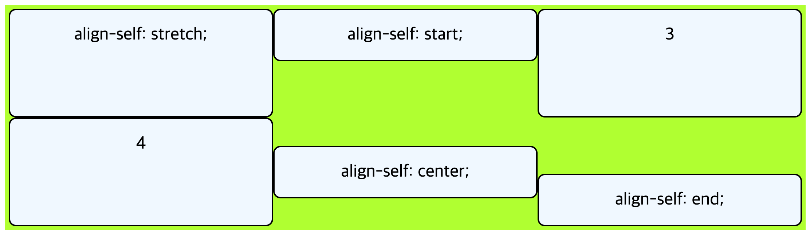

---

## 9. 가로 방향 정렬

### 9-1. justify-items

`justify-items` 프로퍼티는 Gird 컨테이너에 적용하며 아이템들을 가로(row축) 방향으로 정렬할 때 사용한다.

```html
<!DOCTYPE html>
<html>
  <head>
    <style>
      div {
        font-size: 24px;
        box-sizing: border-box;
      }
      .parents {
        background-color: greenyellow;
        padding: 5px;
        margin-bottom: 20px;
      }
      .box {
        border: 2px solid black;
        border-radius: 10px;
        text-align: center;
        padding: 20px 40px;
        background-color: aliceblue;
      }
      .grid-container {
        display: grid;
        grid-template-columns: repeat(3, 1fr);
      }
      .start {
        justify-items: start;
      }
      .end {
        justify-items: end;
      }
      .center {
        justify-items: center;
      }
      .stretch {
        justify-items: stretch;
      }
    </style>
  </head>
  <body>
    <div class="parents">
      justify-items: start;
      <div class="grid-container start">
        <div class="box">1</div>
        <div class="box">2</div>
        <div class="box">3</div>
        <div class="box">4</div>
        <div class="box">5</div>
        <div class="box">6</div>
      </div>
    </div>
    <div class="parents">
      justify-items: end;
      <div class="grid-container end">
        <div class="box">1</div>
        <div class="box">2</div>
        <div class="box">3</div>
        <div class="box">4</div>
        <div class="box">5</div>
        <div class="box">6</div>
      </div>
    </div>
    <div class="parents">
      justify-items: center;
      <div class="grid-container center">
        <div class="box">1</div>
        <div class="box">2</div>
        <div class="box">3</div>
        <div class="box">4</div>
        <div class="box">5</div>
        <div class="box">6</div>
      </div>
    </div>
    <div class="parents">
      justify-items: stretch;
      <div class="grid-container stretch">
        <div class="box">1</div>
        <div class="box">2</div>
        <div class="box">3</div>
        <div class="box">4</div>
        <div class="box">5</div>
        <div class="box">6</div>
      </div>
    </div>
  </body>
</html>
```

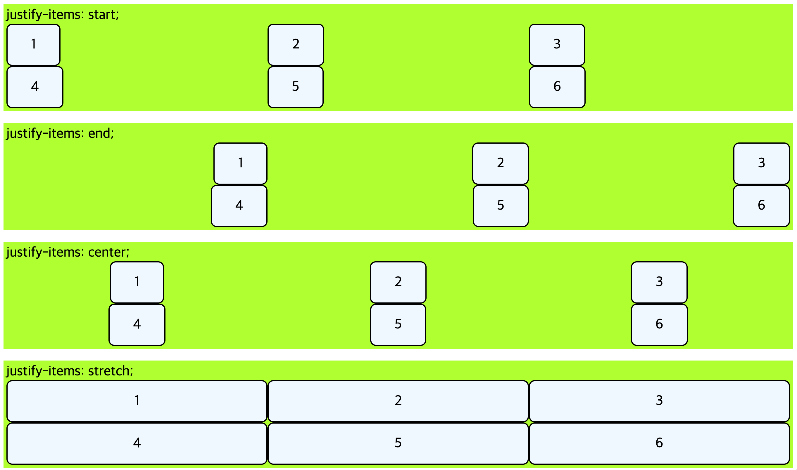

---

### 9-2. justify-content

`justify-content` 프로퍼티는 Grid 컨테이너에 적용하며 Grid 아이템들의 너비를 모두 합한 값이 Grid 컨테이너의 너비보다 작을 때 Grid 아이템들을 통째로 정렬한다.

```html
<!DOCTYPE html>
<html>
  <head>
    <style>
      div {
        font-size: 24px;
        box-sizing: border-box;
      }
      .parents {
        background-color: greenyellow;
        padding: 5px;
        margin-bottom: 20px;
      }
      .box {
        border: 2px solid black;
        border-radius: 10px;
        width: 200px;
        text-align: center;
        padding: 20px 40px;
        background-color: aliceblue;
      }
      .grid-container {
        display: grid;
        grid-template-columns: repeat(3, auto);
      }
      .stretch {
        justify-content: stretch;
      }
      .start {
        justify-content: start;
      }
      .center {
        justify-content: center;
      }
      .end {
        justify-content: end;
      }
      .space-between {
        justify-content: space-between;
      }
      .space-around {
        justify-content: space-around;
      }
      .space-evenly {
        justify-content: space-evenly;
      }
    </style>
  </head>
  <body>
    <div class="parents">
      justify-content: stretch;
      <div class="grid-container stretch">
        <div class="box">1</div>
        <div class="box">2</div>
        <div class="box">3</div>
        <div class="box">4</div>
        <div class="box">5</div>
        <div class="box">6</div>
      </div>
    </div>
    <div class="parents">
      justify-content: start;
      <div class="grid-container start">
        <div class="box">1</div>
        <div class="box">2</div>
        <div class="box">3</div>
        <div class="box">4</div>
        <div class="box">5</div>
        <div class="box">6</div>
      </div>
    </div>
    <div class="parents">
      justify-content: center;
      <div class="grid-container center">
        <div class="box">1</div>
        <div class="box">2</div>
        <div class="box">3</div>
        <div class="box">4</div>
        <div class="box">5</div>
        <div class="box">6</div>
      </div>
    </div>
    <div class="parents">
      justify-content: end;
      <div class="grid-container end">
        <div class="box">1</div>
        <div class="box">2</div>
        <div class="box">3</div>
        <div class="box">4</div>
        <div class="box">5</div>
        <div class="box">6</div>
      </div>
    </div>
    <div class="parents">
      justify-content: space-between;
      <div class="grid-container space-between">
        <div class="box">1</div>
        <div class="box">2</div>
        <div class="box">3</div>
        <div class="box">4</div>
        <div class="box">5</div>
        <div class="box">6</div>
      </div>
    </div>
    <div class="parents">
      justify-content: space-around;
      <div class="grid-container space-around">
        <div class="box">1</div>
        <div class="box">2</div>
        <div class="box">3</div>
        <div class="box">4</div>
        <div class="box">5</div>
        <div class="box">6</div>
      </div>
    </div>
    <div class="parents">
      justify-content: space-evenly;
      <div class="grid-container space-evenly">
        <div class="box">1</div>
        <div class="box">2</div>
        <div class="box">3</div>
        <div class="box">4</div>
        <div class="box">5</div>
        <div class="box">6</div>
      </div>
    </div>
  </body>
</html>
```

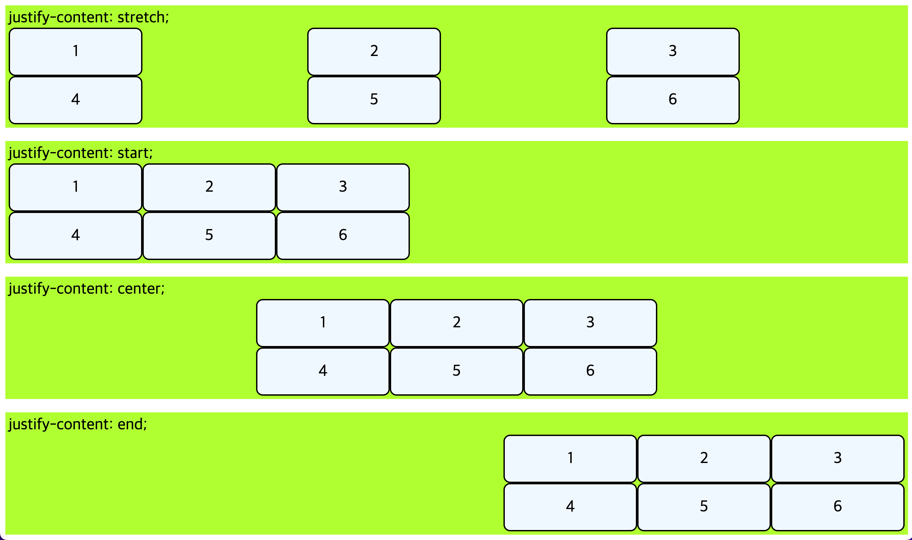


---

### 9-3. justify-self

`justify-self`는 Grid 아이템에 적용하는 프로퍼티로 해당 아이템을 가로(row축) 방향으로 정렬한다.

```html
<!DOCTYPE html>
<html>
  <head>
    <style>
      div {
        font-size: 24px;
        box-sizing: border-box;
      }
      .parents {
        background-color: greenyellow;
        padding: 5px;
        margin-bottom: 20px;
      }
      .box {
        border: 2px solid black;
        border-radius: 10px;
        text-align: center;
        padding: 20px 40px;
        background-color: aliceblue;
      }
      .grid-container {
        display: grid;
        grid-template-columns: repeat(3, 1fr);
      }
      .box:nth-child(1) {
        justify-self: stretch;
      }
      .box:nth-child(2) {
        justify-self: start;
      }
      .box:nth-child(5) {
        justify-self: center;
      }
      .box:nth-child(6) {
        justify-self: end;
      }
    </style>
  </head>
  <body>
    <div class="parents">
      <div class="grid-container">
        <div class="box">justify-self: stretch;</div>
        <div class="box">justify-self: start;</div>
        <div class="box">3</div>
        <div class="box">4</div>
        <div class="box">justify-self: center;</div>
        <div class="box">justify-self: end;</div>
      </div>
    </div>
  </body>
</html>
```

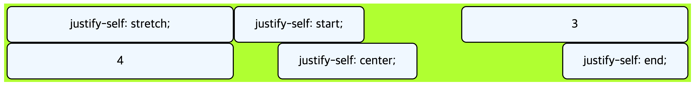

---

## 10. 정렬 shorthand

### 10-1. place-content

`align-content`와 `justify-content`를 같이 쓸 수 있는 shorthand이다.

사용법 `place-content: <align-content> <justify-content>`

하나의 값만 쓰면 두 프로퍼티 모두에 적용된다.

---

### 10-2. place-slef

`align-slef`와 `justify-slef`를 같이 쓸 수 있는 shorthand이다.

사용법 `place-slef: <align-slef> <justify-slef>`

하나의 값만 쓰면 두 프로퍼티 모두에 적용된다.

---

## 11. order

각 Grid 아이템들의 시각적 나열 순서를 결정하는 속성이다.

숫자값이 들어가면, 작은 숫자일 수록 먼저 배치된다. "시각적" 순서일 뿐 HTML 자체의 구조를 바꾸진 않다.

---

## 12. z-index

Z축 정렬을 할 수 있는 프로퍼티이다. 숫자가 클 수록 위로 올라간다.

```html
<!DOCTYPE html>
<html>
  <head>
    <style>
      div {
        font-size: 24px;
        box-sizing: border-box;
      }
      .parents {
        background-color: greenyellow;
        padding: 5px;
        margin-bottom: 20px;
      }
      .box {
        border: 2px solid black;
        border-radius: 10px;
        text-align: center;
        padding: 20px 40px;
        background-color: aliceblue;
      }
      .grid-container {
        display: grid;
        grid-template-columns: repeat(3, 1fr);
        gap: 10px;
      }
      .box:nth-child(5) {
        z-index: 1;
        background-color: burlywood;
        opacity: 0.8;
        transform: scale(2);
      }
    </style>
  </head>
  <body>
    <div class="parents">
      <div class="grid-container">
        <div class="box">1</div>
        <div class="box">2</div>
        <div class="box">3</div>
        <div class="box">4</div>
        <div class="box">5</div>
        <div class="box">6</div>
        <div class="box">7</div>
        <div class="box">8</div>
        <div class="box">9</div>
      </div>
    </div>
  </body>
</html>
```

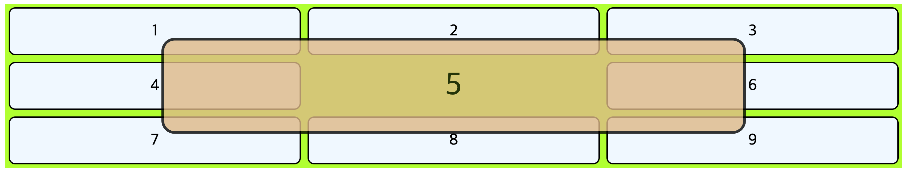

---

## 13. Conclusion

> 내가 자바스크립트의 웹 프레임워크/라이브러리 중 React를 사랑하는 것과 같이 CSS에서는 Grid를 가장 많이 사랑한다. 그 만큼 사용하는 비중이 많고 유용하게 사용하고 있다는 뜻이다. 확실히 Grid를 처음 공부할 땐 하나하나 이해하려고 많은 시간을 보냈는데 지금은 Flex와 함께 서로 비교하며 공부하니 쉽게 이해가 되었다. 다만 주로 사용하지 않는 프로퍼티가 있는데 바로 `justify-content`와 `align-content`이다. 이 두 속성은 Flex에서는 많이 사용했지만 Grid에서는 한 번도 사용하지 않았던 프로퍼티인거 같다. 그래도 어떤 특징을 가지고 있는지 짚고 넘어가자.  
> 그리고 찝찝한게.. `auto-fill`, `auto-fit`이 내 생각대로, 예상한대로 작동하지 않아서 조금은 씁쓸하다... 해결책을 찾아봐야겠다.😭

---

## 참고

[The CSS Grid Enchiridion](https://medium.com/stephenkoo/the-css-grid-enchiridion-1ca2d9fd68fe)  
[이번에야말로 CSS Grid를 익혀보자](https://studiomeal.com/archives/533)  
[Understanding CSS Grid: Grid Lines](https://www.smashingmagazine.com/2020/01/understanding-css-grid-lines/)

---

[👆](#grid-layout)
