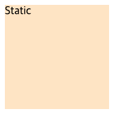
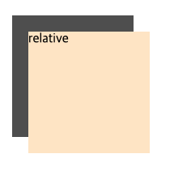
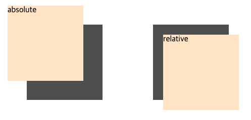
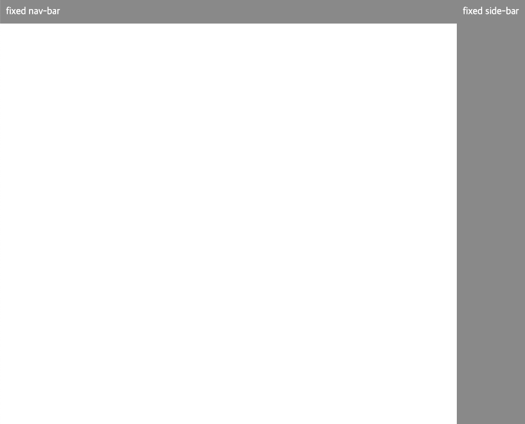
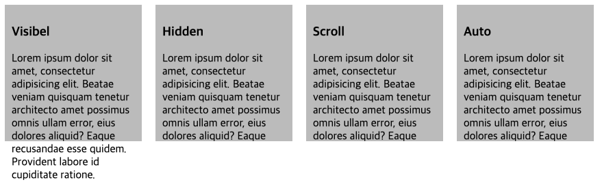

# Position

## 1. 개요

`position` 프로퍼티는 요소의 위치를 정의한다. 해당 프로퍼티를 사용하면 웹 문서에서 요소의 위치를 자유롭게 정할 수 있다. `top`, `bottom`, `left`, `right` 프로퍼티와 함께 사용하여 위치를 지정한다.

아래의 표는 `position` 프로퍼티값이다.
|종류|설명|
|:---|:---|
|static|문서의 흐름에 맞춰 배치한다. 기본값|
|relative|위칫값을 지정할 수 있다는 점을 제외하면 static과 같다.|
|absolute|relative값을 사용한 상위 요소를 기준으로 위치를 지정해 배치한다.|
|fixed|브라우저 창을 기준으로 위치를 지정해 배치한다.|

---

## 2. static (기본위치)

기본적인 요소의 배치 순서에 따라 위에서 아래로, 왼쪽에서 오른쪽으로 순서에 따라 배치되면 부모 요소 내에 요소로서 존재할 때는 부모 요소의 위치를 기준으로 배치된다.

좌표 프로퍼티(`top`, `bottom`, `left`, `right`)를 같이 사용할 수 없으며 사용할 경우 무시된다.

```html
<!DOCTYPE html>
<html>
  <head>
    <style>
      .parent {
        width: 150px;
        height: 150px;
      }
      .children {
        background-color: bisque;
        height: 100%;
      }
    </style>
  </head>
  <body>
    <div class="parent">
      <div class="children">Static</div>
    </div>
  </body>
</html>
```



---

## 3. relative (상대위치)

기본 위치를 기준으로 좌표 프로퍼티(`top`, `bottom`, `left`, `right`)를 사용하여 위치를 이동시킬 수 있다.

```html
<!DOCTYPE html>
<html>
  <head>
    <style>
      .parent {
        width: 150px;
        height: 150px;
        background-color: rgb(78, 78, 78);
      }
      .child {
        position: relative;
        background-color: bisque;
        height: 100%;
        top: 20px;
        left: 20px;
      }
    </style>
  </head>
  <body>
    <div class="parent">
      <div class="child">relative</div>
    </div>
  </body>
</html>
```



---

## 4. absolute (절대위치)

부모 요소 또는 가장 가까이 있는 조상 요소(static 제외)를 기준으로 좌표 프로퍼티(`top`, `bottom`, `left`, `right`)만큼 이동한다. 즉, relative, absolute, fiexed 프로퍼티가 선언되어 있는 부모 또는 조상 요소를 기준으로 위치가 결정된다.

만일 부모 또는 조상 요소가 staitc인 경우, document body를 기준으로 하여 좌표 프로터티대로 위치하게 된다.

absolute 프로퍼티 선언 시, block 레벨 요소의 width는 inline 요소와 같이 content에 맞게 변화되느로 적절한 width를 지정하여야 한다.

relative 프로퍼티는 기본 위치를 기준으로 좌표 프로퍼티(`top`, `bottom`, `left`, `right`)를 사용하여 위치를 이동시킨다. 하지만 absoulte 프로터피 요소는 부모 요소의 영역을 벗어나 자유롭게 어디든지 위치할 수 있다.

```html
<!DOCTYPE html>
<html>
  <head>
    <style>
      body {
        display: flex;
      }
      .parent {
        width: 150px;
        height: 150px;
        margin: 50px;
        background-color: rgb(78, 78, 78);
      }
      .children-relative {
        position: relative;
        background-color: bisque;
        height: 100%;
        top: 20px;
        left: 20px;
      }
      .children-absolute {
        position: absolute;
        background-color: bisque;
        width: 150px;
        height: 150px;
        top: 20px;
        left: 20px;
      }
    </style>
  </head>
  <body>
    <div class="parent">
      <div class="children-absolute">absolute</div>
    </div>
    <div class="parent">
      <div class="children-relative">relative</div>
    </div>
  </body>
</html>
```



---

## 5. fixed (고정위치)

부모 요소와 관계없이 브라우저의 viewport를 기준으로 좌표 프로퍼티(`top`, `bottom`, `left`, `right`)를 사용하여 위치를 이동시킨다.

스크롤이 되더라도 화면에서 사라지지 않고 항상 같은 곳에 위치힌다.

fixed 프로퍼티 선언 시, block 레벨 요소의 width는 inline 요소와 같이 content에 맞게 변화되느로 적절한 width를 지정하여야 한다.

```html
<!DOCTYPE html>
<html>
  <head>
    <style>
      div {
        background-color: rgb(137, 137, 137);
        color: white;
        padding: 10px;
        box-sizing: border-box;
      }
      .nav {
        position: fixed;
        width: 100%;
        top: 0;
        right: 0;
      }
      .side{
        position: fixed;
        height: 100%;
        top: 0;
        right: 0;
      }
    </style>
  </head>
  <body>
    <div class="nav">fixed nav-bar</div>
    <div class="side">fixed side-bar</div>
</html>
```



---

## 6. overflow 프로퍼티

overflow 프로퍼티는 자식 요소가 부모 요소의 영역을 벗어났을 때 처리 방법을 정의한다.

아래는 overflow 프로퍼티 값에 대한 설명이다.

| 프로퍼티 값 | 설명                                                                                           |
| :---------- | :--------------------------------------------------------------------------------------------- |
| visible     | 영역을 벗어난 부분을 표시한다. 기본값                                                          |
| hidden      | 영역을 벗어난 부분을 잘라내어 보이지 않게 한다.                                                |
| scroll      | 영역을 벗어난 부분이 없어도 스크롤 표시한다.(현재 대부분 브라우저는 auto와 동일하게 작동한다.) |
| auto        | 영역을 벗어난 부분이 있을때만 스크롤 표시한다.                                                 |

```html
<!DOCTYPE html>
<html>
  <head>
    <style>
      body {
        display: flex;
      }
      div {
        background-color: rgb(187, 187, 187);
        padding: 10px;
        box-sizing: border-box;
        width: 200px;
        height: 200px;
        margin-right: 20px;
      }
      .visible {
        overflow: visible;
      }
      .hidden {
        overflow: hidden;
      }
      .scroll {
        overflow: scroll;
      }
      .auto {
        overflow: auto;
      }
    </style>
  </head>
  <body>
    <div class="visible">
      <h3>Visibel</h3>
      <p>Lorem ipsum dolor sit amet, consectetur adipisicing elit. Beatae veniam quisquam tenetur architecto amet possimus omnis ullam error, eius dolores aliquid? Eaque recusandae esse quidem. Provident labore id cupiditate ratione.</p>
    </div>
    <div class="hidden">
      <h3>Hidden</h3>
      <p>Lorem ipsum dolor sit amet, consectetur adipisicing elit. Beatae veniam quisquam tenetur architecto amet possimus omnis ullam error, eius dolores aliquid? Eaque recusandae esse quidem. Provident labore id cupiditate ratione.</p>
    </div>
    <div class="scroll">
      <h3>Scroll</h3>
      <p>Lorem ipsum dolor sit amet, consectetur adipisicing elit. Beatae veniam quisquam tenetur architecto amet possimus omnis ullam error, eius dolores aliquid? Eaque recusandae esse quidem. Provident labore id cupiditate ratione.</p>
    </div>
    <div class="auto">
      <h3>Auto</h3>
      <p>Lorem ipsum dolor sit amet, consectetur adipisicing elit. Beatae veniam quisquam tenetur architecto amet possimus omnis ullam error, eius dolores aliquid? Eaque recusandae esse quidem. Provident labore id cupiditate ratione.</p>
    </div>
</html>
```



---

## 7. Conclusion

> `position: relative;`를 지금까지는 단지 `absolute`값을 설정하기 위해 부모요소 중 원하는 요소에 작성해야하는 프로퍼티로 알고 있었다. 하지만 `relative`만의 특징이 있었고 그 쓰임새가 `absolute`와 굉장히 비슷하다는 것을 알았다. 단지 바로 위의 부모 요소인지 아닌지의 차이만 있다. 하지만 지금까지 단독으로 `relative`를 사용하지 않았던 것을 생각하면 해당 프로퍼티 대신하여 `padding`을 사용할 수 있어서 그런 것이지 않을까 싶다.  
> 그리고 지금까지 컨텐츠 내의 scroll를 사용하기 위해서는 `absolute`를 적극적으로 사용했는데 굳이 그러지 않고 `relative`를 사용해도 될 듯 하다~

---

## 참고

[poiemaweb 2-8 요소의 위치 정의](https://poiemaweb.com/css3-position)  
도서 - HTML + CSS + 자바스크립트 웹 표준의 정석

---

[👆](#position)

📅 2022-07-20
