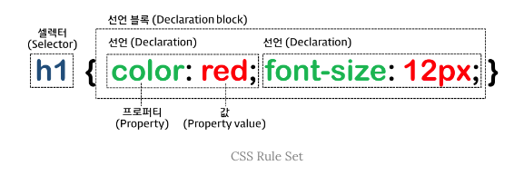
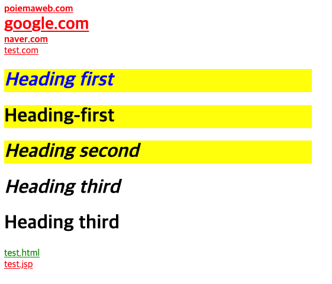
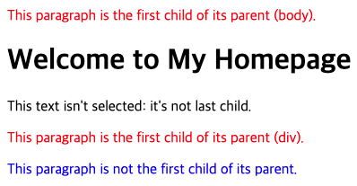
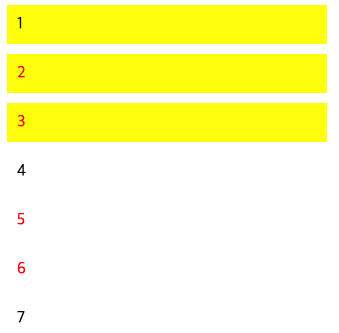
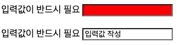
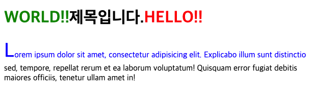

# Seletor

## 1. 개요

style를 적용 하고자하는 HTML요소를 특정할 필요가 있다. 이때 사용하는 것이 셀렉터/선택자(Selector)이다. style를 적용하고자하는 HTML 요소를 셀렉터로 특정하고 선택된 요소에 스타일을 정의하는 것. 복수개의 셀렉터를 연속하여 지정할 수 있으며 쉼표(,)로 구분함.


- 태그(tag): `<p></p>`와 같은 태그 자체
- 요소(element): `<p>hello world</p>`에서 `<p>`태그 및 내부 부분을 모두 포함

> `<p>`태그를 적용한 스타일이라는 표현은 옳지 않음. p요소에 적용하는 스타일로 표현하는 것이 옳바름.

---

## 2. 전체 셀렉터(Universal Selector)

전체 셀렉터는 스타일을 문서의 모든 요소에 적용할 때 사용. html 요소를 포함한 요소가 선택됨.(head 요소도 포함)

기본형 `* {속성: 값;}`

```html
...
<head>
  <style>
    /* 모든 요소를 선택 */
    * {
      color: red;
    }
  </style>
</head>
<body>
  <h1>Welcome my TIL</h1>
  <p>반갑습니다.</p>
  <span>안녕하세요.</span>
</body>
```

---

## 3. 태그/타입 셀렉터(Type Selector)

태그 셀렉터는 특정 태그를 사용한 모든 요소에 스타일을 적용. 태그 선택자를 사용해 스타일을 지정하면 해당 태그를 사용한 모든 요소에 적용.

기본형 ` 태그명 { 스타일 규칙 }`

```html
<head>
  <style>
    /* 모든 p 태그 요소를 선택 */
    p {
      color: red;
    }
  </style>
</head>
<body>
  <h1>Welcome my TIL</h1>
  <p>반갑습니다.</p>
  <p>아래의 내용을 보세요.</p>
  <span>안녕하세요.</span>
</body>
```

---

## 4. ID 셀렉터(ID Selector)

id 어트리뷰트 값을 지정하여 일치하는 요소를 선택. id 어트리뷰트 값은 중복될 수 없는 유일한 값이므로 주로 문서의 레이아웃과 관련된 스타일을 지정하는데 사용.

기본형 `#id 어트리뷰트 값 { 스타일 규칙 }`

```html
<head>
  <style>
    /* id 어트리뷰트 값이 header인 요소를 선택 */
    #header {
      color: red;
    }
  </style>
</head>
<body>
  <header id="header">
    <h1>Welcome my TIL</h1>
    <p>반갑습니다.</p>
    <p>아래의 내용을 보세요.</p>
    <span>안녕하세요.</span>
  </header>
</body>
```

---

## 5. 클래스 셀렉터(Class Selector)

class 어트리뷰트 값을 지정하여 일치하는 요소를 선택. class 어트리뷰트 값은 중복될 수 있음.

기본형 `.class 어트리뷰트 값 { 스타일 규칙 }`

```html
<head>
  <style>
    /* 모든 p 태그 요소를 선택 */
    p {
      background-color: black;
    }

    /* class 어트리뷰트 값이 text1인 모든 요소를 선택 */
    .text1 {
      color: yellow;
    }

    /* class 어트리뷰트 값이 text2인 모든 요소를 선택 */
    .text2 {
      color: #fff;
    }

    /* class 어트리뷰트 값이 text-large인 모든 요소를 선택 */
    .text-large {
      font-size: 200%;
    }

    /* class 어트리뷰트 값이 text-center인 모든 요소를 선택 */
    .text-center {
      text-align: center;
    }
  </style>
</head>
<body>
  <header id="header">
    <h1>Welcome my TIL</h1>
    <p class="text1 text-large">반갑습니다.</p>
    <p class="text1 text-center">아래의 내용을 보세요.</p>
    <p class="text2 text-large text-center">아래의 내용을 보세요.</p>
    <span>안녕하세요.</span>
  </header>
</body>
```

> HTML요소에 class 어트리뷰트 값은 공백으로 구분하여 여러 개 지정할 수 있음. 위와 같이 클래스 셀렉터를 사용하여 미리 스타일을 정의해 두고, HTML요소는 이미 정의되어 있는 클래스를 지정하는 것으로 필요한 스타일을 지정할 수 있음. 이는 **재사용**의 측면에서 유용함.
>
> > Tailwind Css의 개념이지 않을까? 싶다.  
> > [공식문서](https://tailwindcss.com/)

---

## 6. 어트리뷰트 셀렉터(Attribute Selector)

- 지정된 어트리뷰트를 갖는 모든 요소를 선택
  - 기본형 `셀렉터[어트리뷰트] { 스타일 규칙 }`
- 지정된 어트리뷰트를 가지며 지정된 값과 어트리뷰트의 값이 일치하는 모든 요소를 선택
  - 기본형 `셀렉터[어트리뷰트="값"] { 스타일 규칙 }`
- 지정된 어트리뷰트의 값이 (공백으로 분리된) 단어로 포함하는 요소를 선택
  - 기본형 `셀렉터[어트리뷰트~="값"] { 스타일 규칙 }`
- 지정된 어트리뷰트의 값과 일치하거나 지정 어트리뷰트 값 뒤 연이은 하이폰("값-")으로 시작하는 요소를 선택
  - 기본형 `셀렉터[어트리뷰트|="값"] { 스타일 규칙 }`
- 지정된 어트리뷰트 값으로 시작하는 요소를 선택
  - 기본형 `셀렉터[어트리뷰트^="값"] { 스타일 규칙 }`
- 지정된 어트리뷰트 값으로 끝나는 요소를 선택
  - 기본형 `셀렉터[어트리뷰트$="값"] { 스타일 규칙 }`
- 지정된 어트리뷰트 값을 포함하는 요소를 선택
  - 기본형 `셀렉터[어트리뷰트*="값"] { 스타일 규칙 }`

```html
<head>
  <style>
    /* a 요소 중에 href 어트리뷰트를 갖는 모든 요소 */
    a[href] {
      color: red;
    }

    /* a 요소 중에 target 어트리뷰트 값이 "_blank"인 모든 요소 */
    a[target="_blank"] {
      font-size: 28px;
    }

    /* h1 요소 중에 title 어트리뷰트 값에 "first"를 단어를 포함하는 요소 */
    h1[title~="first"] {
      color: blue;
    }

    /* h1 요소 중에 lang 어트리뷰트 값이 "en"과 일치하거나 "en-"로 시작하는 요소 */
    h1[lang|="en"] {
      background-color: yellow;
    }

    /* a 요소 중에 href 어트리뷰트 값이 "https://"로 시작하는 요소  */
    a[href^="https://"]
    {
      font-weight: 700;
    }

    /* a 요소 중에 href 어트리뷰트 값이 ".html"로 끝나는 요소 */
    a[href$=".html"] {
      color: green;
    }

    /* h1 요소 중에서 class 어트리뷰트 값에 "test"를 포함하는 요소 */
    h1[class*="test"] {
      font-style: italic;
    }
  </style>
</head>
<body>
  <header id="header">
    <a href="https://www.poiemaweb.com">poiemaweb.com</a><br />
    <a href="https://www.google.com" target="_blank">google.com</a><br />
    <a href="https://www.naver.com" target="_top">naver.com</a><br />
    <a href="http://www.test.com" target="_top">test.com</a>
    <h1 title="heading first" lang="en" class="first_test">Heading first</h1>
    <h1 title="heading-first" lang="en-us" class="second">Heading-first</h1>
    <h1 title="heading second" lang="en-gb" class="test">Heading second</h1>
    <h1 title="heading third" lang="us" class="second_test">Heading third</h1>
    <h1 title="heading third" lang="no">Heading third</h1>
    <a href="test.html">test.html</a><br />
    <a href="test.jsp">test.jsp</a>
  </header>
</body>
```



---

## 7. 복합 셀렉터 (Combinator)

### 7-1. 후손 셀렉터 (Descendant Combinator)

> 자신의 1 level 상위에 속하는 요소를 부모 요소, 1 level 하위에 속하는 요소를 자손 요소(자식 요소)라 함.
> 자신보다 n level 하위에 속하는 속하는 요소는 후손 요소(하위 요소)라 함.

```html
<body>
  <div>
    <h2>나는 자손이면서 후손이에요.</h2>
    <p>나는 자손이면서 후손이에요.</p>
    <span>
      <p>나는 후손이에요.</p>
    </span>
  </div>
</body>
```

기본형 `셀렉터A 셀렉터B { 스타일 규칙 }`

```html
<!DOCTYPE html>
<html>
  <head>
    <style>
      /* div 요소의 후손요소 중 p 요소 */
      div p {
        color: red;
      }
    </style>
  </head>
  <body>
    <h1>Heading</h1>
    <div>
      <p>paragraph 1</p>
      <p>paragraph 2</p>
      <span><p>paragraph 3</p></span>
    </div>
    <p>paragraph 4</p>
  </body>
</html>
```

paragraph 4를 제외한 나머지 것들에 스타일이 적용됨.

---

### 7-2. 자식 셀렉터 (Child Combinator)

자식 셀렉터는 셀렉터A의 모든 자식 요소 중 셀렉터B와 일치하는 요소를 선택. 후손은 아님.

기본형 `셀렉터A > 셀렉터B { 스타일 규칙 }`

```html
<!DOCTYPE html>
<html>
  <head>
    <style>
      /* div 요소의 자식요소 중 p 요소 */
      div > p {
        color: red;
      }
    </style>
  </head>
  <body>
    <h1>Heading</h1>
    <div>
      <p>paragraph 1</p>
      <p>paragraph 2</p>
      <span><p>paragraph 3</p></span>
    </div>
    <p>paragraph 4</p>
  </body>
</html>
```

paragraph 1, 2만 스타일이 적용됨.

---

### 7-3. 형제(동위) 셀렉터 (Sibling Combinator)

형제(동위) 셀렉터는 형제 관계(동위 관계)에서 뒤에 위치하는 요소를 선택할 때 사용한다.


---

#### 7-3-1. 인접 형제 셀렉터 (Adjacent Sibling Combinator)

셀렉터A의 형제 요수 중 셀렉터A **바로 뒤**에 위치하는 셀렉터B 요소를 선택. A와 B사이에 다른 요소가 존재하면 선택되지 않음.

기본형 `셀렉터A + 셀렉터B { 스타일 규칙 }`

```html
<!DOCTYPE html>
<html>
  <head>
    <style>
      /* p 요소의 형제 요소 중에 p 요소 바로 뒤에 위치하는 ul 요소를 선택한다. */
      p + ul {
        color: red;
      }
    </style>
  </head>
  <body>
    <div>A div element.</div>
    <ul>
      <li>Coffee</li>
      <li>Tea</li>
      <li>Milk</li>
    </ul>

    <p>The first paragraph.</p>
    <!-- 아래의 ul요소(후손요소 포함)가 스타일이 적용된다. -->
    <ul>
      <li>Coffee</li>
      <li>Tea</li>
      <li>Milk</li>
    </ul>

    <h2>Another list</h2>
    <ul>
      <li>Coffee</li>
      <li>Tea</li>
      <li>Milk</li>
    </ul>
  </body>
</html>
```

#### 7-3-2. 일반 형제 셀렉터 (General Sibling Combinator)

셀렉터A의 형제 요소 중 셀렉터A 뒤에 위치하는 셀렉터B 요소를 **모두** 선택

기본형 `셀렉터A ~ 셀렉터B { 스타일 규칙 }`

```html
<!DOCTYPE html>
<html>
  <head>
    <style>
      /* p 요소의 형제 요소 중에 p 요소 뒤에 위치하는 ul 요소를 모두 선택한다. */
      p ~ ul {
        color: red;
      }
    </style>
  </head>
  <body>
    <div>A div element.</div>
    <ul>
      <li>Coffee</li>
      <li>Tea</li>
      <li>Milk</li>
    </ul>

    <p>The first paragraph.</p>
    <!-- 아래의 ul요소(후손요소 포함)가 스타일이 적용된다. -->
    <ul>
      <li>Coffee</li>
      <li>Tea</li>
      <li>Milk</li>
    </ul>

    <h2>Another list</h2>
    <!-- 아래의 ul요소(후손요소 포함)가 스타일이 적용된다. -->
    <ul>
      <li>Coffee</li>
      <li>Tea</li>
      <li>Milk</li>
    </ul>
  </body>
</html>
```

---

## 8. 가상 클래스 셀렉터 (Pseudo-Class Selector)

가상 클래스는 요소의 특정 상태에 따라 스타일을 정의할 때 사용.

> - 마우스가 올라와 있을 때
> - 링크를 방문했을 때와 아직 방문하지 않았을 때
> - 포커스가 들어와 있을 때

이러한 특정 상태에는 원래 클래스가 존재하지 않지만 가상 클래스를 임의로 지정하여 선택하는 방법  
가상 클래스는 마침표(.) 대신 콜론(:)을 사용, 가상 클래스는 미리 정의된 이름이 있기 때문에 임의의 이름을 사용할 수 없음.

사용법 `셀렉터:가상클래스 { 클래스 규칙 }`

```html
<!DOCTYPE html>
<html>
  <head>
    <style>
      /* a 요소가 hover 상태일 때 */
      a:hover {
        color: red;
      }
      /* input 요소가 focus 상태일 때 */
      input:focus {
        background-color: yellow;
      }
    </style>
  </head>
  <body>
    <a href="#">Hover me</a><br /><br />
    <input type="text" placeholder="focus me" />
  </body>
</html>
```

---

### 8-1. 링크 셀렉터 (Link pseudo-classes), 동적 셀렉터 (User action pseudo-classes)

| pseudo-class | Description                      |
| :----------- | :------------------------------- |
| :link        | 셀렉터가 방문하지 않는 링크일 때 |
| :visited     | 셀렉터가 방문한 링크일 때        |
| :hover       | 셀렉터가 마우스가 올라와 있을 때 |
| :active      | 셀렉터가 클릭된 상태일 때        |
| :focus       | 셀렉터에 포커스가 들어와 있을 때 |

```html
<!DOCTYPE html>
<html>
  <head>
    <style>
      /* a 요소가 방문하지 않은 링크일 때 */
      a:link {
        color: red;
      }

      /* a 요소가 방문한 링크일 때 */
      a:visited {
        color: blue;
      }

      /* a 요소에 마우스가 올라와 있을 때 */
      a:hover {
        font-weight: 700;
      }

      /* a 요소가 클릭된 상태일 때 */
      a:active {
        color: green;
      }

      /* text input 요소와 password input 요소에 포커스가 들어와 있을 때 */
      input[type="text"]:focus,
      input[type="password"]:focus {
        color: red;
      }
    </style>
  </head>
  <body>
    <a href="#" target="_blank">This is a link</a><br />
    <input type="text" value="I'll be red when focused" /><br />
    <input type="password" value="I'll be red when focused" />
  </body>
</html>
```

---

### 8-2. UI 요소 상태 셀렉터 (UI element states pseudo-classes)

| pseudo-class | Description                      |
| :----------- | :------------------------------- |
| :checked     | 셀렉터가 체크 상태일 때          |
| :enabled     | 셀렉터가 사용 가능한 상태일 때   |
| :disabled    | 셀렉터가 사용 불가능한 상태일 때 |

```html
<!DOCTYPE html>
<html>
  <head>
    <style>
      /* input 요소가 사용 가능한 상태일 때, input 요소 바로 뒤에 위치하는 인접 형제 span 요소를 선택 */
      input:enabled + span {
        color: red;
      }

      /* input 요소가 사용 불가능한 상태일 때, input 요소 바로 뒤에 위치하는 인접 형제 span 요소를 선택 */
      input:disabled + span {
        color: blue;
      }

      /* input 요소가 체크 상태일 때, input 요소 바로 뒤에 위치하는 인접 형제 span 요소를 선택 */
      input:checked + span {
        color: red;
      }
    </style>
  </head>
  <body>
    <input type="radio" checked="checked" value="male" name="gender" />
    <span>Male</span><br />
    <input type="radio" value="female" name="gender" /> <span>Female</span
    ><br />
    <input type="radio" value="neuter" name="gender" disabled />
    <span>Neuter</span>
    <hr />

    <input type="checkbox" checked="checked" value="bicycle" />
    <span>I have a bicycle</span><br />
    <input type="checkbox" value="car" /> <span>I have a car</span><br />
    <input type="checkbox" value="motorcycle" disabled />
    <span>I have a motorcycle</span>
  </body>
</html>
```

---

### 8-3. 구조 가상 클래스 셀렉터 (Structural pseudo-classes)

| pseudo-class | Description                                                                                    |
| :----------- | :--------------------------------------------------------------------------------------------- |
| :first-child | 셀렉터에 해당하는 모든 요소 중 첫번째 자식인 요소를 선택, 형제 요소 중 제일 첫 요소를 선택     |
| :last-child  | 셀렉터에 해당하는 모든 요소 중 마지막 자식인 요소를 선택, 형제 요소 중 제일 마지막 요소를 선택 |

```html
<!DOCTYPE html>
<html>
  <head>
    <style>
      /* p 요소 중에서 첫번째 자식을 선택 */
      p:first-child {
        color: red;
      }

      /* p 요소 중에서 마지막 자식을 선택 */
      /* body 요소의 두번째 p 요소는 마지막 자식 요소가 아니다.
       body 요소의 마지막 자식 요소는 div 요소이다. */
      p:last-child {
        color: blue;
      }
    </style>
  </head>
  <body>
    <p>This paragraph is the first child of its parent (body).</p>

    <h1>Welcome to My Homepage</h1>
    <p>This text isn't selected: it's not last child.</p>

    <div>
      <p>This paragraph is the first child of its parent (div).</p>
      <p>This paragraph is not the first child of its parent.</p>
    </div>
  </body>
</html>
```



| pseudo-class       | Description                                                                         |
| :----------------- | :---------------------------------------------------------------------------------- |
| :nth-child(n)      | 셀렉터에 해당하는 모든 요소 중 앞에서 n번째 자식인 요소를 선택                      |
| :nth-last-child(n) | 셀렉터에 해당하는 모든 요소 중 뒤에서 n번째 자식인 요소를 선택                      |
| :first-of-type     | 셀렉터에 해당하는 요소의 부모 요소의 자식 요소 중 첫번째 등장하는 요소를 선택       |
| :last-of-type      | 셀렉터에 해당하는 요소의 부모 요소의 자식 요소 중 마지막에 등장하는 요소를 선택     |
| :nth-of-type(n)    | 셀렉터에 해당하는 요소의 부모 요소의 자식 요소 중 앞에서 n번째 등장하는 요소를 선택 |
| :nth-last-type(n)  | 셀렉터에 해당하는 요소의 부모 요소의 자식 요소 중 뒤에서 n번째 등장하는 요소를 선택 |

> 구조 가상 셀렉터는 생각보다 구별하기가 어렵다. 여러번 쓰면서 익숙해지도록 노력하기  
> 각각의 구조 가상 셀렉터마다 특징이 있다. 모두 다르므로 상황에 맞게 고민하며 사용하기  
> 상황에 따라서는 같은 요소를 선택하는 경우도 있다.

---

### 8-4. 부정 셀렉터 (Negation pseudo-class)

셀렉터에 해당하지 않는 모든 요소를 선택

사용법 `:not(셀렉터) { 스타일 규칙 }`

```html
<!DOCTYPE html>
<head>
  <style>
    /* input 요소 중에서 type 어트리뷰트 값이 password가 아닌 요소를 선택 */
    input:not([type="password"]) {
      color: red;
    }
  </style>
</head>
<body>
  <input type="text" value="Text input" />
  <input type="email" value="email input" />
  <input type="password" value="Password input" />
</body>
```

```html
<!DOCTYPE html>
<head>
  <style>
    div {
      max-width: 300px;
      padding: 10px;
      margin-bottom: 10px;
    }
    /* div 요소 중에서 1, 4, 7...번째 등장하는 요소가 아닌 요소만을 선택 */
    /* 1, 4, 7... : 공차가 3인 등차수열 */
    div:not(:nth-child(3n + 1)) {
      color: red;
    }

    /* div 요소 중에서 4번째 이후 등장하는 요소가 아닌 요소만을 선택 */
    div:not(:nth-of-type(n + 4)) {
      background-color: yellow;
    }
  </style>
</head>
<body>
  <div>1</div>
  <div>2</div>
  <div>3</div>
  <div>4</div>
  <div>5</div>
  <div>6</div>
  <div>7</div>
</body>
```

> 위의 경우 `nth-child()`과 `nth-of-type()`중 아무거나 사용해도 같은 요소들이 선택된다.



---

### 8-5. 정합성 체크 셀렉터 (validity pseudo-class)

| pseudo-class | Description                                                |
| :----------- | :--------------------------------------------------------- |
| :valid       | 정합성 검증이 성공한 input 요소 또는 form 요소를 선택한다. |
| :invalid     | 정합성 검증이 실패한 input 요소 또는 form 요소를 선택한다. |

```html
<!DOCTYPE html>
<html>
  <head>
    <style>
      /* 정합성 검증에 성공한 경우 */
      input[type="text"]:valid {
        background-color: white;
      }

      /* 정합성 검증에 실패한 경우 */
      input[type="text"]:invalid {
        background-color: red;
      }
    </style>
  </head>
  <body>
    <label
      >입력값이 반드시 필요
      <input type="text" required />
    </label>
  </body>
</html>
```



---

## 9. 가상 요소 셀렉터 (Pseudo-Element Selector)

가상 요소는 요소의 특정 부분에 스타일을 적용하기 위하여 사용

- 요소 콘텐츠의 첫글자 또는 첫줄
- 요소 콘첸츠의 앞 또는 뒤

사용법 `셀렉터::pseudo-element { 스타일 규칙}`

| pseudo-class   | Description                                                                       |
| :------------- | :-------------------------------------------------------------------------------- |
| ::first-letter | 콘텐츠의 첫글자를 선택                                                            |
| ::first-line   | 콘텐츠의 첫줄을 선택, **블록** 요소에만 적용                                      |
| ::after        | 콘텐츠의 뒤에 위치하는 공간을 선택, 일반적으로 **`content`** 프로퍼티와 함께 사용 |
| ::before       | 콘텐츠의 앞에 위치하는 공간을 선택, 일반적으로 **`content`** 프로퍼티와 함께 사용 |
| ::selection    | 드래그 한 콘텐츠를 선택, iOS Safari 등 일부 브라우저에서는 동작하지 않음          |

```html
<!DOCTYPE html>
<head>
  <style>
    /* p 요소 콘텐츠의 첫글자를 선택 */
    p::first-letter {
      font-size: 40px;
    }

    /* p 요소 콘텐츠의 첫줄을 선택 */
    p::first-line {
      color: blue;
    }

    /* h1 요소 콘텐츠의 앞 공간에 content 어트리뷰트 값을 삽입 */
    h1::after {
      content: "HELLO!! ";
      color: red;
    }

    /* h1 요소 콘텐츠의 둣 공간에 content 어트리뷰트 값을 삽입 */
    h1::before {
      content: " WORLD!!";
      color: green;
    }

    /* p 요소 중 드래그한 콘텐츠를 선택 */
    p::selection {
      background: yellow;
    }
  </style>
</head>
<body>
  <h1>제목입니다.</h1>
  <p>
    Lorem ipsum dolor sit amet, consectetur adipisicing elit. Explicabo illum
    sunt distinctio sed, tempore,<br />
    repellat rerum et ea laborum voluptatum! Quisquam error fugiat debitis
    maiores officiis, tenetur ullam amet in!
  </p>
</body>
```

## 

---

## 참고

[poiemaweb 2-2 셀렉터](https://poiemaweb.com/css3-selector)  
도서 - HTML + CSS + 자바스크립트 웹 표준의 정석

---

[👆](#seletor)

📅 2022-07-10
