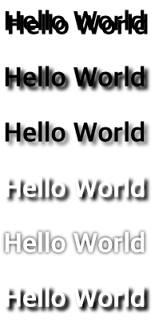
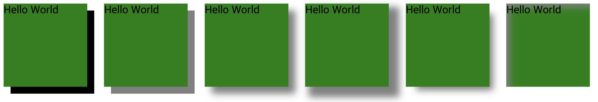

# Shadow

## 👉 바로가기

- [1. 개요](#1-개요)
- [2. text-shadow](#2-text-shadow)
- [3. box-shadow](#3-box-shadow)
- [참고](#참고)

---

## 1. 개요

`shadow`는 텍스트나 요소에 그림자효과를 부여하기 위한 프로퍼티이다.

## 2. text-shadow

`text-shadow`는 글자에 그림자 효과를 주는 프로퍼티이다.

사용법 `text-shadow: offset-x offset-y blur-radius color | none | initial | inherit`

아래는 `text-shadow`의 프로퍼티 값의 설명이다.

| 프로퍼티 값  | 설명                                                               | 생략   |
| :----------- | :----------------------------------------------------------------- | :----- |
| offset-x     | 그림자를 텍스트의 오른쪽으로 지정값만큼 이동시킨다.                | 불가능 |
| offset-y     | 그림자를 텍스트의 아래로 지정값만큼 이동시킨다.                    | 불가능 |
| blur-radius  | 그림자의 흐림정도를 지정한다. 지정값만큼 그림자가 커지고 흐려진다. | 가능   |
| shadow-color | 그림자의 색상을 지정한다.                                          | 가능   |

```html
<!DOCTYPE html>
<html>
  <head>
    <style>
      h2:nth-child(1) {
        text-shadow: 3px 3px;
      }
      h2:nth-child(2) {
        text-shadow: 3px 3px 3px;
      }
      h2:nth-child(3) {
        text-shadow: 3px 3px 3px gray;
      }
      h2:nth-child(4) {
        color: white;
        text-shadow: 3px 3px 3px black;
      }
      h2:nth-child(5) {
        color: white;
        text-shadow: 0px 0px 3px black;
      }
      h2:nth-child(6) {
        color: white;
        text-shadow: 3px 3px 3px black, 3px 3px 3px gray;
      }
    </style>
  </head>
  <body>
    <h2>Hello World</h2>
    <h2>Hello World</h2>
    <h2>Hello World</h2>
    <h2>Hello World</h2>
    <h2>Hello World</h2>
    <h2>Hello World</h2>
  </body>
</html>
```



---

## 3. box-shadow

`box-shadow`는 선택한 요소에 그람자 효과를 만들어 준다.

사용법 `box-shadow: x-position y-position blur spread color | inset | initial | inherit`

아래는 `box-shadow`의 프로퍼티 값의 설명이다.

| 프로퍼티 값 | 설명                                                         | 생략   |
| :---------- | :----------------------------------------------------------- | :----- |
| x-position  | 가로 위치, 양수면 오른쪽, 음수면 왼쪽에 그림자가 만들어진다. | 불가능 |
| y-position  | 세로 위치, 양수면 아래쪽, 음수면 위쪽에 그림자가 만들어진다. | 불가능 |
| blur        | 그림자를 흐릿하게 만든다. 값이 클수록 더욱 흐려진다.         | 가능   |
| spread      | 양수면 그림자를 확장하고, 음수면 축소한다.                   | 가능   |
| color       | 그림자 색을 정한다.                                          | 가능   |
| inset       | 그림자를 요소의 안쪽에 만든다.                               | 가능   |
| inital      | 기본값으로 설정한다.                                         | 가능   |
| inherit     | 부모 요소의 속성값을 상속받는다.                             | 가능   |

```html
<!DOCTYPE html>
<html>
  <head>
    <style>
      div {
        display: inline-block;
        width: 120px;
        height: 120px;
        background-color: green;
        margin-right: 20px;
      }
      div:nth-child(1) {
        box-shadow: 10px 10px;
      }
      div:nth-child(2) {
        box-shadow: 10px 10px gray;
      }
      div:nth-child(3) {
        box-shadow: 10px 10px 10px gray;
      }
      div:nth-child(4) {
        box-shadow: 10px 10px 10px 5px gray;
      }
      div:nth-child(5) {
        box-shadow: 10px 10px 10px -5px gray;
      }
      div:nth-child(6) {
        box-shadow: 10px 10px 10px -5px gray inset;
      }
    </style>
  </head>
  <body>
    <div>Hello World</div>
    <div>Hello World</div>
    <div>Hello World</div>
    <div>Hello World</div>
    <div>Hello World</div>
    <div>Hello World</div>
  </body>
</html>
```



---

## 참고

[CSS / text-shadow / 글자에 그림자 효과를 주는 속성](https://www.codingfactory.net/10650)
[CSS / box-shadow / 박스에 그림자 효과 만드는 속성](https://www.codingfactory.net/10628)  
[poiemaweb 2-12 그림자](https://poiemaweb.com/css3-shadow)

---

[👆](#shadow)
