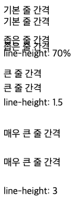
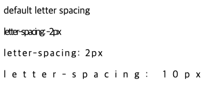
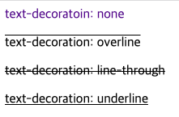
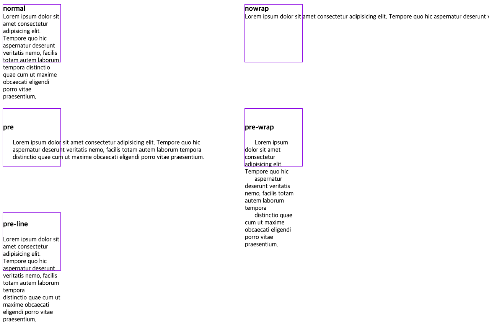
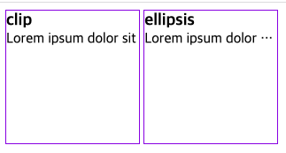
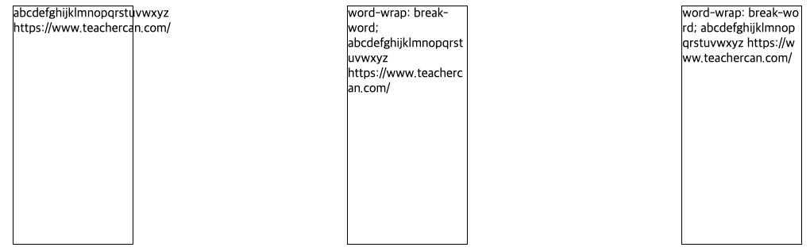
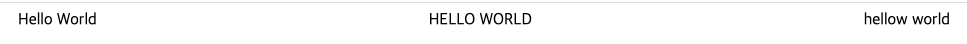

# Text

## 1. 개요

텍스트 스타일은 사용하는 글자의 모양새를 지정하는 글꼴 스타일과 웹 문서에 표시되는 텍스트를 지정하는 문단 스타일이 있다.

---

## 2. line-height 프로퍼티

텍스트의 높이를 지정한다. 한 문단이 두 줄이 넘으면 줄 간격이 생긴다. 줄 간격이 너무 좁거나 넓으면 가독성이 떨어진다. 이때 `line-height` 속성을 이용하면 줄 간격을 원하는 만큼 조절할 수 있다.

```html
<!DOCTYPE html>
<html>
  <head>
    <style>
      .small {
        line-height: 70%;
      }
      .large {
        line-height: 1.5;
      }
      .x-large {
        line-height: 3;
      }
    </style>
  </head>
  <body>
    <p>
      기본 줄 간격<br />
      기본 줄 간격<br />
    </p>
    <p class="small">
      좁은 줄 간격<br />
      좁은 줄 간격<br />
      line-height: 70%
    </p>
    <p class="large">
      큰 줄 간격<br />
      큰 줄 간격<br />
      line-height: 1.5
    </p>
    <p class="x-large">
      매우 큰 줄 간격<br />
      매우 큰 줄 간격<br />
      line-height: 3
    </p>
  </body>
</html>
```



다음은 수직 중양 정렬 예제이다. a요소의 `line-height` 값과 a요소를 감싸는 `div` 요소의 `height` 값을 일치시킨다.

```html
<!DOCTYPE html>
<html>
  <head>
    <style>
      .btn {
        width: 80px;
        height: 40px;
        background-color: orchid;
        border-radius: 40px;
      }
      .btn > a {
        display: block;
        color: aliceblue;
        text-align: center;
        text-decoration: none;
        line-height: 40px;
      }
    </style>
  </head>
  <body>
    <div class="btn">
      <a class="btn" href="#">Click</a>
    </div>
  </body>
</html>
```


---

## 3. letter-spacing 프로퍼티

글자 사이의 간격을 지정한다.

```html
<!DOCTYPE html>
<html>
  <head>
    <style>
      .ex1 {
        letter-spacing: -2px;
      }
      .ex2 {
        letter-spacing: 2px;
      }
      .ex3 {
        letter-spacing: 10px;
      }
    </style>
  </head>
  <body>
    <p>default letter spacing</p>
    <p class="ex1">letter-spacing: -2px</p>
    <p class="ex2">letter-spacing: 2px</p>
    <p class="ex3">letter-spacing: 10px</p>
  </body>
</html>
```



---

## 4. text-align 프로퍼티

텍스트의 수평 정렬을 정의한다. 한글 문서에서 흔히 사용하는 왼쪽 정렬, 오른쪽 정렬, 양쪽 정렬, 가운데 정렬 등을 웹 문서에서도 지정할 수 있다.

아래의 표는 `text-align`의 프로퍼티값이다.
|종류|설명|
|:---|:---|
|start|현재 텍스트 줄의 시작 위치에 맞추어 문단을 정렬한다.|
|end|현재 텍스트 줄의 끝 위치에 맞추어 문단을 정렬한다.|
|left|왼쪽에 맞추어 문단을 정렬한다.|
|right|오른쪽에 맞추어 문단을 정렬한다.|
|center|가운데에 맞추어 문단을 정렬한다.|
|justify|양쪽에 맞추어 문단을 정렬한다.|
|match-parent|부모 요소를 따라 문단을 정렬한다.|

```html
<!DOCTYPE html>
<html>
  <head>
    <style>
      p {
        background-color: antiquewhite;
      }
      .start {
        text-align: start;
      }
      .end {
        text-align: end;
      }
      .left {
        text-align: left;
      }
      .right {
        text-align: right;
      }
      .center {
        text-align: center;
      }
      .justify {
        text-align: justify;
      }
    </style>
  </head>
  <body>
    <p class="start">
      Lorem ipsum dolor sit amet, consectetur adipisicing elit. Odio esse in
      amet quos aliquam temporibus dicta adipisci, magnam, corrupti velit quis
      fugiat voluptatum provident possimus assumenda quaerat totam delectus
      tempore.
    </p>
    <p class="end">
      Lorem ipsum dolor sit amet, consectetur adipisicing elit. Odio esse in
      amet quos aliquam temporibus dicta adipisci, magnam, corrupti velit quis
      fugiat voluptatum provident possimus assumenda quaerat totam delectus
      tempore.
    </p>
    <p class="left">
      Lorem ipsum dolor sit amet, consectetur adipisicing elit. Odio esse in
      amet quos aliquam temporibus dicta adipisci, magnam, corrupti velit quis
      fugiat voluptatum provident possimus assumenda quaerat totam delectus
      tempore.
    </p>
    <p class="right">
      Lorem ipsum dolor sit amet, consectetur adipisicing elit. Odio esse in
      amet quos aliquam temporibus dicta adipisci, magnam, corrupti velit quis
      fugiat voluptatum provident possimus assumenda quaerat totam delectus
      tempore.
    </p>
    <p class="center">
      Lorem ipsum dolor sit amet, consectetur adipisicing elit. Odio esse in
      amet quos aliquam temporibus dicta adipisci, magnam, corrupti velit quis
      fugiat voluptatum provident possimus assumenda quaerat totam delectus
      tempore.
    </p>
    <p class="justify">
      Lorem ipsum dolor sit amet, consectetur adipisicing elit. Odio esse in
      amet quos aliquam temporibus dicta adipisci, magnam, corrupti velit quis
      fugiat voluptatum provident possimus assumenda quaerat totam delectus
      tempore.
    </p>
  </body>
</html>
```


---

## 5. text-decoration 프로퍼티

`text-decoration` 프로퍼티는 텍스트에 밑줄을 긋거나 취소선을 표시한다. 링크의 underline를 제거할 수 있으며 텍스트에 underline, overline, line-through를 추가할 수도 있다.

```html
<!DOCTYPE html>
<html>
  <head>
    <style>
      a {
        text-decoration: none;
      }
      p:nth-of-type(1) {
        text-decoration: overline;
      }
      p:nth-of-type(2) {
        text-decoration: line-through;
      }
      p:last-child {
        text-decoration: underline;
      }
    </style>
  </head>
  <body>
    <a href="#">text-decoratoin: none</a>
    <p>text-decoration: overline</p>
    <p>text-decoration: line-through</p>
    <p>text-decoration: underline</p>
  </body>
</html>
```



---

## 6. white-space 프로퍼티

white space는 공백(space), 들여쓰기(tab), 줄바꿈(line break)을 의미한다. html은 기본적으로 연속된 공백, 들여쓰기는 1번만 실행되며 줄바꿈은 무시된다. 또한 텍스트는 부모의 가로 영역을 벗어나지 않고 자동 줄바꿈(wrap)된다. `white-space` 프로퍼티는 이러한 기본 동작을 제어하기 위한 프로퍼티다.

| 프로퍼티 | line break | space/tab   | wrapping(자동줄바꿈) |
| :------- | :--------- | :---------- | -------------------- |
| normal   | 무시       | 1번만 반영  | O                    |
| nowrap   | 무시       | 1번만 반영  | X                    |
| pre      | 반영       | 그대로 반영 | X                    |
| pre-wrap | 반영       | 그대로 반영 | O                    |
| pre-line | 반영       | 1번만 반영  | O                    |

```html
<!DOCTYPE html>
<html>
  <head>
    <style>
      body {
        display: grid;
        grid-template-columns: 1fr 1fr;
      }
      div {
        width: 150px;
        height: 150px;
        border: 1px solid blueviolet;
        margin-bottom: 120px;
      }
      h3 {
        margin: 0;
      }
      .nomal {
        white-space: normal;
      }
      .nowrap {
        white-space: nowrap;
      }
      .pre {
        white-space: pre;
      }
      .pre-wrap {
        white-space: pre-wrap;
      }
      .pre-line {
        white-space: pre-line;
      }
    </style>
  </head>
  <body>
    <div class="nomal">
      <h3>normal</h3>
      Lorem ipsum dolor sit amet consectetur adipisicing elit. Tempore quo hic
      aspernatur deserunt veritatis nemo, facilis totam autem laborum tempora
      distinctio quae cum ut maxime obcaecati eligendi porro vitae praesentium.
    </div>
    <div class="nowrap">
      <h3>nowrap</h3>
      Lorem ipsum dolor sit amet consectetur adipisicing elit. Tempore quo hic
      aspernatur deserunt veritatis nemo, facilis totam autem laborum tempora
      distinctio quae cum ut maxime obcaecati eligendi porro vitae praesentium.
    </div>
    <div class="pre">
      <h3>pre</h3>
      Lorem ipsum dolor sit amet consectetur adipisicing elit. Tempore quo hic
      aspernatur deserunt veritatis nemo, facilis totam autem laborum tempora
      distinctio quae cum ut maxime obcaecati eligendi porro vitae praesentium.
    </div>
    <div class="pre-wrap">
      <h3>pre-wrap</h3>
      Lorem ipsum dolor sit amet consectetur adipisicing elit. Tempore quo hic
      aspernatur deserunt veritatis nemo, facilis totam autem laborum tempora
      distinctio quae cum ut maxime obcaecati eligendi porro vitae praesentium.
    </div>
    <div class="pre-line">
      <h3>pre-line</h3>
      Lorem ipsum dolor sit amet consectetur adipisicing elit. Tempore quo hic
      aspernatur deserunt veritatis nemo, facilis totam autem laborum tempora
      distinctio quae cum ut maxime obcaecati eligendi porro vitae praesentium.
    </div>
  </body>
</html>
```



---

## 7. text-overflow 프로퍼티

부모 영여긍ㄹ 벗어난 wrapping(자동줄바꿈)이 되지 않은 텍스트의 처리 방법을 정의한다.

- 조건
  - `width` 프로퍼티가 지정되어 있어야 한다. 이를 위해 필요한 경우 block레벨 요소로 변경해야 한다.
  - 자동 줄바꿈을 방지하려면 `white-space` 프로퍼티를 nowrap으로 설정한다.
  - overflow 프로퍼티에 반드시 `visible` 이외의 값이 지정되어 있어야 한다.

아래는 `text-overflow` 프로퍼티에 설정할 수 있는 프로퍼티 값이다.
|프로퍼티 값|설명|
|:---|:---|
|clip|영역을 벗어난 텍스트를 표시하지 않는다.(기본값)|
|ellipsis|영역을 벗어난 텍스트를 잘라내어 보이지 않게 하고 말줄임표(...)를 표시힌다.|

```html
<!DOCTYPE html>
<html>
  <head>
    <style>
      div {
        width: 150px;
        height: 150px;
        border: 1px solid blueviolet;
        white-space: nowrap;
        overflow: hidden;
        display: inline-block;
      }
      h3 {
        margin: 0;
      }
      .clip {
        text-overflow: clip;
      }
      .ellipsis {
        text-overflow: ellipsis;
      }
    </style>
  </head>
  <body>
    <div class="clip">
      <h3>clip</h3>
      Lorem ipsum dolor sit amet consectetur adipisicing elit.
    </div>
    <div class="ellipsis">
      <h3>ellipsis</h3>
      Lorem ipsum dolor sit amet consectetur adipisicing elit.
    </div>
  </body>
</html>
```



---

## 8. word-wrap 프로퍼티

한 단어의 길이가 길어서 부모 영역을 벗어난 텍스트의 처리 방법을 정의한다.

사용법 `word-wrap: break-word;`

---

## 9. word-break 프로퍼티

`word-wrap` 프로퍼티와 같이 한 단어의 길이가 길어서 부모 영역을 벗어난 텍스트의 처리 방법을 정의한다. `word-wrap` 프로퍼티 경우 단어를 어느 정도는 고려하여 개행하지만 `word-break: break-all;`는 단어를 고려하지 않고 부모 영역에 맞추어 강제 개행한다.

사용법 `word-break: break-all;`

```html
<!DOCTYPE html>
<html>
  <head>
    <style>
      body {
        display: flex;
        justify-content: space-around;
      }
      div {
        width: 150px;
        height: 300px;
        border: 1px solid black;
        margin-bottom: 10px;
      }
      div:nth-of-type(2) {
        word-wrap: break-word;
      }
      div:nth-of-type(3) {
        word-break: break-all;
      }
    </style>
  </head>
  <body>
    <div>abcdefghijklmnopqrstuvwxyz https://www.teachercan.com/</div>
    <div>
      word-wrap: break-word; abcdefghijklmnopqrstuvwxyz
      https://www.teachercan.com/
    </div>
    <div>
      word-break: break-all; abcdefghijklmnopqrstuvwxyz
      https://www.teachercan.com/
    </div>
  </body>
</html>
```



---

## 10. text-transform 프로퍼티

영문자를 표기할 때 텍스트의 대소 문자를 원하는 대로 바꿀 때 `text-transform` 프로퍼티를 사용한다. 한글에는 영향을 미치지 않고 영문자에만 적용된다.

아래는 `text-transform` 프로퍼티값이다.
|종류|설명|
|:---|:---|
|capitalize|각 단어의 첫 번째 글자를 대문자로 변환한다.|
|uppercase|모든 글자를 대문자로 변환한다.|
|lowercase|모든 글자를 소문자로 변환한다.|

```html
<!DOCTYPE html>
<html>
  <head>
    <style>
      body {
        display: flex;
        justify-content: space-around;
      }
      .ex1 {
        text-transform: capitalize;
      }
      .ex2 {
        text-transform: uppercase;
      }
      .ex3 {
        text-transform: lowercase;
      }
    </style>
  </head>
  <body>
    <span class="ex1">hello world</span>
    <span class="ex2">hello world</span>
    <span class="ex3">HELLOW WORLD</span>
  </body>
</html>
```



---

## 11. Conclusion

> text관련 프로퍼티도 많이 사용을 했지만 `white-space`, `text-overflow`, `word-wrap`, `word-break` 프로퍼티는 티처캔을 만들 때만 사용하여 익숙하지 않는 프로퍼티이다. 그만큼 다른 프로퍼터에 비해 비중이 떨어지는 거 같다. 하지만 웹 페이지를 만들면서 필요한 상황이 올 수 있기에 해당 프로퍼티의 특징을 잘 알아두고 있자.

---

## 참고

[poiemaweb 2-7 폰트와 텍스트](https://poiemaweb.com/css3-font-text)  
도서 - HTML + CSS + 자바스크립트 웹 표준의 정석

---

[👆](#text)
