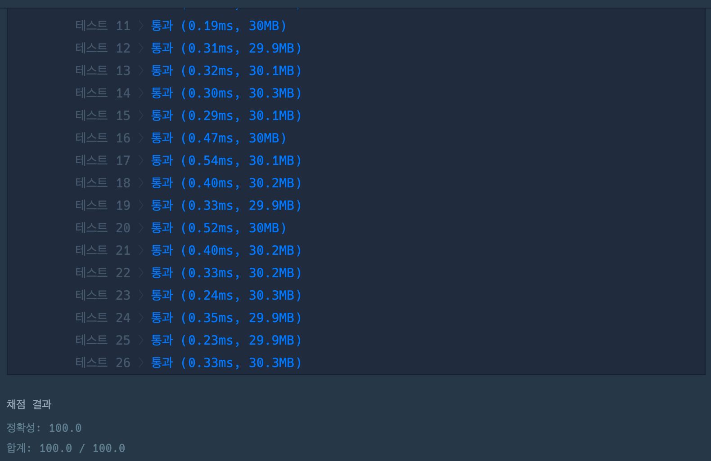
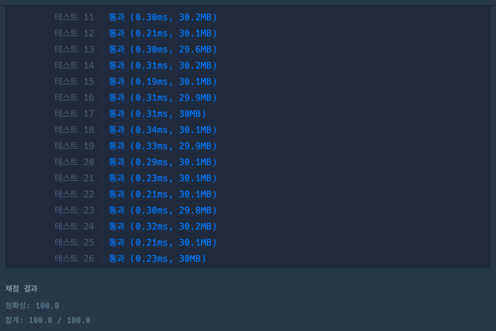

# 신규 아이디 추천

## 1. 개요

- 프로그래머스
- Lv.1
- 2021 KAKAO BLIND RECRUITMENT
- [문제 바로가기](https://school.programmers.co.kr/learn/courses/30/lessons/72410)

---

## 2. 문제 설명

카카오에 입사한 신입 개발자 네오는 "카카오계정개발팀"에 배치되어, 카카오 서비스에 가입하는 유저들의 아이디를 생성하는 업무를 담당하게 되었습니다. "네오"에게 주어진 첫 업무는 새로 가입하는 유저들이 카카오 아이디 규칙에 맞지 않는 아이디를 입력했을 때, 입력된 아이디와 유사하면서 규칙에 맞는 아이디를 추천해주는 프로그램을 개발하는 것입니다. 다음은 카카오 아이디의 규칙입니다.

- 아이디의 길이는 3자 이상 15자 이하여야 합니다.
- 아이디는 알파벳 소문자, 숫자, 빼기(-), 밀줄(\_), 마침표(.) 문자만 사용할 수 있습니다.
- 단, 마침표(.)는 처음과 끝에 사용할 수 없으며 또한 연속으로 사용할 수 없습니다.

"네오"는 다음과 같이 7단계의 순차적인 처리 과정을 통해 신규 유저가 입력한 아이디가 카카오 아이디 규칙에 맞는 지 검사하고 규칙에 맞지 않은 경우 규칙에 맞는 새로운 아이디를 추천해 주려고 합니다.

신규 유저가 입력한 아이디가 `new_id` 라고 한다면,

> 1단계 new_id의 모든 대문자를 대응되는 소문자로 치환합니다.\
> 2단계 new_id에서 알파벳 소문자, 숫자, 빼기(-), 밑줄(\_), 마침표(.)를 제외한 모든 문자를 제거합니다.\
> 3단계 new_id에서 마침표(.)가 2번 이상 연속된 부분을 하나의 마침표(.)로 치환합니다.\
> 4단계 new_id에서 마침표(.)가 처음이나 끝에 위치한다면 제거합니다.\
> 5단계 new_id가 빈 문자열이라면, new_id에 "a"를 대입합니다.\
> 6단계 new_id의 길이가 16자 이상이면, new_id의 첫 15개의 문자를 제외한 나머지 문자들을 모두 제거합니다.만약 제거 후 마침표(.)가 new_id의 끝에 위치한다면 끝에 위치한 마침표(.) 문자를 제거합니다.\
> 7단계 new_id의 길이가 2자 이하라면, new_id의 마지막 문자를 new_id의 길이가 3이 될 때까지 반복해서 끝에 붙입니다.

예를 들어, new_id 값이 "...!@BaT#\*..y.abcdefghijklm" 라면, 위 7단계를 거치고 나면 new_id는 아래와 같이 변경됩니다.

1단계 대문자 'B'와 'T'가 소문자 'b'와 't'로 바뀌었습니다.\
`"...!@BaT#_..y.abcdefghijklm"` → `"...!@bat#_..y.abcdefghijklm"`

2단계 '!', '@', '#', '\_' 문자가 제거되었습니다.\
`"...!@bat#_..y.abcdefghijklm"`→`"...bat..y.abcdefghijklm"`

3단계 '...'와 '..' 가 '.'로 바뀌었습니다.\
`"...bat..y.abcdefghijklm"` → `".bat.y.abcdefghijklm"`

4단계 아이디의 처음에 위치한 '.'가 제거되었습니다.\
`".bat.y.abcdefghijklm"` → `"bat.y.abcdefghijklm"`

5단계 아이디가 빈 문자열이 아니므로 변화가 없습니다.\
`"bat.y.abcdefghijklm"` → `"bat.y.abcdefghijklm"`

6단계 아이디의 길이가 16자 이상이므로, 처음 15자를 제외한 나머지 문자들이 제거되었습니다.\
`"bat.y.abcdefghijklm"` → `"bat.y.abcdefghi"`

7단계 아이디의 길이가 2자 이하가 아니므로 변화가 없습니다.\
`"bat.y.abcdefghi"` → `"bat.y.abcdefghi"`

따라서 신규 유저가 입력한 new_id가 `"...!@BaT#*..y.abcdefghijklm"`일 때, 네오의 프로그램이 추천하는 새로운 아이디는 `"bat.y.abcdefghi"` 입니다.

---

### 2-1. 문제 설명 - 문제

신규 유저가 입력한 아이디를 나타내는 new_id가 매개변수로 주어질 때, "네오"가 설계한 7단계의 처리 과정을 거친 후의 추천 아이디를 return 하도록 solution 함수를 완성해 주세요.

---

### 2-2. 문제 설명 - 제한사항

new\*id는 길이 1 이상 1,000 이하인 문자열입니다. new_id는 알파벳 대문자, 알파벳 소문자, 숫자, 특수문자로 구성되어 있습니다. new_id에 나타날 수 있는 특수문자는 `-*.~!@#$%^&\*()=+[{]}:?,<>/` 로 한정됩니다.

---

### 2-3. 문제 설명 - 입출력 예

| no  | new_id                         | result            |
| --- | ------------------------------ | ----------------- |
| 예1 | "...!@BaT#\*..y.abcdefghijklm" | "bat.y.abcdefghi" |
| 예2 | "z-+.^."                       | "z--"             |
| 예3 | "=.="                          | "aaa"             |
| 예4 | "123\_.def"                    | "123\_.def"       |
| 예5 | "abcdefghijklmn.p"             | "abcdefghijklmn"  |

---

### 2-4. 문제 설명 - 입출력 예에 대한 설명

입출력 예 #1\
문제의 예시와 같습니다.

입출력 예 #2\
7단계를 거치는 동안 new_id가 변화하는 과정은 아래와 같습니다.

1단계 변화 없습니다.\
2단계 `"z-+.^."` → `"z-.."`\
3단계 `"z-.."` → `"z-."`\
4단계 `"z-."` → `"z-"`\
5단계 변화 없습니다.\
6단계 변화 없습니다.\
7단계 `"z-"` → `"z--"`

입출력 예 #3\
7단계를 거치는 동안 new_id가 변화하는 과정은 아래와 같습니다.

1단계 변화 없습니다.\
2단계 `"=.="` → `"."`\
3단계 변화 없습니다.\
4단계 `"."` → `""` (new_id가 빈 문자열이 되었습니다.)\
5단계 `""` → `"a"`\
6단계 `변화 없습니다.`\
7단계 `"a"` → `"aaa"`

입출력 예 #4\
1단계에서 7단계까지 거치는 동안 new*id("123*.def")는 변하지 않습니다. 즉, new_id가 처음부터 카카오의 아이디 규칙에 맞습니다.

입출력 예 #5\
1단계 변화 없습니다.\
2단계 변화 없습니다.\
3단계 변화 없습니다.\
4단계 변화 없습니다.\
5단계 변화 없습니다.\
6단계 `"abcdefghijklmn.p"` → `"abcdefghijklmn."` → `"abcdefghijklmn"`\
7단계 변화 없습니다.

---

## 3. 문제 풀이

```javascript
function solution(new_id) {
  // 1) 1단계 대문자를 소문자로 치환
  var answer = new_id.toLowerCase();

  // 2) 2단계 숫자, 빼기(-), 밑줄(_), 마침표(.)를 제외한 모든 문자 제거
  answer = answer.replace(/[^\w-.]/g, "");

  // 3) 3단계, 4단계 연속되거나 처음, 끝에 위치한 마침표(.) 제거
  answer = answer
    .split("")
    .reduce((acc, cur) => {
      if (cur === "." && acc === "") return acc;
      if (cur === "." && acc[acc.length - 1] === ".") return acc;
      return acc + cur;
    }, "")
    .replace(/\.$/, "");

  // 4) 5단계 빈 문자일 경우 "a" 대입
  answer = answer === "" ? "a" : answer;

  // 5) 6단계 16자 이상일 경우 첫 15개의 문자를 제외한 나머지 문자 제거 및 끝에 마침표(.)가 취할 경우 마침표(.) 제거
  answer = answer.slice(0, 15).replace(/\.$/, "");

  // 6) 7단계 2자 이하라면, 마지막 문자를 길이가 3이 될 때까지 반복
  if (answer.length === 2) {
    answer += answer[answer.length - 1];
  }
  if (answer.length === 1) {
    answer += answer[answer.length - 1];
    answer += answer[answer.length - 1];
  }

  return answer;
}
```

---

### 1) 1단계 대문자를 소문자로 치환

> 1단계 new_id의 모든 대문자를 대응되는 소문자로 치환합니다.

1단계를 위해 `String.toLowerCase()`메서드를 사용하였다.

```javascript
var answer = new_id.toLowerCase();
```

---

### 2) 2단계 숫자, 빼기(-), 밑줄(\_), 마침표(.)를 제외한 모든 문자 제거

> 2단계 new_id에서 알파벳 소문자, 숫자, 빼기(-), 밑줄(\_), 마침표(.)를 제외한 모든 문자를 제거합니다.

2단계를 위해 `String.replace()`메서드와 정규식을 사용하였다.

```javascript
answer = answer.replace(/[^\w-.]/g, "");
```

- String.replace(): 어떤 패턴에 일치하는 일부 또는 모든 부분이 교체된 새로운 문자열을 반환하는 메서드이다.
- 정규식의 \[]: 안에 들어갈 정규식 중 하나를 의미
- 정규식의 \[^]: 부정을 의미
- 정규식의 \w: 알파벳, 숫자로 된 문자, 밑줄(\_)
- 정규식의 -: 빼기(-)
- 정규식의 .: 마침표(.)
- 정규식의 g: global의 표현이며 대상 문자열내에 모든 패턴들을 검색하는 것을 의미

---

### 3) 3단계, 4단계 연속되거나 처음, 끝에 위치한 마침표(.) 제거

> 3단계 new_id에서 마침표(.)가 2번 이상 연속된 부분을 하나의 마침표(.)로 치환합니다.\
> 4단계 new_id에서 마침표(.)가 처음이나 끝에 위치한다면 제거합니다.

3단계 3단계, 4단계는 함께 묶어 실행을 하였다.

```javascript
answer = answer
  .split("")
  .reduce((acc, cur) => {
    if (cur === "." && acc === "") return acc;
    if (cur === "." && acc[acc.length - 1] === ".") return acc;
    return acc + cur;
  }, "")
  .replace(/\.$/, "");
```

`Array.reduce()`메서드를 통해 중복되는 마침표(.)와 앞에 위치한 마침표를 제거를 하였다. 이를 위해 문자열을 배열로 바꾸어야 했다. 그래서 `String.split()`메서드르 사용하였다. 이러한 과정을 통해 문자열에서 마침표(.)가 연속적으로 두 번 이상이 반복되었다면 하나만 남기고 제거를 하였다.

참고로 `Array.reduce()`는 문자열을 반환한다.

이후 바로 `Array.replace()`메서드와 정규식을 사용해 마침표(.)가 끝에 위치한 경우 제거하였다.

- 정규식의 .: 마침표(.)
- 정규식의 $: 문자열의 종료를 표현하며 앞에 위치한 정규식으로 종료됨을 의미, 위의 정규식에서는 마침표(.)로 끝나는 경우를 의미

---

### 4) 5단계 빈 문자일 경우 "a" 대입

> 5단계 new_id가 빈 문자열이라면, new_id에 "a"를 대입합니다.

위의 단계를 통해 `new_id`가 빈 문자가 될 수 있다. 이렇게 빈 문자가 될 경우 5단계를 통해 빈 문자가가 아닌 "a"가 될 수 있게한다.

```javascript
answer = answer === "" ? "a" : answer;
```

---

### 5) 6단계 16자 이상일 경우 첫 15개의 문자를 제외한 나머지 문자 제거 및 끝에 마침표(.)가 취할 경우 마침표(.) 제거

> 6단계 new_id의 길이가 16자 이상이면, new_id의 첫 15개의 문자를 제외한 나머지 문자들을 모두 제거합니다.만약 제거 후 마침표(.)가 new_id의 끝에 위치한다면 끝에 위치한 마침표(.) 문자를 제거합니다.

6단계를 위해 `String.slice()`메서드와 `String.replace()`메서드를 사용하였다. 끝에 위치한 마침표(.) 문자 제거는 4단계에서 했던 방법과 같다.

```javascript
answer = answer.slice(0, 15).replace(/\.$/, "");
```

- String.slice(beginIndex, endIndex): beginIndex에 위치한 문자부터 endIndex에 위치한 문자 직전의 문자까지 추출된다. endIndex가 생략될 경우 문자열 마지막까지 추출된다.

---

### 6) 7단계 2자 이하라면, 마지막 문자를 길이가 3이 될 때까지 반복

> 7단계 new_id의 길이가 2자 이하라면, new_id의 마지막 문자를 new_id의 길이가 3이 될 때까지 반복해서 끝에 붙입니다.

마지막인 7단계에서는 단순히 6단계까지 끝낸 문자열의 길이가 1인 경우와 2인경우를 나누어 마지막 문자를 한 번 혹은 두 번씩 더한다.

```javascript
if (answer.length === 2) {
  answer += answer[answer.length - 1];
}
if (answer.length === 1) {
  answer += answer[answer.length - 1];
  answer += answer[answer.length - 1];
}
```

---

### 결과



---

## 4. 다른 사람의 풀이

좋아요가 가장 많이 있고 댓글도 가장 많이 달린 풀이이다. 또한 정규식을 많이 사용하여 문제를 풀었기 때문에 배울 것이 많다 생각하여 가져왔다.

```javascript
function solution(new_id) {
  const answer = new_id
    .toLowerCase() // 1단계
    .replace(/[^\w-_.]/g, "") // 2단계
    .replace(/\.+/g, ".") // 3단계
    .replace(/^\.|\.$/g, "") // 4단계
    .replace(/^$/, "a") // 5단계
    .slice(0, 15) // 6단계
    .replace(/\.$/, ""); // 6단계
  const len = answer.length;
  return len > 2 ? answer : answer + answer.charAt(len - 1).repeat(3 - len); // 7단계
}
```

1단계와 2단계 그리고 6단계는 나와 같은 방법으로 풀었기 때문에 생략을 하고 다른 단계를 분석해보자.

---

### 3단계

> 3단계 new_id에서 마침표(.)가 2번 이상 연속된 부분을 하나의 마침표(.)로 치환합니다.

```javascript
replace(/\.+/g, ".");
```

- 정규식의 .: 마침표(.)
- \+: 반복문을 표현하며 앞의 정규식 표현이 한 번 이상 반복됨을 의미

---

### 4단계

> 4단계 new_id에서 마침표(.)가 처음이나 끝에 위치한다면 제거합니다.

```javascript
.replace(/^\.|\.$/g, "")
```

- 정규식의 .: 마침표(.)
- 정규식의 ^: 문자열의 시작을 표현하며 뒤에 위치한 정규식으로 시작됨을 의미, 위의 정규식에서는 마침표(.)로 시작하는 경우를 의미
- 정규식의 $: 문자열의 종료를 표현하며 앞에 위치한 정규식으로 종료됨을 의미, 위의 정규식에서는 마침표(.)로 끝나는 경우를 의미
- 정규식의 |: or를 표현, 위의 정규식에서는 마침표(.)로 시작 또는 끝나는 것을 의미
- g: 대상 문자열내에 모든 패턴들을 검색하는 것을 의미, 위의 정규식에서는 마침표(.)로 시작하거나 끝나는 것 모두를 검색한다는 의미

---

### 5단계

> 5단계 new_id가 빈 문자열이라면, new_id에 "a"를 대입합니다.

```javascript
.replace(/^$/, "a")
```

- 정규식의 ^$: 각각 문자열의 시작과 종료를 의미, ^, $사이에 아무런 문자가 없기 때문에 시작과 끝에 아무런 문자가 없다는 것을 의미

---

### 7단계

> 7단계 new_id의 길이가 2자 이하라면, new_id의 마지막 문자를 new_id의 길이가 3이 될 때까지 반복해서 끝에 붙입니다.

```javascript
const len = answer.length;
return len > 2 ? answer : answer + answer.charAt(len - 1).repeat(3 - len);
```

문자열의 길이가 2보다 크면 그대로 문자열을 리턴하고 그렇지 않으면 `String.charAt()`메서드와 `String.repeat()`메서드를 이용해 길이가 3인 문자열을 만들어 리턴한다.

- String.charAt(index): 문자열에서 특정 인덱스에 위치하는 유니코드 단일문자를 반환한다.

  ```javascript
  answer.charAt(len - 1);
  ```

  `answer` 문자열의 마지막 단일문자를 반환한다.

- String.repeat(count): 문자열을 주어진 횟수만큼 반복해 붙인 새로운 문자열을 반환한다.

  ```javascript
  .repeat(3 - len)
  ```

  `answer` 문자열의 마지막 단일문자를 `3 - len`만큼 반복해 `answer`문자열에 붙인 새로운 문자열을 반환한다.

---

### 결과



실행속도가 빨라진 테스트도 보이고 느려진 테스트도 보인다.

---

## 5. Conclusion

> 정규식이 필요할 때 그때그때 구글링을 통해 필요한 내용을 찾아 적용을 하였다. 하지만 정규식에 대한 기본지식이 없다보니 매번 볼 때 마다 새로운 느낌이 들었다. 언제한번 시간을 내서 정규식에 대한 공부를 하고 정리도 해야겠다.\
> 배열 메서드는 자주 사용하고 있어서 언제 어떤 메서드를 사용할지 금방금방 알 수 있지만 문자열 메서드는 나에게는 생소했다. 내가 복잡하게 풀었던 문제가 단순히 문자열 메서드로 풀어지는 코드를 보니 신기했고 재미있었다. 역시 아는만큼 보이고 코드 작성 시간도 절약이 되는 것 같다.

---

## 참고

[String.prototype.replace()](https://developer.mozilla.org/ko/docs/Web/JavaScript/Reference/Global_Objects/String/replace)\
[String.prototype.slice()](https://developer.mozilla.org/ko/docs/Web/JavaScript/Reference/Global_Objects/String/slice)\
[String.prototype.charAt()](https://developer.mozilla.org/ko/docs/Web/JavaScript/Reference/Global_Objects/String/charAt)\
[String.prototype.repeat()](https://developer.mozilla.org/ko/docs/Web/JavaScript/Reference/Global_Objects/String/repeat)\
[정규표현식 (Regex) 정리](https://hamait.tistory.com/342)

---

📅 2022-08-10
