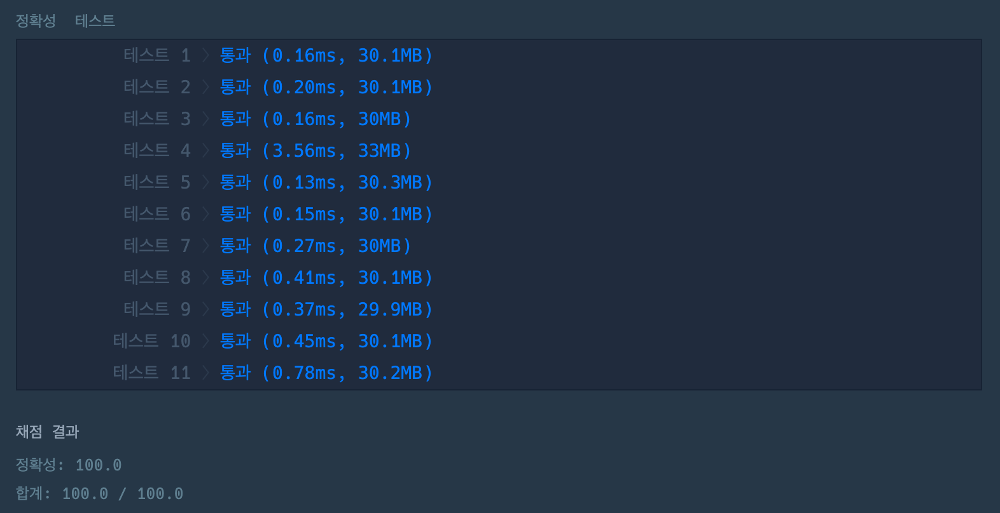
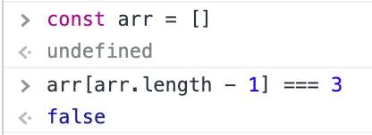
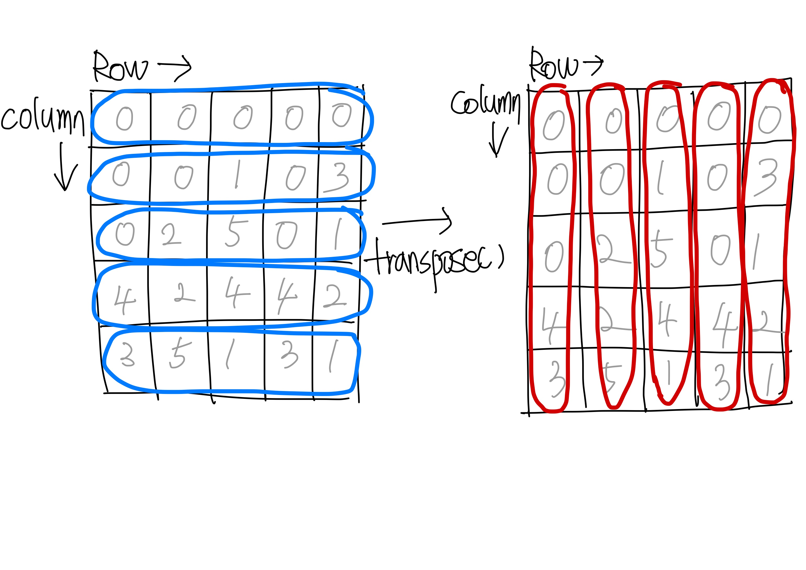

# 크레인 인형뽑기 게임

### 👉 바로가기

- [1. 개요](#1-개요)
- [2. 문제설명](#2-문제-설명)
  - [2-1. 문제 설명 - 제한사항](#2-1-문제-설명---제한사항)
  - [2-2. 문제설명 - 입출력 예](#2-2-문제설명---입출력-예)
  - [2-3. 문제 설명 - 입출력 예에 대한 설명](#2-3-문제-설명---입출력-예에-대한-설명)
- [3. 문제 풀이](#3-문제-풀이)
  - [1) 뽑힌 인형을 넣을 바구니](#1-뽑힌-인형을-넣을-바구니)
  - [2) 사라진 인형의 개수](#2-사라진-인형의-개수)
  - [3) 인형을 뽑을 열](#3-인형을-뽑을-열)
  - [4) 인형을 basket배열에 추가하고 borad에 해당 인형을 제거](#4-인형을-basket배열에-추가하고-borad에-해당-인형을-제거)
  - [5) 인형이 있을 경우](#5-인형이-있을-경우)
  - [6) 빈 바구니일 경우](#6-빈-바구니일-경우)
  - [7) 빈 바구니가 아닐 경우](#7-빈-바구니가-아닐-경우)
  - [8) 바구니에 마지막에 담긴 인형과 같을 경우](#8-바구니에-마지막에-담긴-인형과-같을-경우)
  - [9) 바구니에 마지막에 담긴 인형과 다를 경우](#9-바구니에-마지막에-담긴-인형과-다를-경우)
  - [결과](#결과)
- [4. Refactoring](#4-refactoring)
- [5. 다른 사람의 풀이](#5-다른-사람의-풀이)
- [6. Conclusion](#6-conclusion)

---

## 1. 개요

- 프로그래머스
- Lv.1
- 2019 카카로 개발자 겨울 인턴십

---

## 2. 문제 설명

게임개발자인 "죠르디"는 크레인 인형뽑기 기계를 모바일 게임으로 만들려고 합니다.
"죠르디"는 게임의 재미를 높이기 위해 화면 구성과 규칙을 다음과 같이 게임 로직에 반영하려고 합니다.


게임 화면은 "1 x 1" 크기의 칸들로 이루어진 "N x N" 크기의 정사각 격자이며 위쪽에는 크레인이 있고 오른쪽에는 바구니가 있습니다. (위 그림은 "5 x 5" 크기의 예시입니다). 각 격자 칸에는 다양한 인형이 들어 있으며 인형이 없는 칸은 빈칸입니다. 모든 인형은 "1 x 1" 크기의 격자 한 칸을 차지하며 격자의 가장 아래 칸부터 차곡차곡 쌓여 있습니다. 게임 사용자는 크레인을 좌우로 움직여서 멈춘 위치에서 가장 위에 있는 인형을 집어 올릴 수 있습니다. 집어 올린 인형은 바구니에 쌓이게 되는 데, 이때 바구니의 가장 아래 칸부터 인형이 순서대로 쌓이게 됩니다. 다음 그림은 [1번, 5번, 3번] 위치에서 순서대로 인형을 집어 올려 바구니에 담은 모습입니다.


만약 같은 모양의 인형 두 개가 바구니에 연속해서 쌓이게 되면 두 인형은 터뜨려지면서 바구니에서 사라지게 됩니다. 위 상태에서 이어서 [5번] 위치에서 인형을 집어 바구니에 쌓으면 같은 모양 인형 두 개가 없어집니다.


크레인 작동 시 인형이 집어지지 않는 경우는 없으나 만약 인형이 없는 곳에서 크레인을 작동시키는 경우에는 아무런 일도 일어나지 않습니다. 또한 바구니는 모든 인형이 들어갈 수 있을 만큼 충분히 크다고 가정합니다. (그림에서는 화면표시 제약으로 5칸만으로 표현하였음)

게임 화면의 격자의 상태가 담긴 2차원 배열 board와 인형을 집기 위해 크레인을 작동시킨 위치가 담긴 배열 moves가 매개변수로 주어질 때, 크레인을 모두 작동시킨 후 터트려져 사라진 인형의 개수를 return 하도록 solution 함수를 완성해주세요.

---

### 2-1. 문제 설명 - 제한사항

- board 배열은 2차원 배열로 크기는 "5 x 5" 이상 "30 x 30" 이하입니다.
- board의 각 칸에는 0 이상 100 이하인 정수가 담겨있습니다.

  - 0은 빈 칸을 나타냅니다.
  - 1 ~ 100의 각 숫자는 각기 다른 인형의 모양을 의미하며 같은 숫자는 같은 모양의 인형을 나타냅니다.

- moves 배열의 크기는 1 이상 1,000 이하입니다.
- moves 배열 각 원소들의 값은 1 이상이며 board 배열의 가로 크기 이하인 자연수입니다.

---

### 2-2. 문제설명 - 입출력 예

| board                                                         | moves             | result |
| ------------------------------------------------------------- | ----------------- | ------ |
| [[0,0,0,0,0],[0,0,1,0,3],[0,2,5,0,1],[4,2,4,4,2],[3,5,1,3,1]] | [1,5,3,5,1,2,1,4] | 4      |

---

### 2-3. 문제 설명 - 입출력 예에 대한 설명

입출력 예 #1

인형의 처음 상태는 문제에 주어진 예시와 같습니다. 크레인이 [1, 5, 3, 5, 1, 2, 1, 4] 번 위치에서 차례대로 인형을 집어서 바구니에 옮겨 담은 후, 상태는 아래 그림과 같으며 바구니에 담는 과정에서 터트려져 사라진 인형은 4개 입니다.


## 3. 문제 풀이

```js
function solution(board, moves) {
  const basket = []; // 1) 뽑힌 인형을 넣을 바구니
  var answer = 0; // 2) 사라진 인형의 수

  for (i = 0; i < moves.length; i++) {
    const yIndex = moves[i] - 1; // 3) 인형을 뽑을 열

    for (k = 0; k < board.length; k++) {
      // 4) 인형을 basket배열에 추가하고 borad에 해당 인형을 제거
      const pushItem = () => {
        basket.push(board[k][yIndex]);
        board[k][yIndex] = 0;
      };

      // 5) 인형이 있을 경우
      if (board[k][yIndex] !== 0) {
        // 6) 빈 바구니일 경우
        if (basket.length === 0) {
          pushItem();
          break;

          // 7) 빈 바구니가 아닐 경우
        } else {
          // 8) 바구니에 마지막에 담긴 인형과 같을 경우
          if (basket[basket.length - 1] === board[k][yIndex]) {
            basket.pop();
            board[k][yIndex] = 0;
            answer += 2;
            break;

            // 9) 바구니에 마지막에 담긴 인형과 다를 경우
          } else {
            pushItem();
            break;
          }
        }
      }
    }
  }

  return answer;
}
```

---

### 1) 뽑힌 인형을 넣을 바구니

새롭게 뽑힌 인형과 이미 뽑힌 인형을 비교하기 위해서는 뽑힌 인형이 들어있는 배열이 필요하다. 이를 위해 아래와 같이 뽑힌 인형을 넣을 수 있는 빈 배열을 `basket`이라는 변수로 선언한다. 이후 `basket`에 `Array.push()` 메서드를 사용하여 뽑힌 인형을 저장한다.

```js
const basket = [];
```

---

### 2) 사라진 인형의 개수

인형이 뽑혔지만 `basket`에 마지막에 담긴 인형과 같을 경우 새로 뽑힌 인형과 마지막에 담긴 인형이 사라지게 된다. 그리고 사라진 인형의 수를 `anwser`에 카운트 된다. 이를 위해 아래와 같이 `anwser`을 선언한다.

```js
var answer = 0;
```

---

### 3) 인형을 뽑을 열

`solution`함수의 `moves`파라미터는 배열이며 각 원소는 어떤 열에서 인형을 뽑을 지에 대한 정보가 들어있다.

- 1: 첫 번째 열에서 인형을 뽑는다.
- 4: 네 번째 열에서 인형을 뽑는다.

`moves`배열의 각각의 원소를 반복문으로 돌며 또다른 파라미터인 `borad`에서 조건에 맞는 인형을 뽑아 `basket`에 저장을 해야한다.

이때 `board`의 각각의 원소들이 또한 배열인데 이 배열에서 몇 번째의 값을 비교하여 저장할지를 알기 위해 아래와 같이 변수를 선언한다.

```js
const yIndex = moves[i] - 1;
```

여기서 `-1`를 하는 이유는 배열은 `0`부터 순서가 매겨지기 때문이다.

---

### 4) 인형을 basket배열에 추가하고 borad에 해당 인형을 제거

`pushItem`함수는 조건에 맞는 인형(뽑힌 인형)이 있을 경우 `basket`에 저장하기 위해 사용된다. 뽑힌 인형은 값이 0이 되어야 한다. 아래와 같이 `pushItem`함수를 정의한다.

```js
const pushItem = () => {
  basket.push(board[k][yIndex]);
  board[k][yIndex] = 0;
};
```

- k: `borad`에서 층을 의미한다. 맨 윗층부터 시작한다.
- yIndex: `borad`에서 열을 의미한다. 위에서 선언한 값이 들어온다.

---

### 5) 인형이 있을 경우

인형이 없을 경우 즉, `board[k][yIndex]`의 값이 0인 경우는 제외한다.

```js
if (board[k][yIndex] !== 0) {
}
```

---

### 6) 빈 바구니일 경우

빈 바구니인 경우 즉, `basket`배열에 아무런 값이 없는 경우(길이가 0인 경우)는 이전값과 비교할 필요 없이 바로 뽑힌 인형을 `basket`에 저장하면 된다.

```js
if (basket.length === 0) {
    pushItem();
    break;
}
```

`break`를 실행하는 이유는 새로운 인형이 `basket`에 저장되었기 때문에 더 이상 반복문을 진행할 필요가 없기 때문에 빠져나오기 위해서이다.

---

### 7) 빈 바구니가 아닐 경우

빈 바구니가 아닐 경우에는 두 가지의 경우의 수를 생각해야 한다. 첫 번째 경우는 `basket`의 마지막에 담긴 인형과 새로 뽑힌 인형이 같은 경우이고 두 번째 경우는 서로 같지 않는 경우이다.

---

### 8) 바구니에 마지막에 담긴 인형과 같을 경우

먼저 첫 번째 경우이다. 이때에는 뽑힌 인형이 `basket`에 저장되지 않고 `basket`의 마지막에 담긴 인형과 새로 뽑힌 인형이 모두 사라지면서 `answer`의 값이 2증가해야 한다. 이를 위해 아래와 같이 코드를 작성한다.

```js
if (basket[basket.length - 1] === board[k][yIndex]) {
    basket.pop();
    board[k][yIndex] = 0;
    answer += 2;
    break;
}
```

1. `basket[basket.length - 1] === board[k][yIndex]`를 통해 비교
2. `Array.pop()` 메서드를 사용해 `basket`의 마지막 원소를 제거
3. 인형이 사라지긴 했지만 뽑혔으므로 `board[k][yIndex] = 0;`를 통해 0으로 수정
4. `answer`의 값을 2증가
5. `break`를 통해 반복문 종료

---

### 9) 바구니에 마지막에 담긴 인형과 다를 경우

두 번째 경우는 `6) 빈 바구니일 경우`와 같은 로직이 실행된다.

```js
pushItem();
break;
```

---

### 결과



---

## 4. Refactoring

나는 `basket`이 비어있을 때와 비어있지 않을 때를 따로 나누어서 코드를 작성했다. 하지만 `basket`이 빈 배열이 때의 첫 번째 값은 정의되어 있지 않기 때문에 새롭게 뽑힌 인형과 비교하면 두 개는 서로 같지 않다.

즉, `basket`이 빈배열인 경우 `basket[basket.length - 1] === board[k][yIndex]`의 값은 `false`가 된다. 그러므로 굳이 `basket`이 빈배열일 때아 아닐 때를 나눌 필요가 없다.

아래의 사진을 참고


또한 `pushItem`함수를 정의한 이유는 같은 코드가 두 번 사용되기 때문이다. `basket`이 빈배열일 때의 조건문을 제거하면 굳이 `pushItem`함수를 정의하지 않아도 된다. 그래서 아래와 같이 코드를 좀 더 간결하게 작성할 수 있다.

```js
function solution(board, moves) {
  const basket = [];
  var answer = 0;

  for (i = 0; i < moves.length; i++) {
    const zIndex = moves[i] - 1;
    for (k = 0; k < board.length; k++) {
      if (board[k][zIndex] !== 0) {
        if (basket[basket.length - 1] === board[k][zIndex]) {
          basket.pop();
          answer = answer + 2;
        } else {
          basket.push(board[k][zIndex]);
        }
        board[k][zIndex] = 0;
        break;
      }
    }
  }
  return answer;
}
```

---

## 5. 다른 사람의 풀이

### 박민수님의 풀이

```js
const transpose = (matrix) =>
  matrix.reduce(
    (result, row) => row.map((_, i) => [...(result[i] || []), row[i]]),
    []
  );

const solution = (board, moves) => {
  const stacks = transpose(board).map((row) =>
    row.reverse().filter((el) => el !== 0)
  );
  const basket = [];
  let result = 0;

  for (const move of moves) {
    const pop = stacks[move - 1].pop();
    if (!pop) continue;
    if (pop === basket[basket.length - 1]) {
      basket.pop();
      result += 2;
      continue;
    }
    basket.push(pop);
  }

  return result;
};
```

`transspose`함수가 눈에 띈다. 어떤 함수이며 결과값이 어떤지 알아보자. 해당 함수는 파라미터로 matrix모양의 배열을 받는다. 그리고 받은 배열을 `Array.reduce()`메서드를 사용해 새로운 배열을 반환한다.

또한 `Array.reduce()`메서드의 콜백함수에서 `Array.map()`메서드가 실행되고 있다. 여기서는 `row(현재 받고 있는 배열의 원소)`배열이 각각의 원소를 가지고 반복을 통해 배열을 봔한하고 있다.

예시로 `[[0,0,0,0,0],[0,0,1,0,3],[0,2,5,0,1],[4,2,4,4,2],[3,5,1,3,1]]`를 파라미터로 받고 `Array.reduce()`메서드가 실행되는 과정을 살펴보자.

| 호출순서   | acc(result)                                         | cur(row)    | 반환값                                                        |
| ---------- | --------------------------------------------------- | ----------- | ------------------------------------------------------------- |
| 1번째 호출 | []                                                  | [0,0,0,0,0] | [[0],[0],[0],[0],[0]]                                         |
| 2번째 호출 | [[0],[0],[0],[0],[0]]                               | [0,0,1,0,3] | [[0,0],[0,0],[0,1],[0,0],[0,3]]                               |
| 3번째 호출 | [[0,0],[0,0],[0,1],[0,0],[0,3]]                     | [0,2,5,0,1] | [[0,0,0],[0,0,2],[0,1,5],[0,0,0],[0,3,1]]                     |
| 4번째 호출 | [[0,0,0],[0,0,2],[0,1,5],[0,0,0],[0,3,1]]           | [4,2,4,4,2] | [[0,0,0,4],[0,0,2,2],[0,1,5,4],[0,0,0,4],[0,3,1,2]]           |
| 5번째 호출 | [[0,0,0,4],[0,0,2,2],[0,1,5,4],[0,0,0,4],[0,3,1,2]] | [3,5,1,3,1] | [[0,0,0,4,3],[0,0,2,2,5],[0,1,5,4,1],[0,0,0,4,3],[0,3,1,2,1]] |

해당 과정을 통해 matrix배열이 어떻게 바뀌었나? matrix는 row과 column이있다. 문제에서의 `board`또한 matrix모양을 가지고 있는 2차원 배열이다. 각각의 배열은 하나의 `row`에 해당된다. 하지만 `transpose`함수로 인해 각각의 배열은 `row`가 아니라 하나의 `column`에 해당하게 된다.

그림으로 표현하면 아래와 같다.



즉, 인형을 위에서 뽑는 것이기 때문에 편하게 각각의 배열을 `column`으로 관리를 한다는 것이다.

그 다음으로 아래의 코드를 분석해보자.

```js
const stacks = transpose(board).map((row) =>
  row.reverse().filter((el) => el !== 0)
);
```

인형을 뽑기위해 `stacks`이라는 변수를 만들었다. 기계의 입장에서는 인형을 위로 뽑겠지만 배열에서 인형(값)을 뽑기 위해서는 `Array.pop()`메소드를 사용하여 맨 뒤에 위치해 있는 값부터 뽑아야 한다. 또한 값이 0인 경우에는 인형이 없기 때문에 `Array.filter()`메소드를 이용하여 0인 값을 모두 제거하였다.

즉 아래와 같은 흐름이다.

1. `transpose(board)`를 통해 2차원의 배열을 `row`가 아닌 `column`으로 재구성한다.
2. 2차원 배열의 각각의 원소인 배열을 `Array.reverse()`메서드를 통해 순서를 뒤집는다. 앞에 있는 것이 위에 있는 것이기 때문에 순서를 뒤집어 후에 `Array.pop()`메서드를 이용할 수 있게 한다.
3. `Array.filter()`를 통해 값이 0인 원소를 제거한다.

해당 로직을 거친 2차원 배열인 `stacks`의 모습은 아래와 같다.

```js
const stacks = [
  [3, 4], // 1얄
  [5, 2, 2], // 2열
  [1, 4, 5, 1], // 3열
  [3, 4], // 4열
  [1, 2, 1, 3], // 5열
];
```

마지막으로 for문을 통해 `moves`배열의 값들에 해당되는 인형을 뽑아본다.

```js
for (const move of moves) {
  const pop = stacks[move - 1].pop();
  if (!pop) continue;
  if (pop === basket[basket.length - 1]) {
    basket.pop();
    result += 2;
    continue;
  }
  basket.push(pop);
}
```

여기서 먼저 짚고 넘어가야 할 부분은 나는 지금까지 for문을 사용할 때 아래와 같이 사용했다.

```js
for (i = 0; i < array.lenfth; i++) {}
```

박민수님이 사용한 방법이 더 깔끔해 보인다. 참고하여 나중에 코드를 작성할 때 사용해보자.

```js
const pop = stacks[move - 1].pop();
```

다시 본론으로 들어가서 위의 코드부터 해석하자. `moves`배열의 원소을 바탕으로 반복문을 실행하고 있다. 각각의 반복문에서는 `pop`이 선언되어 있고 이 `pop`은 `moves`배열의 원소에 해당되는 열(이것또한 배열인것을 잊지말자)의 마지막 원소를 `Array.pop() `메서드를 사용하여 가져오고 있다. `Array.pop()`은 기존 배열을 바꾸고 빼낸 원소를 return한다.

```js
if (!pop) continue;
```

그 후 만약 `pop`이 없다면 다음 반복문을 실행한다.(위의 코드 참고)

```js
if (pop === basket[basket.length - 1]) {
    basket.pop();
    result += 2;
    continue;
}
```

하지만 만약 `pop`과 `basket`에 담긴 마지막 원소가 같다면 위와 같은 코드가 실행된다. 위의 코드는 내가 풀이를 했던 방법과 같은 방법이다. 하지만 다른점은 나는 반복문 자체를 `break`했지만 여기서는 `continue`를 하여 다음 반목분을 이어가게 된다.

```js
basket.push(pop);
```

마지막으로 뽑힌 인형이 `basket`에 담긴 마지막 인형과 같지 않는다면 `Array,pusy()`메서드를 사용하여 `basket`의 마지막에 위치 시킨다.(위의 코드 참고)

---

## 6. Conclusion

> 코딩테스트의 첫 번째 문제이다. 지금까지 해보진 않은 공부여서 오늘은 공부한 내용을 정리하는 데 많은 시간이 걸렸다. 하지만 정리를 하면서 많은 것을 배웠다. `Array.reduce()`메서드를 오랜만에 써보면서 다시 한 번 더 개념을 잡았고 2차원 배열에 대해서도 어느정도 친숙해졌다.  
> 다른 사람들이 풀이한 내용을 보고 "어떻게 이런 생각을 할 수 있지?"라면서 감탄을 하였다. 기가막힌 코드를 보고 분석하는 것도 좋은 경험이 되어 좋은 코딩테스트 공부를 할 수 있었다.

---

[👆](#크레인-인형뽑기-게임)
