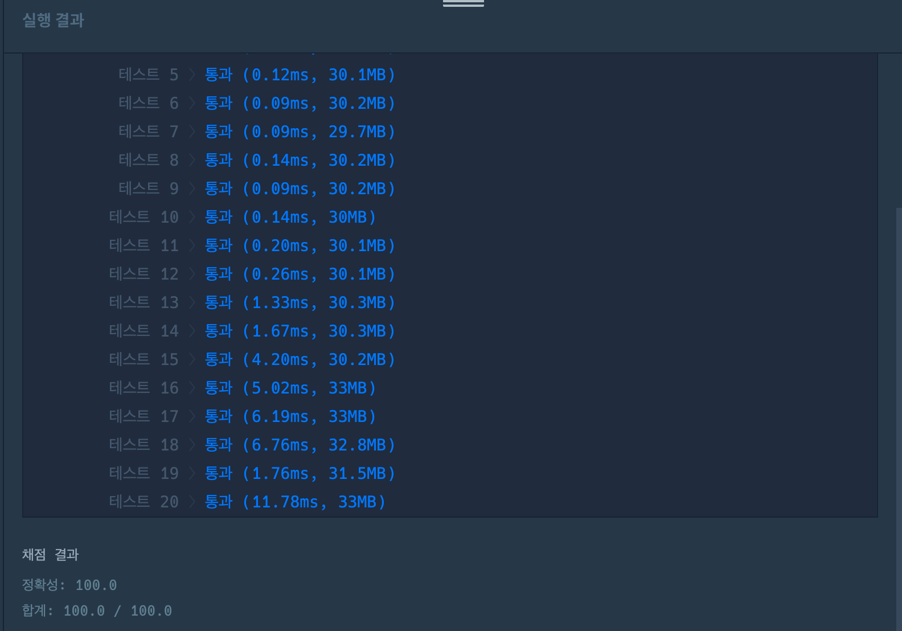

# 최소직사각형

## 👉 바로가기

- [1. 개요](#1-개요)
- [2. 문제 설명](#2-문제-설명)
  - [2-1. 문제 설명 - 제한사항](#2-1-문제-설명---제한사항)
  - [2-2. 문제 설명 - 입출력 예](#2-2-문제-설명---입출력-예)
  - [2-3. 문제 설명 - 입출력 예 설명](#2-3-문제-설명---입출력-예-설명)
- [3. 문제 풀이](#3-문제-풀이)
  - [1) 명함의 가로, 세로의 길이 중 가장 큰 값을 가져오기](#1-명함의-가로-세로의-길이-중-가장-큰-값을-가져오기)
  - [2) 각 명함의 짧은 길이 중 가장 큰 값을 가져오기](#2-각-명함의-짧은-길이-중-가장-큰-값을-가져오기)
  - [3) 결과](#3-결과)
- [4. Refactoring](#4-refactoring)
- [5. 다른 사람의 풀이](#5-다른-사람의-풀이)
- [6. Conclusion](#6-conclusion)

---

## 1. 개요

- 프로그래머스
- Lv.1
- 완전탐색
- [문제 바로가기](https://school.programmers.co.kr/learn/courses/30/lessons/86491)

---

## 2. 문제 설명

명함 지갑을 만드는 회사에서 지갑의 크기를 정하려고 합니다. 다양한 모양과 크기의 명함들을 모두 수납할 수 있으면서, 작아서 들고 다니기 편한 지갑을 만들어야 합니다. 이러한 요건을 만족하는 지갑을 만들기 위해 디자인팀은 모든 명함의 가로 길이와 세로 길이를 조사했습니다.

아래 표는 4가지 명함의 가로 길이와 세로 길이를 나타냅니다.

| 명함 번호 | 가로 길이 | 세로 길이 |
| --------- | --------- | --------- |
| 1         | 60        | 50        |
| 2         | 30        | 70        |
| 3         | 60        | 30        |
| 4         | 80        | 40        |

가장 긴 가로 길이와 세로 길이가 각각 80, 70이기 때문에 80(가로) x 70(세로) 크기의 지갑을 만들면 모든 명함들을 수납할 수 있습니다. 하지만 2번 명함을 가로로 눕혀 수납한다면 80(가로) x 50(세로) 크기의 지갑으로 모든 명함들을 수납할 수 있습니다. 이때의 지갑 크기는 4000(=80 x 50)입니다.

모든 명함의 가로 길이와 세로 길이를 나타내는 2차원 배열 sizes가 매개변수로 주어집니다. 모든 명함을 수납할 수 있는 가장 작은 지갑을 만들 때, 지갑의 크기를 return 하도록 solution 함수를 완성해주세요.

---

### 2-1. 문제 설명 - 제한사항

- sizes의 길이는 1 이상 10,000 이하입니다.
  - sizes의 원소는 [w, h] 형식입니다.
  - w는 명함의 가로 길이를 나타냅니다.
  - h는 명함의 세로 길이를 나타냅니다.
  - w와 h는 1 이상 1,000 이하인 자연수입니다.

---

### 2-2. 문제 설명 - 입출력 예

| sizes                                         | result |
| --------------------------------------------- | ------ |
| [[60, 50], [30, 70], [60, 30], [80, 40]]      | 4000   |
| [[10, 7], [12, 3], [8, 15], [14, 7], [5, 15]] | 120    |
| [[14, 4], [19, 6], [6, 16], [18, 7], [7, 11]] | 133    |

---

### 2-3. 문제 설명 - 입출력 예 설명

입출력 예 #1
문제 예시와 같습니다.

입출력 예 #2
명함들을 적절히 회전시켜 겹쳤을 때, 3번째 명함(가로: 8, 세로: 15)이 다른 모든 명함보다 크기가 큽니다. 따라서 지갑의 크기는 3번째 명함의 크기와 같으며, 120(=8 x 15)을 return 합니다.

입출력 예 #3
명함들을 적절히 회전시켜 겹쳤을 때, 모든 명함을 포함하는 가장 작은 지갑의 크기는 133(=19 x 7)입니다.

---

## 3. 문제 풀이

```js
function solution(sizes) {
  // 1) 명함의 가로, 세로의 길이 중 가장 큰 값을 가져오기
  const longest = sizes
    .map((item) => (item[0] >= item[1] ? item[0] : item[1]))
    .sort((a, b) => b - a)[0];

  // 2) 각 명함의 짧은 길이 중 가장 큰 값을 가져오기
  const opposite = sizes
    .map((item) => (item[0] >= item[1] ? item[1] : item[0]))
    .sort((a, b) => b - a)[0];

  return longest * opposite;
}
```

---

### 1) 명함의 가로, 세로의 길이 중 가장 큰 값을 가져오기

```js
const longest = sizes
  .map((item) => (item[0] >= item[1] ? item[0] : item[1]))
  .sort((a, b) => b - a)[0];
```

`sizes`의 배열을 `Array.map()`메서드와 `Array.sort()`메서드를 사용하여 새로운 배열을 만들고 가장 앞의 원소(가장 큰 값)를 가져오는 과정이다. 해당 값은 변수 `longest`에 할당하였다.

---

### 2) 각 명함의 짧은 길이 중 가장 큰 값을 가져오기

```js
const opposite = sizes
  .map((item) => (item[0] >= item[1] ? item[1] : item[0]))
  .sort((a, b) => b - a)[0];
```

`1) 명함의 가로, 세로의 길이 중 가장 큰 값을 가져오기`의 방법과 마찬가지로 `Array.map()`메서드와 `Array.sort()`메서드를 사용했다. 다른 점 한가지는 명함의 길이 중 작은 값들만 `Array.map()`메서드로 리턴했다는 것이다. 나온 결과 값을 변수 `opposite`에 할당하였다.

그 후 두 개의 변수를 곱해 직사각형의 넓이를 리턴하였다.

---

### 3) 결과



---

## 4. Refactoring

나의 풀이에서 보면 `longest`와 `opposite`를 구하는 과정이 원소의 값을 가져오는 과정을 제외하고는 같다. 그래서 이를 한 번에 해결하고자 한다. 또한 변수명도 마음에 들지 않는다.

그래서 아래와 같이 코드를 수정하였다.

```js
function solution(sizes) {
  const resizes = sizes.map(([w, h]) => (w >= h ? [w, h] : [h, w]));
  const maxLengths = resizes.reduce(
    ([w, h], [a, b]) => [w >= a ? w : a, h >= b ? h : b],
    [0, 0]
  );
  return maxLengths[0] * maxLengths[1];
}
```

먼저 `resies`변수는 배열이며 파라미터로 받은 `sizes`배열을 `Array.map()`메서드를 사용하여 반복문을 돌고 있다. 이 과정을 통해 명함에서 길이가 긴 부분이 가로, 길이가 짧은 부분이 세로로 위치하게 된다.

그 후 가로와 세로의 각각의 부분에서 가장 큰 길이만 찾는 과정을 `Array.reduce()`메서드를 사용하여 구했다. 해당 메서드가 실행되는 과정을 표로 나타내봤다.

```js
const sizes = [
  [14, 4],
  [19, 6],
  [6, 16],
  [18, 7],
  [7, 11],
];
const resizes = [
  [14, 4],
  [19, 6],
  [16, 6],
  [18, 7],
  [11, 7],
];
```

| 호출순서 | acc([w, h]) | cur([a, b]) | 반환값  |
| -------- | ----------- | ----------- | ------- |
| 1        | [0, 0]      | [14, 4]     | [14, 4] |
| 2        | [14, 4]     | [19, 6]     | [19, 6] |
| 3        | [19, 6]     | [16, 6]     | [19, 6] |
| 4        | [19, 6]     | [18, 7]     | [19, 7] |
| 5        | [19, 7]     | [11, 7]     | [19, 7] |

아이러니하게 실행속도는 리팩토링 하기 전 코드가 조금 더 빠른 듯 하다.😂(속도는 그때 그때 마다 다르긴 하다.) 그래도 리팩토링을 통해 가독성이 조금 더 나아지고 중복되는 내용을 제거했다는 과정이 뿌듯하다.

---

## 5. 다른 사람의 풀이

다른 사람의 풀이 중 어느정도 좋아요가 많고 유사한 코드가 많은 것을 가져왔다.

```js
function solution(sizes) {
  const rotated = sizes.map(([w, h]) => (w < h ? [h, w] : [w, h]));

  let maxSize = [0, 0];
  rotated.forEach(([w, h]) => {
    if (w > maxSize[0]) maxSize[0] = w;
    if (h > maxSize[1]) maxSize[1] = h;
  });
  return maxSize[0] * maxSize[1];
}
```

`rotated`배열은 내가 리팩토링을 할 때의 `resizes`배열과 같은 방법이다.
하지만 다른 점은 `maxSize`를 구하는 방법이다. 나는 `Array.reduce()`메서드를 이용했지만 위의 코드에서는 `Array.forEach()`메서드를 사용하였다. 해당 과정에서 반복문을 돌며 기존의 `maxSize`보다 값이 크다면 그 값을 `maxSize`의 새로운 값으로 정하고 있다. 결국 같은 결과를 가지겠지만 그 과정이 다르다. 가독성을 생각했을 땐 리팩토링 코드보다 다른 사람의 풀이 코드가 더 뛰어나 보인다.

---

## 6. Conclusion

> 명함의 가로, 세로를 적당히 돌려 각각의 가장 큰 길이를 구해 서로 곱하면 되는 문제였다. 하지만 난 그러한 과정을 바로 생각해 내지 못했다. 어떻게 보면 정말 단순한 문제였는데 제한시간 내에 답을 구하지 못해 정말 아쉬웠다. 코딩 테스트를 어렵게 접근하는 것이 아닐까 하는 의문이 든다. 해결하는 과정을 너무 복잡하게만 생각하지 말자. 과정을 복잡하게 생각하면 코드도 복잡해져 금방 지친다.

---

[👆](#최소직사각형)
