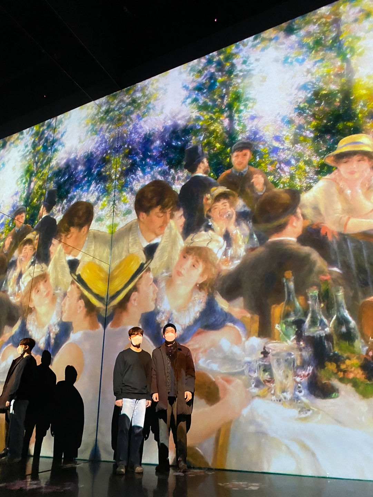

# #4 23년 1월 23일 \~ 23년 1월 29일

## 1. 주간 요약

***

## 2. 개발 공부

### 2-1. 코딩 테스트

복잡한 자료구조가 아닌 구현 문제에 대한 자신감이 어느 정도 붙었다고 생각한다. 하지만 아직 가야할 길은 멀다. 그래프, DP, 그리드 등 말만 들어도 두려운 존재들이 너무 많다. 그래서 관련 문제는 아직 도전을 하지 못하고 있다. 알고리즘 강의도 꾸준히 들어서 얼른 두려움을 없애길...

코딩 테스트 문제를 풀고 정리를 하며, 다른 사람의 풀이도 함께 보니 하나의 문제에 대해서 다양하게 접근이 가능하다는 것을 다시 한 번 더 깨닫게 되었다. 무엇이 효율적이고 가독성이 좋은지는 그 다음의 문제이다. 생각의 흐름을 넓히는 것이 우선이라고 생각한다. 많은 코드를 보고 많은 풀이를 보며 그들이 어떻게 이런 생각을 하였는지 배우도록 하자.

### 2-2. 알고리즘 강의

이번주에는 정렬과 관련한 알고리즘을 학습하였다. 많은 정렬 알고리즘 중 `버블 정렬`, `선택 정렬`, `삽입 정렬`에 대해 강의를 들으며 학습한 내용을 정리하였다. 3가지 정렬 알고리즘 모두 그다지 효율적인 정렬 알고리즘이 아니다. 단, 특정한 상황에선 효율적이로 쓰이긴 하지만, 평균적으로 사용했을 때 모두 `O(n^2)`의 시간 복잡도를 가지고 있으므로 좋다고는 할 수 없다. 대신, 다음주에 배울 다른 정렬 알고리즘과 비교하여 알아둬야 하기 때문에 중요하다고 할 수 있다. 뿐만 아니라 직접 코드로 정렬 알고리즘을 작성하는 학습을 하였기에 그것만 해도 큰 배움이었다고 생각한다.

다음주엔 `합병 정렬`, `퀵 정렬`, `지수 정렬`에 대해 배운다. 천천히 대신 내것으로 만들도록 하자. 그 다음부턴 자료 구조, 알고리즘이다. 꾸준히 배우자.

### 2-3. 정규 표현식

정규 표현식에 대한 기초적인 학습은 끝났다고 말하고 싶다. 패턴에 대해 학습하였고 정규식과 함께 사용하는 자바스크립의 메서드들도 정리하였다. 단, 정리만 하였지 많은 정규 표현식을 다루지 않아 아직 서툴다. 많은 상황에서 사용할 수 있는 정규 표현식을 연습하도록 하자. 연습하는 것 또한 TIL에 남겨 학습 과정을 정리하자.

정규 표현식 정리를 하니, 오랫동안 묵혀 있던 무언가가 해결된 느낌이었다. 코딩 테스트 문제를 풀면서 언젠가는 정규 표현식을 정리해야지 해야지... 했지만 시간이 많이 흘러서 그런가? 아무튼 정리한 만큼 필요한 내용이 있으면 추가하고 지식의 양와 질을 높혀 정규 표현식을 맛깔나게 사용해보자.

### 2-4. 개발 공부 TIL

이번주 정리한 TIL이다.

| 주제      | TIL 제목                      | TIL 바로가기                                                                         |
| ------- | --------------------------- | -------------------------------------------------------------------------------- |
| 코딩 테스트  | \[3차] 압축                    | [TIL 바로가기](../../../CodingTest/Programmers/Level2/programmers\_compression.md)   |
| 코딩 테스트  | \[3차] n진수 게임                | [TIL 바로가기](../../../CodingTest/Programmers/Level2/programmers\_base\_n\_game.md) |
| 알고리즘 강의 | 버블 정렬(Bubble Sort)          | [TIL 바로가기](../../../DataStructureAlgorithm/SortingAlgorithm/BubbleSort.md)       |
| 알고리즘 강의 | 선택 정렬(Selection Sort)       | [TIL 바로가기](../../../DataStructureAlgorithm/SortingAlgorithm/SelectionSort.md)    |
| 알고리즘 강의 | 삽입 정렬(Insertion Sort)       | [TIL 바로가기](../../../DataStructureAlgorithm/SortingAlgorithm/InsertionSort.md)    |
| 정규 표현식  | 검색 기준 패턴                    | [TIL 바로가기](../RegExp/SearchCriteria.md)                                          |
| 정규 표현식  | 특정 문자 숫자 매칭 패턴              | [TIL 바로가기](../RegExp/CharacterClasses.md)                                        |
| 정규 표현식  | 갯수 반복 패턴                    | [TIL 바로가기](../RegExp/NumberRepetition.md)                                        |
| 정규 표현식  | 그룹 패턴                       | [TIL 바로가기](../RegExp/GroupAndRanges.md)                                          |
| 정규 표현식  | 정규 표현식의 메서드                 | [TIL 바로가기](../RegExp/RegExpMethod.md)                                            |
| 정규 표현식  | 정규 표현식과 함께 사용하는 String의 메서드 | [TIL 바로가기](../RegExp/StringMethodWithRegExp.md)                                  |

***

## 3. 독서

1월 달 독서 목표가 `객체지향의 사실과 오해` 2회독을 완료하는 것인데 아직 4장을 읽고 있다. 한 번 읽었던 것이라 빨리 읽으면 다른 책을 읽으려 했지만 게으른건지ㅠㅠ 자기 전에 30분\~1시간 정도 독서하는 것보다 유튜브를 보는 것이 더 재밌었어 그런건지 잘 지키지 못하고 있다. 남은 시간은 2틀이다. 목표를 달성하자

***

## 4. 영어 공부

이번주에도 7일 동안 스픽을 모두 하였다. 부끄럽지만 왕초보 1탄 부터 하고 있어 얼른 끝내고 싶은 마음이 굴뚝같다. 아마 다음주에 왕초보 1탄을 모두 마무리할 수 있지 않을까 한다.

***

## 5. 강릉 여행

28, 29일 주말에 강릉 여행을 다녀왔다. 여자친구와 친한 친구 커플과 함께 1박 2일로 여행을 떠났다. 강릉은 여자친구와 많이 여행을 다닌 곳이긴 하지만 오랜만에 가는 것이라 더욱 기대가 컸다. 물론 현재 서울에 있기 때문에 가는 시간은 배가 늘었지만 그래도 시원한 바다를 보고 아르떼 뮤지엄에서 멋진 작품을 볼 수 있어 힐링이 되었다. 그리고 빠질 수 없는 맛난 먹거리도 먹어서 기분이 좋아졌다. 물론 평소에도 맛난 것을 자주 먹지만 그래도 강릉에서 유명한 먹거리를 먹으니 이래서 여행을 떠나는구나 한다.

여러 사진을 찍었는데, 아쉽게도 먹거리 사진을 찍지 않아서 아쉽다. 먹거리가 나오자마자 바로 먹어버러서 그런가... 대신에 함께 다녀온 사람들과 찍은 사진을 남기며 23년 4주차 회고을 마무리한다.

    

***

📅 2023-01-30
