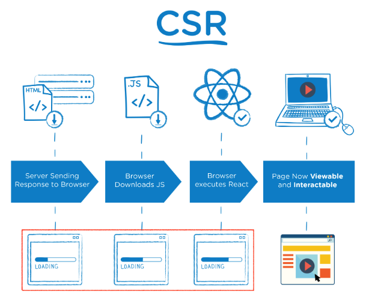
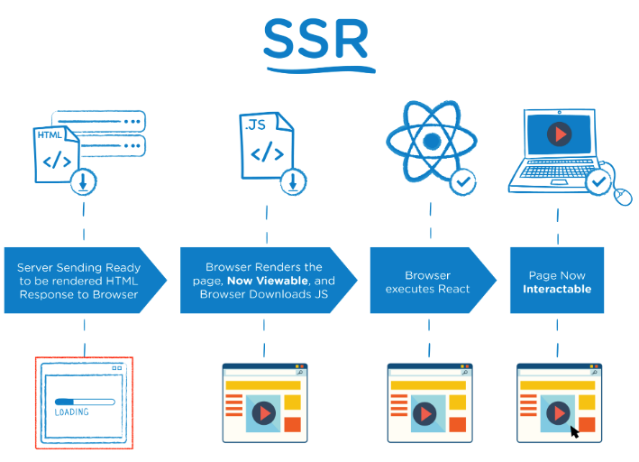

# CSR & SSR

## 1. 개요

웹 개발자라고 하면 필수적으로 알아야 하는 두가지의 주제가 바로 **CSR**과 **SSR**이다. 이는 [MPA, SPA](./SPA.md)과 밀접한 연관을 가지고 있다.

CSR과 SSR의 근본적인 차이는 렌더링의 방식에 있다. 화면에 그려지는 것은 HTML인데 이것을 누가 하느냐 주최에 따라서 CSR과 SSR로 나뉘게 된다.

> 랜더링: 서버로부터 요청해서 받은 내용을 브라우저 화면에 표시해주는 것.

---

## 2. CSR (Client Side Rendering)



1. 서버에서 client의 request에 의해 index.html 파일을 client에 전송
2. body 내부에는 아래와 같은 코드만 들어있음(예시)

   ```html
   ...
   <body>
     <div id="root"></div>
     <script src="app.js"></script>
   </body>
   ```

3. 기본적으로 빈 html이기 때문에 순간적으로 client는 빈 화면을 보여주고, app.js를 서버에 요청, 서버는 다시 app.js를 client에 보내줌
4. 추가 데이터가 필요하면 서버에 요청해서 데이터를 받아온 다음에 Data(JSON)과 app.js를 기반으로 해서 동적으로 HTML을 생성함

---

## 3. SSR (Server Side Randering)



1. client가 서버에 콘텐츠를 요청하면 랜더링 준비를 마친 HTML, JS code를 웹 브라우저로 보냄
2. 웹 브라우저는 서버에서 받은 HTML를 랜더함, 이때 사용자는 페이지를 볼 수 있지만 JS code를 아직 다운로드 받지 않았기 때문에 interaction이 불가능 함
3. 웹 브라우저가 JS code를 다운로드를 진행하고 다운로드가 끝나면 HTML에 JS로직을 연결함
4. 이후 웹 브라우저는 interaction이 가능해짐

---

## 4. CSR vs SSR

1. 웹 페이지 로딩 시간
   - 첫 페이지 로딩 시간: CRS인 경우 HTML, CSS와 모든 스크립트들을 한 번에 불러오고 반면 SSR은 필요한 부분의 HTML과 스트립트만 불러오게 되므로 평균적으로 SSR이 더 빠르다.
   - 나머지 로딩 시간: CSR은 이미 첫 페이지 로딩할 때 나머지 부분을 구성하는 코드를 받아왔기 때문에 빠르지만, SSR은 첫 페이지를 로딩한 과정을 정확하게 다시 실행하기 때문에 CSR에 비해 느리다.
2. SEO 대응
   - CSR 방식: 대부분의 웹 크롤러, 봇들은 JS를 실행시키지 못하고 HTML에서만 콘텐츠를 수집하기 때문에 빈 페이지로 인식하게 된다.
   - SSR 방식: View를 서버에서 전부 렌더링하기 때문에 HTML에 모든 콘텐츠가 저장되어 있어 SEO를 사용하는데 문제가 없다.
3. 서버 자원 사용: SSR이 페이지가 바뀔 때 마다 서버에 요청을 하기 때문에 서버 자워을 더 많이 사용한다.
4. Blinking Issue: SSR인 경우 사용자가 새로고침을 하게 되면 전체 웹사이트를 다시 서버에서 받아와야 하기 때문에 화면이 없어졌다 나타난다. 이는 UX관점에서 봤을 때 좋지 않다.

> 지금까지 살펴본 결과 CSR은 SPA과 SSR은 MPA과 같다고 생각할 수 있다. 하지만 정답은 같지 않다.  
> SPA는 서버로부터 처음에만 페이지를 받아오고 이후에는 동적으로 DOM을 구성하여 렌더링 되는 화면이 바뀌게 한다. 여기서 `동적으로 DOM을 구성하여 렌더링 되는 화면이 바뀌게 한다.`부분이 CSR이다. 다시 말해 SPA는 처음에만 페이지를 받아오고 이후에는 받아오지 않는데 이럼에도 불구하고 데이터가 수정되고 조회되게 하고 싶어 CSR이란 **방식**을 채택한 것이다.  
> SPA와 MPA는 페이지를 여러 개 쓰냐 한 개만 쓰냐의 차이이고 CSR과 SSR은 렌더링을 어디서 하냐의 차이이다. SSR과 CSR은 MPA과 SPA를 구성하는 요소일 뿐이다.

---

## 5. TTV & TTL

- TTV: Time To View의 약자로 웹 브라우저에 서버에서 받은 HTML이 보여지는 때를 말한다.
- TTI: Time To Interact의 약자로 웹 브라우저가 JS code를 다운로드하여 동적인 동작를 가능하게 되는 때를 말한다.

- CRS에서는 TTV 사용자가 웹 사이트를 볼 수 있음에 동시에 TTI 클릭을 하거나 인터렉션이 가능하게 된다.
- SSR에서는 TTI 이전에 사용자가 웹사이트를 볼 수 있다. 하지만 JS code를 불러오기 까지는 시간이 걸리기 때문에 인터렉션은 불가능하다.

## 6. React에서의 SSR

- Next.js
  - 서버 사이드 랜더링(SSR), 정적 웹 페이지 생성(SSG) 등 리액트 기반 웹 애플리케이션 기능들을 가능케 하는 Node.js 위에서 빌드된 오픈 소스 웹 개발 프레임워크이다.
  - [Next.js 위키백과](https://ko.wikipedia.org/wiki/Next.js)
  - [Next.js org](https://nextjs.org/)
- Gatsby
  - [GatsbyJS](https://www.gatsbyjs.com/)

---

## 7. Conclusion

> 이번 내용을 공부하면서 저번에 공부하였던 MPA, SPA과 많은 내용이 겹쳐 MPA과 SSR, SPA과 CSR이 똑같은 것이 아닌가 하는 궁금점이 생겼다. 공부하면서 MPA과 SPA는 Application으로 해당 Application이 어떻게 페이지를 렌더링하느냐에 따라 그 방법이 SSR인지 CSR인지로 나눈다고 이해를 하였다.  
> 그리고 최근 노마드코더에서 NextJS를 배우고 있다. 지금은 스터디 때문에 진도를 팍팍 나가고 있지는 못하지만 NextJS가 React기반의 프레임워크라는 것을 알고있었다. 하지만 NextJS가 CSR의 문제를 해결하는 역할을 하는 것까지는 자세히 알지 못하였다. 단지 좀더 React를 편하게 개발을 할 수 있는 것... 이라고만 알고 있었다. 이렇게 오늘도 하나를 알고가니 뿌듯한 마음이 들고,,, 지금까지 얼마나 대충 공부를 했는지 참...  
> SSR과 CSR에 대해 공부하면서 이번에는 유튜브 영상도 많이 봤다. 아래의 유튜브가 도움이 많이 되었다. 나중에 다시 보며 개념을 확실히 잡도록 하자.

---

## 참고

[CSR/SSR, SPA/MPA, PWA](https://tech.weperson.com/wedev/frontend/csr-ssr-spa-mpa-pwa/#csr-client-side-rendering-vs-ssr-server-side-rendering)  
[Client side - Server side rendering](https://korshika.tistory.com/58)  
[React 서버 사이드 렌더링 / 클라이언트 사이드 렌더링이란?](https://ctdlog.tistory.com/46)  
[SSR과 CSR의 차이](https://proglish.tistory.com/216)  
[SPA, CSR과 SSR, SEO](https://velog.io/@ksh4820/SPA-CSR%EA%B3%BC-SSR-SEO)

도움이 많이 되었던 유튜브 🎬

- 완전 새로운 리액트가 온다? 핵심정리 10분컷.  
  [](https://www.youtube.com/watch?v=7mkQi0TlJQo)

- 서버사이드 렌더링 (개발자라면 상식으로 알고 있어야 하는 개념 정리 ⭐️)  
  [](https://www.youtube.com/watch?v=iZ9csAfU5Os)

- 10분 데코톡  
  [![[10분 테코톡] 🎨 신세한탄의 CSR&SSR](https://img.youtube.com/vi/YuqB8D6eCKE/0.jpg)](https://www.youtube.com/watch?v=YuqB8D6eCKE)

---

[👆](#csr--ssr)

📅 2022-07-14
