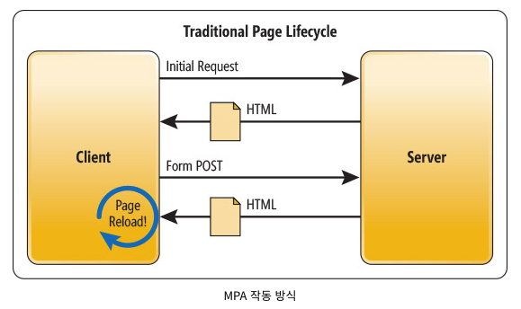
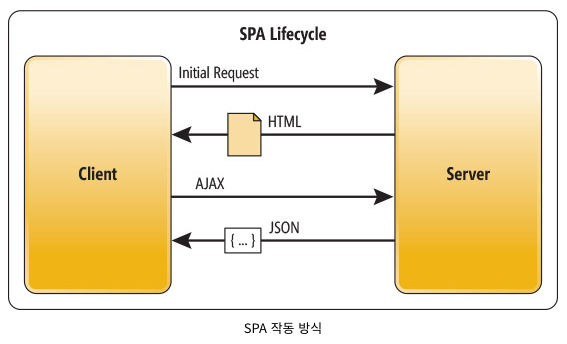
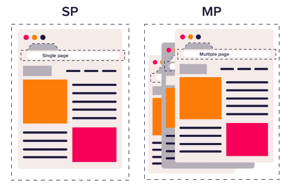

# SPA (Single Page Application)

## 1. 개요

웹 프론트앤드 개발자가 주로 사용하는 React, Vue, Angular는 SPA(Single Page Application)이다. 그렇다면 SPA는 무엇일까? SPA를 과거의 웹 페이지 형태(MPA, Multi Page Application)와 비교하며 SPA의 특징과 장점 및 단점을 살펴보자.

---

## 2. SPA이전의 MPA (Multi Page Application)

MPA는 전통적인 웹 애플리케이션 개발 방식이다. 이러한 구조는 jsp, 혹은 php 등과 같은 웹 서버 언어로 구축된 웹사이트에서 많이 보인다. 웹 브라우저(Client)에서 특정 페이지를 요청을 서버에 보내면, 서버는 데이터를 HTML 문서로 웹 브라우저(Client)에게 보낸다. 서버에서 HTML 문서를 보낼 때 마다 전체 페이지가 다시 불러와지므로 화면은 깜빡거리게 된다. 이는 웹 브라우저를 사용하고 있는 사용자의 입장에서는 좋지 않는 경험일 것이다. 만약 불러오게 되는 데이터의 양이 많다면 데이터가 모두 불러올 때 까지 우리가 볼 수 있는 페이지는 아무것도 없는 흰 페이지이다.

또한 프론트엔드와 백엔드가 서로 밀접해게 연관되어 개발이 복잡해질 수 있다.

하지만 MPA에도 장점이 있다.

- SEO 친화적: 완성된 형태의 HTML파일을 서버로부터 전달 받기 때문에 네이버나 구글 같은 검색 사이트에 노출되는 것이 중요한 웹사이트라면 MPA 구조의 웹 애플리케이션이 적합하다.
  > SEO(검색 엔진 최적화)는 웹사이트가 검색 결과에 더 잘 보이도록 최적화 하는 과정이다.  
  > h태그, 메타태그, 이미지 최적화, 콘텐츠 최적화, 글자의 수, 내부링크등의 요소를 작업하여 검색 엔진을 최적화 한다.  
  > 참고 - [검색 엔진 최적화](https://ko.wikipedia.org/wiki/%EA%B2%80%EC%83%89_%EC%97%94%EC%A7%84_%EC%B5%9C%EC%A0%81%ED%99%94)
- 매우 짧은 첫 로딩: 서버에서 이미 랜더링하여 가져오기 때문, 하지만 Client가 JS파일을 모두 다운로드하고 적용하기 전 까지는 각각의 기능은 동작하지 않는다.

---

## 3. SPA의 등장 배경

1. 서버의 부하
   - 과거의 웹 페이지에서 브라우저는 화면을 보여주기만 할 뿐이다. 요청한 웹 문서에 대한 처리는 전부 서버에서 담당하기 페이지를 요청할 때 마다 서버에 부하가 생겼다.
   - SPA는 웹 애플리케이션에 필요한 정적 리소스(Html, Css, Javascript)를 최초 접근 시 단 한 번만 다운로드한다. 이후 서버는 브라우저에 필요한 정보에 대한 요청(Ajax)이 오면 응답(Json)만 주기 때문에 서버에 부하를 줄일 수 있다.
2. 모바일 최적화
   - 온라인 세상에서 모바일의 중요성이 커지면서 모바일 최적화에 대한 니즈를 충족해야 한다. 모바일 웹이 MPA 방식으로 구현됐다면, 수많은 페이지를 이동할 때, 페이지를 리랜더링 해야 하므로 사용자 경험(UX)이 감소할 것이다.
   - SPA에서는 수정된 부분만 렌더링 하기 때문에, 기존의 웹 페이지보다 UX가 향상된다.

---

## 4. SPA

SPA는 한 개(Single)의 Page로 구성된 Application으로 최초 단 한 번만 리소스(HTML, CSS, Javascript)를 로딩하고 이후에는 데이터를 받아올 때만 서버와 통신한다.

최초 로딩 때 실행한 HTML파일에서 변경되지 않는 부분은 그대로 두고 변경되는 부분만 다시 렌더링하여 효율적인 변경이 가능하다. 이는 SPA의 가장 큰 장점이며 새로고침이 되지 않고 변경된다는 점에서 사용자에게 좋은 경험을 제공해 줄 수 있다.

React, Vue, Angular등의 프론트앤드 기술들이 사용하고 있는 방식이다.

---

## 5. SPA의 장점과 단점

### 5-1. SPA의 장점

1. 자연스러운 사용자 경험(UX): 깜빡거림이 없다
2. 필요한 리소스만 부분적으로 로딩
3. 컴포넌트별 개발 용이
4. 모바일 앱 개발을 염두에 둔다면 동일한 API를 사용하도록 설계 가능

---

### 5-2. SPA의 단점

1. 느린 초기 구동 속도: JavaScript 파일을 번들링해서 한 번에 받기 때문
2. SEO(검색엔진최적화)의 어려움: SSR로 해결 가능
3. 보안 이슈: CSR방식의 SPA에서는 클라이언트측의 쿠키말고는 사용자에 대한 정보를 저장할 공간이 마땅치 않음, SSR에서는 사용자에 대한 정보를 서버측에서 세션으로 관리

> CSR과 SSR에 대해서는 다른 챕터에서 다룬다.

---

## 6. MPA vs SPA

요즘 기업들의 대부분은 SPA를 사용한다 그렇다면 SPA가 무조건 MPA보다 좋고 웹 개발을 할 때에 SPA만 사용해야만 할까? 그것은 아니다. 각각의 장점을 잘 비교해서 상황에 맞는 방식으로 개발을 해야 한다.

고려해야 할 점

- 로딩 속도의 차이
- 프론트엔드와 백엔드의 상호 의존성
- SEO
- 유저 경험성(UX)
- 보완성
- 개발 처리 속도
- 자바스크립트 의존성

---

## 7. Conclusion

> html, css, js만 배우다가 처음 react를 배울 때가 생각이난다. 부품을 조립하여 장난감을 만드는 것처럼 컴포넌트를 만들어 필요한 컴포넌트를 가져와 여러 페이지를 만드는 방법이 너무 재밌고 신선해서 지금까지 공부하고 있다. 그래서 'MPA보다는 SPA방식이 더 좋은 것이다'라고 생각을 하고 있었는데 SPA에 대해 정리를 하다보니 꼭 그렇지는 안았다. 단점도 분명 존재하고 이를 보안할 수 있는 SSR도 있어 이후에는 SSR과 CSR에 대해 정리하고자 한다.  
> 그리고 용어조차 제대로 알지 못하고 지내왔던 것에 대해 반성하자. 대충 들어만 봤지 정확히 어떤 개념인지 모르는 용어가 많다.😭

---

## 참고

- [SPA(Single Page Application) - [1] 등장 배경](https://velog.io/@kws60000/SPASingle-Page-Application-1-%EB%93%B1%EC%9E%A5-%EB%B0%B0%EA%B2%BD)
- [웹 개발자가 알아두면 좋은 SPA, MPA](https://seunghyun90.tistory.com/92)
- [SPA vs MPA와 SSR vs CSR 장단점 뜻정리](https://hanamon.kr/spa-mpa-ssr-csr-%EC%9E%A5%EB%8B%A8%EC%A0%90-%EB%9C%BB%EC%A0%95%EB%A6%AC/)
- [MPA VS SPA 어떤 기술이 더 좋은 것인가?라는 의문에 대한 답과 단상.](https://velog.io/@minsu8834/%ED%94%84%EB%A1%A0%ED%8A%B8-%EA%B0%9C%EB%B0%9C%EC%9D%98-%EC%97%AD%EC%82%AC%EB%A5%BC-%ED%86%B5%ED%95%B4-%EC%82%B4%ED%8E%B4-%EB%B3%B8-SPA%EB%9E%80-%EB%AC%B4%EC%97%87%EC%9D%B8%EA%B0%80)

---

[👆](#spa-single-page-application)

📅 2022-07-13
