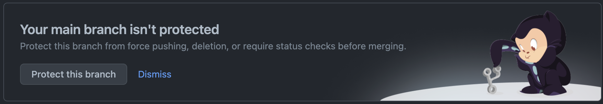
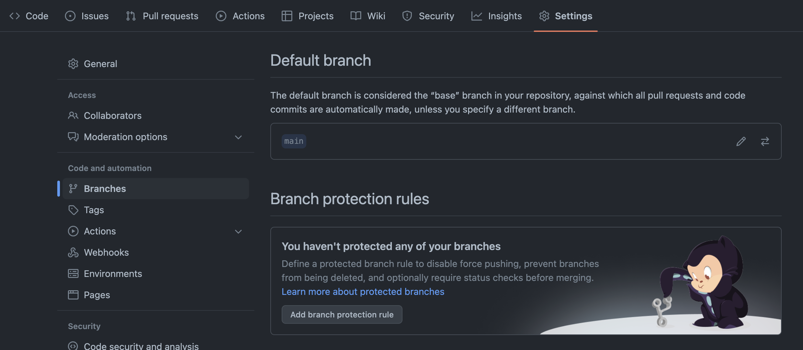
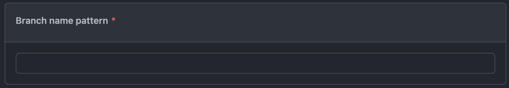
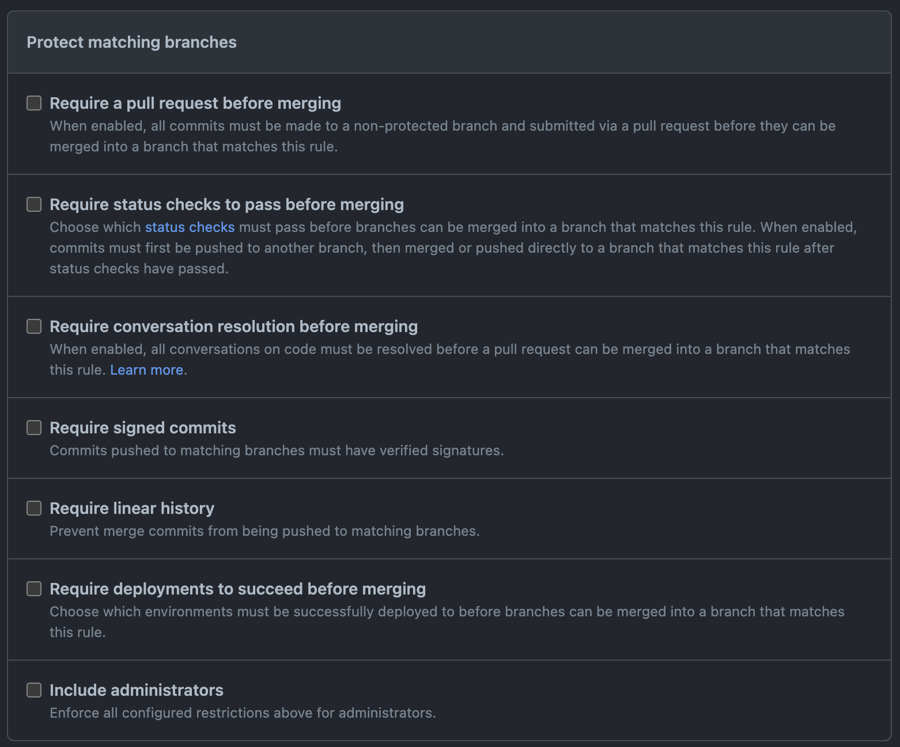
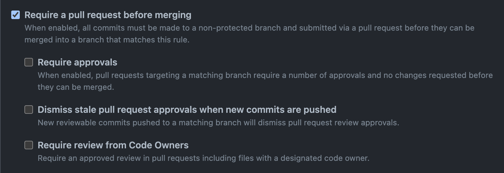
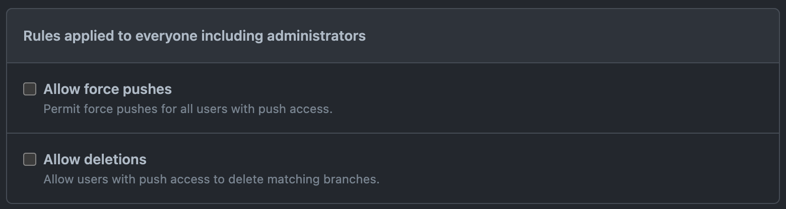

# Branch Protection Rule 적용하기

## 1. 개요

티처캔 프로젝트를 진행하는 깃허브의 메인 브랜치에서 아래와 같은 내용의 메시지가 보였다.

위의 내용은 main branch가 보호되어 있지 않다고 한다. 그러면 어떠한 경우에서 main branch를 보호하고자 하는 것일까?

1. 무질서하게 코드를 작성하고 머지하는 경우
2. 브랜치가 실수로 지워지는 경우
3. PR이 아닌 다른 방식으로 커밋을 추가하는 경우

티처캔의 소중한 main branch를 악으로 가득찬 위의 경우에서 보호해보자.

---

## 2. Branch protection rules로 이동하기

`Branch protection rules`의 추가는 레포지토리의 setting - branch에서 할 수 있다.

`Add branch protection rules`를 클릭하자.

---

## 3. Branch name pattern 만들기

`Branch protection rules`를 만들기 위해 첫 번재로 해야 할 일은 `Branch name pattern`을 만드는 것이다. 하나의 브랜치에 적용할 경우 해당 브랜치의 이름을 작성하고 특정 단어가 들어간 브랜치에 적용할 경우에는 해당 단어앞뒤에 \*를 붙이면 된다.

> main 브랜치에만 적용할 경우: `main`  
> feature 단어를 가진 모든 브랜치에 적용할 경우: `*feature*`  
> feature 접두어를 가진 모든 브랜치에 적용할 경우: `feature*`  
> 모든 브랜치에 적용할 경우: `*`

와일드카드(\*)로 규칙이 확장이 가능하기 때문에 여러개의 보호 규칙이 하나의 브랜치에 적용되는 경우가 있다. 이 경우 특정 브랜치의 이름을 포함하고 있을 수록 우선순위가 높게 적용된다. 만약 특정 브랜치의 이름을 포함하고 있는 보호 규칙이 여러가지라고 하면 먼저 생성된 규칙이 우선순위가 높게 적용된다.

한가지의 예롤 와일드카드(\*)를 이용해 전체 브랜치 규칙을 추가하고 특정 브랜치 이름으로 예외 규칙을 만들어 줄 수 있다.

---

## 4. Protect matching branches

`Branch name pattern`에 해당되는 모든 브랜치를 보호할 수 있는 규칙을 설정할 수 있다. 현재 7가지의 옵션이 있으며 중복하여 선택해 규칙을 설정할 수 있다.

하나하나 어떤 옵션인지 알아보자.

---

### 4-1. Require a pull request before merging

> When enabled, all commits must be made to a non-protected branch and submitted via a pull request before they can be merged into a branch that matches this rule.

해당 브랜치에 커밋을 추가하기 위해서는 별도 브랜치를 만들어 Pull Request를 해야되는 옵션이다. 협업 시 드랜치를 Local에서의 Direct Push로부터 보호하고 코드리뷰를 강제하기 위해 사용한다.

예를 들어 develop 브랜치에 팀원이 작업하는 경우 develop 브랜치에 해당 옵션을 걸어주고 각자 자기 개발 브랜치(feature 브랜치)에 작업을 한 다음 PR을 통해서 develop 브랜치로 코드를 반영하도록 하는 것이다.

해당 옵션에는 서브 옵션이 있다. 서브 옵션은 아래와 같다.

- `Require approvals`: 몇 명의 동료가 리뷰 승인을 해줘야하는지 설정
- `Dismiss stale pull request approvals when new commits are pushed`: 리뷰 승인 이후 새로운 코드가 추가로 들어왔을 때, 기존 리뷰 승인을 무효화 할 것인지 설정
- `Require review from Code Owners`: 코드의 소유자에게도 PR을 받아야하는지 설정

---

### 4-2. Require status checks to pass before merging

> Choose which status checks must pass before branches can be merged into a branch that matches this rule. When enabled, commits must first be pushed to another branch, then merged or pushed directly to a branch that matches this rule after status checks have passed.

해당 브랜츠에 커밋이 머지되는 경우 반드시 status check를 통과해야하는 보호 규칙이다. 반영되려는 커밋이 특정 테스트를 통과하는지 자동으로 검증하도록 설정할 수 있다.

`Require branches to be up to date before merging` 이라는 서브 옵션을 선택하면 PR이 항상 최신 브랜치 상태에서 테스트된다.

---

### 4-3. Require conversation resolution before merging

> When enabled, all conversations on code must be resolved before a pull request can be merged into a branch that matches this rule. Learn more.

PR를 날리게 되면 코드리뷰를 통해 Conversation이 생기게 된다. 이 Conversation이 모두 solved되었을 때만 머지할 수 있다.

---

### 4-4. Require signed commits

> Commits pushed to matching branches must have verified signatures.

커밋들이 sign이 되어 있어야 한다. 보통 Github에 GPG Key를 등록하고 해당 Key를 가진 사람이 커밋한 경우 Verified라고 뜨게 된다.

---

### 4-5. Require linear history

> Prevent merge commits from being pushed to matching branches.

해당 브랜치에서 분기를 불가능하게 만든다. 히스토리 추적을 쉽게하기 위함이며, 하나의 브랜치로 유지해야 할 필요가 있을 때 사용한다.

---

### 4-6. Require deployments to succeed before merging

> Choose which environments must be successfully deployed to before branches can be merged into a branch that matches this rule.

가장 최근에 생성된 설정 옵션으로 보인다. 브랜치를 머지하기 전 변경사항들이 특정 환경에 성공적으로 배포할 수 있도록 확인하는 옵션이다. 아래는 `Github Docs`에서 소개하고 있는 해당 설정 옵션의 설명이다.

> You can require that changes are successfully deployed to specific environments before a branch can be merged. For example, you can use this rule to ensure that changes are successfully deployed to a staging environment before the changes merge to your default branch.

---

### 4-7. Include administrators

> Enforce all configured restrictions above for administrators.

관리자에게도 위의 규칙 옵션들 중 선택한 규칙 옵션이 적용되도록 한다.

---

## 5. Rules applied to everyone including administrators

관리자를 포함해 모든 사람들에게 적용되는 규칙을 설정하는 곳이다.

---

### 5-1. Allow force pushes

> Permit force pushes for all users with push access.

강제 푸시를 허용할 것인지 여부를 결정한다. 왠만해서 아니라 절대 사용하지 말라고 블로그에 적혀있다... 건들지 말 것

해당 규칙 옵션에는 서브 옵션이 있다.

- `Everyone`: 모든 사람들에게 강제 푸쉬를 허용
- `Specify who can force push`: 설정된 사람들에게만 강제 푸쉬를 허용

---

### 5-2. Allow deletions

> Allow users with push access to delete matching branches.

push access를 가진 유저들이 브랜치를 지울 수 있도록 한다. 푸시는 Write를 위한 명령어인데 이 명령어에 대한 유저에게 삭제 명령을 가능하도록 만드는 옵션이다. 왠만해선 이것도 사용하지 말자.

---

## 6. Conclusion

> main branch에 새로운 커밋을 머지해야 할 경우가 올 때마다 `1. 개요`에 있는 사진처럼 나에게 해당 브랜치가 보호되지 않고 있다는 메시지가 보였다. 그래서 이번 기회에 브랜치를 보호하는 규칙에 대해 알아보고 정리하면서 규칙을 적용하고자 한다. 이러한 브랜치 보호 규칙은 앞으로 티처캔을 꾸준히 개발하고 업데이트하는 과정에서 반드시 필요하기 때문에 더 이상 미루지 않고 설정하기로 했다.

> Github에서 제공하는 여러 보호 규칙 중 보통 자주사용하게 될 것들은 아래와 같을 것이다.
>
> 1. `Require a pull request before merging`
> 2. `Require conversation resolution before merging`
> 3. `Include administrators`

> 코드의 수정, 새로운 기능의 개발 뿐 아니라 이렇게 Github를 이용해 프로젝트를 안전하게 진행할 수 있었다니 아직 내가 모르는 기능이 많이 있다. 많은 것들을 배우고 상황에 적절히 적용해보자.:)

---

## 참고

[[GitHub] Branch Protection Rule 적용해 브랜치 보호하기](https://kotlinworld.com/292)  
[[Gihub] 브랜치 보호 규칙 설정 - PR 리뷰 및 테스트 강제](https://hbase.tistory.com/215)  
[About protected branches](https://docs.github.com/en/repositories/configuring-branches-and-merges-in-your-repository/defining-the-mergeability-of-pull-requests/about-protected-branches)
