# 배열의 요소 추가 삭제(push, pop, unshift, splice, slice)

## 1. 개요

배열의 요소를 추가하고나 삭제하는 방법에 대해 알아보자. 각각의 메서드의 특징을 잘 알고 상황에 맞게 필요한 메서드를 사용하자.

---

## 2. Array.push()

- **특징**: 배열의 끝에 하나 이상의 요소를 추가, 원본 배열을 수정
- **반환 값**: 호출한 배열의 새로운 길이
- **구문**

  ```javascript
  arr.push(element1[, ...[, elementN]])
  ```

- **매개변수**
  - `elementN`: 배열의 끝에 추가할 요소

예시를 통해 `Array.push()`메서드의 사용법을 알아보자.

```javascript
const color = ["black", "red", "white"];
const length = color.push("blue");
```

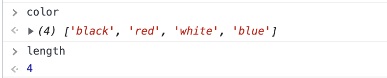

```javascript
const length2 = color.push("green", "yellow");
```

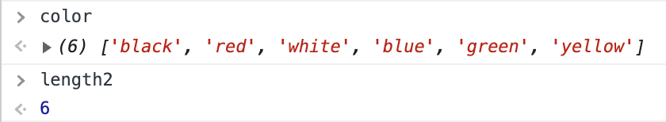

---

## 3. Array.pop()

- **특징**: 배열의 마지막 요소를 제거, 원본 배열을 수정
- **반환 값**: 배열에서 제거한 요소, 빈 배열에 `pop()`을 호출하면 `undefined`을 반환
- **구문**

  ```javascript
  arr.pop();
  ```

예시를 통해 `Array.pop()`메서드의 사용법을 알아보자.

```javascript
const color = ["black", "red", "white", "blue", "green", "yellow"];
const popItem = color.pop();
```

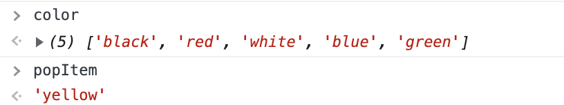

---

## 4. Array.unshift()

- **특징**: 새로운 요소를 배열의 맨 앞에 추가, 원본 배열을 수정
- **반환 값**: 호출한 배열의 새로운 길이
- **구문**

  ```javascript
  arr.unshift([...elementN]);
  ```

- **매개변수**
  - `elementN`: 배열 맨 앞에 추가할 요소

예시를 통해 `Array.unshift()`메서드의 사용법을 알아보자.

```javascript
const color = ["black", "red", "white"];
const length = color.unshift("blue", "green");
```

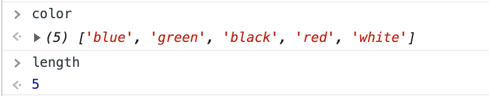

---

## 5. Array.shift()

- **특징**: 배열의 첫 번째 요소를 제거, 원본 배열을 수정
- **반환 값**: 배열에서 제거한 요소, 빈 배열에 `shift()`을 호출하면 `undefined`을 반환
- **구문**

  ```javascript
  arr.shift();
  ```

예시를 통해 `Array.shift()`메서드의 사용법을 알아보자.

```javascript
const color = ["blue", "green", "black"];
const shiftItem = color.shift();
```

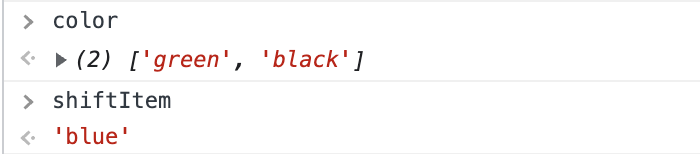

---

## 6. Array.splice()

- **특징**: 배열의 기존 요소를 삭제하거나 새 요소를 추가하여 원본 배열의 내용을 변경
- **반환 값**: 제거한 요소를 담은 배열. 하나의 요소만 제거한 경우 길이가 1인 배열을 반환합니다. 아무 값도 제거하지 않았으면 빈 배열을 반환
- **구문**

  ```javascript
  array.splice(start[, deleteCount[, item1[, item2[, ...]]]])
  ```

- **매개변수**
  - `start`
    - 배열의 변경을 시작할 인덱스
    - 음수인 경우 배열의 끝에서부터 요소를 세어 나감
    - \-n일 경우 요소 끝의 n번째 요소를 가르키며 `array.length - n`번째 인덱스와 같음
  - `deleteCount`(Optional)
    - 배열에서 제거할 요소의 수
    - `deleteCount`를 생략하거나 값이 `array.length - start`보다 클 경우 `start`부터의 모든 요소를 제거
    - `deleteCount`값이 0이하라면 어떤 요소도 삭제하지 않지만 최소한 하나의 새로운 요소를 지정해야 함
  - `item1, item2, ...`
    - 배열에 추가할 요소
    - 아무 요소를 지정하지 않으면 삭제만 함

예시를 통해 `Array.splice()`메서드의 사용법을 알아보자.

---

### 6-1. 특정 인덱스의 요소부터 마지막 요소까지 삭제하는 경우

```javascript
const color = ["blue", "black", "white", "green", "blue", "red", "yellow"];
const removeItem = color.splice(3);
```

인덱스가 3인 요소(green)부터 마지막 요소(yellow)까지 삭제를 한다.

`color`배열엔 삭제한 요소를 제외한 요소들이 있고 `removeItem`배열엔 삭제한 요소들이 있다.

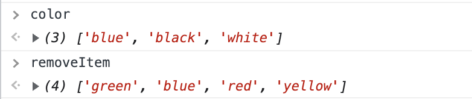

---

### 6-2. 특정 인덱스의 요소부터 특정 수 만큼 삭제하는 경우

```javascript
const color = ["blue", "black", "white", "green", "blue", "red", "yellow"];
const removeItem = color.splice(3, 3);
```

인덱스가 3인 요소(green)부터 3개의 요소를 삭제한다.

`color`배열엔 삭제한 요소를 제외한 요소들이 있고 `removeItem`배열엔 삭제한 요소들이 있다.

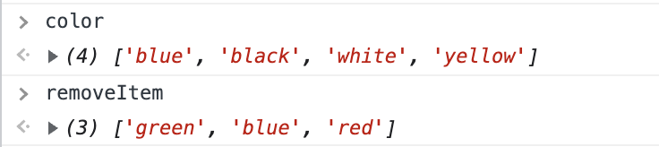

---

### 6-3. 특정 인덱스의 요소부터 특정 수 만큼 삭제한 후 다른 새로운 요소를 추가하는 경우

```javascript
const color = ["blue", "black", "white", "green", "blue", "red", "yellow"];
const removeItem = color.splice(2, 2, "gray", "orange");
```

1. 인덱스가 2인 요소(white)부터 2개의 요소를 삭제한다.
2. 삭제된 자리에 새로운 요소 2개(gray, orange)를 추가한다.

`color`배열엔 삭제한 요소를 제외한 요소과 새롭게 추가된 요소들이 있고 `removeItem`배열엔 삭제한 요소들이 있다.

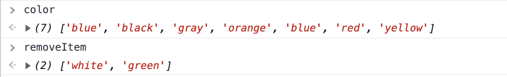

---

### 6-4. 어떤한 요소도 삭제하기 않고 특정 인덱스 이후에 새로운 요소를 추가하는 경우

```javascript
const color = ["blue", "black", "white", "green", "blue", "red", "yellow"];
const removeItem = color.splice(4, 0, "gray", "orange");
```

인덱스가 4인 요소(blue) 이전에 새로운 요소 2개(gray, orange)를 추가한다.

`color`배열엔 기존 요소에 새롭운 요소가 추가되어 있고 `removeItem`배열은 삭제된 요소가 없으니 빈 배열이다.

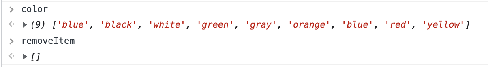

이때 주의해야 할 점은 `start` 이후에 새로운 값이 추가되는 것이 아니라 `start` 이전에 새로운 값이 추가되는 것이다.

---

## 7. Array.slice()

- **특징**: 어떤 배열의 `begin`부터 `end`까지(`end` 미포함)에 대한 얕은 복사본을 새로운 배열 객체로 반환한다. 원본 배열은 바뀌지 않는다.
- **반환 값**: 추출한 요소를 포함한 새로운 배열
- **구문**

  ```javascript
  arr.slice([begin[, end]])
  ```

- **매개변수**
  - `begin`(Optional)
    - 추출 시작점에 대한 인덱스
    - 음수일 경우 배열의 끝에서부터의 길이, `slice(-2)`는 배열에서 마지막 두 개의 엘리먼트를 추출
    - `undefined`인 경우 0번 인덱스부터 추출
    - 배열의 길이와 같거나 큰 경우 빈 배열을 반환
  - `end`(Optional)
    - 추출을 종료 할 인덱스
    - `end` 인덱스를 제외하고 추출, `slice(2, 4)`는 두번째부터 세번째 요소까지 추출
    - 음수일 경우 배열의 끝에서부터 길이, `slice(2, -1)`는 세번째부터 끝에서 두번째 요소까지 추출
    - 생략되거나 배열의 길이와 같거나 크다면 배열의 마지막 요소까지 추출

예시를 통해 `Array.slice()`메서드의 사용법을 알아보자.

항상 알아두어야 할 것은 `Array.slice()`메서드는 원본 배열을 바꾸지 않는다는 것이다.

---

### 7-1. 매개변수가 모두 생략된 경우

```javascript
const color = ["blue", "black", "white", "green", "blue", "red", "yellow"];
const newColor = color.slice();
```

`begin`, `end`가 모두 생략된 경우에는 0번 인덱스부터 배열의 끝까지의 요소를 추출한다.

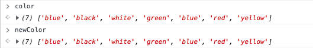

---

### 7-2. begin이 undefined인 경우

```javascript
const color = ["blue", "black", "white", "green", "blue", "red", "yellow"];
const newColor = color.slice(undefined, 4);
```

- `begin`이 `undefined`이므로 0번 인덱스부터 추출을 시작한다.
- `end`가 4이므로 4번 인덱스 앞(green)까지 추출한다.

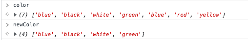

---

### 7-3. begin이 배열의 길이와 같거나 큰 경우

```javascript
const color = ["blue", "black", "white", "green", "blue", "red", "yellow"];
const newColor1 = color.slice(color.length);
const newColor2 = color.slice(color.length + 1);
```

위의 `newColor1`, `newColor2` 모두 빈 배열을 반환한다.

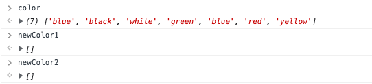

---

### 7-4. end가 생략되거나 배열의 길이와 같거나 큰 경우

```javascript
const color = ["blue", "black", "white", "green", "blue", "red", "yellow"];
const newColor1 = color.slice(2);
const newColor2 = color.slice(2, color.length);
```

`end`가 생략되거나 배열의 길이와 같거나 큰 경우에는 배열의 마지막 요소까지 추출한다.

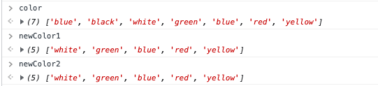

---

### 7-5. begin에 해당하는 요소부터 end의 앞까지의 요소를 추출하는 경우

```javascript
const color = ["blue", "black", "white", "green", "blue", "red", "yellow"];
const newColor = color.slice(2, 5);
```

- `begin`이 2이므로 세번째의 요소부터 추출을 시작한다.
- `end`가 5이므로 다섯번째 요소까지 추출한다.

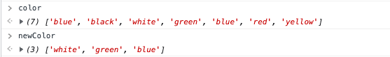

---

## 8. Array.concat()

- **특징**: 인자로 주어진 배열이나 값들을 기존 배열에 합쳐서 새 배열을 반환, 원본 배열을 변경하지 않음
- **반환 값**: 추가된 새로운 배열
- **구문**

  ```javascript
  array.concat([value1[, value2[, ...[, valueN]]]])
  ```

예시를 통해 `Array.slice()`메서드의 사용법을 알아보자.

---

### 8-1. 배열 두 개 이어붙이기

```javascript
const color1 = ["blue", "black", "white"];
const color2 = ["green", "blue", "red"];
const newColor = color1.concat(color2);
```

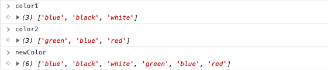

---

### 8-2. 배열 세 개 이어붙이기

```javascript
const num1 = [1, 2];
const num2 = [3, 4];
const num3 = [5, 6];
const newNum = num1.concat(num2, num3);
```

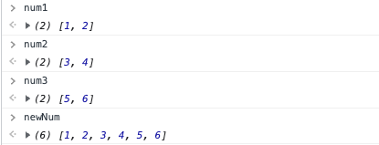

---

### 8-3. 배열에 값 이어붙이기

```javascript
const color1 = ["blue", "black"];
const color2 = ["green", "blue"];
const newColor = color1.concat("gray", color2, "yellow");
```

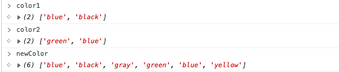

---

## 9. 정리하기

1.  배열에 새로운 요소를 추가하는 메서드

    - Array.push()
    - Array.unshift()
    - Array.splice()
    - Array.concat()

    ***

2.  배열에 요소를 제거하는 메서드

    - Array.pop()
    - Array.shift()
    - Array.splice()
    - Array.slice(): 해당 메서드는 원본 배열을 바꾸지 않아 엄밀히 말하면 배열에 요소를 제거하진 않지만 제거된 요소를 제외한 나머지 요소를 가지는 배열을 반환하기 때문에 해당 범주에 넣었다.

    ***

3.  원본 배열을 바꾸는 메서드

    - Array.push()
    - Array.pop()
    - Array.unshift()
    - Array.shift()
    - Array.splice()

    ***

4.  원본 배열을 바꾸지 않는 메서드
    - Array.slice()
    - Array.concat()

---

## 10. Conclusion

> 이번 챕터에서 정리한 많은 메서드 중 개인적으로 가장 많이 사용하고 있는 메서드는 `Array.push()`메서드이다. 그 외의 메서드는 필요할 때만 구글에 검색을 하여 사용하곤 했다. 하지만 항상 헷갈리던 메서드가 있었다. 바로 `Array.splice()`메서드와 `Array.slice()`메서드이다. 가장 큰 이유는 두 메서드의 이름이 비슷해서지 않을까 싶다. 이번 기회에 해당 메서드의 쓰임에 대해 정확히 이해하고 필요한 상황에 맞게 메서드를 적절히 사용하자.\
> 나름 정리한 내용은 아래와 같다.
>
> > `Array.splice()`메서드: 요소를 제거하거나 제거된 자리에 다른 요소를 추가\
> > `Array.slice()`메서드: 원본배열을 수정하기 않으면서 원하는 요소를 추출

---

## 참고

[MDN - Array.prototype.push()](https://developer.mozilla.org/ko/docs/Web/JavaScript/Reference/Global_Objects/Array/push)\
[MDN - Array.prototype.pop()](https://developer.mozilla.org/ko/docs/Web/JavaScript/Reference/Global_Objects/Array/pop)\
[MDN - Array.prototype.unshift()](https://developer.mozilla.org/ko/docs/Web/JavaScript/Reference/Global_Objects/Array/unshift)\
[MDN - Array.prototype.shift()](https://developer.mozilla.org/ko/docs/Web/JavaScript/Reference/Global_Objects/Array/shift)\
[MDN - Array.prototype.splice()](https://developer.mozilla.org/ko/docs/Web/JavaScript/Reference/Global_Objects/Array/splice)\
[MDN - Array.prototype.slice()](https://developer.mozilla.org/ko/docs/Web/JavaScript/Reference/Global_Objects/Array/slice)\
[MDN - Array.prototype.concat()](https://developer.mozilla.org/ko/docs/Web/JavaScript/Reference/Global_Objects/Array/concat)

---

[👆](#배열의-요소-추가-삭제push-pop-unshift-splice-slice)

📅 2022-08-14
