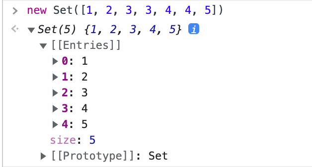
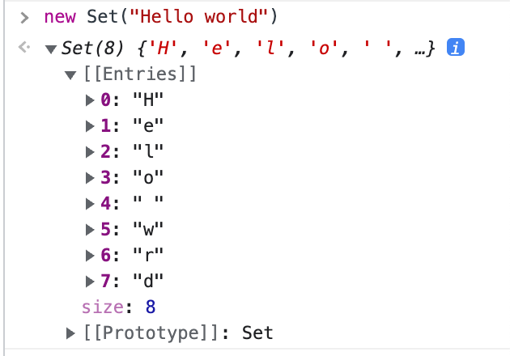

# Set

## 1. 개요

ES6의 `Set`는 `Map`와 비슷하지만 `Set`는 `Map`와는 다르게 `key`값만이 존재한다. 앞으로 유용하게 사용할 수 있는 `Set`에 대해 살펴보자.

***

## 2. Set 객체의 특징

`Set` 객체는 자료형에 관계 없이 원시 값과 객체 참조 모두 유일한 값을 저장할 수 있는 자바스크립트 표준 내장 객체이다. 삽입 순서대로 요소를 순회(`for...in`, `for...of`보다 `for`문을 선호)할 수 있으며 하나의 `Set`내 값은 한 번만 나타낼 수 있다. 즉, 어떤 값은 그 `Set` 콜렉션 내에서 유일하다.

`Set`의 특징을 정리하자면 아래와 같다.

* 동일한 값을 중복하여 포함할 수 없다.
* 요소 순서에 의미가 없다.
* 인덱스로 요소에 접근할 수 없다.

이러한 `Set`은 수학적 집합을 구현하기 위한 자료구조이다. 그래서 `Set`를 통해 교집합, 합집합, 차집합, 여집합 등을 구현할 수 있다.

***

## 3. Set 객체의 생성

```javascript
const set = new Set();
```


기본 생성 방법은 위와 같다. `Set` 객체는 `set 생성자 함수`로 생성하며 인수를 전달하지 않으면 빈 `Set` 객체가 생성된다.

인수로는 **이터러블**를 받을 수 있다.

*   배열을 인수로 받은 경우

    ```javascript
    const set = new Set([1, 2, 3, 3, 4, 4, 5]);
    ```

    
*   문자열을 인수로 받은 경우

    ```javascript
    const set = new Set("Hello world");
    ```

    

생성된 `Set` 객체를 보면 중복된 값이 없는 것을 볼 수 있다. 이렇게 `Set` 객체를 사용하여 배열 및 문자열 등에서 중복된 요소를 제거할 수 있다. 이를 이용하여 중복된 요소를 제거한 배열을 만들 수 있다.

```javascript
const arr = [...new Set([1, 2, 3, 3, 4, 4, 5])];
```


***

## 4. Set의 주요 메서드와 프로퍼티

### 4-1. Set.add(value)

값을 추가하고 `Set` 자신을 반환한다. 만약 동일한 값을 넣고 `set.add(value)`를 아무리 많이 호출한다해도 `Set` 객체에는 추가가 되지 않는다. `Set.add()`메서드는 자기 자신을 반환하기 때문에 체이닝을 할 수 있다.

```javascript
const set = new Set();
set.add(1).add(2).add(2).add(3).add(4).add(4);
```


`Set`객체는 객체나 배열, 원시값 같이 자바스크립트의 모든 값을 요소로 저장할 수 있다.

```javascript
const js = { name: "js" };
const react = { name: "react" };
const next = { name: "next" };

const set = new Set();
set.add(js).add(react).add(next).add(react).add(next).add({ name: "html" });
```


중복된 요소가 없는 것을 확인할 수 있다.

***

### 4-2. Set.delete(value)

값을 제거한다. 호출 시점에 `Set` 내에 값이 있어서 제거에 성공하면 `true`, 아니면 `false`를 반환한다. 이때 `Set` 객체에는 인덱스가 없기 때문에 삭제하려는 요소값을 인수로 전달해야한다. 그리고 `Set.delete()`메서드는 불리언값을 리턴하기 때문에 체이닝을 할 수 없다.

```javascript
const js = { name: "js" };
const react = { name: "react" };
const next = { name: "next" };

const set = new Set();
set.add(1).add(2).add(3).add(4).add(js).add(react).add(next);

set.delete(js);
set.delete(3);
```


***

### 4-3. Set.has(value)

`Set` 객체 내에 값이 존재하면 `true`, 아니면 `false`를 반환한다.

```javascript
const set = new Set("Hello World");

set.has("H");
set.has(" ");
set.has("w");
```


***

### 4-4. Set.clear()

`Set` 객체의 모든 요소를 일괄삭제한다. 항상 `undefined`를 반환한다.

```javascript
const set = new Set([1, 2, 3, 4]);
set.clear();
```


***

### 4-5. Set.size

`Set` 객체에 몇 개의 요소가 있는지 확인한다. `Set.size` 프로퍼티에 숫자를 할당하여 `Set` 객체의 크기를 정할 수 없다. 해당 프로퍼티는 `setter`함수는 없고 `getter`함수만 존재하기 때문이다.

```javascript
const arraySet = new Set([1, 2, 3, 4]);
const stringSet = new Set("Hello World");

arraySet.size;
stringSet.size;
```


***

## 5. Set 객체 요소의 순회

`Set` 객체 요소를 순회하기 위해서는 `Set.forEach`메서드를 사용한다. 또한 `for`문, `for...or`문으로 순회할 수도 있다. 추가적으로 `Set` 객체는 이터러블이기 때문에 스프레드문법과, 배열 디스트럭처링의 대상이 될 수 있다.

`Set.forEach`의 첫 번째와 두 번째 인수는 **현재 순회중인 요소값**이다. 이런 이유는 `Set` 객체에는 인덱스가 없기 때문에 `Array.forEach`메서드와 인터페이스를 통일하기 위함니다. 세 번째 인수로는 현재 순회중인 `Set` 객체 자체이다.

```javascript
const set = new Set([1, 2, 3, 4]);
set.forEach((v, _, set) => {
  console.log(v, set);
});
```


***

## 6. Set 객체를 통한 집합 연산

`Set` 객체를 통해 교집합, 차집합, 합집합, 부분 집합과 상위 집합을 구현할 수 있다.

***

### 6-1. 교집합

```javascript
const setA = new Set([1, 2, 3, 4, 5]);
const setB = new Set([1, 4, 5, 6, 7]);

new Set([...setA].filter((a) => setB.has(a)));
```


***

### 6-2. 차집합

```javascript
const setA = new Set([1, 2, 3, 4, 5]);
const setB = new Set([1, 4, 5, 6, 7]);

new Set([...setA].filter((a) => !setB.has(a)));
new Set([...setB].filter((b) => !setA.has(b)));
```


***

### 6-3. 합집합

```javascript
const setA = new Set([1, 2, 3, 4, 5]);
const setB = new Set([1, 4, 5, 6, 7]);

new Set([...setA, ...setB]);
```


***

### 6-4. 부분 집합과 상위 집합

```javascript
const setA = new Set([1, 2, 3, 4, 5]);
const setB = new Set([1, 2, 3]);

const isSuperSet = (setA, setB) => {
  return [...setB].every((b) => setA.has(b));
};
```


`isSuperSet()`함수는 첫 번째 파라미터가 두 번째 파라미터에 상위집합인지 알려주는 함수이다. 해당 값이 `true`라면 첫 번째 파라미터는 상위집합 두 번째 파라미터는 부분 집합이 된다.

***

## 7. Conclusion

> 중학교, 고등학교 때 배웠던 합집합, 교집합 등등을 다시 다루게 되니 신선했다. 또한 이를 코드로 구현할 수 있다는 것이 놀라웠다. 지금까지 다양한 집합을 다룰 기회가 없었지만 코딩 테이트를 공부하다보면 많이 사용하게 될 듯 하다. 맵(Map)과 셋(Set) 옛날에는 그저 어려운 개념이었는데 지금은 어느정도 익숙해진 듯 하다.

***

## 참고

[맵과 셋](https://ko.javascript.info/map-set)\
[JavaScript - Set](https://velog.io/@vvee1253/JavaScript-Set)\
[\[JavaScript\] 37. Set 과 Map](https://velog.io/@dolarge/Java-Script-Set-%EA%B3%BC-Map)\
[Set-mdn](https://developer.mozilla.org/ko/docs/Web/JavaScript/Reference/Global\_Objects/Set)\
[Map 과 Set](https://hyeooona825.tistory.com/25)

***

[👆](Set.md#set)

📅 2022-08-12
