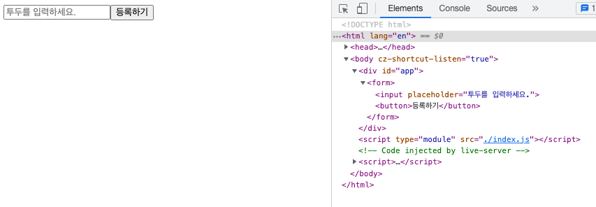
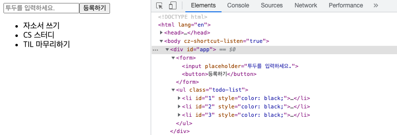

# 투두 등록하기

## 1. 투두 등록 폼 만들기

```javascript
// index.js
const $app = document.getElementById("app");

const $form = document.createElement("form");
const $input = document.createElement("input");
const $button = document.createElement("button");
$input.placeholder = "투두를 입력하세요.";
$button.textContent = "등록하기";

$form.appendChild($input);
$form.appendChild($button);
$app.appendChild($form);
```



`createElement()` 메서드와 `appendChild()` 메서드를 사용하여 요소 노드를 만들고 DOM에 추가한다.

***

## 2. 폼 전송 시 input 초기화

```javascript
function App() {
  const addTodo = () => {
    const todo = $input.value;
    $input.value = "";
  };
  $form.addEventListener("submit", (e) => {
    e.preventDefault();
    addTodo();
  });
}

new App();
```

`$form` 요소 노드에 `submit` 이벤트를 등록한다. `preventDefault()` 메서드를 사용하여 DOM 요소의 기본 동작을 중단하고 `addTodo()` 함수를 실행한다. 이곳에서는 `$input` 요소 노드의 `value`를 `todo` 변수에 할당하고 `value`를 빈 문자열로 바꾼다.

***

## 3. 투두 데이터 업데이트

```javascript
function App() {
  let todos = [];

  const addTodo = () => {
    const todo = $input.value;
    todos.push({ todo, done: false });
    $input.value = "";
  };
  $form.addEventListener("submit", (e) => {
    e.preventDefault();
    addTodo();
  });
}

new App();
```

빈 배열의 `todos`를 선언한다. `todos`는 앞으로 관리할 투두 리스트가 된다. `addTodo` 함수에서 `push()` 메서드를 사용하여 `todo`와 `done`(기본값으로 `false`)를 담은 객체를 추가한다.

***

## 4. 투두 데이터 업데이트에 따른 View(DOM) 업데이트

```javascript
function App() {
  let todos = [];

  const addTodoView = (todo) => {
    if (!document.querySelector(".todo-list")) {
      const $ul = document.createElement("ul");
      $ul.classList.add("todo-list");
      $app.appendChild($ul);
    }
    const $todoList = document.querySelector(".todo-list");
    const $li = document.createElement("li");
    $li.id = todos.length;
    $li.style.color = "black";
    $li.textContent = todo;
    $todoList.appendChild($li);
  };

  const addTodo = () => {
    const todo = $input.value;
    todos.push({ todo, done: false });
    $input.value = "";
    addTodoView(todo);
  };
  $form.addEventListener("submit", (e) => {
    e.preventDefault();
    addTodo();
  });
}

new App();
```

`addTodoView()` 함수를 통해 View(DOM)를 업데이트한다. 해당 함수는 `addTodo()` 함수가 실행된 후 호출되어 실행된다.



***

## 5. MVC 패턴으로 분리 및 리팩토링

티렉토리 구조

```bash
├── src
│   ├── controllers
│   │   ├── controller.js
│   ├── models
│   │   ├── todos.js
│   ├── utils
│   │   └── dom.js
│   ├── views
│   │   ├── view.js
├── index.html
└── index.js
```

### 5-1. Utils Function

파일 위치: src/utils/dom.js

DOM과 관련된 변수, 함수를 관리하기 위한 파일이다. 해당 파일엔 `<div id="app"></div>` 노드를 가져와 할당한 변수 `$app`와 요소 노드를 취득하기 위한 함수 `$`가 있다.

```javascript
export const $app = document.getElementById("app");
export const $ = (id) => document.getElementById(id);
```

***

### 5-2. View

파일 위치: src/views/view.js

```javascript
import { $, $app } from "../utils/dom.js";

export default class View {
  constructor() {
    this.render();
  }
  render() {
    const template = `
        <form id="todo-form">
            <input 
                placeholder="투두를 입력하세요." 
                id="todo-input"
                autocomplete="off"
            />
            <button>등록하기</button>
        </form>
        <ul id="todo-list">
        </ul>
    `;
    $app.innerHTML = template;
  }

  static todoRender = (todos) => {
    const template = todos
      .map(({ todo, done }, index) => {
        return `<li id=${index}>
            <span>${todo}</span>
            <button id="todo-done-btn">${done ? "완료함" : "완료"}</button>
            <button id="todo-delete-btn">삭제</button>
        </li>
        `;
      })
      .join("");
    $("todo-list").innerHTML = template;
  };
}
```

`View`는 크게 두 가지의 역할을 한다. 처음 생성될 때 `render()` 함수를 실행하여 뼈대가 되는 `html`를 그린다. 이때 todo를 등록할 수 있는 `form` 태그와 등록된 todo가 그려질 `ul` 태그가 생성된다.

`todoRender()` 함수는 `static`으로 사용한다. 해당 함수를 호출하면 생성된 모든 투두를 `todos`로 받아 목록을 그린 후 `innerHTML` 프로퍼티를 사용하여 `todo-list`의 자식 노드로 생성한다.

***

### 5-3. Model

파일 위치: src/models/todos.js

```javascript
import { $ } from "../utils/dom.js";

export default class Todos {
  constructor() {
    this.todos = [];
  }

  addTodo = () => {
    const todo = $("todo-input").value;
    $("todo-input").value = "";
    this.todos.push({ todo, done: false });
    return this.todos;
  };
}
```

`todos`를 위한 `Model`이다. `todos`의 관리를 위해 `constructor`에서 `this.todos`를 배열로 선언한다.

`addTodo()` 함수는 현재의 `input`의 값을 바탕으로 새로운 `todo`를 추가할 때 사용된다. 반환하는 값은 추가된 `todo`가 포함된 `todos`이다.

***

### 5-4. Controller

파일 위치: src/controllers/controller.js

```javascript
import Todos from "../models/todos.js";
import { $ } from "../utils/dom.js";
import View from "../views/view.js";

export default class Controller {
  constructor() {
    this.todosModel = new Todos();
    this.view = new View();
    this.eventHandler();
  }

  addTodo = () => {
    this.todosModel.addTodo();
    View.todoRender(this.todosModel.todos);
  };

  eventHandler = () => {
    $("todo-form").addEventListener("submit", (e) => {
      e.preventDefault();
      this.addTodo();
    });
  };
}
```

`Controller`에서는 `View`와 `Model`를 연결해주고 이벤트 핸들러를 등록 및 실행한다.

현재 등록된 이밴트 핸들러는 `todo-form` 아이디를 가진 `form`이 `submit`되었을 때 `todo`를 추가하는 것 뿐이다. 해당 이벤트가 실행되면 `addTodo()` 함수가 호출되어 `Model`의 `todos` 업데이트하고 업데이트 된 `todos`를 바탕으로 `View.todoRender()` 함수가 실행된다.

***

## 6. Conclusion

> 지금까지 바닐라 자바스크립트를 사용하여 웹을 만들 땐 `MVC`로 나누지 않고 한 곳에 모아 구현을 해 왔다. 비슷한 기능의 함수가 따로 파일을 만들어 `import`하는 방식으로 나누었을 뿐이다. 이번 기회에 `MVC` 패턴으로 나누어 봤는데, 일단 제대로 나누었는지 부터 의문이 든다. 하지만 나름 고민하면서 어떻게 하면 효과적으로 나눌 수 있는지 고민을 하였다. 앞으로 계속 공부를 하면서 `MVC` 패턴을 지키며 코드 구현을 해보도록 하자.

***

📅 2022-10-20
