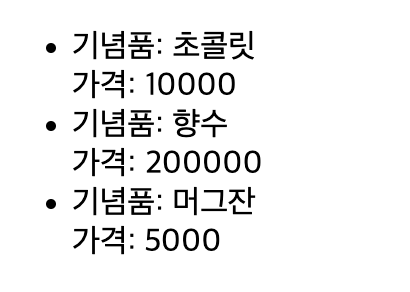
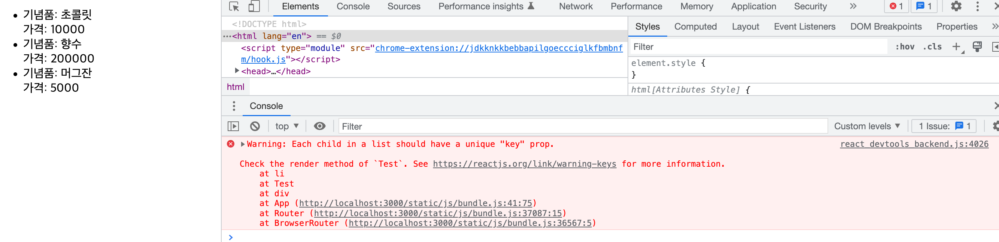

# 배열 렌더링

## 👉 바로가기

- [1. 개요](#1-개요)
- [2. 일일히 하나씩!](#2-일일히-하나씩)
- [3. Array.map()을 사용한 배열 렌더링](#3-arraymap을-사용한-배열-렌더링)
- [4. key props](#4-key-props)

---

## 1. 개요

리액트에서 배열에 담긴 정보를 렌더링하기 위해선 어떻게 해야하는지 그리고 배열의 정보가 업데이트가 될 때 렌더링을 최적화하는 방법에 대해 알아보자.

---

## 2. 일일히 하나씩!

아래와 같이 객체를 원소로 가진 배열을 일일히 하나씩 가져와서 렌더링을 해보자.

```js
const giftItems = [
  {
    name: "초콜릿",
    price: 10000,
  },
  {
    name: "향수",
    price: 200000,
  },
  {
    name: "머그잔",
    price: 5000,
  },
];
```

```js
import React, { useState } from "react";

const Test = () => {
  const giftItems = [
    {
      name: "초콜릿",
      price: 10000,
    },
    {
      name: "향수",
      price: 200000,
    },
    {
      name: "머그잔",
      price: 5000,
    },
  ];

  return (
    <ul>
      <li>
        <div>기념품: {giftItems[0].name}</div>
        <div>가격: {giftItems[0].price}</div>
      </li>
      <li>
        <div>기념품: {giftItems[1].name}</div>
        <div>가격: {giftItems[1].price}</div>
      </li>
      <li>
        <div>기념품: {giftItems[2].name}</div>
        <div>가격: {giftItems[2].price}</div>
      </li>
    </ul>
  );
};

export default Test;
```



`giftItem`배열의 원소를 하나씩 일일히 가져와서 렌더링을 하고 있다. 물론 이것도 배열을 렌더링하는 하나의 방법이다. 하지만 `giftItem`의 원소가 엄청 많다면 어떨까? 일일히 하나씩 작성을 하는 것이 가능할까? 가능하겠지만 시간은 많이 소요가 될 것이다. 즉, 비효율적인 방법이다.

---

## 3. Array.map()을 사용한 배열 렌더링

`Array.map()`메서드는 배열의 원소를 가지고 반복문 돌면서 새로운 값을 리턴해준다. 해당 메서드에 대한 자세한 내용은 자바스크립트 파트에서 다룬다.

`Array.map()`메서드를 사용하여 배열 렌더링을 해보자. 위의 긴 코드를 아래와 같이 수정하자.

```js
import React, { useState } from "react";

const Test = () => {
  const giftItems = [
    {
      name: "초콜릿",
      price: 10000,
    },
    {
      name: "향수",
      price: 200000,
    },
    {
      name: "머그잔",
      price: 5000,
    },
  ];

  return (
    <ul>
      {giftItems.map((gift) => (
        <li>
          <div>기념품: {gift.name}</div>
          <div>가격: {gift.price}</div>
        </li>
      ))}
    </ul>
  );
};

export default Test;
```



12줄이었던 코드가 6줄로 줄어들었다. 만약 `giftItems`배열에 더 많은 원소가 있었다면 줄어든 코드의 양은 훨씬 많았을 것이다.

하지만 콘솔에 `Warning`메시지가 보인다. 리스트의 각각의 자식에는 `key` props가 필요하다는 것이다. 해당 경고 메시지가 바로 렌더링 최적화와 관련이 있다.

---

## 4. key props

`Array.map()`메서드를 사용했던 부분을 아래와 같이 수정하자.

```js
{
  giftItems.map((gift, index) => (
    <li key={index}>
      <div>기념품: {gift.name}</div>
      <div>가격: {gift.price}</div>
    </li>
  ));
}
```

`li`태그에 `key props`를 설정하였다. 이렇게 된다면 리액트는 더 이상 경고 메시지를 보내지 않는다.

그렇다면 `key props`가 왜 필요한 것일까? 리액트는 렌더링이 될 때 virtual DOM을 만들고 수정사항이 생기면 이를 비교하여 수정된 부분만 렌더링을 한다. 즉, 리액트는 DOM 자체를 전부 렌더링하지 않아 빠른 렌더링을 할 수 있다.

만약 `key props`가 설정되어 있지 않다면 `Array.map()`메서드로 만들어진 virtual DOM은 배열에 새로운 원소가 추가될 때 모두 수정 되었다고 생각을 한다. 그래서 처음부터 다시 랜더링을 하게 된다. 하지만 `key props`가 있다면 새롭게 추가된 원소에 대해서만 렌더링을 하게 된다.

여기서 `key props`의 값은 고유의 값이여야 한다.

더 자세한 내용은 [VirtualDOM](./VirtualDOM.md) 챕터의 `6-3. Recursing On Children`과 `6-4. key`를 참고하면 된다.

---

## 5. Conclusion

> `Array.map()`메서드를 사용하여 배열을 렌더링하는 방법은 리액트 프로젝트에서 정말로 많이 사용된다. 그래서 그만큼 많이 다루어 봤기 때문에 기억을 되살리며 나름 정리를 해보았다. 하지만 아직 렌더링, Virtual DOM에 대한 개념은 미약하니 혹시 잘못된 정보가 있으면 github issus로 꼭 알려주었으면 좋겠다:)

---

[👆](#배열-렌더링)
