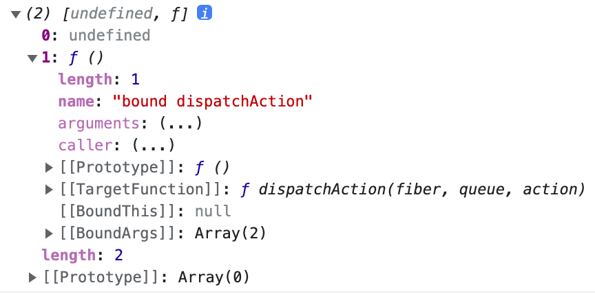

# 클래스형 Component vs 함수형 Component

## 1. 개요

리액트에서 컴포넌트는 클래스형 컴포넌트와 함수형 컴포넌트로 나눌 수 있다. 리액트의 초기 버전에서는 클래스 컴포넌트를 주로 사용했다. 하지만 클래스형 컴포넌트가 사용하기 불편하다는 의견이 많이 나오고 2019년 v16.8 부터 함수형 컴포넌트에 리액트 훅(Hook)를 지원해 주면서 공식 문서에서도 함수형 컴포넌트와 훅을 함께 사용할 것을 권장하고 있다.

함수형 컴포넌트를 주로 사용하다고 해서 클래스형 컴포넌트를 모르고 넘어가서는 안된다. 리액트의 기초를 탄탄하게 다지려면 클래스 컴포넌트와 컴포넌트의 생명주기에 대해 잘 이애하고 있어야한다.

리액트에서의 컴포넌트란 무엇이고 몇 가지의 특징을 비교하여 클래스형 컴포넌트와 함수형 컴포넌트를 비교해보자.

---

## 2. Component란?

리액트에는 **컴포넌트 기반**의 구조라는 중요한 특징이 있다. 리액트에서는 모든 페이지가 컴포넌트로 구성되어 있고, 하나의 컴포넌트는 또 다른 여러 개의 컴포넌트의 조합으로 구성할 수 있다.

**리액트 컴포넌트가 해주는 역할은 어떠한 속성들을 입력으로 받아서 그에 맞는 리액트 엘리먼트를 생성하여 리턴해주는 것**이다.

> 리액트 앨리먼트: 리액트 앱을 구성하는 가장 작은 빌딩 블록들, 리액트 앨리먼트는 자바스크립트 객체 형태로 존재한다.
>
> ```javascript
> {
>   type: "button";
>   props: {
>     classNmae: "bg-green";
>     children: {
>       type: "b";
>       props: {
>           children: "Hello, element!"
>       };
>     }
>   }
> }
> ```
>
> 아래는 랜더링 후
>
> ```html
> <button4 class="bg-green">
>   <b>Hello, element!</b>
> </button4>
> ```

아래는 리액트 컴포넌트의 특징이다.

- 리액트로 만들어진 앱을 이루는 최소한의 단위
- 기존의 웹 프레임워크는 MVC방식으로 분리하여 관리한다. 때문에 각 요소의 의존성이 높아 재활용이 어렵다는 단점이 있었다. 반면 컴포넌트는 MVC의 뷰를 독립적으로 구성하여 재사용을 할 수 있고 이를 통해 새로운 컴포넌트를 쉽게 만들 수 있다.
- 컴포넌트는 데이터(props)를 입력받아 View(state) 상태에 따라 DOM Node를 출력하는 함수앋.
- 컴포넌트 이름은 항상 대문자로 시작하도록 한다.(리액트는 소문자로 시작하는 컴포넌트를 DOM태그로 취급하기 때문이다.)
- UI를 재사용 가능한 개별적인 여러 조각으로 나누고, 각 조각을 개별적으로 나누어 코딩한다.
- "props"라고 하는 임의의 입력을 받은 후, 화면에 어떻게 표시되는지를 기술하는 React 앨리먼트를 반환한다.

> 아주 쉬운 예시\
> 컴포넌트: 붕어빵 기계 틀\
> props: 팥, 고구마, 슈크림 등\
> 리액트 앨리먼트: 팥 붕어빵, 고구마 붕어빵, 슈크림 붕어빵 등

---

## 3. 일반적 차이

- 클래스형 컴포넌트

  - state, lifeCycle 관련 기능사용이 가능하다.
  - 메모리 자원을 함수형 컴포넌트보다 조금 더 사용한다.
  - 임의 메서드를 정의할 수 있다.

  ***

- 함수형 컴포넌트
  - state, lifeCycle 관련 기능사용이 불가능하지만 Hook을 통해 해결된다.
  - 메모리 자원을 함수형 컴포넌트보다 덜 사용한다.
  - 컴포넌트 선언이 편하다.

---

## 4. 선언 방식에서의 차이

### 4-1. 클래스형 컴포넌트의 선언 방식

```jsx
import React, { Component } from "react";

class App extends Component {
  render() {
    const name = "react";
    return <div>Hello, {name}!</div>;
  }
}

export default App;
```

- class 키워드가 필요하다.
- Component을 상속 받아야한다.
- render() 메소드가 반드시 있어야한다.

---

### 4-2. 함수형 컴포넌트의 선언 방식

```jsx
import React from "react";

const App = () => {
  const name = "react";
  return <div>Hello, {name}!</div>;
};

export default App;
```

---

## 5. state 사용에서의 차이

state에 대한 자세한 내용은 따로 다룬다. 여기서는 단순히 컴포넌트 내부에서 바뀔 수 있는 값으로만 알고 넘어간다.

### 5-1. 클래스형 컴포넌트의 state

- constructor 내부에서 this.state를 통해 초기 값 설정 가능하다.
- constructor없이 바로 state 초기값을 설정할 수 있다.
- 클래스형 컴포넌트의 state는 객체 형식이다.
- this.setState 함수로 state 값을 변경할 수 있다.

```jsx
import React, { Component } from "react";

class Test extends Component {
  // constructor 내부에서 this.state를 통해 초기 값 설정 가능하다.
  constructor(props) {
    super(props);

    this.state = {
      name: "HD",
      age: 29,
    };
  }

  // constructor없이 바로 state 초기값을 설정할 수 있다.
  state = {
    gender: "male",
    region: "korea",
  };

  render() {
    console.log(this.state); // {name: "HD", age: 29}

    const onClick = () => {
      this.setState({ name: "KH" });
    };
    return (
      <div>
        <p>Hello, I'm {this.state.name}</p>
      </div>
    );
  }
}

export default Test;
```

> 의문점: constructor 내부에서 선언한 state값들은 콘솔로 찍히는데 왜 그 아래에서 선언한 state값들을 콘솔로 찍히지 않을까...?

---

### 5-2. 함수형 컴포넌트의 state

- 함수형 컴포넌트에서는 `useState` 함수로 state를 사용한다.
- useState 함수를 호출하면 첫 번째 원소는 현재 상태, 두 번째 원소는 상태를 바꾸어 주는 함수이다. 

```jsx
import React, { useState, useEffect } from "react";

const Test = () => {
  // const [값이 담긴 변수, 값을 변경하는 함수] = useState(초기값)
  // 기본형: const [state, setState] = useState();
  // useState에 대해서는 Hook에서 자세히 다룬다.
  const [name, setName] = useState("HD");

  const onClick = () => {
    if (name === "HD") setName("KH");
    else setName("HD");
  };

  return (
    <div>
      <p>Hello, {name}!</p>
      <button onClick={onClick}>click me!</button>
    </div>
  );
};

export default Test;
```

---

## 6. props 사용에서의 차이

리액트에서의 props이란?

- 컴포넌트의 속성을 설정 할 때 사용하는 요소
- 읽기 전용
- 컴포넌트 자체 props를 수정해서는 안된다.
- 모든 React 컴포넌트는 자신의 props를 다룰 때 반드시 순수 함수처럼 동작해야한다.
- 수정 되는 것은 state이다.

> props에 대한 자세한 내용는 다른 챕터에서 다룬다.

---

### 6-1. 클래스형 컴포넌트의 props

this.props로 통해 값을 불러올 수 있다.

```jsx
import React, { Component } from "react";

class Test extends Component {
  render() {
    // this.props로 통해 값을 불러올 수 있다.
    const { name, age, region, gender } = thie.props;
    return (
      <div>
        안녕하세요? 저는 {name}입니다. 나이는 {age}이고 {region}에서 왔습니다.
        그리고 성별은 {gender}입니다.
      </div>
    );
  }
}

export default Test;
```

---

### 6-2. 함수형 컴포넌트의 props

함수평 컴포넌트에서의 props를 호출 방법은 아래와 같다.

```jsx
import React from "react";

const Test = (props) => {
  const { name, age, region, gender } = props;
  return (
    <div>
      안녕하세요? 저는 {name}입니다. 나이는 {age}이고 {region}에서 왔습니다.
      그리고 성별은 {gender}입니다.
    </div>
  );
};

export default Test;
```

또한 props를 불러올 필요 없이 바로 호출 할 수 있다.

```jsx
import React from "react";

// props를 불러올 필요 없이 바로 호출 할 수 있다.
const Test = ({ name, age, region, gender }) => {
  return (
    <div>
      안녕하세요? 저는 {name}입니다. 나이는 {age}이고 {region}에서 왔습니다.
      그리고 성별은 {gender}입니다.
    </div>
  );
};

export default Test;
```

---

## 7. Lifecycle

초기 리액트는 클래스형 컴포넌트에서만 라이프사이클과 state 관리가 가능했다.

이를 통해 클래스형 컴포넌트를 이용해 다양한 컴포넌트를 만들 수 있었으나 코드의 복잡한 단점이 있었다.

이후 리액트 16.8버전에서는 이러한 클래스형 컴포넌트의 장점을 그대로 두고 단점을 보안했다. 그로 인해 함수형 컴포넌트에서도 Hook를 통해 라이프사이클과 state관리가 가능하게 되었다.

> 리액트의 Lifecycle은 다른 챕터에서 자세히 다룬다.

---

## 8. 이벤트 핸들링에서의 차이

리액트에서의 이밴트 핸들링에 대한 자세한 내용은 다른 챕터에서 다루고 여기에서는 두 컴포넌트에서의 차이점을 간단히 다룬다.

### 8-1. 클래스형 컴포넌트에서의 이벤트 핸들링

- 함수 선언시 arrow function으로 바로 선언이 가능하다.
- 요소에서 적용하기 위해서는 this를 붙여야한다.

```jsx
import React, { Component } from "react";

class Test extends Component {
  // 함수 선언시 arrow function으로 바로 선언이 가능하다.
  onClickBtn = () => {
    window.alert("Good!!");
  };
  render() {
    return (
      <div>
        {/* 요소에서 적용하기 위해서는 this를 붙여야한다. */}
        <button onClick={this.onClickBtn}>Click me!</button>
      </div>
    );
  }
}

export default Test;
```

> 랜던 함수 안에서는 함수형 컴포넌트에서 사용하는 방법으로 가능한데.. 이게 맞는건가 궁금하다.

---

### 8-2. 함수형 컴포넌트에서의 이벤트 핸들링

- const 키워드 + 함수 형태로 선언 해야한다.
- 요소에서 적용하기 위해서는 this가 필요없다.

```jsx
import React from "react";

const Test = () => {
  // const 키워드 + 함수 형태로 선언 해야한다.
  const onClickBtn = () => {
    window.alert("Good!!");
  };
  return (
    <div>
      {/* 요소에서 적용하기 위해서는 this가 필요없다. */}
      <button onClick={onClickBtn}>Click me!</button>
    </div>
  );
};

export default Test;
```

## 9. Conclusion

> 현재는 대부분 함수형 컴포넌트를 사용하여 리액트 App를 개발하고 있다. 그래서 클래스형 컴포넌트에 대해서는 공부를 제대로 한 적이 없다. 물론 이번 정리도 두 컴포넌트의 차이를 정리한 것일 뿐 클래스형 컴포넌트에 대해 자세하게 공부하지는 않았다. 한 눈에 봤을 때도 함수형 컴포넌트가 훨씬 가독성이 좋았고 복잡하지 않는 구조여서 더욱 클래스형 컴포넌트를 소홀히 여겼다. 물론 그렇다고 앞으로 클래스형 컴포넌트를 더욱 자세하게 배우고 클래스형 컴포넌트를 사용해 리액트 App를 개발하진 않을것이다. 오늘 공부한 내용처럼 간단히 차이점만 알고 넘어가도록 하자. 다만 누군가가 해당 질문을 했을 때 자신있게 대답하고 내가 대답을 못하는 질문이 생기면 바로 정리해 TIL에 올리자.

---

## 참고

도서 - 소플의 처음 만난 리액트\
[\[React\] 클래스형 컴포넌트 vs 함수형 컴포넌트](https://devowen.com/298)\
[\[React\] 4. React 컴포넌트(1) - 컴포넌트란?](https://goddaehee.tistory.com/299)\
[클래스형과 함수형 차이](https://velog.io/@sdc337dc/0.%ED%81%B4%EB%9E%98%EC%8A%A4%ED%98%95-%EC%BB%B4%ED%8F%AC%EB%84%8C%ED%8A%B8)\
[WIL 4 라이프 사이클 (클래스형 vs 함수형), react hooks api](https://kongom2.tistory.com/m/20)

---

📅 2022-07-22
