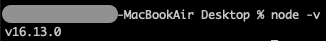
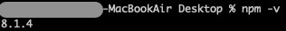
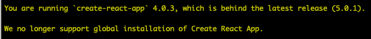

# Create React App

## 1. 개요

React 프로젝트를 쉽고 빠르게 만들 수 있도록 도와주는 Create React App에 대해 알아보자.

---

## 2. 준비사항

create react app를 사용하기 위해서는 아래와 같은 준비사항이 필요하다.

1. 14.0.0 혹은 상위 버전의 node

   > `$ node -v` 명령어를 통해 node의 버전을 알 수 있다.  
   > 

2. 5.6 혹은 상위 버전의 npm
   > `$ npm -v` 명령어를 통해 npm의 버전을 알 수 있다.  
   > 

아직 node를 설치하지 않았다면 아래의 링크를 통해 설치할 수 있다. npm은 node를 설치하면 함께 설치된다.  
[download nodejs](https://nodejs.org/ko/)

---

## 3. Create React App이란?

React로 개발하기 위해서는 웹팩(Webpack), 바벨(Babel)등 미리 배워야하고 설정해야 할 기술들이 있다. 이러한 관련 기술을 신경쓰지 않고 React App을 바로 개발할 수 있는 방법이 Create React App이라는 CLI(커캔드 라인 인터페이스)도구 이다. 해당 도구를 사용하면 골치 아픈 문제없이 아주 간단하게 React프로젝트를 구성할 수 있다.

---

## 4. create react app

터미널을 열고 아래와 같이 명령러를 입력하여 React 프로젝트를 생성한다.

> $ npx create-react-app my-app

---

## 5. create react app with typescript

React 프로젝트에 typescript를 포함시키고 싶다면 아래와 같은 명령어를 입력해야 한다.

> $ npx create-react-app my-app --template typescript

---

## 6. error

`create react app`명령어를 실행하다 보면 아래와 같은 에러가 나타나 React 프로젝트를 생성할 수 없는 경우가 있다.

- 해결방법
  - 첫번째 방법
    1.  $ npm uninstall -g create-react-app
    2.  $ npm add create-react-app
    3.  $ npx create-react-app myapp
  - 두번째 방법: $ npx create-react-app@latest myapp

---

## 참고

[Create React App: 손쉽게 프로젝트 만들기](https://www.daleseo.com/create-react-app/)  
[React 오류 해결 You are running `create-react-app` 4.0.2, which is behind the latest release (4.0.3).](https://velog.io/@milkyway/React-%EC%98%A4%EB%A5%98-%ED%95%B4%EA%B2%B0-You-are-running-create-react-app-4.0.2-which-is-behind-the-latest-release-4.0.3)  
[[에러해결] You are running `create-react-app` 4.0.3, which](https://sezzled.tistory.com/108)  
[Create React App Getting Started](https://create-react-app.dev/docs/getting-started)  
[새로운 React 앱 만들기](https://ko.reactjs.org/docs/create-a-new-react-app.html)

---

📅 2022-07-20
