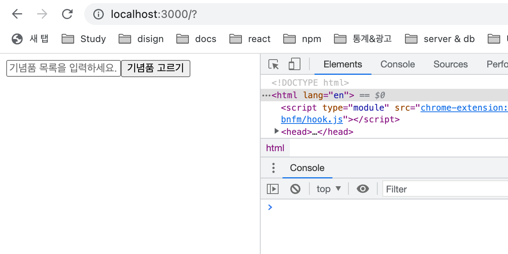
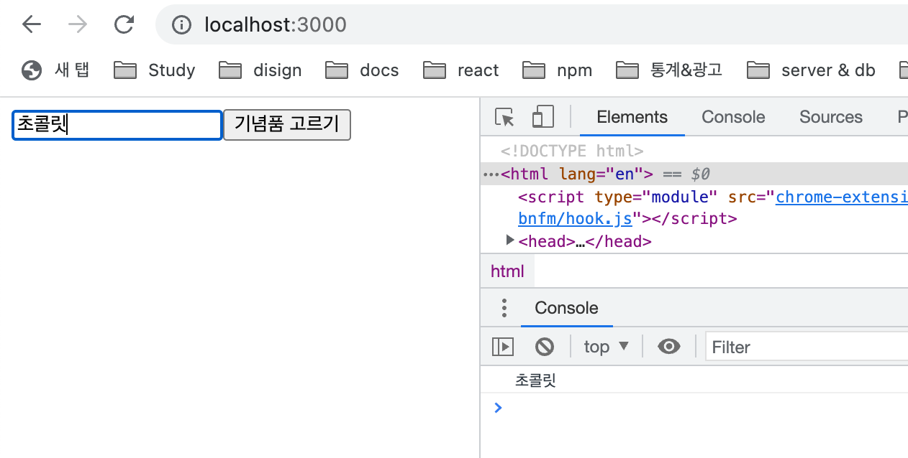
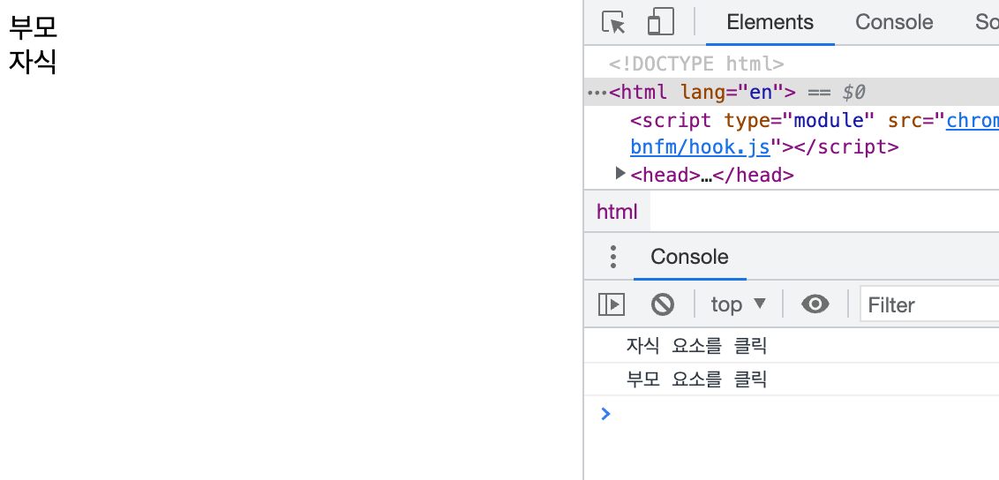
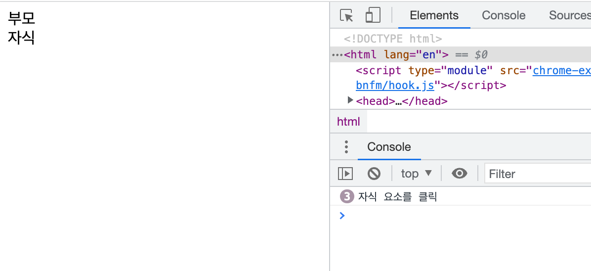

# 이벤트 처리

## 1. 개요

웹 개발을 할 때 여러 이밴트가 필요하다. 대표적인 예로 버튼을 클릭했을 때, 폼의 데이터가 전송될 때가 있다. 여기서 **클릭**, **전송**이 이밴트이다. 리액트에서는 이러한 이밴트를 어떻게 다루는지 살펴보자.

---

## 2. React 엘리먼트에 이벤트 등록하기

React 엘리먼트에서의 이벤트 등록은 html에서의 이벤트 등록과 두가지의 차이점이 있다.

- React의 이벤트는 소문자 대신 개멀 케이스(camelCase)를 사용한다.
- JSX를 사용하여 문자열이 아닌 함수로 이벤트 핸들러를 전달한다.

아래는 html에서 이벤트를 등록하는 방법이다.

```html
<button onclick="onclickBtn()">Button</button>
```

React에서는 아래와 같이 이벤트를 등록한다.

```jsx
return <button onClick={onClickBtn}>Button</button>;
```

React에서 이벤트를 등록할 때에는 DOM요소에만 이벤트 등록이 가능하다. `div`, `button`, `input`, `form` 등의 DOM요소에는 이벤트 등록이 가능하지만, 리액트의 컴포넌트에는 불가능하다.

---

## 3. JSX DOM 이벤트 프로퍼티

| 이벤트 명  | JSX DOM 이벤트 프로퍼티 | 이벤트 호출 시점                          |
| ---------- | ----------------------- | ----------------------------------------- |
| click      | onClick                 | 엘리먼트에 마우스나 키보드가 클릭 된 경우 |
| change     | onChange                | 엘리먼트의 내용이 변경된 경우             |
| submit     | onSubmit                | 폼의 데이터가 전송될 때                   |
| keydown    | onKeyDown               | 키보드 버튼이 눌린 경우                   |
| keyup      | onKeyUP                 | 키보드 버튼이 눌렀다 뗀 경우              |
| keypress   | onKeyPress              | 키보드 버튼이 눌려져 있는 경우            |
| focus      | onFocus                 | 엘리먼트가 포커스 된 경우                 |
| blur       | onBlur                  | 엘리먼트의 포커스가 사라진 경우           |
| mousemove  | onMouseMove             | 엘리먼트 위에서 마우스 커서가 움직일 때   |
| mousedown  | onMouseDown             | 마우스 버튼이 클릭되기 시작할 때          |
| mouseup    | onMouseUp               | 마우스 버튼 클릭이 끝날 때                |
| mouseenter | onMouseEnter            | 엘리먼트 위에 마우스가 올려졌을 때        |
| mouseleave | onMouseLeave            | 엘리먼트 위에 마우스가 떠나갔을 때        |

---

## 4. 이벤트의 기본동작 방지

### 4-1. preventDefault()

```jsx
import React, { useState } from "react";

const Test = () => {
  const [gift, setGift] = useState("");
  const onSubmitGift = () => {
    console.log(gift);
  };
  return (
    <form onSubmit={onSubmitGift}>
      <input
        type="text"
        placeholder="기념품 목록을 입력하세요."
        vale={gift}
        onChange={(e) => setGift(e.target.value)}
      />
      <input type="submit" value="기념품 고르기" />
    </form>
  );
};

export default Test;
```

내가 예상하는 위의 컴포넌트의 동작은 기념품 목록을 입력하고 `기념품 고르기`버튼을 눌러 `onSubmit`이벤트를 사용하여 폼 데이터를 전송하는 것이다. `onSubmit`이벤트가 실행되면 기념품의 목록이 콘솔에 찍히게 될 것이다. 정말 그렇게 될까? 기념품 목록을 입력하고 데이터를 전송해보자.



분명 기념품 목록을 입력하고 데이터를 전송했는데 콘솔은 찍히지 않고 페이지가 새로고침이 된 것을 볼 수 있다. 또한 주소에 `/?`가 붙었다. 이러한 이유는 `form`의 `onSubmit`으로 이벤트를 수행하면 바로 새로운 페이지로 연결되기 때문이다.

이러한 동작을 막을 수 있는 것이 바로 `preventDefault()`이다. `preventDefault()`은 링크나 폼 전송과 같은 기본 동작을 방지한다.

`onSubmitGift()`함수를 아래와 같이 수정하자.

```javascript
const onSubmitGift = (e) => {
  e.preventDefault();
  console.log(gift);
};
```

이제 이벤트의 기본 동작을 방지하기 때문에 `onSubmit`이벤트가 수행해도 페이지는 새로고침이 되지 않고 콘솔도 확인할 수 있다.



---

## 4-2. stopPropagation()과 이벤트 버블링

이벤트 버블링은 자바스크립트를 배울 때 들어본 적이 있는 개념이다. 다시 정리하자면 아래와 같다.

> 이벤트 버블링이란 특정한 요소에서 어떤 이벤트가 발생했을 때, 상위에 있는 요소까지 이벤트가 전파되는 것이다.

이벤트 버블링과 함께 알아두면 좋은 개념은 이벤트 캡쳐링인데 이는 이벤트가 발생한 요소의 최상위 요소부터 처음 이벤트가 발생한 요소까지 탐색하는 것이다.

리액트에서의 이벤트 버블링의 예를 알아보자.

```jsx
import React from "react";

const Test = () => {
  const onClickParents = () => {
    console.log("부모 요소를 클릭");
  };
  const onClickChildren = () => {
    console.log("자식 요소를 클릭");
  };
  return (
    <div>
      <div onClick={onClickParents}>
        부모
        <div onClick={onClickChildren}>자식</div>
      </div>
    </div>
  );
};

export default Test;
```

위와 같은 리액트 컴포넌트가 있다. `자식` 텍스트를 클릭하면 콘솔엔 **자식 요소를 클릭**만 찍히게 될까? 그렇지 않다. 상위에 있는 요소까지 이벤트가 전파가 되어 **부모 요소를 클릭**도 함께 찍히게 된다.(아래의 사진 참고)



이벤트 전파를 막기 위한 코드를 `onClickChildren()`함수에 아래와 같이 작성하자.

```javascript
const onClickChildren = (e) => {
  e.stopPropagation();
  console.log("자식 요소를 클릭");
};
```

이제 `자식` 텍스트를 클릭하면 **자식 요소를 클릭**만 콘솔에 찍힌다.



---

## 5. Conclusion

> 이번 챕터를 공부하면서 옛날 자바스크립을 배우면서 봤던 내용인 이벤트 버블링에 대해 다시 한 번 복습하는 기회가 있었다. 당시에는 해당 개념을 이해하기에 많은 어려움이 있었지만 그대로 지금은 그때보다 수월하게 개념을 이해할 수 있었다. 물론 더욱 깊게 파면 한 없이 어려워지겠지만 말이다. 리액트 프로젝트를 진행하면서 생각보다 `preventDefault()`와 `stopPropagation()`를 사용해야 하는 상황은 많지 않았다. 하지만 필요한 상황이 올 수 있으니 오늘 배운 개념에 대해 잘 알고 있도록 하자. 그리고 다양한 이벤트들도 때와 상황에 맞게 사용하도록 하자!

---

## 참고

[이벤트 처리하기](https://ko.reactjs.org/docs/handling-events.html)\
[\[React\] 4. React 컴포넌트(4) - 이벤트 처리 방법](https://goddaehee.tistory.com/302)\
[React 이벤트 처리](https://velog.io/@yoonvelog/React-%EC%9D%B4%EB%B2%A4%ED%8A%B8-%EC%B2%98%EB%A6%AC)

---

📅 2022-08-04
