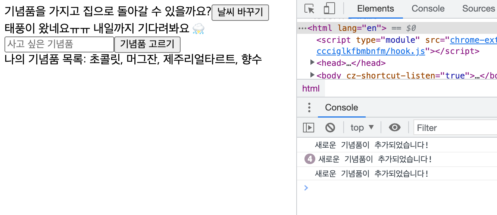

# useCallback()

## useCallback()

### 1. 개요

`useCallback()`훅은 `useMemo()`와 더불어 성능 최적화에 사용되는 React의 훅이다. `useMemo()`는 **특정 결과값**을 재사용할 때 사용하는 반면, `useCallback()`훅은 **특정 함수**를 새로 만들지 않고 재사용하고 싶을 때 사용하는 훅이다.

***

### 2. useCallback() 사용법

사용법 `const fn = useCallback(function, deps)`

* function: Memoization을 하는 함수
* deps: 의존성 배열로 `useEffect()`의 deps와 같다.

기본 사용법은 `useMemo()`과 같아 보인다. 하지만 함수를 Memoization하는지 특정 값을 Memoization이 하는 것에 차이가 있다.

***

### 3. useCallback()를 사용하지 않는 컴포넌트의 랜더링

먼저 `useCallback()`훅을 사용하지 않은 코드를 작성하고 랜더링하는 과정을 살펴보자. 최근에 제주도 여행을 다녀왔기에 이와 관련한 간단한 코드를 예시로 소개한다.

아래와 같이 두 개의 컴포넌트를 생성한다.

```jsx
// Test 컴포넌트
import React, { useState } from "react";
import { useForm } from "react-hook-form";
import Children from "./Children";

const Test = () => {
  const { register, handleSubmit, setValue } = useForm();
  const [isSunny, setIsSunny] = useState(true);
  const [gift, setGift] = useState([]);

  const getMyGift = () => {
    return gift.join(", ");
  };

  return (
    <div>
      <div>
        <span>기념품을 가지고 집으로 돌아갈 수 있을까요?</span>
        <button onClick={() => setIsSunny(!isSunny)}>날씨 바꾸기</button>
        <div>
          {isSunny
            ? "날씨가 매우 좋네요! 비행기가 이륙할 수 있어요 🛫"
            : "태풍이 왔네요ㅠㅠ 내일까지 기다려봐요 ⛈"}
        </div>
      </div>
      <form
        onSubmit={handleSubmit(({ gift }) => {
          setGift((prev) => [...prev, gift]);
          setValue("gift", "");
        })}
      >
        <input {...register("gift")} placeholder="사고 싶은 기념품" />
        <input type="submit" value="기념품 고르기" />
      </form>
      <Children getMyGift={getMyGift} />
    </div>
  );
};

export default Test;

// Children 컴포넌트
import React, { useState, useEffect } from "react";

const Children = ({ getMyGift }) => {
  const [myGift, setMyGift] = useState();
  useEffect(() => {
    console.log("새로운 기념품이 추가되었습니다!");
    setMyGift(getMyGift());
  }, [getMyGift]);
  return <div>나의 기념품 목록: {myGift}</div>;
};

export default Children;
```

코드의 분석부터 해보자.

* 먼저 나는 `useForm`훅을 사용하고 있다. 이 훅은 `react-hook-form` 모듈을 설치한 후 사용할 수 있다. 해당 모듈과 훅에 대해서는 다른 챕터에서 자세히 다루도록 하겠다.
*   `isSunny`와 `gift`라는 state를 만들었다.

    ```jsx
    const [isSunny, setIsSunny] = useState(true);
    const [gift, setGift] = useState([]);
    ```
* `isSunny` state는 `날씨 바꾸기`버튼을 눌러 값을 바꿀 수 있고 값에 따라 비행기가 이륙할 수 있는지 없는지 텍스트로 알려주고 있다.
*   `gift` state는 초기값이 배열이고 `input`에서 받은 값을 차례대로 `Array.push()`메서드를 통해 저장하고 있다.

    ```jsx
    handleSubmit(({ gift }) => {
      setGift((prev) => [...prev, gift]);
      setValue("gift", "");
    });
    ```
*   `getMyGift()`는 `Children`컴포넌트에 `props`로 전달하는 함수이다. 해당 함수는 배열을 `Array.join()`메서드를 통해 문자열로 바꾸는 역할을 한다.

    ```jsx
    const getMyGift = () => {
      return gift.join(", ");
    };
    ```
*   `Children`컴포넌트에서는 `myGift` state가 선언이 되어 있다. 해당 state는 `props`으로 전달받은 `getMyGift()`가 업데이트 될 때 마다 `useEffect()` 을 통해 업데이트 되고 있다.

    ```jsx
    const [myGift, setMyGift] = useState();
    useEffect(() => {
      console.log("새로운 기념품이 추가되었습니다!");
      setMyGift(getMyGift());
    }, [getMyGift]);
    ```

코드 분석이 끝났으니 state값들을 변경하여 화면이 랜더링하는 과정을 알아보자. 일단 제주도에 갔으니 기념품을 사야한다. 사고 싶은 기념품을 입력하고 `기념품 고르기` 버튼을 눌러 나의 기념품 목록에 추가하자.


초콜릿, 머그잔, 제주리얼타르트, 향수를 기념품 품목에 추가하였다. 추가가 될 때 마다 `getMyGift()`가 새로운 함수 객체를 할당하고 있기 때문에 `Children`컴포넌트의 `useEffect()`가 실행된다.

그렇다면 `getMyGift()`와 전혀 상관없는 `isSunny`의 값을 바꾸게 되면 어떻게 될까? `날씨 바꾸기`버튼을 클릭하여 비행기를 다음날에 띄어보자.



날씨가 바뀌어 태풍이 오고 있다. `isSunny`값은 성공적으로 바뀌었고 `gift`의 값은 바뀌지 않았다. 하지만 `getMyGift()`가 새로운 함수 객체를 할당하고 있어 `Children`컴포넌트의 `useEffect()`가 실행이 되었다. 그래서 우리는 "새로운 기념품이 추가되었습니다!"라는 텍스트가 콘솔에 하나 더 추가된 모습을 볼 수 있다.

즉 리랜더링이 필요하지 않는 컴포넌트에서 불필요한 리랜더링이 일어난 것이다.

이러한 이유는 `useMemo()`챕터에서 설명했지만 다시 복습하자면, 리액트에서의 컴포넌트도 하나의 함수이다. 즉 함수가 리랜더링 된다는 것은 변수가 초기화가 된다는 것이다. 같은 역할을 하고 있는 함수지만 변수가 참조하고 있는 함수 객체의 주소는 다르기 때문이다.

***

### 4. useCallback()를 사용한 컴포넌트의 랜더링

이제 `useCallback()`훅을 사용하여 위의 문제를 해결하자.

`getMyGift()`의 함수를 아래와 같이 수정하자.

```jsx
const getMyGift = useCallback(() => {
  return gift.join(", ");
}, [gift]);
```

그리고 나서 다시 기념품 목록을 추가해보자.


이번에도 기념품 추가 될 때마 `Children`컴포넌트가 리랜더링이 되는 것을 확인할 수 있다. 그러면 `날씨 바꾸기`버튼을 클릭하여 `Children`컴포넌트와 관련없는 `isSunny`의 값을 바꾸어 보자.


`isSunny`의 값이 바뀌어 날씨가 태풍으로 업데이트 되어도 `Children`컴포넌트는 리랜더링이 되지 않는 것을 확인할 수 있다.

이는 `useCallback()`훅의 의존성 배열의 값으로 `gift`만 추가했기에 `isSunny`가 아무리 바뀌어도 `getMyGift()`함수가 참조하고 있는 함수 객체의 주소는 바뀌지 않기 때문이다.

***

### 5. Conclusion

> `useMemo()`훅과 `useCallback()`훅을 공부하면서 느꼈던 점은 "과연 내가 적제적소에 해당 훅을 잘 사용할 수 있을까?"였다. 지금까지 랜더링 최적화에 대한 고민을 하지 않고 코드를 작성했기 때문에 필요한 곳에 내가 잘 적용을 할 수 있을지 걱정이 된다. 그래도 얼른 티처캔 리팩토링을 시작해서 직접 프로잭트에 적용을 하고 싶다. 리팩토링은 다음주 월요일(22.8.8) 부터 시작!

***

## 참고

[\[React\] 리액트 Hooks : useCallback() 함수 사용법](https://cocoon1787.tistory.com/798) [React Hooks: useCallback 사용법](https://www.daleseo.com/react-hooks-use-callback/)

도움이 많이 되었던 유튜브 🎬

*   React Hooks에 취한다 - useCallback 짱 쉬운 강의 | 리액트 훅스 시리즈

    [](https://www.youtube.com/watch?v=XfUF9qLa3mU)

***

[👆](UseCallback.md#usecallback)

📅 2022-08-04
