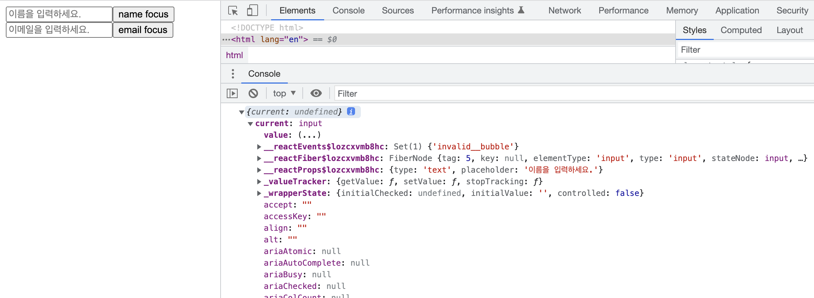
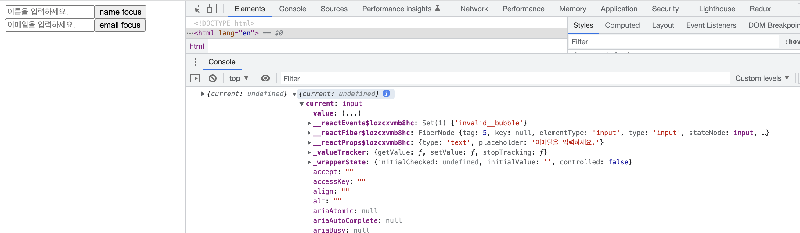
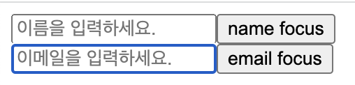
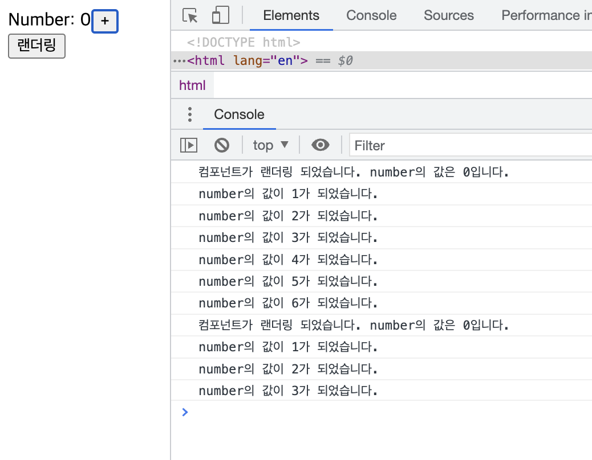
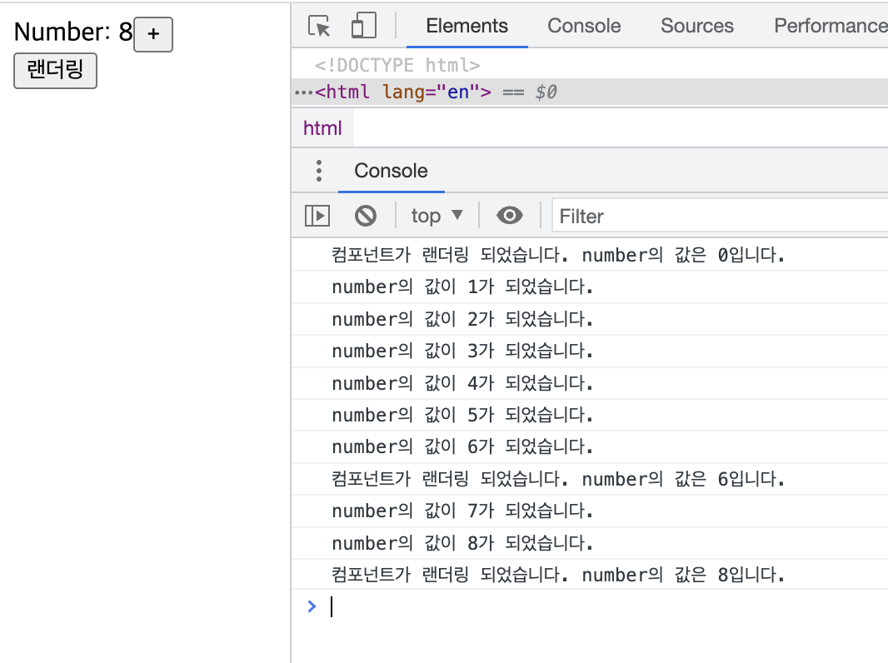

# useRef()

## 1. 개요

자바스크립트을 사용할 때 특정 DOM에 접근하기 위해서는 `getElementById`, `querySelector`와 같은 DOM Selector 함수를 사용한다. 그렇다면 리액트에서는 어떤 방법으로 DOM에 접근할 수 있을까? 바로 `useRef()`훅을 이용하면 된다.

---

## 2. useRef() 로 특정 DOM 선택하기

먼저 `useRef()`를 사용하여 특정 DOM을 선택하자. 우선적으로 할 일은 `useRef()`를 리액트에서 임포트한 후 Ref 객체를 만드는 일이다. 그 후 Ref 객체를 우리가 선택하고 싶은 DOM에 `ref`값으로 설정해야 한다.

아래의 예시를 함께 보자.

```jsx
import React, { useRef } from "react";

const Test = () => {
  const nameRef = useRef();
  const emailRef = useRef();

  console.log(nameRef, emailRef);

  return (
    <div>
      <div>
        <input ref={nameRef} type="text" placeholder="이름을 입력하세요." />
        <button>name focus</button>
      </div>
      <div>
        <input ref={emailRef} type="text" placeholder="이메일을 입력하세요." />
        <button>email focus</button>
      </div>
    </div>
  );
};

export default Test;
```

`useRef()`를 통해 두개의 Ref 객체를 만들었다. 하나는 `nameRef`이고 다른 하나는 `emailRef`이다. 그 후 각각 input의 `ref` 값으로 설정했다. 콘솔로 어떤 내용이 찍히는지 보자.

 

Ref 객체의 `.current` 값은 우리가 원하는 DOM를 가리키게 된다.

좀 더 나아가 input옆에 위치한 버튼을 누를 때 각각의 input에 focus를 주도록 해보자. 그렇다면 아래의 추가적인 코드(버튼의 onClick) 작성이 필요하다.

```jsx
import React, { useRef } from "react";

const Test = () => {
  const nameRef = useRef();
  const emailRef = useRef();

  // 버튼을 누를 때 해당 input에 포커스를 주는 함수
  const onClickBtn = (ref) => {
    if (ref === "name") {
      nameRef.current.focus();
    } else {
      emailRef.current.focus();
    }
  };

  return (
    <div>
      <div>
        <input ref={nameRef} type="text" placeholder="이름을 입력하세요." />
        <button onClick={() => onClickBtn("name")}>name focus</button>
      </div>
      <div>
        <input ref={emailRef} type="text" placeholder="이메일을 입력하세요." />
        <button onClick={() => onClickBtn("email")}>email focus</button>
      </div>
    </div>
  );
};

export default Test;
```

`.current.focus()`을 통해 input에 focus를 줄 수 있다. 클릭을 통해 확인해 보면 아래의 사진과 같다. 아래는 `email focus` 버튼을 눌렀을 때의 모습이다.



---

## 3. useRef() 로 변수 관리하기

`useRef()`는 DOM를 선택하는 용도 외에도, 컴포넌트 안에서 조회 및 수정할 수 있는 변수를 관리할 수 있다.

리액트 컴포넌트는 `useState()`로 선언된 변수(데이터)가 변할 때 마다 리랜더링을 하게 되면서 컴포넌트 내부 변수들이 초기화된다. 아래의 예시 코드를 보면서 어떻게 동작하는지 이해해보자.

```jsx
import React, { useState } from "react";

const Test = () => {
  var number = 0;
  const [render, setRender] = useState(true);

  const onClickPlusBtn = () => {
    number += 1;
    console.log(`number의 값이 ${number}가 되었습니다.`);
  };

  const onClickRender = () => {
    setRender((prev) => !prev);
  };

  console.log(`컴포넌트가 랜더링 되었습니다. number의 값은 ${number}입니다.`);

  return (
    <div>
      <div>
        <span>Number: {number}</span>
        <button onClick={onClickPlusBtn}>+</button>
      </div>
      <button onClick={onClickRender}>랜더링</button>
    </div>
  );
};

export default Test;
```



변수 `number`는 `var`를 통해 선언이 되었고 아무리 +버튼을 누른다 해도 화면이 다시 랜더링이 되지는 않는다. 하지만 콘솔을 찍었을 때 코드 내부에서는 숫자가 하나씩 오르는 것을 확인할 수 있다. 그렇다면 그 아래의 랜더링 버튼을 눌렀을 땐 어떨까? `number`의 값이 초기화 되어 다시 0이 된다.

이번에는 `var`가 아닌 `useRef()`를 통해 변수를 관리해보자. 아래와 같이 코드를 수정하자.

```jsx
import React, { useState, useRef } from "react";

const Test = () => {
  const number = useRef(0);
  const [render, setRender] = useState(true);

  const onClickPlusBtn = () => {
    number.current += 1;
    console.log(`number의 값이 ${number.current}가 되었습니다.`);
  };

  const onClickRender = () => {
    setRender((prev) => !prev);
  };

  console.log(
    `컴포넌트가 랜더링 되었습니다. number의 값은 ${number.current}입니다.`
  );

  return (
    <div>
      <div>
        <span>Number: {number.current}</span>
        <button onClick={onClickPlusBtn}>+</button>
      </div>
      <button onClick={onClickRender}>랜더링</button>
    </div>
  );
};

export default Test;
```

위와 같이 `var`로 선언한 `number`를 `useRef()`로 바꾸었고 `useRef()`의 ()안에 파라미터로 0을 넣어 초기값을 설정하였다. 그리고 `number.current`를 통해 값을 조회한다. 또한 +버튼을 누를 때 마다 `number.current`의 값을 수정하여 1씩 값을 증가시키게 하였다. 그 결과는 아래의 사진과 같다.



이전 `var`로 선언했을 때 처럼 +버튼을 누를 땐 `number`값이 1씩 증가하지만 컴포넌트가 리랜더링 되었을 땐 이전과 다르게 `number`값이 0으로 초기화가 되지 않는 것을 확인할 수 있다.

여기서 알 수 있는 하나의 사실은 `useRef()`로 선언된 변수의 값이 변하더라고 컴포넌트가 리랜더링되지 않는다는 것이다. 즉, 위의 사진에서는 `Number: 8`이라고 되어있지만 이는 랜더링 버튼으로 인해 컴포넌트가 리랜더링이 되었기 때문이고 그 전까지는 수정된 `number`의 값을 화면에서는 볼 수 없다. 아래의 사진을 참고하라!


---

## 4. Conclusion

> `useRef()`를 통해 DOM에 직접 접근하고 작업하는 과정은 특히 `input`를 다룰 때 몇 번 사용했었다. 하지만 `useRef()`를 통해 변수를 관리하는 것은 한 번도 해보지 못하였다. `var`로 변수를 선언하고 관리하는 것과의 차이는 이해가 되지만 어떤 기능에서 `useRef()`를 사용해야 하는지에 대해서는 아직 의문이다. 구체적인 예시와 `useRef()`를 사용하여 변수를 관리하는 장점에 대해 알아보고 싶다.(이후 공부하다가 해당 내용이 나오면 `useRef()`챕터에 정리를 해야겠다.)

---

## 참고

[ko.reactjs.org - useRef](https://ko.reactjs.org/docs/hooks-reference.html#useref)\
[10. useRef 로 특정 DOM 선택하기](https://react.vlpt.us/basic/10-useRef.html)\
[\[React\] useRef 사용법 및 예제](https://itprogramming119.tistory.com/entry/React-useRef-%EC%82%AC%EC%9A%A9%EB%B2%95-%EB%B0%8F-%EC%98%88%EC%A0%9C)

---

[👆](UseRef.md#useref)

📅 2022-08-01
