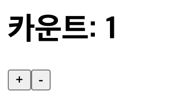

# useState()

## 1. 개요

리액트에서 가장 많이 사용하는 훅을 하나 말하자면 `useState()`가 될 것이다. `useState()`는 이름에서 알 수 있듯이 state를 사용하기 위한 훅이다. 즉, `useState()`를 통해 동적으로 변하는 데이터를 관리할 수 있다.

***

## 2. useState()를 사용하지 않는다?!

```jsx
import React, { useState } from "react";

const Counter = () => {
  let number = 1;

  const onIncrease = () => {
    number += 1;
    console.log("증가 / number:", number);
  };

  const onDecrease = () => {
    number -= 1;
    console.log("감소 / number:", number);
  };

  return (
    <div>
      <h1>카운트: {number}</h1>
      <button onClick={onIncrease}>+</button>
      <button onClick={onDecrease}>-</button>
    </div>
  );
};

export default Counter;
```



위의 컴포넌트는 버튼을 클릭하여 카운트를 하나씩 증가시키거나 감소시키고 현재의 카운트를 보여주는 단순한 컴포넌트이다.

하지만 버튼을 눌러 카운트를 증가, 감소를 시키면 카운트의 값이 바뀌지 않는 것을 볼 수 있다. 그렇다면 변수 `number`값이 변하지 않아서 일까? 버튼을 클릭하면 실행되는 함수에 콘솔로 `number`값을 찍어보면 아래와 같이 계속 변하는 것을 알 수 있다.


`number`값이 계속해서 변하지만 화면에 변환 `number`값이 나타나지 않는 이유는 리액트가 재랜더링을 하지 않아서 이다.

`number`의 값이 동적으로 계속해서 변하기 때문에 우리는 `useState()`를 사용해서 테이터를 관리해야 한다.

***

## 3. useState() 사용하기

`useState()` 아래와 같이 사용한다.

> const \[변수명, set함수명] = useState(초깃값);\
> 보통 set함수혐은 변수명 앞에 set를 붙인다. 예를들어 변수를 `name`이라고 지었으면 set함수명은 `setName`으로 짖는다.\
> 초깃값은 어떤 타입으로 정해도 되고 생략을 해도 된다. 생략을 했을 때는 `undefined`가 된다.

`useState()` 를 사용하여 위의 Counter 컴포넌트의 `number`값을 관리해보자.

```jsx
import React, { useState } from "react";

const Counter = () => {
  const [number, setNumber] = useState(1);

  const onIncrease = () => {
    setNumber((prev) => prev + 1);
    console.log("증가 / number:", number);
  };

  const onDecrease = () => {
    setNumber((prev) => prev - 1);
    console.log("감소 / number:", number);
  };

  return (
    <div>
      <h1>카운트: {number}</h1>
      <button onClick={onIncrease}>+</button>
      <button onClick={onDecrease}>-</button>
    </div>
  );
};

export default Counter;
```

위와 같이 코드를 수정하면 +, - 버튼을 누를 때 마다 `number`값이 바뀌게 된다.


콘솔창도 함께 보며 비교해보자.


화면에는 `number`값이 4라고 나오지만 콘솔에는 `증가 / number: 3`이 찍히는 것을 볼 수 있다. 이는 `inCrease()`함수 내에서 콘솔이 찍힌 후 `number`값이 바뀌고 나서 재렌더링이 되기 때문이다. 즉, 아래와 같은 과정을 거친다고 볼 수 있다.

1. `setNumber((prev) => prev + 1);` 함수 실행 (비동기)
2. `console.log("증가 / number:", number);` 함수 실행
3. `number`값이 바뀌며 페이지가 재렌더링
4. `<h1>카운트: {number}</h1>`에 변한된 `number`값이 적용된다.

그렇다면! `inCrease()`함수내의 `consolo.log`에 변경된 `number`값이 찍히게 하기 위해서는 어떻게 할까? 즉, 재렌더링이 되면서 동시에 변화된 `state`값(여기서는 number)을 다른 함수로 사용하기 위해선 다음 챕터에서 배울 `useEffect()`를 사용하면 된다. 자세한 내용은 `useEffect()`챕터에서 다룬다.

***

## 4. setState()

`setState()`는 리액트 함수형 컴포넌트 내서 상태를 관리하기 위해 사용하는 hooks인 `useState()`를 통해 반환되는 함수이다. `setState()`는 아래와 같은 특징이 있다.

1. 기본적으로 비동기적으로 동작한다.
2. state 객체를 넘거줄 수 있을 뿐만 아니라 새로운 state를 반환하는 함수를 인자로 넘겨줄 수 있다.

`setState()`의 전달인자에 대해 자세히 살펴보자

아래는 `setState()`의 타입을 나타낸 코드이다.

```typescript
type SetStateAction<S> = S | ((prevState: S) => S);
```

위의 내용을 정리하자면 `setState()`의 전달인자는 두 종류가 들어갈 수 있다.

1. S: state가 어떻게 변경되어져야 한다라는 그 값을 넣을 수 있다.
2. ((prevState: S) => S): 이전의 state를 인자로 받고 새로운 state를 반환하는 함수(콜백함수)를 넣을 수 있다.

`3. useState 사용하기`에서는 두 번째 방법으로 인자를 넣었다.

***

## 5. Conclusion

> `useState()`는 다음에 배울 `useEffect()`와 함께 리액트에서 자주 사용하고 있는 훅이다. 기본적인 사용방법은 이미 알고 있는 내용이라 공부하고 이해하는 데에는 큰 어려움을 느끼진 않았다. 하지만 `setState()`함수가 비동기라는 것을 알게 되었다. 그 전에는 그냥 `state`값을 바꾸기 위해 사용하는 함수라는 정도만 알고 있었다.\
> 해당 내용에 대한 학습이 있기 전에는 "왜 `setState()`를 사용해서 `state`값을 바꾸었는데 바로 적용이 되지 않을까?"라는 궁금증이 있었는데 궁금증이 해결되어서 속이 뻥 뚫린 기분이다.😃

***

## 참고

도서 - 소플의 처음 만난 리액트\
[7. useState 를 통해 컴포넌트에서 바뀌는 값 관리하기](https://react.vlpt.us/basic/07-useState.html)\
[React의 setState() 제대로 사용하기](https://velog.io/@devjade/React%EC%9D%98-setState-%EC%A0%9C%EB%8C%80%EB%A1%9C-%EC%82%AC%EC%9A%A9%ED%95%98%EA%B8%B0)

***

[👆](UseState.md#usestate)

📅 2022-07-26
