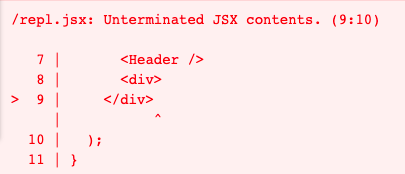
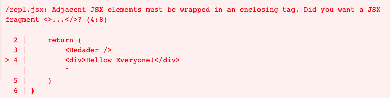

# JSX

## 1. 개요

```jsx
const element = <h1>Hello, world!</h1>;
```

위의 태그 문법은 문자열도, HTML도 아니다. 자바스크립트를 공부할 때에는 한 번도 본 적이 없는 형태의 문법이다. 위와 같은 문법을 JSX이라고 불리며 리액트에서 사용되는 문법이다. 리액트에서는 UI가 어떻게 생겨야 하는지 설명하기 위해 JSX를 사용하므로 JSX의 개념에 대해 숙지해야 한다.

---

## 2. JSX란?

XML과 매우 비슷하게 생긴 JSX는 자바스크립트의 확장 문법이다. 이러한 JSX의 코드는 브라우저에서 실행되기 전 코드가 번들링되는 과정에서 바벨을 사용하여 일반 자바스크립트 형태의 코드로 변환된다.

```jsx
function App() {
  return <div>Hello World!</div>;
}
```

위의 코드가 아래와 같이 변환된다.

```js
function App() {
  return React.createElement("h1", null, "Hello World!");
}
```

위의 두 개의 코드를 보면 JSX의 코드가 훨씬 직관적으로 느껴진다. 만약 React.createElement함수를 사용하여 개발을 한다면 매우 불편할 것이다. 반대로 JSX를 사용하면 매우 편하게 UI를 렌더링을 할 수 있다.

> JSX도 자바스크립트 문법인가? NO!  
> JSX는 리액트로 개발할 때 사용되므로 공식적인 자바스크립트 문법이 아니다. 바벨에서 여러 문법을 지원할 수 있도록 preset 및 plugin을 설정한다. 바벨을 통해 개발자들이 임의로 만든 문법, 혹은 차기 자바스크립트의 문법들을 사용할 수 있다.

> Babel은 무엇인가?  
> Babel은 자바스크립트의 문법을 확장해주는 도구이다. 아직 지원되지 않는 최신 문법이나, 편의상 사용하거나 실험적인 자바스크립트 문법들을 정식 자바스크립트 형태로 변환해줌으로써 구형 브라우저같은 환경에서도 제대로 실행 할 수 있게 해주는 역할을 한다. `$ npx create-react-app`을 실행할 경우 babel를 별도로 설정을 하지 않아도 된다.  
> [Babel](https://babeljs.io/)  
> [Babel 사용해보기](https://babeljs.io/repl#?browsers=defaults%2C%20not%20ie%2011%2C%20not%20ie_mob%2011&build=&builtIns=false&corejs=3.21&spec=false&loose=false&code_lz=Q&debug=false&forceAllTransforms=false&shippedProposals=false&circleciRepo=&evaluate=false&fileSize=false&timeTravel=false&sourceType=module&lineWrap=true&presets=env%2Creact%2Cstage-2&prettier=false&targets=&version=7.18.8&externalPlugins=&assumptions=%7B%7D)

---

## 3. JSX의 기본 규칙

JSX가 JavaScript로 제대로 변환되기 위해서는(에러가 나지 않기 위해서는) 지켜야할 몇 가지 규칙이있다.

---

### 3-1. 꼭 닫혀야 하는 태그

```js
import React from "react";
import Header from "./Header";

function App() {
  return (
    <div>
      <Header />
      <div>
    </div>
  );
}
```

위의 코드는 오류가 발생한다.



`<Header />`컴포넌트 아래 줄에 있는 `<div>`태그가 닫혀있지 않기 때문이다.

HTML에서는 `input` 또는 `br`태그를 할 때 닫지 않고 사용하기도 하는데 리액트에서는 닫아야 한다. 태그와 태그 사이에 내용(요소)이 들어가지 않을 때, Self Closing태그 라는 것을 사용해야 한다. 위의 `Header`컴포넌트를 사용 할 때에도 Self Closing태그를 사용했다.

---

### 3-2. 꼭 감싸져야하는 태그

```js
import React from "react";
import Header from "./Header";

function App (){
    return (
        <Hedader />
        <div>Hello Everyone!</div>
    )
}
```

위의 코드는 오류가 발생한다.



`<Header />`컴포넌트와 `<div></div>`태그가 하나의 태그로 감싸여있지 않기 때문이다. 이때 주로 리액트의 Fragment라는 것을 사용한다. `<React.Fragment></React.Fragmen>`또는 `<></>`

```js
import React from "react";
import Header from "./Header";

function App() {
  return (
    <React.Fragment>
      <Hedader />
      <div>Hello Everyone!</div>
    </React.Fragment>
  );
}
```

위의 코드 처럼 태그를 작성할 때 이름 없이 작성을 하게 되면 Fragment가 만들어지는데, Fragment는 브라우저 상에서 따로 별도의 엘리먼트로 나타나지 않는다.

---

### 3-3. JSX안에 자바스크립트 값 사용하기

JSX내부에 자바스크립트 변수를 보여줘야 할 때에는 `{}`으로 감싸서 보여준다.

```js
import React from "react";
import Header from "./Header";

function App() {
  const name = "HD";
  const numArr = [1, 2, 3, 4, 5];
  return (
    <React.Fragment>
      <Hedader />
      <div>Hello {name}!</div>
      <span>{numArr.map((num) => num)}</span>
      {name === "HD" ? <span>Welcome HD!</span> : null}
      </img>
    </React.Fragment>
  );
}
```

---

### 3-4. style과 className

인라인 스타일로 style를 작성하는 경우 객체 형태로 작성해야 하며, `background-color`처럼 `-`로 구분되어 있는 이름들은 `backgroundColor`처럼 camelCase 형태로 네이밍 해줘야 한다.

```js
import React from "react";
import Header from "./Header";

function App() {
  return (
    <React.Fragment>
      <Hedader />
      <div
        style={{
          backgroundColor: "black",
          color: "white",
          padding: "10px 20px",
        }}
      >
        Hellow Everyone!
      </div>
    </React.Fragment>
  );
}
```

class를 사용하여 외부 스타일 시트를 사용할 경우 HTML에서는 `class`라는 어트리뷰트를 사용했는데 JSX에서는 `className`를 사용한다.

```css
/* App.css */

.gray-box {
  background: gray;
  width: 64px;
  height: 64px;
}
```

```js
import React from "react";
import Header from "./Header";
import "./App.css";

function App() {
  return (
    <React.Fragment>
      <Hedader />
      <div className="gray-box">Hellow Hellow Everyone!!</div>
    </React.Fragment>
  );
}
```

---

### 3-5. 주석

JSX 내부의 주석은 `{/* 내용 */}`의 형태로 작성한다.

열리는 태그 내부에서는 `// 내용 `의 형태로 작성한다.

---

## 4. JSX의 장점

1. 개발자 경험(DX) 개선: 표현력이 뛰어나 코드를 읽기 쉽다. XML과 문법이 유사하여 중첩된 선언형 구조를 더 잘 나타낸다.
2. 팀의 생산성 향상: 전문 개발자 외에도 개발 지식이 있는 팀원이 있다면 직접 코드를 수정할 수도 있다. JSX는 HTML과 비슷하여 이들에게도 친숙하기 때문이다.
3. 문법 오류와 코드량 감소: 작성해야 할 코드가 줄어들며, 이는 곧 실수나 반복으로 인한 스트레스를 줄여준다.

---

## 5. Conclusion

> JSX의 공부는 순조롭게 이루어졌다. 리액트를 공부하고 여러 프로젝트를 진행하면서 많이 사용했던 JSX였기 때문이다. 아무런 의문 없이 "아 리액트에선 이렇게 해야지" 하고 생각하며 보내왔고 앞으로도 React를 많이 사용할 예정이므로 JSX를 잘 다루어보자  
> 처음 JSX를 접했을 때도 아무런 위화감을 느끼지 않았다. "어떻게 변수에 태그를 할당할 수 있지?"라는 의문조차가 없었다. 메타에서 잘 만들어 주었으니 잘 써야겠다:)

---

## 참고

[JSX 소개](https://ko.reactjs.org/docs/introducing-jsx.html)  
[[React 기초] JSX란? / JSX 문법](https://developerntraveler.tistory.com/54)  
[4. JSX의 기본 규칙 알아보기](https://react.vlpt.us/basic/04-jsx.html)  
[3.1 JSX의 정의와 장점](https://thebook.io/006961/part01/ch03/01/)

---

[👆](#jsx)
