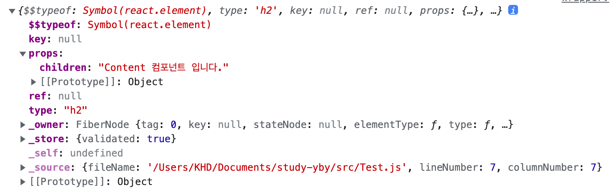

# Props

## 1. 개요

리액트 App를 개발하는 것을 붕어빵을 만드는 것과 비교했을 때 붕어빵 틀은 컴포넌트, 붕어빵 속 재료는 props, 완성된 붕어빵은 리액트 앨리먼트가 된다.

이중 props에 따라 같은 컴포넌트라 해도 모두 다른 내용이 들어간 리액트 앨리먼트를 만들 수 있다. 하지만 같은 컴포넌트를 사용하기 때문에 전체적은 틀은 같다.

이처럼 props는 같은 리액트 컴포넌트에서 눈에 보이는 글자나 색깔 등의 속성을 바꾸고 싶을 때 사용하는 컴포넌트의 속 재료라고 생각하면 된다.

---

## 2. props는 읽기 전용

> All React components must act like pure functions with respect to their props.

리액트 공식 문서는 위와 같이 props의 성격을 설명하고 있다. 공식문서에는 **pure functions**이라는 함수가 나오는데 그렇다면 **pure functions**이라는 것은 무엇일까?

아래의 함수를 보자

```javascript
function sum(a, b) {
  return a + b;
}
```

위의 함수 `sum`의 인자 `a`,`b`의 값을 변경하지 않으면, 같은 입력값에 대해서는 항상 같은 출력값을 낸다. 이러한 함수를 Pure하다고 한다.

반대로 Pure의 반대인 Impure한 함수의 예를 살펴보자

```javascript
function widthdraw(account, amount) {
  account.total -= amount;
}
```

위의 함수가 실행이 되면 자신의 입력값을 변경하기 때문에 순수하지 않는 함수가 된다.

순수함수와 순수하지 않는 함수를 살펴봤다. 다시 정리하자면

> 모든 리액트 컴포넌트는 props를 직접 바꿀 수 없고(읽기 전용), 같은 props에 대해서는 항상 같은 결과(리액트 앨리먼트)를 보여준다.

---

## 3. props의 기본 사용법

Parents 컴포넌트에서 Child 컴포넌트로 `name`이라는 값을 전달하고자 하는 상황을 가정하자. 그렇다면 아래와 같이 코드를 작성해야 한다.

```jsx
//  Parents.js;
import React from "react";
import Child from "./Child";

const Parents = () => {
  return (
    <div>
      <Child name="HD" />
    </div>
  );
};

export default Parents;

// Child.js
import React from "react";

const Child = (props) => {
  return <div>제 이름은 {props.name}입니다.</div>;
};

export default Child;
```

Child.js 같이 Child 컴포넌트에게 전달되는 props는 파라미터를 통하여 조회할 수 있다. props는 객체 형태로 전될다며, 만약 `name`값을 조회하고 싶다면 `props.name`을 조회하면 된다.

---

## 4. 여려개의 props와 구조분해 할당

Parents 컴포넌트에서 `name`값 뿐 아니라 `age`, `region`을 Child 컴포넌트에 넘겨주는 상황을 가정해보자. 뿐만 아니라 객체 형태로 전달되는 props를 ES6에 등장한 구조분해(비구조화) 할당 표현식을 사용해보자.

```jsx
//  Parents.js;
import React from "react";
import Child from "./Child";

const Parents = () => {
  return (
    <div>
      <Child name="HD" age="29" region="한국" />
    </div>
  );
};

export default Parents;

// Child.js
import React from "react";

// 구조분해 할당으로 props값들을 얻을 수 있다.
const Child = ({ name, age, region }) => {
  return (
    <div>
      제 이름은 {name}입니다. 나이는 {age}이고 {region}에서 왔습니다.
    </div>
  );
};

export default Child;
```

`props의 기본 사용법`와 다르게 Child 컴포넌트의 파라미터에서 구조분해 할당 문법을 통해 props값들을 불러왔다. 이전에는 `props.`를 사용해 각각의 값을 불러왔지만 구조분해 할당을 통해 조금 더 간결하게 코드를 작성할 수 있다.

---

## 5. defaultProps로 기본값 설정

만약 전달 받은 props값이 없으면 어떡할까? 이럴때는 조건부 랜더링을 통해 값을 설정할 수 있고 defaultProps를 이용해 기본값을 설정할 수 있다. 조건부 랜더링은 다른 챕터에서 자세히 다루고 이번 챕터에서는 defaultProps를 사용해 보자.

아래의 코드를 살펴보자.

```jsx
//  Parents.js;
import React from "react";
import Child from "./Child";

const Parents = () => {
  return (
    <div>
      <Child name="HD" />
      <Child />
    </div>
  );
};

export default Parents;

// Child.js
import React from "react";

const Child = ({ name }) => {
  return <div>제 이름은 {name}입니다.</div>;
};

Child.defaultProps = {
  name: "이름을 설정해주세요.",
};

export default Child;
```

Parents.js에서 두개의 Child 컴포넌트를 호출하고 있다. 하지만 하나는 `name`값이 있고 다른 하나는 값이 없다.

`name`값이 없는 경우 Child.js에서는 `Child.defaultProps`를 사용해 `name`의 기본값을 지정한다. 아래는 위 코드의 결과이다.


---

## 6. props.children

컴포넌트 태그 사이에 넣고 싶은 앨리먼트 또는 다른 컴포넌트를 추가하고 싶을 땐 `props.children`을 사용하면 된다. 구조분해 할당으로 간단하게 사용해도 좋다.

컨탠츠의 내용이 담긴 Content 컴포넌트가 Wrapper 컴포넌트로 감싸져 있다고 가정해보자. 그렇다면 코드는 아래와 같을 것이다.

```jsx
//  Wrapper.js
import React from "react";

const Wrapper = () => {
  return (
    <div style={{ backgroundColor: "red", color: "white" }}>
      <h1>Wrapper 컴포넌트 입니다.</h1>
    </div>
  );
};

export default Wrapper;

//  Content.js
import React from "react";
import Wrapper from "./Wrapper";

const Content = () => {
  return <Wrapper>
        <h2>Content 컴포넌트 입니다.</h2>
    </Wrapper>;
};

export default Content;
```


위의 코드를 살펴보자. Content 컴포넌트가 Wrapper 컴포넌트로 감싸여있다. Content 컴포넌트의 Wrapper 컴포넌트 사이에는 `<h2>Content 컴포넌트 입니다.</h2>`의 앨리먼트가 있지만 화면에는 나타나지 않았다.

왜 그럴까? 그 이유는 `<h2>Content 컴포넌트 입니다.</h2>`도 하나의 props인데 Wrapper 컴포넌트에서 해당 props를 어디에 넣을지 정의하지 않아서이다. 이때 필요한 것이 바로 `props.children`이다.

다음과 같이 코드를 수정하자.

```jsx
//  Wrapper.js
import React from "react";

const Wrapper = ({children}) => {
  return (
    <div style={{ backgroundColor: "red", color: "white" }}>
      <h1>Wrapper 컴포넌트 입니다.</h1>
      {children}
    </div>
  );
};

export default Wrapper;

//  Content.js
import React from "react";
import Wrapper from "./Wrapper";

const Content = () => {
  return <Wrapper>
        <h2>Content 컴포넌트 입니다.</h2>
    </Wrapper>;
};

export default Content;
```


이번에는 성공적으로 `<h2>Content 컴포넌트 입니다.</h2>`의 내용이 출력되었다. 다른점은 찾아보자.

Wrapper 컴포넌트의 props를 구조분해 할당을 하여 `children`값을 가져왔다. 그리고 `<h1>Wrapper 컴포넌트 입니다.</h1>`아래에 `children`를 넣어주었다. 그래서 Content 컴포넌트의 `<h2>Content 컴포넌트 입니다.</h2>`이 바로 아래에 위치하게 된다.

Wrapper.js에서 콘솔로 `children`를 찍어보자 그러면 아래와 같은 객체을 볼 수 있다.



`children`에는 Content 컴포넌트에서 작성된 리액트 앨리먼트가 객체 형태로 존재하고 있음을 확인할 수 있다.

주의할 점은 `props.children`이 아닌 다른 임의의 이름으로 선언하면 원하는 결과물을 얻을 수 없다.

---

## 7. Conclusion

> `props`에 대해 공부하면서 순수함수라는 개념도 함께 배웠다. `props`값이 변화하지 않는 다는 것을 여러 프로젝트를 진행하면서 알고 있었지만 이런 개념이 순수함수와 연관이 있다는 것을 알게 되었다.\
> 그리고 넘겨받는 `props`의 값이 없다면 나는 지금까지 조건부 랜더링을 통해 코드를 작성했다. 하지만 다른 방법인 `defaultProps`에 대해 알게 되었고 한 번쯤 사용해서 리액트에 대한 지식을 넓혀야 겠다. 사실 `typescript`를 리액트에 도입한다면 훨씬 좋은 방법이 있지만... 역시나 `typescript`를 배운지 얼마 안되었고 그 또한 기록을 남기지 않아 기억은 나지 않는다...ㅎㅎ\
> `props.children`를 콘솔로 처음 찍어보는 것도 재미있었다! 그 안에 내용인 리액트 앨리먼트라 신기하다\~\
> typescript도 정리를 잘하자😀

---

## 참고

도서 - 소플의 처음 만난 리액트\
[리액트 공식문서 Components와 Props](https://ko.reactjs.org/docs/components-and-props.html)\
[5. props 를 통해 컴포넌트에게 값 전달하기](https://react.vlpt.us/basic/05-props.html)

---

📅 2022-07-22
