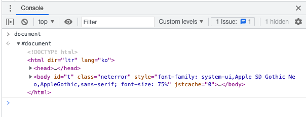
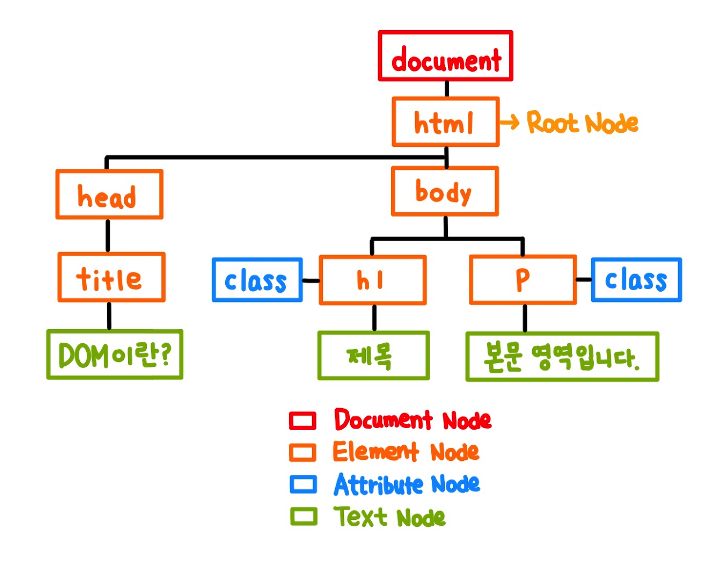
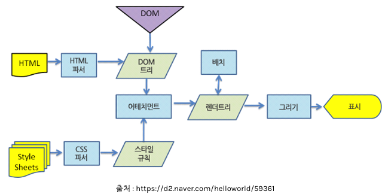
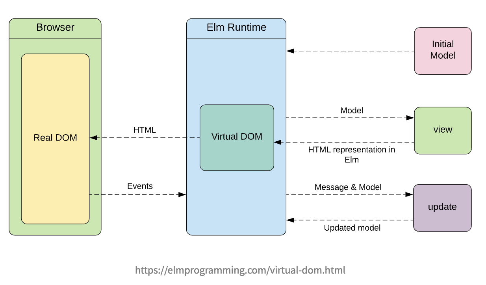
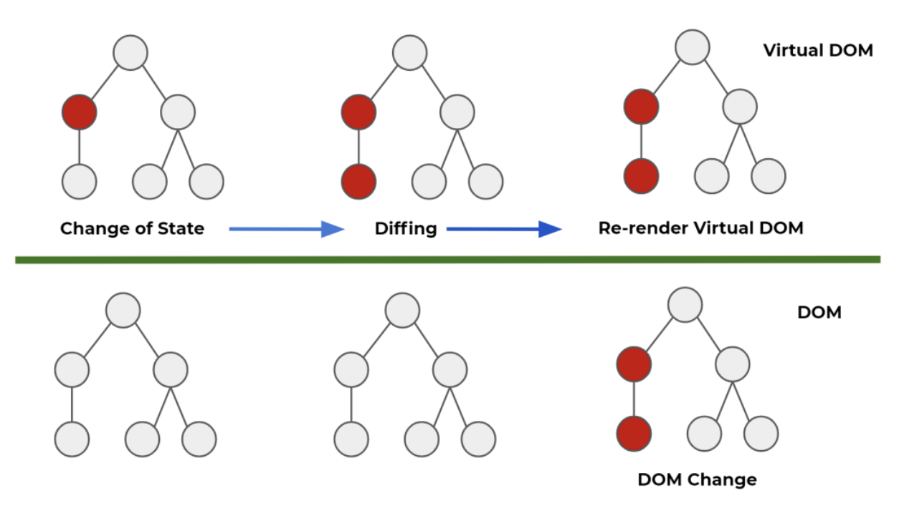

# VirtualDOM

## 👉 바로가기

- [1. 개요](#1-개요)
- [2. DOM의 개념](#2-dom의-개념)
- [3. DOM의 트리 구조](#3-dom의-트리-구조)
- [4. DOM의 문제와 브라우저의 랜더링 방법](#4-dom의-문제와-브라우저의-랜더링-방법)
- [5. VirtualDOM](#5-virtualdom)
- [6. Diffing Algorithm](#6-diffing-algorithm)
  - [6-1. Elements Of Different Types](#6-1-elements-of-different-types)
  - [6-2. DOM Elements Of The Same Type](#6-2-dom-elements-of-the-same-type)
  - [6-3. Recursing On Children](#6-3-recursing-on-children)
  - [6-4. keys](#6-4-keys)
- [8. Conclusion](#8-conclusion)

---

## 1. 개요

리액트의 특징 중 하나는 VirtualDOM(가상돔)이다. VirtrualDOM를 살펴보기 앞서 DOM의 개념에 대해 먼저 알아보고 VirtualDOM의 특징에 대해 살펴보자.

---

## 2. DOM의 개념

DOM(Document Object Model, 문서 객체 모델)은 XML이나 HTML문서에 접근하기 위한 일종의 인터페이스이다. 이 객체 모델은 문서 내의 모든 요소를 정의하고, 각각의 요소에 접근하는 방법을 제공한다. 즉 DOM이란 **웹 문서의 모든 요소를 자바스크립트를 이용하여 조작할 수 있도록 객체를 사용하여 문서를 해석하는 방법**을 말한다.

웹 문서의 모든 Element와 Attribute, Text들을 브라우저가 이해할 수 있도록 각각 객체로 만들고 이 객체들을 관계를 트리 구조로 구정한 것이 DOM이다.

콘솔 창에 DOM의 요소 중 하나인 documnet를 입력하면 아래와 같은 내용을 볼 수 있다.



콘솔에 출력되는 값을 펼쳐보면 웹 문서의 구조가 들어있다. 이것이 바로 DOM이고, 우리는 DOM를 이용하여 웹 문서를 동적으로 변경할 수 있다.

## 3. DOM의 트리 구조

```html
<!DOCTYPE html>
<html>
  <head>
    <title>DOM이란?</title>
  </head>
  <body>
    <h1 class="title">제목</h1>
    <p class="content">본문 영역입니다.</p>
  </body>
</html>
```

위의 웹문서를 DOM의 트리구조로 나타내보면 아래와 같은 계층 구조로 표현된다.



DOM의 트리구조는 노드와 가지로 표현한다. 네모 상자가 노드이고 노드와 노드를 연결하여 관계를 표시하고 있는 선이 가지이다. 노드는 HTML의 태그 요소만 표현하는 것이 아니라 모든 텍스트, 이미지, 태그의 속성들까지 객체화하여 DOM트리에 표현한다.

1. 문서 노드 (Document Node)  
   트리의 최상위에 존재하며, 하위 자식 노드에 접근하기 위해선 Document Node를 통해야만 한다. DOM트리에 접근하기 위한 시작점이다.
2. 요소 노드 (Element Node)  
   웹 문서의 태그는 Element Node로 표현된다. 모든 Element Node는 Attribute Node와 Text Node를 자식으로 가질 수 있는데, 이 자식 노드들을 변경하여 웹 페이지를 동적으로 조작할 수 있다.
3. 속성 노드 (Attribute Node)  
   태그의 모든 속성은 Attribute Node로 표현하며 해당 태그의 자식 노드로 인식된다.
4. 텍스트 노드 (Text Node)  
   태그가 가지고 있는 텍스트는 해당 Element Node의 자식 노드인 Text Node로 표현된다. Text Node는 DOM트리의 가장 아래쪽에 위치하여 자신의 자식 노드는 가질 수 없다.
5. 주석 노드 (Comment Node)  
   주석은 Comment Node로 표현한다.

> DOM은 자바스크립트가 아니다. DOM은 웹 문서에만 존재하고 브라우저가 자바스크립트를 이용해서 웹 페이지를 조작할 수 있도록 제공해주는 하나의 요소일 뿐이다. 우리가 자바스크립트로 DOM을 조작하는 것은 HTML웹 문서 자체를 수정하는 것이 DOM을 조작하는 것일 뿐이다.

---

## 4. DOM의 문제와 브라우저의 랜더링 방법

DOM의 문제라고 하면 아래와 같은 두 가저 점을 뽑을 수 있다.

1. DOM조작에 의한 렌더링이 비횰적
2. SPA특징으로 DOM 복잡도 증가에 따른 최적화 및 유지 보수가 더 어려워 짐

DOM을 통해 동적으로 웹 브라우저를 변경하기 위해서는 아래와 같은 과정을 거쳐야 합니다.

```js
document.getElementById("hello").innerHTML = "hello world!";
document.body.style.backgound = "blue";
```

이러한 과정을 통해 웹 브라우저는 DOM이 변경된 것을 인지하고 브라우저 엔진을 다시 랜더링 합니다.

> 브라우저 엔진은 User Interface와 Rendering Engine 사이의 동작을 제어해주는 엔진이다. 이와관련해서는 브라우저에 대한 공부를 할 때 따로 정리를 하겠다.

브라우저의 랜더링 방법에 대해 간단히 살펴보면서 위의 DOM 렌더링 문제에 대해 알아보자.
아래는 브라우저 렌더링 과정을 그림을 나타낸 것이다.



- 렌더링 과정
  1. HTML을 파싱하여 DOM 객체를 생성하고, css을 파싱하여 스타일 규칙을 만든다.
  2. 이 두개를 합쳐 실제로 웹 브라우저에 보여져야할 요소를 표현한 "렌더 트리"를 만든다.
  3. 이 렌더 트리를 기준으로 레이아웃을 배치고 색을 칠하는 등의 작업을 한다.

DOM을 변경할 때 마다 위의 랜더링 과정을 여러번 하게 된다. DOM을 100번 변경할 때 100번의 가까운 렌더링을 해야하기 때문에 비효율적인 문제가 있다.(100번보다 낮다고 하지만 빠른 이해를 돕기 위해 그냥 100번이라고 하겠다.)

아래의 예시 내용을 보며 이해를 해보자

```html
<!DOCTYPE html>
<html>
  <head>
    <title>DOM이란?</title>
  </head>
  <body>
    <ul>
      <li>원숭이</li>
      <li>사자</li>
      <li>호랑이</li>
    </ul>
  </body>
</html>
```

위와 같은 페이지가 있다고 가정해보자. DOM를 이용하여 li노드들의 컨텐츠를 바꾸기 위해서는 아래와 같은 과정이 필요하다.

```js
const liTags = document.querySelectorAll("li");

// 화면 렌더링1 발생
liTags[0].textContents = "강아지";

// 화면 렌더링2 발생
liTags[1].textContents = "고양이";

// 화면 렌더링3 발생
liTags[2].textContents = "앵무새";
```

위의 과정을 보면 하나의 업데이트마다 뷰의 변화 생기면 그 때 마다 브라우저가 다시 화면을 그리는 과정이 시작되고 이 부분이 잦은 돔작으로 생기는 성능의 병목점이 된다.

---

## 5. VirtualDOM

VirtualDOM은 여러 수정 사항이 있더라도 한 번만 렌더링을 실행한다. 또한 DOM를 새롭게 생성한 후 렌더링 하지 않고 바뀐 부분만 찾아서 해당 부분만 수정할 수 있도록 도와준다.



위의 그림처럼 VirtualDOM은 DOM이 생성하기 전, 이전 상태 값과 수정사항을 비교하여 달라진 부분만 DOM에게 한 번만 전달하여 딱 한 번의 렌더링을 할 수 있도록 한다.



위의 그림의 첫번째 DOM의 상태를 보자. 빨간색 부분이 바로 수정된 부분이다. VirtualDOM은 스스로 달라진 부분의 값을 탐지하고 수정하여 실제 DOM에게 전달한다.  
만약 VirtaulDOM이 없었다면 모든 부분이 렌더링 해야하기 때문에 전부다 빨간색으로 바뀌었을 것이다.

---

## 6. Diffing Algorithm

아래는 React doc에서 설명하는 VirtualDOM의 개념이다.

> The virtual DOM (VDOM) is a programming concept where an ideal, or “virtual”, representation of a UI is kept in memory and synced with the “real” DOM by a library such as ReactDOM. This process is called reconciliation.

리액트에서는 VirtaulDOM이 ReactDOM과 같은 라이브러리를 통해 실제DOM과 연동시켜준다고 한다. 이러한 과정을 "reconciliation"이라고 부른다.

이때 **diffing 알고리즘**을 이용해 렌더링을 한다.

직접 코드를 살펴보면서 리액트가 어떻게 작동하는지, 어떤 규칙이 있는지 알아보자.

---

### 6-1. Elements Of Different Types

상위 root element가 바뀌면 하위 element도 함께 바뀐다.

```jsx
import React from "react";
import Hedaer from "./Header";

function App() {
  return (
    <div>
      <Header />
    </div>
  );
}

// 상위태그 div가 span으로 바뀐다.
function App() {
  return (
    <span>
      <Header />
    </span>
  );
}
```

위의 코드를 설명하자면 상위에 있는 `div`태그가 `span`으로 바뀌었다. 이럴 경우 `Header`컴포넌트가 바뀌지 않더라고 리액트는 새로운 DOM를 생성한다.

---

### 6-2. DOM Elements Of The Same Type

이번에는 element(요소)는 같지만 attribute(속성)이 달라지는 경우이다. 아래의 코드를 참고

```jsx
import React from "react";
import Hedaer from "./Header";

function App() {
  return (
    <div className="after">
      <Header />
    </div>
  );
}

// 상위태그 div의 className이 바뀐다.
function App() {
  return (
    <div className="before">
      <Header />
    </div>
  );
}
```

이와 같은 상황에서 리액트는 두 attribute(속성)을 비교하여 바뀐 부분만 변화시킨다.

---

### 6-3. Recursing On Children

하위(자식) 요소가 추가되는 경우를 살펴보자.

```jsx
import React from "react";

function App() {
  return (
    <ul>
      <li>강아지</li>
      <li>고양이</li>
    </ul>
  );
}

// 세번째 리스트만 추가
function App() {
  return (
    <ul>
      <li>강아지</li>
      <li>고양이</li>
      <li>거북이</li>
    </ul>
  );
}
```

리액트는 diffing 알고리즘은 첫번째, 두번째 리스트가 같은 것을 확인하였고 세번째 리스트만 다르다는 것을 확인했기 때문에 세번째 element(여시서는 `<li>거북이</li>`)만 추가한다. 만약 기존 DOM방식이었다면 모두 다시 랜더링이 되었을 것이다.

하지만 첫번재 리스트가 두번째가 되고 새로운 첫번째 리스트가 생기면 어떻게 될까?(아래의 코드를 참고)

```jsx
import React from "react";

function App() {
  return (
    <ul>
      <li>강아지</li>
      <li>고양이</li>
    </ul>
  );
}

// 거북이 리스트가 첫번째 리스트로 추가
function App() {
  return (
    <ul>
      <li>거북이</li>
      <li>강아지</li>
      <li>고양이</li>
    </ul>
  );
}
```

이런 경우는 리액트는 첫 번째 리스트가 강아지에서 거북이로 바뀐 것을 알아채고 li의 모든 요소를 새로 랜더링 한다. 이를 해결하기 위해 key attribute를 통해 해결할 수 있다.

---

### 6-4. key

리액트에서 우리가 `Array.map()`메서드를 사용할 때 key 속성을 사용해야 한다. 그 이유가 바뀌는 값이 있고 순서도 바뀌었을 경우 DOM이 처음부터 새롭게 렌더링을 하지 않게 위해서다.

'6-3. Recursing On Children'에서의 문제를 해결해보자.

```jsx
import React from "react";

function App() {
  return (
    <ul>
      <li key="1">강아지</li>
      <li key="2">고양이</li>
    </ul>
  );
}

// 거북이 리스트가 첫번째 리스트로 추가
function App() {
  return (
    <ul>
      <li key="3">거북이</li>
      <li key="1">강아지</li>
      <li key="2">고양이</li>
    </ul>
  );
}
```

위와 같이 각 요소에 key를 지정해주면 새로운 요소가 추가되고 순서가 달라지더라도 처음부터 렌더링을 하지 않고 변화가 생긴 부분만 렌더링 해준다. 단 key속성의 값은 고유값이여야 한다. 즉 중복되서는 안된다.

> key를 굳이 지정하지 않아도 오류가 나지 않고 바뀐 부분이 화면에 잘 나타난다. 하지만 리액트에서 warning 메세지를 보내준다. 이는 DOM 렌더링에서 성능이 저하되기 때문이다. 리액트를 사용하는 이점을 살리기 위해 key를 지정해 두도록 하자.

아래는 리액트로 개발을 할 경우 자주 보게 되는 `array`와 `Array.map()`메소드 그리고 `key attribute`이다.

```jsx
import React from "react";

function App() {
  const colors = ["black", "red", "blue", "white"];

  return (
    <ul>
      {colors.map((color, index) => (
        <li key={index}>{color}</li>
      ))}
    </ul>
  );
}
```

---

## 7. React Fiber

Fiber은 React16의 새로운 reconciliation엔진이다. Fiber의 주요 목표는 VirtualDOM의 incremental rendering를 활성화하는 것이다.  
[React Fiber Architecture](https://github.com/acdlite/react-fiber-architecture)

> React Fiber에 대해서는 한 챕터로 따로 정리를 하도록 하자.

---

## 8. Conclusion

> 자바스크립트를 배울 때 공부했던 DOM의 내용이 어렴풋이 기억이 났다. 나는 DOM을 사용해서 HTML을 조작했을 때 코드가 길어지고 복잡해진다라는 느낌이 들었지만 DOM을 사용해서 HTML의 요소를 바뀌는 것에 재미를 느꼈었다. 그리고 나서 리액트를 배우니 배웠던 DOM를 사용하지 않아 기억 속에 잠시 묻어두었다.(아주 간혹 사용하였다. NextJS 배울때)  
> 리액트에서의 VirtualDOM이 DOM의 비효율적인(그렇다고 엄청 비효율적이진 않은 거 같다.) 렌더링 방식을 보완해주는 것이라는 것을 이번 공부를 통해 알게 되었고 내가 아무런 생각없이 짰던 코드들이 VirtualDOM를 활용한 방식이라는 것에 놀라웠다. 역시 공부를 하고 사용하는 것과 공부하지 않고 사용하는 것은 큰 차이가 있는 듯 하다.🧐  
> 그리고 이전에 팀원과 코드를 함께 보며 공부를 하다가 한 팀원이 `key attribute`를 사용하지 않아 warning 메세지가 나타나는 것을 보았다. 나는 `key attribute`를 사용해야 한다고 이야기 했고 어떠한 이유인지까지는 설명을 못했다. 하지만 지금은 자신있게 설명할 수 있을 거 같다.😀  
> 끝으로 공부를 하면서 정리를 하고 있는데 내가 용어를 잘 사용하고 있는지 잘못된 정보가 없는지 걱정이 된다. 이를 보신 분들 중 잘못된 정보가 있다면 꼭 깃허브이슈를 통해 알려주시길 바란다.

---

## 참고

[[JS/DOM] 자바스크립트, 문서 객체 모델(Document Object Model)에 대하여](https://im-developer.tistory.com/100)  
[DOM의 개념](http://www.tcpschool.com/javascript/js_dom_concept)  
[Virtual DOM 동작 원리와 이해 (with 브라우저의 렌더링 과정)](https://jeong-pro.tistory.com/210)  
[왜 Virtual DOM은 브라우저 렌더링 횟수를 줄여주는가?](https://www.paduckk-dev.com/development/%EC%99%9C%20Virtual%20DOM%EC%9D%80%20%EB%B8%8C%EB%9D%BC%EC%9A%B0%EC%A0%80%20%EB%A0%8C%EB%8D%94%EB%A7%81%20%ED%9A%9F%EC%88%98%EB%A5%BC%20%EC%A4%84%EC%97%AC%EC%A3%BC%EB%8A%94%EA%B0%80/)  
[DOM과 Virtual Dom이란?](https://www.howdy-mj.me/dom/what-is-dom/)  
[리액트: Virtual DOM(가상돔, 버추얼돔)이란?](https://dj-min43.medium.com/%EB%A6%AC%EC%95%A1%ED%8A%B8-virtual-dom-%EA%B0%80%EC%83%81%EB%8F%94-%EB%B2%84%EC%B6%94%EC%96%BC%EB%8F%94-%EC%9D%B4%EB%9E%80-359c28112048)  
[React, diffing 알고리즘](https://velog.io/@joy37/React-diffing-%EC%95%8C%EA%B3%A0%EB%A6%AC%EC%A6%98)

---

[👆](#virtualdom)
