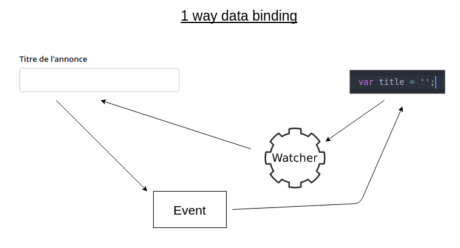
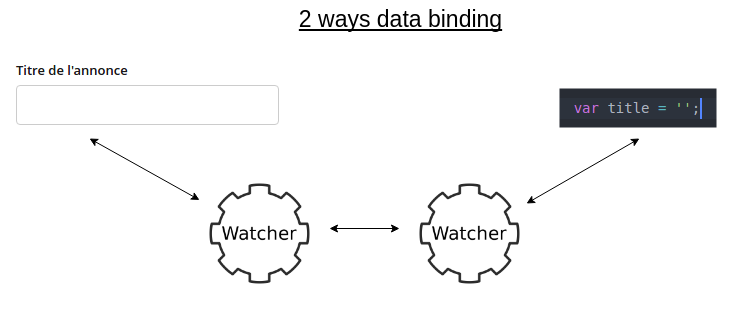

# React란?

## 👉 바로가기

- [1. 개요](#1-개요)
- [2. 자바스크립트 UI 라이브러리/프레임워크](#2-자바스크립트-ui-라이브러리프레임워크)
  - [2-1. ReactJS](#2-1-reactjs)
  - [2-2. AngularJS](#2-2-angularjs)
  - [2-3. VueJS](#2-3-vuejs)
- [3. React의 특징](#3-react의-특징)
  - [3-1. 선언형 프로그래밍](#3-1-선언형-프로그래밍)
  - [3-2. 단방향 데이터 바인딩 (One way data binding)](#3-2-단방향-데이터-바인딩-one-way-data-binding)
  - [3-3. 가상 돔 (Virtual DOM)](#3-3-가상-돔-virtual-dom)
  - [3-4. JSX](#3-4-jsx)
- [4. React의 장단점](#4-react의-장단점)
  - [4-1. React의 장점](#4-1-react의-장점)
  - [4-2. React의 단점](#4-2-react의-단점)
- [5. Conclusion](#5-conclusion)
- [참고](#참고)

## 1. 개요

웹 개발에 사용하는 대표적인 자바스크립트 UI 라이브러리/프레임워크에는 어떤 것이 있을까? 내가 공부하고 있는 React가 바로 대표적인 자바스크립트 UI 라이브러리이다. 뿐만 아니라 널리 사용되고 있는 것들 중 Angular와 Vue가 있다.

그 중 React에 대해 공부하고 아래에 정리하고자 한다.

> JSX과 가상 돔(Virtual DOM)은 다른 챕터에서 자세하게 다룬다.

---

## 2. 자바스크립트 UI 라이브러리/프레임워크

> 프레임워크와 라이브러리
>
> > 프레임워크와 라이브러리의 가장 큰 차이점은 프로그램의 흐름에 대한 제어 권한이다. 프레임워크는 흐름의 제어 권한을 개발자가 아닌 프레임워크가 갖고 있는 반면에, 라이브러리는 흐름에 대한 제어를 하지 않고 개발자가 필요한 부분만 필요할 때 가져다 사용하는 형태이다.

> User Interface (UI, 사용자 인터페이스)
>
> > 사용자와 컴퓨터 프로그램이 서로 상호작용을 하기 위해 중간에서 서로 간에 입력과 출력을 제어해주는 것이다. 웹 사이트에서 버튼과 입력창 등이 모두 사용자 인터페이스이다. 사용자 인터페이스를 만들기 위한 기능 모음집(라이브러리)을 UI 라이브러리라고 부른다.

---

### 2-1. ReactJS


리액트는 자바스크립트 **라이브러리**의 하나로서 **사용자 인터페이스를 만들기 위해 사용**된다. 메타(구 페이스북)에서 만들었으며 2013년에 처음으로 출시되어 사용률이 점점 증가하다가 현재는 다른 라이브러리를 모두 따돌리고 가장 많이 사용되는 자바스크립트 UI 라이브러리가 되었다.

자바스크립트에 HTML을 포함하는 JSX(JavaScript XML)이라는 간단한 문법과 단방향 데이터 바인딩(One-way Data Binding)을 사용하고 있다. 그리고 가상 돔(Virtual DOM)이라는 개념을 사용하여 웹 애플리케이션의 퍼포먼스를 최적화한 라이브러리이다.

---

### 2-2. AngularJS


앵귤러(Angular)는 클라이언트 단일 페이지 애플리케이션(SPA)을 개발을 위해 만들어진 오픈소스 **프레임워크**이다. 최근의 프론트엔드 라이브러리(또는 프레임워크) React, Vue와 함께 자주 언급된다. 동적 콘텐츠 작성을 하는 데 있어서 획기적인 접근 방식으로 유행을 불러일으킬 만큼 많은 수요가 있었다.

2010년 중반 때 까지만 해도 굉장히 많은 곳에서 사용되었지만 2018년 LTS(단기간에 버전 업데이트를 하지 않고 안정적인 버전을 장기간 유지하는 방식)모드에 돌입하였고 2022년 1월 LTS 마저 중단을 선언하고 사실상 공식적인 지원이 종료 되었다.

---

### 2-3. VueJS


뷰는 큰 IT기업의 주도로 시작된 앵귤러(구글), 리액트(메타)와는 다르게 Evan You라는 중국인 개발자 한 명이 시작한 오픈소스 프로젝트이다. 2014년에 처음 출시되었고 이후 점점 영향력이 커져 현재는 리액트와 항상 함께 언급되는 자바스크립트 대표 **프레임워크**이다.

---

## 3. React의 특징

---

### 3-1. 선언형 프로그래밍

리액트로 작업할 때 어떤 로직으로 어떻게 코드를 짜야 페이지를 그려질 수 있는지에 대해 생각하기 보다는 컴포넌트나 데이터 등의 배치를 통해 무엇이 렌더링 될지에 대해 생각을 한다. 이것이 선언형 UI의 핵심이다.

먼저 선언형 프로그래밍과 명령형 프로그래밍의 차이에 대해 알아보자.

1. 명령형 프로그래밍

   - 어떤 방법(How)으로 할 것인지를 정의하는 것을 의미
   - 무엇을 하지 세세하게 지정한다.

   ```js
   function double(arr) {
     let result = [];
     for (let i = 0; i < arr.length; i++) {
       result.push(arr[i] * 2);
     }
     return result;
   }
   ```

2. 선언형 프로그래밍
   - 무엇인가(What)를 작업하기 위한 방법을 정의하는 것을 의미
   - 결과만 기술할 뿐 어떻게는 기술하지 않는 프로그래밍 방법
   - 의도에 집중한 프로그래밍 방법
   ```js
   function double(arr) {
     return arr.map((x) => x * 2);
   }
   ```
   - 우리는 filter, map, reduce 메서드가 어떤 로직으로 구현되는지 알 필요가 없다. 해당 메서드의 구체적인 절차는 신경쓰지 않고, 추상화된 메서드를 사용하고 싶을 때 선언만 하면 된다.
   - 가독성이 좋으며 예측이 쉬움

그렇다면 리액트에서의 선언형 프로그래밍이란 무엇일까?

리액트의 JSX를 사용해서 비선언형적인 부분을 캡슐화해서 명령형 프로그래밍 언어를 선언형 프로그래밍으로 만들어준다.

아래의 코드를 살펴보면 `<ul>`태그 안에 새로운 `<li>`태그를 자바스크립트를 이용해서 생성하고 있다.

```html
<ul id="list"></ul>
<script>
  var arr = [1, 2, 3, 4, 5];
  var elem = document.querySelector("#list");

  for (var i = 0; i < arr.length; i++) {
    var child = document.createElement("li");
    clild.innerHTML = arr[i];
    elem.appendChild(child);
  }
</script>
```

이러한 코드를 리액트에서는 아래와 같이 JSX를 통해 유사 HTML 코드안에서 map 함수를 이용하여 선언적으로 프로그래밍을 할 수 있다.

```js
const arr = [1, 2, 3, 4, 5];
return (
  <ul>
    {arr.map((elem) => (
      <li>{elem}</li>
    ))}
  </ul>
);
```

> ### 리액트가 선언형 프로그래밍인 이유
>
> 리액트의 JSX 자체가 선언형은 아니다. 하지만 JSX의 캡슐화를 통해 선언형 코드 작성이 가능해진다. 우리는 리액트로 개발을 하면 여러 컴포넌트를 만들고 필요한 곳에 쓰게 된다. 예를 들어 아래의 코드를 보자.
>
> ```js
> const Profile = () => {
>   return (
>     <div>
>       <Header />
>       ...
>       <Footer />
>     </div>
>   );
> };
> ```
>
> `<Header/>`, `<Footer/>`은 JSX로 작성된 코드를 캡슐화한 컴포넌트다. 개발자들은 `<Header>`컴포넌트와 `<Footer/>`컴포넌트에 대한 자세한 내부 로직은 모르겠지만 각각 헤더와 푸터와 관련한 컴포넌트이고 Profile은 이 두개의 컴포넌트와 기타 등등으로 이루어진 페이지구나라는 것을 알 수 있고 어떻게 그려질지도 짐작 예측할 수 있다.

---

### 3-2. 단방향 데이터 바인딩 (One way data binding)

> **데이터 바인딩**이란? 두 데이터 혹은 정보의 소스를 모두 일치시키는 기법이다. 즉 화면에 보이는 데이터와 브라우저 메모리에 있는 데이터를 일치시키는 기법이다.

- 단방향 데이터 바인딩

  

  - 한쪽 방향으로만 제어가 가능한 것
  - js에서는 사용자의 화면을 변경할 수 있지만 사용자는 js에 있는 데이터를 자동적으로 변경시키지 못하기 때문에 변화된 값을 갑지하여 데이터 바인딩을 시켜줘야 함
  - JS -> HTML 만 가능
  - 데이터 변화에 따른 성능 저하 없이 DOM 객체 갱신 가능하지만 변화를 감지하고 화면을 업데이트 하는 코드를 매번 작성해야 함

  ```js
  const [value, setValue] = useState("");

  return <input value={value} onChange={(e) => setValue(e.target.value)} />;
  ```

  - 위의 코드는 리액트에서 input값을 변화시키기 위해 작성하는 코드이다. `input`태그의 value어트리뷰트값으로 state의 초기값이 ""이 할당이 된다.  
    사용자가 input의 값을 변경하게 될 때 onChange함수가 실행되어 state값을 변경하게 된다. 이로써 사용자는 변경된 input값을 볼 수 있다.  
    만약 onChange함수가 없다면 사용자는 변경된 input값을 볼 수 없다.  
    즉, 사용자가 변수를 직접적으로 변경하는 것이 아니라 작성된 JS 함수를 통해 변경을 감지하여 변수의 값을 바꾼다.
  - 나는 리액트에서 `Form`태그와 `input`태그를 다룰 때 위의 방법으로 작성하지 않고 `useForm`이라는 아주 좋은 패지지 모델을 사용한다.

---

- 양방향 데이터 바인딩

  

  - MVC 패턴에서 뷰와 모델의 데이터를 동기화하는 것
  - 사용자의 입력값에 따라 js의 데이터가 변경되고, js의 데이터가 변경되면 사용자의 화면도 변경
  - HTML -> JS, JS -> HTML 양쪽 모두 가능
  - 입력된 값이나 변경된 값에 따라 내용이 바로 바뀌기 때문에 따로 체크해주지 않음
  - 수많은 코드의 양을 줄여주고 유지보수나 코드를 관리하기 매우 쉽게 해줌
  - vue.js의 예시
    - V-model과 V-on을 통해 양방향 데이터 바인딩을 한다.
    - V-model이 DOM 연관된 내용을 잡아내고, vue가 바라보는 대상의 속성과 연결된다.
    - V-on은 이벤트를 잡아내는 데 사용한다.

---

### 3-3. 가상 돔 (Virtual DOM)

가상 돔 (Virtual DOM)은 아래의 파트에서 좀더 자세히 다룬다.  
[가상 둠(Virtual DOM)바로가기](./VirtualDOM.md)

---

### 3-4. JSX

JSX은 아래의 파트에서 좀더 자세히 다룬다.  
[JSX바로가기](./JSX.md)

---

## 4. React의 장단점

---

### 4-1. React의 장점

1. 빠른 업데이트와 렌더링 속도
   - Virtual DOM를 통해 빠른 업데이트가 가능하다.
   - 리액트는 DOM를 직접 수정하는 것이 아니라 업데이트해야 할 최소한의 부분만을 찾아서 업데이트한다.
2. 컴포넌트 기반 구조
   - 리액트로 개발된 웹사이트는 수많은 컴포넌트의 조합으로 구성되어 있어 컴포넌트가 가지고 있는 장점을 그대로 가지고 있다.
3. 재사용성
   - 재사용성이라는 것은 **다시 사용이 가능한 성질**을 의미한다.
   - 재사용성으로 인해 전체 소프트웨어의 개발 기간이 단축된다.
   - 재사용성으로 인해 유지 보수가 용이하다.
   - 재사용성이 높다는 것은 여러 모듈 간의 의존성이 낮기 때문에 각 부분들이 잘 분리되어 있고 쉽게 버그를 찾아서 수정할 수 있다.
4. 활발한 지식 공유 & 커뮤니티
   - 리액트의 경우 github Star가 모든 오픈소스를 통틀어 최상위급 수치를 보이고 있다.
   - 스택오버플로 웹사이트에서는 리액트 관련 질문이 35만개 이상 등록되어 있다.
5. 모바일 앱 개발 가능
   - 리액트 네이티브라는 모바일 환경 UI 프레임워크를 사용하여 모바일 앱도 개발할 수 있다.

---

### 4-2. React의 단점

1. 방대한 학습량
   - 새로운 버전으로 업데이트되면 이에 대한 내용을 학습하고 숙지하고 있어야 실무 환경에서 원활하게 작업할 수 있다.
2. 높은 상태 관리 복잡도
   - state는 리액트 컴포넌트의 상태를 의미하는데 웹사이트의 규모가 커져 컴포넌트의 개수가 많아지면 상태 관리의 복잡도도 증가한다.
   - 큰 규모의 프로젝트에서는 상태 관리를 위해서 Redux, MobX, Recoil 등의 외부 상태 관리 라이브러리를 사용하는 경우가 많다.
3. 리액트는 CSR의 랜더링 방식을 채택하고 있기 때문에 CSR의 단점을 가지고 있다.
4. IE8 이하는 지원이 안된다.
5. View 만을 관리하여 그 이외의 데이터 모델링 등은 직접 구현하거나 라이브러리를 사용해야 한다.

---

## 5. Conclusion

> 이번 챕터를 공부하면서 아는 개념 및 용어가 나와서 많이 친숙했지만, 선언형 프로그래밍, 데이터 바인딩의 개념을 이해하는데에는 많은 어려움을 겪었다. 선언형 프로그래밍은 얼추 이해가 되었지만 데이터 바인딩 중 단방향 데이터 바인딩이 리액트에서 어떻게 쓰이는지 어떤 개념인지를 이해하는 데 오랜 시간이 걸렸다.(지금도 정확히 알고 있는지 모르겠다.) 여러 블로그들을 찾아보고 유튜브도 찾아봤지만 미묘하게 제각기 다른 이야기를 하고 있는 것 같아 답답한 마음이 들었다. 다 나의 공부가 부족한 이유겠지..  
>  단방향 데이터 바인딩을 공부하면서 의문이 들었던 점은 리액트의 패키지 모듈 중 `useForm`으로 단방향 데이터 바인딩의 단점을 해결할 수 있지 않을까 했는데, 결국 `useForm`에서 사용하는 `getValue()`, `watch()`메소드의 경우도 단방향 데이터 바인딩을 좀더 편리하고 쉽게 사용할 수 있는 것이라 나름 결론을 내렸다.  
> VueJS는 양방향 데이터 바인딩의 방식이라고 하는데 실제 코드를 봐도 이해가 잘 되지 않아 VueJS을 잘 다루는 분에게 살짝 부탁을 드려야 겠다.

---

## 참고

[리액트란 무엇인지 알아보고, 리액트의 특징에 대해서 살펴봅니다.](https://dev-yakuza.posstree.com/ko/react/create-react-app/react/)  
[앵귤러(Angular) 란? 특징 및 장단점](https://paperblock.tistory.com/52)  
[선언형 프로그래밍과 명령형 프로그래밍](https://egas.tistory.com/2)  
[선언형 VS 명령형, 리액트가 선언형인 이유](https://velog.io/@nemo/%EC%84%A0%EC%96%B8%ED%98%95-%EB%AA%85%EB%A0%B9%ED%98%95)  
[명령형 프로그래밍 vs 선언형 프로그래밍](https://hjuu.tistory.com/15)  
[데이터 바인딩의 이해](<https://sungjk.github.io/2015/11/22/AngularJS(2).html>)  
[양방향/단방향 데이터 바인딩](https://talkwithcode.tistory.com/6)
[[WEB] 양방향 단방향 데이터 바인딩](https://velog.io/@sunaaank/data-binding)  
[[React] React 개념 및 장단점](https://minjung-jeon.github.io/React-props-cons/)  
도서 - 소플의 처음 만난 리액트

---

[👆](#react란)
