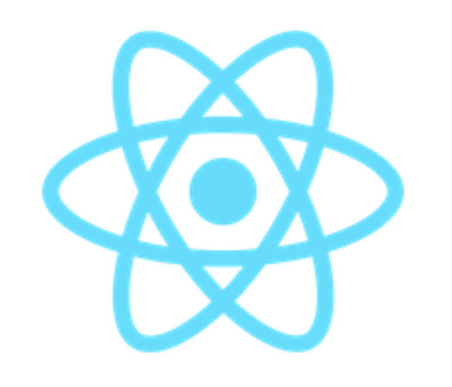
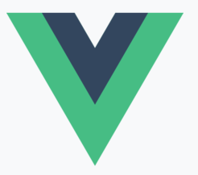

# React란?

## 👉 바로가기

- [1. 개요](#1-개요)
- [2. 자바스크립트 UI 라이브러리/프레임워크](#2-자바스크립트-ui-라이브러리프레임워크)
  - [2-1. ReactJS](#2-1-reactjs)
  - [2-2. AngularJS](#2-2-angularjs)
  - [2-3. VueJS](#2-3-vuejs)
- [3. React의 특징](#3-react의-특징)
  - [3-1. 선언형 프로그래밍](#3-1-선언형-프로그래밍)
  - [3-2. 단방향 데이터 바인딩 (One way data binding)](#3-2-단방향-데이터-바인딩-one-way-data-binding)
  - [3-3. 가상 돔 (Virtual DOM)](#3-3-가상-돔-virtual-dom)
  - [3-4. JSX](#3-4-jsx)
- [4. React의 장단점](#4-react의-장단점)
  - [4-1. React의 장점](#4-1-react의-장점)
  - [4-2. React의 단점](#4-2-react의-단점)
- [5. Conclusion](#5-conclusion)
- [참고](#참고)

## 1. 개요

웹 개발에 사용하는 대표적인 자바스크립트 UI 라이브러리/프레임워크에는 어떤 것이 있을까? 내가 공부하고 있는 React가 바로 대표적인 자바스크립트 UI 라이브러리이다. 뿐만 아니라 널리 사용되고 있는 것들 중 Angular와 Vue가 있다.

그 중 React에 대해 공부하고 아래에 정리하고자 한다.

---

## 2. 자바스크립트 UI 라이브러리/프레임워크

> 프레임워크와 라이브러리
>
> > 프레임워크와 라이브러리의 가장 큰 차이점은 프로그램의 흐름에 대한 제어 권한이다. 프레임워크는 흐름의 제어 권한을 개발자가 아닌 프레임워크가 갖고 있는 반면에, 라이브러리는 흐름에 대한 제어를 하지 않고 개발자가 필요한 부분만 필요할 때 가져다 사용하는 형태이다.

> User Interface (UI, 사용자 인터페이스)
>
> > 사용자와 컴퓨터 프로그램이 서로 상호작용을 하기 위해 중간에서 서로 간에 입력과 출력을 제어해주는 것이다. 웹 사이트에서 버튼과 입력창 등이 모두 사용자 인터페이스이다. 사용자 인터페이스를 만들기 위한 기능 모음집(라이브러리)을 UI 라이브러리라고 부른다.

---

### 2-1. ReactJS

리액트는 자바스크립트 라이브러리의 하나로서 **사용자 인터페이스를 만들기 위해 사용**된다. 메타(구 페이스북)에서 만들었으며 2013년에 처음으로 출시되어 사용률이 점점 증가하다가 현재는 다른 라이브러리를 모두 따돌리고 가장 많이 사용되는 자바스크립트 UI 라이브러리가 되었다.

자바스크립트에 HTML을 포함하는 JSX(JavaScript XML)이라는 간단한 문법과 단방향 데이터 바인딩(One-way Data Binding)을 사용하고 있다. 그리고 가상 돔(Virtual DOM)이라는 개념을 사용하여 웹 애플리케이션의 퍼포먼스를 최적화한 라이브러리이다.

---

### 2-2. AngularJS

앵귤러(Angular)는 클라이언트 단일 페이지 애플리케이션(SPA)을 개발을 위해 만들어진 오픈소스 프레임워크이다. 최근의 프론트엔드 라이브러리(또는 프레임워크) React, Vue와 함께 자주 언급된다. 동적 콘텐츠 작성을 하는 데 있어서 획기적인 접근 방식으로 유행을 불러일으킬 만큼 많은 수요가 있었다.

2010년 중반 때 까지만 해도 굉장히 많은 곳에서 사용되었지만 2018년 LTS(단기간에 버전 업데이트를 하지 않고 안정적인 버전을 장기간 유지하는 방식)모드에 돌입하였고 2022년 1월 LTS 마저 중단을 선언하고 사실상 공식적인 지원이 종료 되었다.

---

### 2-3. VueJS

뷰는 큰 IT기업의 주도로 시작된 앵귤러(구글), 리액트(메타)와는 다르게 Evan You라는 중국인 개발자 한 명이 시작한 오픈소스 프로젝트이다. 2014년에 처음 출시되었고 이후 점점 영향력이 커져 현재는 리액트와 항상 함께 언급되는 자바스크립트 대표 프레임워크이다.

---

## 3. React의 특징

---

### 3-1. 선언형 프로그래밍

---

### 3-2. 단방향 데이터 바인딩 (One way data binding)

---

### 3-3. 가상 돔 (Virtual DOM)

---

### 3-4. JSX

---

## 4. React의 장단점

---

### 4-1. React의 장점

---

### 4-2. React의 단점

---

## 5. Conclusion

---

## 참고

[리액트란 무엇인지 알아보고, 리액트의 특징에 대해서 살펴봅니다.](https://dev-yakuza.posstree.com/ko/react/create-react-app/react/)  
[앵귤러(Angular) 란? 특징 및 장단점](https://paperblock.tistory.com/52)

---

[👆](#react란)
