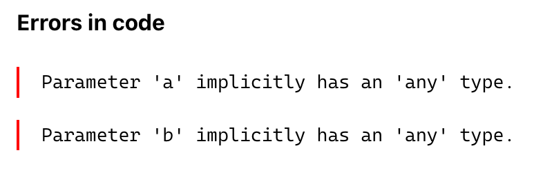
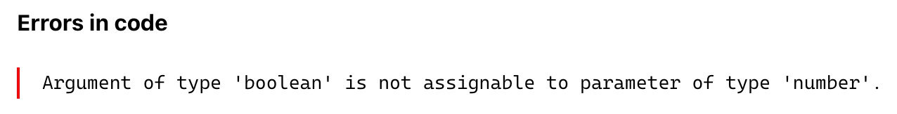
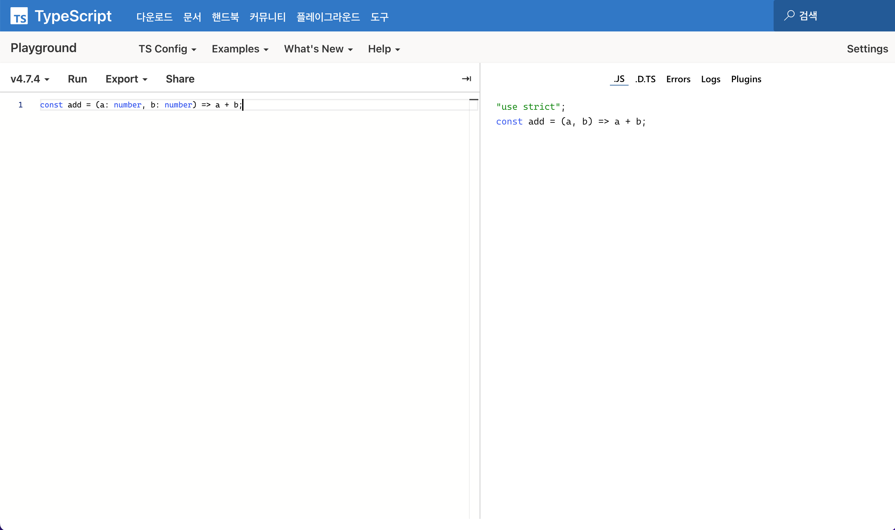

# Typescript란?

## 1. 개요

많은 기업들에서 typescirpt에 대한 역량을 가진 개발자들을 필요로하고 있다. javascript과 이름이 비슷한 typescript는 무엇이며? javascript와는 어떤 차이점이 있는지 알아보자. 또한 typescript가 가지고 있는 특징도 함께 살펴보자.

---

## 2. 타입스크립트(typescript)란?

타입스크립트는 마이크로소프트에서 개발한 오픈소스 프로그래밍 언어이며, 자바스크립트의 단점을 보안하기 위해 만들어졌다. 모든 브라우저, 호스트, 운영체제에서 동작한다.

> TypeScript is JavaScript with syntax for types.  
> TypeScript is a strongly typed programming language that builds on JavaScript, giving you better tooling at any scale.

위는 타입스크립트 공식 홈페이지에서 설명하고 있는 타입스크립트에 대한 설명이다. 이를 토대로 타입스크립트를 설명하자면 아래와 같다.

- 자바스크립트를 기반을 만든 강력한 언어이다.
- 타입을 정하기 때문에 어떠한 환경에서도 훨씬 좋은 경험을 선사한다.
- 타입이 있는 강력한 언어이다.

여기서 말하는 타입이란 프로그램에서 다룰 수 있는 값의 종류(string, boolean, int 등)를 의미한다.

---

## 3. 타입스크립트의 특징

아래는 타입스크립트 공식 홈페이지에 있는 특징을 가져온 것이다.

1. JavaScript and More
   > TypeScript adds additional syntax to JavaScript to support a tighter integration with your editor. Catch errors early in your editor.
   - 타입스크립트는 자바스크립트에 문법을 추가하여 vscode와 같은 에디터에서 오류를 잡는데 도와준다.
   ***
2. A Result Yout Can Trust
   > TypeScript code converts to JavaScript, which runs anywhere JavaScript runs: In a browser, on Node.js or Deno and in your apps.
   - 타입스크립트는 자바스크립트가 실행되는 환경(브라우저, 노드JS, Deno)에서 자바스크립트로 변환된다.
   ***
3. Safety at Scale
   > TypeScript understands JavaScript and uses type inference to give you great tooling without additional code.
   - 타입스크립트는 추가가적인 코드 작성 없이 타입의 유형을 추론할 수 있다.

뿐만 아니라 아래와 같은 다양한 특징을 가지고 있다.

- 컴파일 언어, 정적 타입 언어: 타입스크립트는 컴파일러 또는 바벨(Babel)을 통해 자바스크립트 코드로 변환된다. 코드 작성 단계에서 타입을 체크해 오류를 확인할 수 있고 미리 타임을 결정하기 때문에 실행 속도가 매우 빠르다. 하지만 코드 작성 시 매번 타입을 결정해야 하기 때문에 번거롭고 코드량이 증가하면서 컴파일 시간이 오래 걸린다는 단점이 있다.

- 자바스크립트 슈퍼셋: 타입스크립트는 자바스크립트 기본 문법에 타입스크립트의 문법을 추가한 것이다.

- 객체 지향 프로그래밍 지원: 타입스크립트는 ES6에서 새롭게 사용된 문법을 포함하고 있으며 클래스, 인터페이스, 상속, 모듈 등과 같은 객체 지향 프로그래밍 패턴을 제공한다.

- 점진적 전환 가능: 기존 자바스크립트로 만들어진 프로젝트에 추가 기능이나 특정 기능에만 타입스크립트를 도입함으로써 프로젝트를 점진적으로 전환할 수 있다.

---

## 4. Javascript vs Typescript

앞으로 typescript 파트에서 많은 내용의 typescript를 다루기 때문에 여기서는 하나의 예시를 통해 두 언어의 차이점을 살펴보자.

`a`와 `b`라는 인자를 받아서 더하는 함수인 `add function`를 만들어보자.

먼저 자바스크립트의 코드는 아래와 같다.

```js
const add = (a, b) => a + b;
```

인자에 여러 타입을 넣어 함수를 실행해보자.

```js
add(1, 2); // 3
add("2", 3); // "23"
add("Hello", "world"); // "Helloworld"
add(null, 3); // 3
add(true, false); // 1
```

위에 보이는 것과 같은 `a`, `b`에 어떠한 타입의 인자를 넣고 함수를 실행해도 결과값이 나오는 것을 볼 수 있다.

이번엔 위의 `add function`을 그대로 타입스크립트로 실행하면 어떻게 될까? `a`, `b`에 어떠한 타입도 선언하지 않아 에디터는 아래와 같은 에러를 보여줄 것이다.



위의 에러를 해결하기 위해서는 `a`, `b`에 타입을 정해줘야 한다.

```ts
const add = (a: number, b: number) => a + b;
```

위의 코드처럼 각각의 인자에 `number`라는 타입을 지정해주었다. 이렇게 인자에 타입을 정해두면 `number`타입이 아닌 다른 타입을 인자로 넣어 실행을 하게 된다면 타입스크립트는 다시 아래와 같은 에러를 보여줄 것이다.

```ts
add(true, 4);
```



이렇듯 개발자들은 코드가 컴파일이 되기 전 타입스크립트에서 에러를 보여주어 코드의 문제를 알려주어 에러를 해결할 수 있도록 도와준다.

[typescript palyground](https://www.typescriptlang.org/ko/play?#code/Q)에서 여러 타입스크립트 코드를 작성하면서 자바스크립트 코드와 비교할 수 있다. 아래는 위의 `add function`를 타입스크립트 palyground에서 작성하고 자바스크립트 코드와 비교한 사진이다.



---

## 5. Conclusion

> 아직 타입스크립트에 대해 익숙하지 않다. 리액트와 타입스크립트를 함께 공부하면서 정리를 꾸준히 하여 앞으로 타입스크립트를 꾸준히 사용할 수 있도록 하자. 특히 리액트에서 사용하는 타입스크립트에 대해서 많이 배우자.😁

---

## 참고

[타입스크립트 공식 홈페이지](https://www.typescriptlang.org/)  
[활용도가 높아지는 웹 프론트엔드 언어, 타입스크립트(TypeScript)](https://s-core.co.kr/insight/view/%ED%99%9C%EC%9A%A9%EB%8F%84%EA%B0%80-%EB%86%92%EC%95%84%EC%A7%80%EB%8A%94-%EC%9B%B9-%ED%94%84%EB%A1%A0%ED%8A%B8%EC%97%94%EB%93%9C-%EC%96%B8%EC%96%B4-%ED%83%80%EC%9E%85%EC%8A%A4%ED%81%AC%EB%A6%BD/)

---

[👆](#typescript란)

📅 2022-07-25
